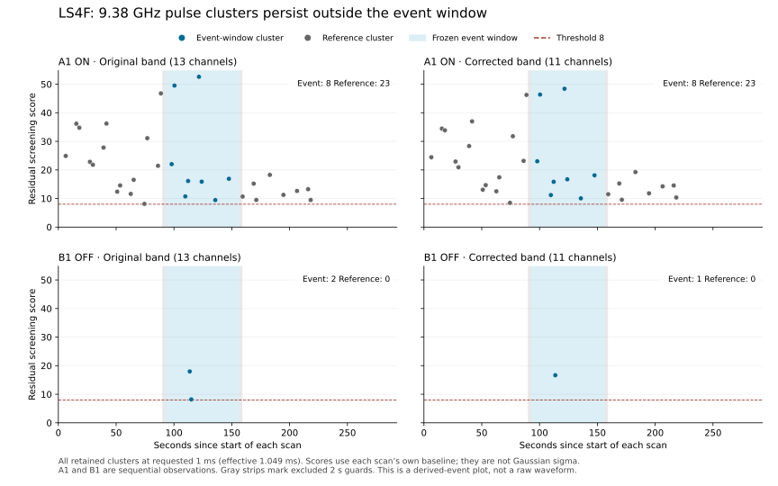

# LS4F v2: native-data reanalysis result

**Completed retrospective reanalysis: 0 / 7 events pass the corrected-band LS4E diagnostic.**

Both original A1/B1 HTR files were re-read, SHA256-verified and deleted after processing. This is the same 2017 recording as LS4C, not independent confirmation. Historical metrics and dispositions reproduced within the frozen tolerances.

| Candidate | Old rule, 13 channels | Old rule, 11 channels | LS4E, 13 channels | LS4E, 11 channels | Corrected OFF veto | Corrected ON-reference veto |
|---|---|---|---|---|---|---|
| LS4B-A1-9860 | No | No | No | No | No | No |
| LS4B-A1-10241 | No | No | No | No | No | No |
| LS4B-A1-9772 | No | No | No | No | No | No |
| LS4B-A1-9878 | No | No | No | No | No | No |
| LS4B-A1-8680 | No | No | No | No | Yes | No |
| LS4B-A1-9450 | No | No | No | No | No | No |
| LS4B-A1-9380 | Yes | Yes | No | No | Yes | Yes |

The 9.38 GHz event still passes the historical rule in both bands and has repeated residual pulses matched across scales. Its revised rejection is caused by both the ON-reference and OFF pulse vetoes, not by eliminating the two extra channels. No event is promoted under the frozen LS4E diagnostic. All 33 LS4 unit tests passed before execution; v2 preserves every non-main calculation function from v1.

## The 9.38 GHz event

The following are corrected-band residual cluster counts. Reference/OFF pulses are not simultaneous ON/OFF coincidence evidence. Scale counts are correlated and do not represent independent events or significance estimates.

| Width (ms) | A1 event clusters | A1 reference clusters | B1 event clusters | B1 reference clusters |
|---|---:|---:|---:|---:|
| 1 | 8 | 23 | 1 | 0 |
| 3 | 7 | 21 | 1 | 0 |
| 10 | 4 | 12 | 1 | 0 |
| 30 | 5 | 13 | 1 | 0 |
| 100 | 2 | 8 | 1 | 0 |
| 300 | 0 | 0 | 1 | 0 |

The reference intervals are longer than the candidate interval; the counts above are not directly comparable occurrence rates. The OFF entries at different widths can represent the same physical event.

## Cross-band control evidence

In B1, the corrected 8.68 and 9.38 GHz bands each contain a pulse near 113.6 s after scan start. Their peaks match at the 30, 100 and 300 ms scales under the frozen same-scan time tolerance. This is three scale-level match records associated with one apparent control event, not three independent confirmations. No corrected cross-band matches were found in A1. The B1 behavior is consistent with a common disturbance and strengthens the interference interpretation, but does not identify a transmitter or establish a calibrated chance-coincidence probability. It is reported as context, not an added decision rule.

## Scope and preserved evidence

The comparison separates channel-selection effects from the changed temporal diagnostic. Raw spectra and full collapsed series are not published. Derived source receipts retain pulse times and scores, channel-excess concentration, byte-endpoint occupancy and same-scan cross-band time matches. These additional diagnostics are descriptive and were not added as retrospective vetoes.

A rejected feature does not pass this conservative residual-pulse screen; rejection does not identify a radar or establish terrestrial origin. A passing feature would still not identify diffraction or artificial origin. Controls can veto real signals, and the synthetic qualification does not establish end-to-end sensitivity or a calibrated false-alarm rate. No technosignature or general light-sail exclusion is claimed.

The first LS4F execution stopped during download because additional temporary workspace copies exhausted disk space. Its abort is preserved in `LS4F_ABORT_RESULT.md`. Version 2 changes only disposable raw-file placement and output identities; scientific functions are unchanged.

## Reproduction

The frozen runtime and exact input identities are specified in `LS4F_NATIVE_REANALYSIS_PLAN.md`, `LS4F_V2_FREEZE.sha256` and `config/ls4f_v2_native_reanalysis.json`. Source-derived receipts are in `results_ls4f_v2_reanalysis/A1_derived.json` and `B1_derived.json`. The runtime refuses to overwrite any prior result directory.

Result identity: `9208e3262651bdc783695bee77b938574d86ea7f53122ca090ffac94baf3c0e5`.
