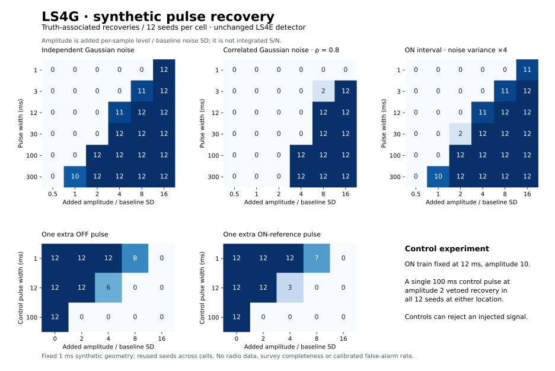

# LS4G: conditional synthetic recovery result

**Completed: 1,692 frozen synthetic trials; no detector retuning or radio-data access.**

The unchanged LS4E diagnostic has a width- and noise-dependent operating range.
Correlated noise reduces recovery, particularly for the shortest pulses. A
single unrelated pulse in a control region can reject an otherwise recovered
ON train. These findings qualify interpretation of LS4F's 0/7 result; they do
not change those seven dispositions or identify the origin of any feature.



## Selected comparisons

All fractions below are truth-associated recoveries from 12 seeds per cell.
Amplitude is added per-sample level divided by baseline marginal noise SD,
not integrated S/N or flux. Each train contains six separated rectangular
pulses with seed-specific time jitter. This is a conditional synthetic study,
not an astronomical sensitivity measurement.

| ON pulse width | Amplitude | Independent noise | AR(1), rho 0.8 | ON variance ×4 |
|---|---:|---:|---:|---:|
| 1 ms | 16 | 12/12 | 0/12 | 11/12 |
| 3 ms | 8 | 11/12 | 2/12 | 11/12 |
| 12 ms | 4 | 11/12 | 0/12 | 11/12 |
| 30 ms | 4 | 12/12 | 0/12 | 12/12 |
| 100 ms | 2 | 12/12 | 0/12 | 12/12 |
| 300 ms | 1 | 10/12 | 0/12 | 10/12 |

These selected comparisons illustrate the full frozen grid shown above; no
interpolated recovery threshold or confidence bound is inferred. Increasing
ON-only noise can occasionally raise detections because normalization uses
the unaffected reference. For example, at 30 ms and amplitude 2 the ON-variance
case recovered 2/12, versus 0/12 in independent unit noise. This is not evidence
that noisier observations improve intrinsic sensitivity.

## Control veto cost

The control experiment uses independent Gaussian noise and a fixed 12 ms ON
train at amplitude 10. With zero added control amplitude it recovers 12/12 in
every repeated baseline cell. Every control-grid trial retains cross-scale
ON support before vetoes. At 100 ms control width and amplitude 2, recovery
falls to 0/12 for both OFF and ON-reference locations. A single control pulse
can therefore reject a successfully detected injected ON train.

At 12 ms control width and amplitude 4, OFF vetoes occur in 6/12 trials and
ON-reference vetoes in 9/12. These locations have different times and noise
realizations, so this difference does not isolate a pure location effect.
OFF and ON scans are separate: no simultaneous sky coincidence is simulated.

## Nulls, completeness and evidence

The 36 no-injection cases produced zero passes: 0/12 in each background.
Seeds and innovations are reused across background families, so 36 is a
count of tested cases, not independent population trials. Across the entire
grid, every passing trial also satisfied the frozen truth-association rule.
Neither statement calibrates a false-alarm probability.

There are 1,296 recovery trials, 36 no-injection cases and 360 control trials.
All 141 cells contain exactly the 12 predeclared seeds. The ledger's SHA256,
unique trial identities, boolean decision logic and every aggregate were
checked independently of the simulation loop. All 39 relevant unit tests
passed before the first grid execution. The LS4E and LS4G freezes verify.
The plan was committed locally in `5605bec` before execution; it was not
publicly preregistered. Thresholds and grid were not changed after inspection.

## Scope and next boundary

The 1 ms sample geometry differs from LS4F's native 0.349525 ms geometry.
Fixed envelopes bypass Stage-1 selection. No frequency-channel extraction,
quantization, clipping, instrumental response, real-noise distribution or
physical diffraction template is modeled. Fractions are specific to this
small synthetic grid and cannot be transported to survey completeness, a
flux limit, an occurrence rate or a general light-sail exclusion.

A useful next experiment would separately freeze injections into measured,
candidate-independent background data and include the upstream selection
procedure. Its input identities, held-out windows and resource limits must
be defined before reading spectra. No such new data access occurs in LS4G.
The present detector and the published LS4F dispositions remain unchanged.

## Reproduction

```bash
sha256sum -c LS4G_FREEZE.sha256
sha256sum -c RESULTS_MANIFEST_LS4G.sha256
PYTHONPATH=src:scripts python -m unittest discover -s tests -p 'test_ls4*.py'
PYTHONPATH=src:scripts python scripts/ls4g_result_summary.py
```

The summary script verifies and presents the existing ledger, and can read
its lossless `trials.jsonl.gz` archive directly. The uncompressed ledger SHA256
is bound in `summary.json`; no scan arrays are included. To rerun the frozen
simulation, first preserve and move aside the existing result directory,
then run `PYTHONPATH=src:scripts python scripts/ls4g_synthetic_recovery.py`.
The runtime refuses to overwrite a prior run. Scientific rows are deterministic
for the recorded runtime; elapsed time makes the full summary identity run-specific.

Runtime: Python 3.12.13, NumPy 2.3.5.

Result identity: `9c8557b6644e85f26a3caba6a264501ad3355af9a4af053c2a0505d5f5b87f9c`.
