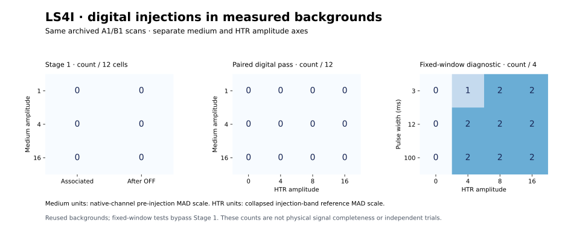
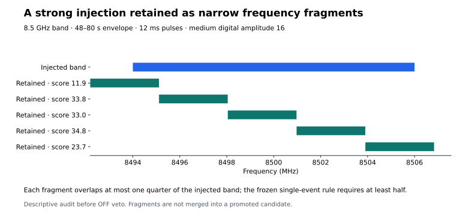

# LS4I: digital injections in measured observations

**Completed measured-background study: 36 Stage-1 interventions and 48 fixed-window HTR diagnostics.**

The four original A1/B1 medium/HTR files were downloaded, verified against
their frozen SHA256 identities and deleted after processing. Total verified
source data: 22,007,514,360 bytes. Both medium baselines
reproduced their historical complete searches within the frozen tolerances.
This experiment uses real archived backgrounds. Its two independently
defined digital amplitude coordinates are not a common physical injection.



## Stage-1 selection

Each row includes two frequency bands, two time placements and three pulse
widths. An association must cover half of both the injected and detected
intervals in time and frequency. Full global search competition, clipping,
normalization, retention and the original adjacent-OFF veto were preserved.

| Medium amplitude | Associated Stage-1 event | Survives Stage-1 OFF |
|---:|---:|---:|
| 1 | 0/12 | 0/12 |
| 4 | 0/12 | 0/12 |
| 16 | 0/12 | 0/12 |

The following **post-result descriptive audit** counts time-aligned retained
frequency fragments before the OFF veto. Their union is clipped to the
injected band. It is not a replacement association rule or a promoted
candidate, and does not enter the primary totals.

| Medium amplitude | Cells with time-aligned fragments | Median union coverage of injected band |
|---:|---:|---:|
| 1 | 0/12 | 0.0% |
| 4 | 6/12 | 24.4% |
| 16 | 12/12 | 99.9% |

No retained Stage-1 event met the frozen bilateral association rule in any
of the 36 injected searches. Consequently, no candidate-conditioned HTR
event was evaluated: the 144 paired zeros follow from the Stage-1 association
gate and are **not 144 observed HTR rejections**. This does not establish that
the spectra contained no detectable excess. The descriptive overlap audit
retains the closest overlap attainable among retained ON-threshold events;
it neither relaxes the decision threshold nor promotes a missed association.



At medium amplitude 16, all 12 cells contain time-aligned retained fragments.
Their union spans approximately 91–100% of the injected band, while each
individual fragment falls short of the required 50% frequency coverage.
The zero primary association count therefore cannot be read as zero ability
to detect these strong digital perturbations. Spectral fragmentation and the
association definition must be qualified together before estimating recovery.
The uninjected Stage-1 baseline has no such time-aligned frequency fragments
in any of the four unique frequency/window placements under this descriptive
audit. This supports attributing the added fragments to the intervention,
without turning them into accepted sky candidates.

## Follow-up and controls

The paired endpoint follows every associated Stage-1 event using its detected
time interval and frequency band, with 0.5 MHz padding and corrected HTR
channel-center selection. It requires the same event to survive both Stage-1
OFF and the LS4E truth-associated residual rule. No truth window replaces a
missed Stage-1 event. The result is **0/144** paired digital passes.
The uninjected backgrounds yield 0/12 baseline passes under the
corresponding width-dependent truth associations.

The separately labelled fixed-window HTR diagnostics give 17/48
truth-associated passes and 34/48 cross-scale-supported
cases before vetoes. OFF vetoes occur in 24/48 cases and ON-reference
vetoes in 0/48. Veto counts can overlap. These fixed-window cases
bypass Stage 1 and do not enter the paired-pass total.

Excluding the 12 zero-amplitude cases gives 17/36 passes. The
positive-amplitude cases separate sharply by the two fixed frequency bands:

| Band center | Truth-associated pass | Cross-scale support before vetoes | OFF veto | ON-reference veto |
|---:|---:|---:|---:|---:|
| 8.5 GHz | 0/18 | 17/18 | 18/18 | 0/18 |
| 10.5 GHz | 17/18 | 17/18 | 0/18 | 0/18 |

At 8.5 GHz, every positive-amplitude case is vetoed by the reused OFF
background even though 17 of 18 have pulse support. At 10.5 GHz, 17 of 18
pass. These are conditional diagnostic counts on the same two scans, not
independent detections or evidence that either whole frequency band is clean.

The complete derived ledger retains both control flags, pulse counts,
truth associations, selected event windows, extraction indices, amplitude
normalizations and channel-dilution fractions. The compressed medium records
retain every searched event for each injection, including unrelated events.

## What the amplitudes mean

The common analytic shape has a 32 s envelope of height 0.1 and six separated
pulses of added height 1, with widths 3, 12 or 100 ms. Bin averages account
for fractional integration boundaries. In medium data the scale is each
native channel's unmodified full-scan robust MAD scale; injection precedes
normalization and clipping. The medium levels are 1, 4 and 16.

HTR levels 0, 4, 8 and 16 use the collapsed injection band's unmodified
outside-envelope reference MAD scale. Adding that digital level uniformly
to selected native channels is evaluated through linear band averaging,
including dilution into wider extraction bands. Archived byte values are
promoted to floating point; the perturbation is not re-quantized or clipped.
This specifies a software intervention after the original conversion.
Equal numerical amplitudes in the two products do not mean equal physical
power, and marginal recovery fractions must not be multiplied.

## Scope and next decision

These are deterministic cells on reused A1/B1 backgrounds. Zero-amplitude
cases repeat backgrounds under different truth-association widths; neither
they nor the other cells are independent observation trials. The data were
not chosen by scanning for clean noise. No physical flux limit, astronomical
completeness, calibrated false-alarm probability, independent confirmation
or general light-sail exclusion follows. Prior LS4F dispositions are unchanged.

The reserved A3/C1/D1 data remain unopened by this study. Any revised detector
must be qualified separately before those files are used for validation.
The LS4H physical amplitude-transfer limitation remains unresolved; this
separately labelled digital study does not remove it.

The next methodological step is a separately specified and qualified
fragment-association or event-retention rule, followed by HTR evaluation
using the resulting selected events. This report does not merge fragments
or revise any frozen LS4I decision.

## Reproduction and validation

All **52 relevant unit tests passed** before the source/configuration freeze
in local commit `030aa62` and before LS4I spectral access. The optimized
native-preprocessing cache was checked against full native recomputation,
including injected cases; the detector module itself was not modified.
Both real medium scans also passed historical full-search replay. Source
receipts, result identity, grid cardinalities and decision logic were verified.
The plan was frozen locally before execution, not publicly preregistered.

```bash
sha256sum -c LS4I_FREEZE.sha256
sha256sum -c RESULTS_MANIFEST_LS4I.sha256
PYTHONPATH=src:scripts python scripts/ls4i_result_summary.py
```

The summary script can verify the lossless compressed injection ledger
directly, without telescope access. The original runtime refuses to overwrite
an existing result directory; preserve it before any new raw-data repeat.
No scan arrays or raw spectra are published.

Runtime: Python 3.12.13, NumPy 2.3.5.
Result identity: `e9802dbe5e7117ccad01ab79165064ad2c7ac9e1d06cd8d709d43d7a1719b967`.
