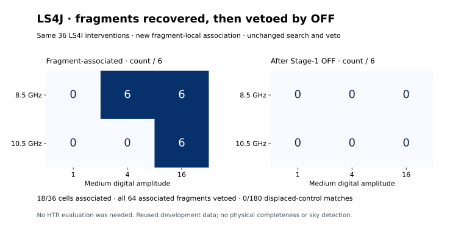

# LS4J: fragment-local recovery and the Stage-1 OFF boundary

**Completed: 18/36 injected cases associate under the qualified fragment-local
rule; all 64 associated fragments are vetoed by the unchanged Stage-1 OFF
control. No selected-event HTR evaluation or new spectral download was needed.**

The rule and all 60 relevant tests were frozen locally in `2875715` and
published in `a02ad75dc3af5cbb6dc026b2c0627e6578a8a8c4` before reclassification.
This is a development amendment informed by LS4I's known fragmentation,
not an independent validation or retroactive change to LS4I's result.



## What changed

An event may now associate with a resolved portion of the injected band.
Time overlap still covers at least 50% of both intervals. Frequency overlap
must cover at least half of the detected event and at least half the smaller
of the injected bandwidth and the detector's 2.9296875 MHz nominal base bin.
This rejects tiny slivers and very broad unrelated events. It does not claim
recovery of the complete injected bandwidth. No events are merged or widened.

The original score thresholds, global search, event retention, OFF veto and
HTR diagnostic remain unchanged. All previous LS4I associations were replayed
exactly, and the complete retained inputs checked against frozen hashes.
The archived medium searches already contain the original native-preprocessing
injections, so reclassification needs no new medium spectral access.

## All injected cases

Each row contains two time placements and three pulse widths. Digital
amplitude is measured in the LS4I native-channel unmodified MAD scale;
it is neither a physical flux unit nor a calibrated Gaussian significance.

| Band center | Medium amplitude | Associated cases | Associated fragments | Cases surviving OFF |
|---:|---:|---:|---:|---:|
| 8.5 GHz | 1 | 0/6 | 0 | 0/6 |
| 8.5 GHz | 4 | 6/6 | 16 | 0/6 |
| 8.5 GHz | 16 | 6/6 | 24 | 0/6 |
| 10.5 GHz | 1 | 0/6 | 0 | 0/6 |
| 10.5 GHz | 4 | 0/6 | 0 | 0/6 |
| 10.5 GHz | 16 | 6/6 | 24 | 0/6 |

At amplitude 16, all 12 cases now associate. Amplitude 4 associates in all
six 8.5 GHz cases and none of the six 10.5 GHz cases. Amplitude 1 has no
associations. These are repeated interventions on the same background;
the fractions are descriptive, not independent Bernoulli trials.

The 180 deliberately displaced control regions have **zero associations**.
The uninjected baseline also has zero associations in its four unique truth
placements and twenty unique control placements (12 and 60 width-labelled
records). Controls are reused and were specified after LS4I, so their zeros
do not establish a calibrated false-alarm probability.

## What actually triggers the veto

The unchanged Stage-1 rule looks for frequency overlap with any retained
B1 OFF event at score 6 or higher; it does not require an OFF pulse train or matching
relative scan time. Every one of the 64 recovered fragments meets that veto.
The exact trace links them to 11 distinct retained OFF events, with 136
fragment-to-OFF links in total. Several links reuse the same OFF feature.

| OFF band | Distinct OFF events | Endpoint bandwidth | Score range | Relative interval in B1 |
|---|---:|---:|---:|---|
| 8.5 GHz | 4 | 2.927 MHz | 6.21–7.06 | 32.21–96.64 s |
| 10.5 GHz | 7 | 11.716 MHz | 9.32–10.38 | 31.14–96.64 s |

These are roughly 64.4 s OFF boxes. B1 times are measured from B1's own scan
start, not simultaneous with A1. No physical cause for these background
features is established by this accounting. The complete source events and
all links are retained in the [OFF trace](results_ls4j_fragment_association/off_veto_trace.json).

LS4I's 17/18 positive-amplitude fixed-window HTR passes at 10.5 GHz cannot
rescue these events: that diagnostic bypassed Stage 1. Stage-1 frequency
screening and the later HTR pulse-control veto ask different questions.
Here the Stage-1 gate already rejects every associated event, so **0/144
paired configurations can pass**, with **zero actual HTR event evaluations**.
This is a logical consequence of the unchanged gate, not 144 measured HTR
rejections. The predeclared conditional-download rule avoided rereading
18.87 GB of HTR products whose evaluation could not change the conjunction.

## Next methodological decision

The new association rule resolves the accounting failure for strong test
injections, but it has only development qualification. The remaining loss
is now attributable to the deliberately conservative Stage-1 OFF veto on
these frequency regions. A subsequent study should qualify the specificity
and injected-signal losses of that veto against explicit RFI/continuum and
pulse-train counterexamples before changing it. The present report neither
weakens the veto nor promotes a rejected event to a sky candidate.

A3/C1/D1 remain unopened. LS4F's sky-candidate dispositions and LS4I's original
endpoint remain unchanged. No physical amplitude transfer, survey completeness,
independent confirmation, or technosignature is established.

## Reproduce from retained evidence

```bash
sha256sum -c LS4I_FREEZE.sha256
sha256sum -c LS4J_FREEZE.sha256
sha256sum -c RESULTS_MANIFEST_LS4J.sha256
PYTHONPATH=src:scripts python scripts/ls4j_result_summary.py
```

The summary verifies the canonical Stage-1 identity, original event handoff
and every OFF veto against the complete retained B1 search. The frozen runner
refuses to overwrite its result directory. Full reclassification can be
repeated in a separate checkout after preserving that derived directory;
no telescope access is required for the Stage-1 phase.

Stage-1 result identity: `a314c58e92d6d738ba65aeaaa10c0b6a282fb1ca83c704a34f8bba376ab3920b`.
