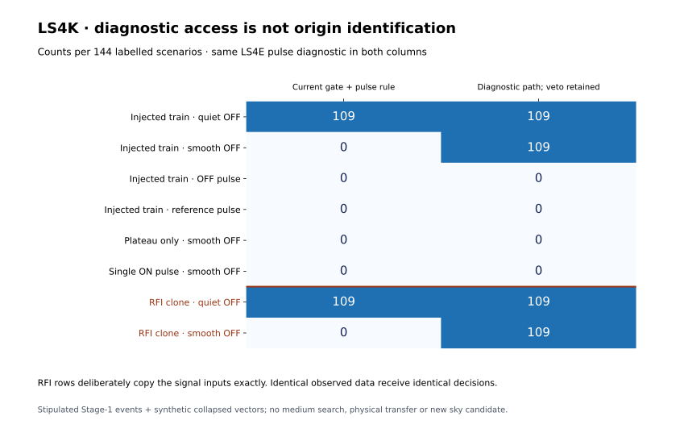

# LS4K: OFF-gate deferral exposes both recovery and an origin ambiguity

**Completed: 1,152 labelled synthetic scenarios, representing 736 distinct
waveform pairs and 736 residual evaluations. All 66 relevant tests passed.**

An additional diagnostic path recovers 109/144 injected trains behind a
smooth OFF feature, while the existing Stage-1 gate admits none of them.
It rejects every tested OFF-pulse, ON-reference-pulse, plateau-only and
single-pulse case. However, an exactly identical ON-only interference
counterexample gets the same 109/144 admissions. This supports investigating
a **veto-preserving diagnostic queue**, not automatic scientific acceptance
or an origin classifier. The operational OFF veto remains unchanged.



## What was actually evaluated

The actual original Stage-1 veto receives **stipulated retained-event inputs**:
a score-12 ON event, with either no OFF event or a frequency-overlapping
score-10 OFF event. These records are not generated by a medium-resolution
search. Independently specified synthetic collapsed vectors are evaluated
with unchanged LS4E detrending, pulse-bank, truth matching and control vetoes.
No radio spectra or reserved observations were accessed.

Each vector is 120 s long at 1 ms sampling. The grid includes white and
AR(1), rho 0.8 noise, eight seeds, three pulse widths (3/12/100 ms) and three
pulse heights (4/8/16 noise-standard-deviation units). A smooth OFF case uses
a Gaussian bump of height 8, center 60 s and sigma 20 s. A pulsed control
adds one 12 ms, height-16 pulse to OFF or the ON-reference region.

The paired inputs are a conditional policy experiment, **not a physically
consistent joint instrument simulation**. There is no common calibrated
medium/HTR amplitude transfer or end-to-end search completeness measurement.

## Complete outcomes

“Current pass” requires the original Stage-1 OFF gate and the LS4E pulse rule.
“Diagnostic admission” evaluates the same pulse rule while keeping the
Stage-1 rejection attached. Neither column establishes a source's origin;
no diagnostic admission was promoted to a sky candidate.

| Scenario | Labelled rows | Current pass | Diagnostic admission |
|---|---:|---:|---:|
| Injected train · quiet OFF | 144 | 109 | 109 |
| Injected train · smooth OFF | 144 | 0 | 109 |
| Injected train · OFF pulse | 144 | 0 | 0 |
| Injected train · reference pulse | 144 | 0 | 0 |
| Plateau only · smooth OFF | 144 | 0 | 0 |
| Single ON pulse · smooth OFF | 144 | 0 | 0 |
| RFI clone · quiet OFF | 144 | 109 | 109 |
| RFI clone · smooth OFF | 144 | 0 | 109 |

Every admitted six-pulse case also matches at least three of its injected
pulses at two supporting scales. The two pulsed-control families still have
109/144 supported ON trains before vetoes, but all 144 OFF-pulse cases trigger
the OFF pulse veto and all 144 reference-pulse cases trigger the reference
veto. Thus the extra diagnostic route does not bypass those pulse controls.
The [complete recovery grid](results_ls4k_off_policy/recovery_grid.json) retains
all width, amplitude and noise combinations; no low-recovery cells are omitted.

## What the counterexamples establish

The two RFI families reuse the signal families' exact waveforms, noise,
truth annotations and Stage-1 evidence. Their hypothetical causal label is
ON-only local pulsed interference. Byte-level input hashes and all decision
fields were verified identical for every paired case. These are constructed
counterexamples, not observed RFI populations or independent trials.

With quiet OFF, both policies already admit 109/144 signal-labelled cases
and their 109/144 interference clones. With smooth OFF, diagnostic access
restores the same count for both causal labels. A rule supplied identical
observables cannot distinguish those labels. The existing veto removes both
in the smooth-OFF condition; it does not solve the quiet-OFF ambiguity either.

This does not measure the prevalence of real ON-only interference. It also
does not identify the 11 real OFF features seen in LS4J as smooth Gaussian
bumps: their morphology remains an empirical question. Zero admissions in
the other synthetic negative families cannot establish a false-alarm rate.

## Concrete next step

A separately frozen measured-data diagnostic can follow the 64 LS4J-associated,
Stage-1-vetoed fragments through HTR using their actual event windows and
frequency selections. Keep every original OFF veto and sky disposition;
record pulse support, OFF/reference vetoes and truth-associated recovery in
a review-only ledger. This would test whether the synthetic smooth-OFF
opportunity exists in the archived A1/B1 backgrounds without treating a
relaxed gate as an accepted candidate. It is not executed in LS4K.

The reserved A3/C1/D1 data remain unopened. LS4F candidate dispositions and
LS4I/LS4J endpoints are unchanged. No physical transfer, survey completeness,
independent confirmation, or technosignature is claimed.

## Freeze and reproduction

Plan, configuration, code, tests and dependencies were frozen locally at
`d09fc55` and published at `916835b08fc3330427689f179928b08ceda7746b` before
numerical scenario execution. All 1,152 rows are preserved in a lossless
compressed ledger. Matched backgrounds, identical RFI copies and repeated
null labels make the rows dependent; they are not 1,152 independent trials.

```bash
sha256sum -c LS4K_FREEZE.sha256
sha256sum -c RESULTS_MANIFEST_LS4K.sha256
PYTHONPATH=src:scripts python scripts/ls4k_result_summary.py
```

The summary verifies the canonical result and ledger hashes, all grid keys,
all clone comparisons, all family totals and both policy decisions. The
frozen runner refuses to overwrite an existing results directory; preserve
it or use a separate checkout before a complete synthetic repeat.

Runtime: Python 3.12.13, NumPy 2.3.5.
Result identity: `0ccde021b35ab2ca5a48b7d5ba8cbd453b5c394955999c3c7b5d9dd4def19e38`.
