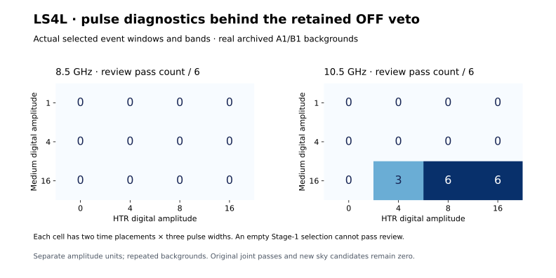

# LS4L: measured pulse diagnostics with the original OFF veto retained

**Completed: 18,870,174,378 bytes of archived A1/B1 HTR data verified and
processed, 256 selected-fragment evaluations, and all 48 LS4I fixed-window
controls reproduced. Original joint passes and promoted sky candidates: zero.**

The review yields **15/144** configurations with at least one truth-associated
pulse pass, of which **15** have a passing fragment that did not pass
at its own zero-injection HTR level. These are diagnostic outcomes with the
original Stage-1 OFF rejection still attached, not accepted sky candidates.



## Exact measured-data experiment

All 64 associated LS4J fragments were selected before LS4L spectral access.
Each is followed at HTR digital levels 0, 4, 8 and 16, retaining its detected
time interval, frequency interval with 0.5 MHz padding, and original OFF
veto evidence. The 36 original medium injection cases crossed with those
four HTR levels give 144 configuration rows; only 72 have selected events.
The other rows stay in the denominator and cannot pass review.

The extractor selects native channel centers exactly. Each fragment band
contains 11 HTR channels, compared with 33 in its corresponding full injection
band. Depending on edge placement, 7 or all 11 extracted channels receive
the digital perturbation. The evaluator applies this dilution explicitly.
A narrow selected band therefore need not reproduce a full-truth-band result.
The actual per-event indices, reference scales and dilution factors remain
in the compressed ledger.

The original LS4I analytic profile, integration, independent medium/HTR
amplitude units, LS4E residual diagnostic and both pulse-control vetoes are
unchanged. No events are merged, widened or reselected. A review pass requires
at least three of the same injected pulses at two supporting scales and no
HTR OFF/reference pulse veto. Stage-1 OFF remains a rejection regardless.

## All configuration-level results

Each table entry is a count out of six cases: two time placements and three
pulse widths. Medium amplitudes are native-channel pre-injection MAD units;
HTR amplitudes are the original full injection band's reference MAD units.
Equal numbers in the two products do not mean equal physical signal power.

| Band | Medium amplitude | HTR 0 | HTR 4 | HTR 8 | HTR 16 |
|---|---:|---:|---:|---:|---:|
| 8.5 GHz | 1 | 0/6 | 0/6 | 0/6 | 0/6 |
| 8.5 GHz | 4 | 0/6 | 0/6 | 0/6 | 0/6 |
| 8.5 GHz | 16 | 0/6 | 0/6 | 0/6 | 0/6 |
| 10.5 GHz | 1 | 0/6 | 0/6 | 0/6 | 0/6 |
| 10.5 GHz | 4 | 0/6 | 0/6 | 0/6 | 0/6 |
| 10.5 GHz | 16 | 0/6 | 3/6 | 6/6 | 6/6 |

There are 15 review-passing configurations among 54 positive-HTR
configurations that actually contain selected fragments. This conditional
fraction answers a different question from 15/144 over the complete grid.
Within selected positive-amplitude cases, the diagnostic passes 15/18 at
10.5 GHz and 0/36 at 8.5 GHz. All fifteen passes are new relative to their
own zero-level HTR comparisons. These counts retain the original Stage-1
rejection and do not add accepted candidates.
At zero HTR amplitude, 0/64
selected-fragment evaluations pass the truth-associated diagnostic.

Zero-level comparisons use the exact same selected fragment and window.
They condition on the previously injected medium selection, so they are not
an uninjected complete-pipeline false-alarm test. The original twelve
uninjected Stage-1 records contain no selected events and are retained as
empty records, not presented as measured HTR backgrounds.

## Positive-amplitude fragment diagnostics

The following counts use the 192 fragment evaluations at positive HTR levels,
not the 144 configuration rows. Several fragments may belong to one case.
Veto counts can overlap and are recorded even without ON pulse support.

| Band | Fragment evaluations | Cross-scale support | HTR OFF veto | ON-reference veto | Truth-associated pass |
|---|---:|---:|---:|---:|---:|
| 8.5 GHz | 120 | 99 | 120 | 0 | 0 |
| 10.5 GHz | 72 | 53 | 0 | 0 | 53 |

The 48 separately labelled fixed-truth-window diagnostics reproduce LS4I
within its frozen tolerances, including its 17/18 positive-amplitude passes
at 10.5 GHz and OFF vetoes in all 18 positive cases at 8.5 GHz. This is a
replay control, not a substitute for the detected fragment bands above.

## Interpretation and next boundary

The measured review shows that some injected pulse patterns can pass the
HTR diagnostic despite a retained Stage-1 frequency-coincidence veto. It
supports keeping that distinction explicit during diagnostic review. It
does not show that the original real OFF features are innocuous: LS4K's
identical-input interference counterexamples still prohibit inferring origin
from pulse-pattern admission alone.

A subsequent investigation should resolve the morphology of the measured
control features in these exact frequency selections before considering any
change in scientific acceptance. Preserve the Stage-1 rejection and both HTR
veto flags throughout. This review changes neither LS4F candidate dispositions
nor the original LS4I/LS4J endpoints.

All configurations reuse A1/B1 backgrounds; counts are not independent
observations. The separate digital perturbations do not establish calibrated
physical transfer, flux sensitivity, survey completeness or false-alarm
probability. A3/C1/D1 remain unopened. No technosignature or new sky candidate
is claimed.

## Execution correction, validation and reproducibility

The original v1 run stopped at replay validation because live tuple channel
indices were compared with persisted JSON lists. Its abort and source receipts
are preserved, and it supports no complete numerical conclusion. The
[execution amendment](LS4L_V2_EXECUTION_AMENDMENT.md) documents the exact
container-format regression. V2 canonicalizes representation before applying
the same strict comparison and tolerances, and saves a derived prevalidation
checkpoint before the final checks. No injection or scientific decision
settings were changed. Both files were reread and reverified; the two runs
together charged 37,740,348,756 bytes within the original maximum budget.

All 73 relevant tests passed before v2 local freeze `e000de9`, published at
`bb4d7aa88eecb828b45f6ff67161995e47664dcd` before repeated spectral access.
The original v1 run had passed 70 relevant unit tests before its local freeze at `0e6d59c`.
The frozen version was published at `f1c1bc29a44a3842de3b4cd0e3b02353d4b276cc`
before LS4L spectral access. Both complete source SHA256 identities and
headers were verified, and raw files deleted after extraction. Only derived
decision evidence is published; no raw or collapsed scan arrays are included.

The final verification checks canonical result identity, source receipts,
every detected event's window and channel selection, all 256 original veto
flags, the 144-row grid, each same-fragment zero comparison and the complete
fixed-window replay. The OFF-vetoed review is a separately frozen LS4L study;
LS4J itself remains correctly recorded as having performed no HTR review.

```bash
sha256sum -c LS4L_FREEZE.sha256
sha256sum -c LS4L_V2_FREEZE.sha256
sha256sum -c RESULTS_MANIFEST_LS4L.sha256
PYTHONPATH=src:scripts python scripts/ls4l_result_summary.py
PYTHONPATH=src:scripts python scripts/ls4l_write_report.py
```

These verification/report steps need only the retained derived ledger.
The spectral runner refuses to overwrite its output directory; a raw-data
repeat must preserve the previous run first and needs the original sources.

Runtime: Python 3.12.13, NumPy 2.3.5.
Result identity: `992e6a3c61fb83f29cb7256a9a6f49c4cd9c7482ec2f65bfddbfae74479ee7f6`.
