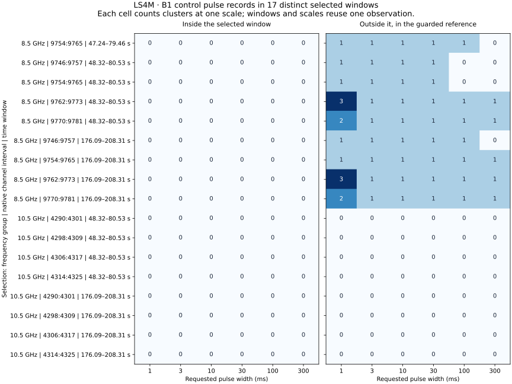

# LS4M: measured B1 control morphology

**Completed: one 9,435,087,189-byte B1 HTR file verified; 17 distinct selected windows and four fixed-window controls measured. All 256 selected-fragment and 48 fixed-window OFF count/veto comparisons reproduce LS4L. No sky candidate is promoted.**

**Main finding:** all nine selected 8.5 GHz windows are HTR-vetoed exclusively by reference-region control pulses; none contains an inside-window control pulse at any tested width. All eight selected 10.5 GHz windows have zero control pulses at these thresholds. This locates the measured HTR veto that blocked the lower-band digital tests. It does not resolve the separate Stage-1 OFF rejection.



## Selected-window results

| Frequency group | Distinct windows | OFF-vetoed windows | Windows with inside pulses | Windows with reference pulses | Reused fragment evaluations |
|---|---:|---:|---:|---:|---:|
| 8.5 GHz | 9 | 9 | 0 | 9 | 160 |
| 10.5 GHz | 8 | 0 | 0 | 0 | 96 |

The 256 uses are the 64 LS4L selected fragments crossed with four HTR digital amplitudes. The measured OFF scan is unchanged across those uses. Seventeen distinct band/window selections avoid counting the same numerical extraction repeatedly, but these selections are still correlated measurements of one observation. The four full-truth-band controls are reported separately below.

## Selected-window pulse measurements by scale

Counts below sum cluster records over distinct selected windows. A feature can recur at several scales and in several overlapping selections; the sums are not counts of independent physical pulses. Largest-channel fractions describe positive excess above the full guarded per-channel reference mean, which differs from the detector’s local residual baseline.

| Group | Width (ms) | Inside records | Reference records | Peak-score range | Largest-channel fraction range | Effective positive channels range |
|---|---:|---:|---:|---|---|---|
| 8.5 GHz | 1 | 0 | 15 | 8.09–74.19 | 0.211–0.541 | 2.92–5.98 |
| 8.5 GHz | 3 | 0 | 9 | 16.66–35.92 | 0.207–0.360 | 4.06–6.10 |
| 8.5 GHz | 10 | 0 | 9 | 20.83–51.16 | 0.184–0.285 | 5.02–6.13 |
| 8.5 GHz | 30 | 0 | 9 | 19.43–54.73 | 0.188–0.264 | 4.95–6.14 |
| 8.5 GHz | 100 | 0 | 7 | 13.17–40.38 | 0.175–0.237 | 4.92–6.10 |
| 8.5 GHz | 300 | 0 | 5 | 10.12–15.78 | 0.182–0.233 | 5.20–6.20 |
| 10.5 GHz | 1 | 0 | 0 | — | — | — |
| 10.5 GHz | 3 | 0 | 0 | — | — | — |
| 10.5 GHz | 10 | 0 | 0 | — | — | — |
| 10.5 GHz | 30 | 0 | 0 | — | — | — |
| 10.5 GHz | 100 | 0 | 0 | — | — | — |
| 10.5 GHz | 300 | 0 | 0 | — | — | — |

## Separately labelled fixed-window controls

| Group | Width (ms) | Distinct windows | Inside records | Reference records |
|---|---:|---:|---:|---:|
| 8.5 GHz | 1 | 2 | 0 | 4 |
| 8.5 GHz | 3 | 2 | 0 | 2 |
| 8.5 GHz | 10 | 2 | 0 | 2 |
| 8.5 GHz | 30 | 2 | 0 | 2 |
| 8.5 GHz | 100 | 2 | 0 | 2 |
| 8.5 GHz | 300 | 2 | 0 | 2 |
| 10.5 GHz | 1 | 2 | 0 | 0 |
| 10.5 GHz | 3 | 2 | 0 | 0 |
| 10.5 GHz | 10 | 2 | 0 | 0 |
| 10.5 GHz | 30 | 2 | 0 | 0 |
| 10.5 GHz | 100 | 2 | 0 | 0 |
| 10.5 GHz | 300 | 2 | 0 | 0 |

## Interpretation and boundaries

Across the nine lower-band selections, the 54 pulse-cluster records are dominated by structure around 113.6 s into B1, outside both selected time placements. Additional 1 ms records occur around 242.04 s and 273.55 s. The structure around 113.6 s is represented in all four selected lower-band frequency intervals. The equal-window 30 ms comparisons include six matched pulse records between bands sharing no native channels; these repeated comparisons are not six independent events.

In the 11-channel selected bands, the largest-channel positive-excess fraction ranges from approximately 0.175 to 0.541, with effective positive-channel counts from 2.92 to 6.20. Thus the retained peak descriptors distribute excess across several channels. No extracted channel records byte values 0 or 255. Neither observation establishes the physical origin of the feature or excludes other instrumental effects.

The unchanged HTR rule vetoes a window if any selected-width pulse appears anywhere in its OFF inside or guarded reference regions. A reference-region veto does not assert a pulse at the injected ON pulse times. B1 and A1 are separate pointings at different times; LS4M does not test simultaneous ON/OFF emission.

The retained ledger gives every peak time, score, cluster span and positive channel-excess vector. Cross-band comparisons use identical time windows and equal scales, with shared native channels explicitly labelled. Byte endpoint occupancy is descriptive and does not prove hardware saturation. These measurements cannot by themselves establish interference or celestial origin.

Original Stage-1 vetoes and both HTR veto definitions remain unchanged. LS4M does not revise LS4F, LS4I, LS4J or LS4L outcomes, fit a diffraction model, calibrate physical sensitivity or false-alarm probability, or promote a sky candidate. Reserved A3/C1/D1 remain unopened.

The next method-development question is whether reference-only OFF activity should receive a separately calibrated diagnostic category. Any proposed acceptance change needs a new frozen plan and interference/false-admission controls. LS4M itself supplies morphology and exact veto localization, not that calibration.

## Reproducibility and execution

The plan, implementation, inputs and 60 passing relevant tests were frozen locally at `74959d3` and published at `669c9c1441b1be275353281108c2eb67543a0b4f` before the B1 spectral read. Only B1 was downloaded; its full checksum and header were verified. A derived checkpoint was saved after each window before final validation. The raw file was deleted; no scan arrays, native submatrices or collapsed time series are published.

Verified source bytes: 9,435,087,189. Charged download budget: 9,435,087,189 of 18,870,174,378 bytes. Runtime: Python 3.12.13, NumPy 2.3.5.

Result identity: `87bced178976c6116974a97bfd7d823768cb48eadd6b61aeed993b43dd30d047`.

```bash
sha256sum -c LS4M_FREEZE.sha256
sha256sum -c RESULTS_MANIFEST_LS4M.sha256
PYTHONPATH=src:scripts python scripts/ls4m_result_summary.py
PYTHONPATH=src:scripts python scripts/ls4m_write_report.py
```

The verification and report commands use only retained derived evidence. The spectral runner refuses to overwrite an existing output directory.
