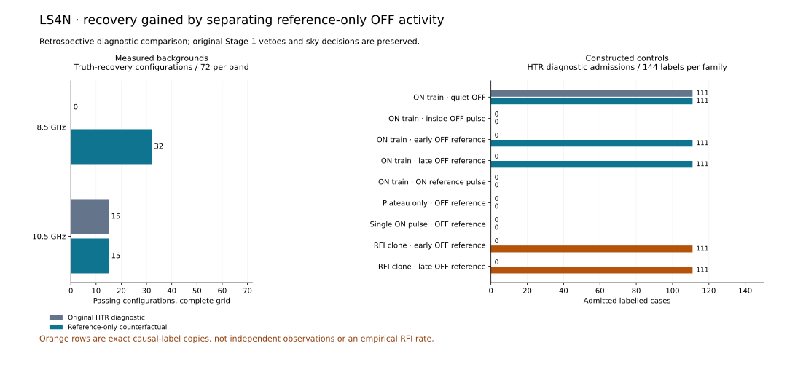

# LS4N: reference-only OFF diagnostics recover injections and admit origin clones

**Completed: all 144 LS4L configurations and 256 selected-fragment evaluations reclassified diagnostically; 1,296 labelled synthetic scenarios completed, representing 880 distinct waveform pairs and 880 residual evaluations. All 66 relevant tests passed. No new radio spectra were read.**

Separating reference-only OFF activity increases measured truth-associated HTR diagnostic recovery from **15/144 to 47/144** configurations. The additional **32** configurations are all at 8.5 GHz. Original Stage-1 vetoes remain attached, so original joint passes and promoted sky candidates remain **zero**.



## Exact diagnostic comparison

The original HTR diagnostic requires cross-scale ON pulse support, no ON-reference pulse and no OFF pulse anywhere in the inside/reference regions. The counterfactual keeps the support requirement, ON-reference veto and inside-OFF veto, while recording reference-only OFF activity separately. Truth recovery requires at least three of the same injected pulses at two supporting scales. This is a separately frozen retrospective diagnostic study; the operational rule was not edited.

LS4M OFF morphology was joined to the original LS4L event records. All 256 selected-fragment and 48 fixed-window OFF count/veto comparisons reproduce their original values before the policy comparison. No pulse is newly detected, associated, widened or merged.

Inside and reference regions are defined in time relative to each scan. A1 and B1 are separate pointings observed at different times; reference-only OFF activity is not evidence that interference was absent during the ON observation.

## Measured-background outcomes

| Group | Original HTR truth passes / full grid | Counterfactual / full grid | Counterfactual / selected positive configurations | Zero-level fragment truth passes |
|---|---:|---:|---:|---:|
| 8.5 GHz | 0/72 | 32/72 | 32/36 | 0/40 |
| 10.5 GHz | 15/72 | 15/72 | 15/18 | 0/24 |

All 47 counterfactual truth-passing configurations contain a passing fragment absent at its own zero-HTR comparison. The 64 zero-level fragment evaluations have zero counterfactual pulse admissions and zero truth recoveries. These comparisons condition on previously injected medium selection and reused A1/B1 backgrounds; they are not complete-pipeline false-alarm trials. Medium and HTR amplitudes remain separate digital units, not a calibrated physical signal strength.

Each cell below contains six configurations: two time placements and three pulse widths. Entries are counterfactual truth recoveries, with empty selections retained in the denominator.

| Group | Medium amplitude | HTR 0 | HTR 4 | HTR 8 | HTR 16 |
|---|---:|---:|---:|---:|---:|
| 8.5 GHz | 1 | 0/6 | 0/6 | 0/6 | 0/6 |
| 8.5 GHz | 4 | 0/6 | 4/6 | 6/6 | 6/6 |
| 8.5 GHz | 16 | 0/6 | 4/6 | 6/6 | 6/6 |
| 10.5 GHz | 1 | 0/6 | 0/6 | 0/6 | 0/6 |
| 10.5 GHz | 4 | 0/6 | 0/6 | 0/6 | 0/6 |
| 10.5 GHz | 16 | 0/6 | 3/6 | 6/6 | 6/6 |

## Complete synthetic controls

Each family has 144 labelled rows: eight seeds, white and AR(1) rho 0.8 noise, three ON widths (3/12/100 ms) and amplitudes (4/8/16 sigma). Vectors last 120 s at 1 ms sampling; the ON envelope is 30–70 s. A 12 ms, height-16 control pulse is placed at 50.25 s inside, 15.25 s in the early reference or 105.25 s in the late reference. The original LS4E residual processor and thresholds are unchanged. Unlike LS4K, these cases do not add a smooth OFF bump.

| Family | Labelled rows | Original HTR admission | Counterfactual HTR admission | Counterfactual truth recovery |
|---|---:|---:|---:|---:|
| ON train · quiet OFF | 144 | 111 | 111 | 111 |
| ON train · inside OFF pulse | 144 | 0 | 0 | 0 |
| ON train · early OFF reference | 144 | 0 | 111 | 111 |
| ON train · late OFF reference | 144 | 0 | 111 | 111 |
| ON train · ON reference pulse | 144 | 0 | 0 | 0 |
| Plateau only · OFF reference | 144 | 0 | 0 | 0 |
| Single ON pulse · OFF reference | 144 | 0 | 0 | 0 |
| RFI clone · early OFF reference | 144 | 0 | 111 | 111 |
| RFI clone · late OFF reference | 144 | 0 | 111 | 111 |

The alternative admits **111/144** trains for both early and late OFF-reference pulses, matching quiet-OFF recovery. It still rejects every tested inside-OFF-pulse, ON-reference-pulse, plateau-only and single-ON-pulse case. All admitted train cases meet the same truth-association requirement. The complete width/amplitude/background grid is retained in `recovery_grid.json`; unsuccessful cells are not omitted.

Both explicit ON-only interference clone families also receive **111/144** admissions. Their waveforms, truth annotations and decisions are exactly identical to their signal-labelled counterparts; every pair was verified. These are constructed causal counterexamples, not observed interference or independent trials. They show that the diagnostic inputs cannot resolve origin, not that 111/144 real interference signals would be accepted.

## Decision and next boundary

Reference-only OFF activity is a useful separate diagnostic category: it explains a substantial conditional injection-recovery loss in the existing lower-band backgrounds. The current evidence does **not** justify promoting those diagnostics into scientific candidates. The interference clones retain the same ambiguity as the recovered injections, and the original Stage-1 rejection remains unresolved.

The next useful investigation should seek independent discriminating evidence, such as a preregistered repeatability or beam/pointing consistency test, before considering a change in acceptance. Its feasibility and development/validation split should be established before opening reserved observations. Repeating threshold relaxations on these same backgrounds would not supply independent confirmation.

No operational veto, LS4F disposition or LS4I/LS4J/LS4L endpoint changed. A3/C1/D1 remain unopened. There is no new sky candidate, calibrated physical sensitivity, survey completeness, false-alarm probability or technosignature claim.

## Freeze, checkpoints and reproduction

Plan, configuration, implementation, tests and dependency/input identities were frozen locally at `dc95afd` and published at `598a99c62323db1b694cd02e0cda9cfc47099eb0` before the full numerical study. The measured ledger was saved first; synthetic progress was flushed and checkpointed after every seed. Final ledgers are losslessly compressed. Repeated backgrounds, null labels and causal clones make the labelled rows dependent.

Result identity: `a163eda05f1e9bd67410c6eeab08d6f635b7a5f6ce940e19719c2b43e8334457`. Runtime: Python 3.12.13, NumPy 2.3.5.

```bash
sha256sum -c LS4N_FREEZE.sha256
sha256sum -c RESULTS_MANIFEST_LS4N.sha256
PYTHONPATH=src:scripts python scripts/ls4n_result_summary.py
PYTHONPATH=src:scripts python scripts/ls4n_write_report.py
```

The verifier rechecks input hashes, all measured joins and original decisions, complete synthetic keys, every policy decision, all clone equivalences, waveform counts, ledger checkpoints and aggregate results. These commands need only retained derived evidence. The numerical runner refuses an existing output directory.
