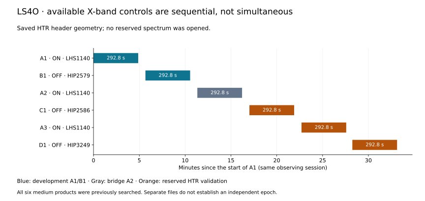

# LS4O: independent-control archive and pointing feasibility

**Status: scoped-metadata-feasibility-complete. 11/11 metadata queries succeeded; 36 distinct matching product URLs and 12 scan/frequency groups were retained. No new radio spectral values were read.**

No X-center scan group at least 24 hours from the original X-band start was found in the returned metadata.

The retained scan groups were observed on these UTC dates: 2017-01-21.



## Expanded archive query

Ten frozen aliases from the LS3 configuration were each queried with only `target` and `limit=3000`. A control query repeated the earlier exact-LHS1140 GBT/cadence/primary-target restriction. The target-only requests omit those restrictions explicitly; undocumented API defaults and other archives are outside this study. Returned target names were checked against the normalized frozen alias set.

| Alias | Query type | Success | Returned rows | Record cap reached |
|---|---|---|---:|---|
| LHS 1140 | target_only | True | 0 | False |
| LHS1140 | target_only | True | 36 | False |
| GJ 3053 | target_only | True | 0 | False |
| GJ3053 | target_only | True | 0 | False |
| TOI-256 | target_only | True | 0 | False |
| TOI256 | target_only | True | 0 | False |
| TIC 92226327 | target_only | True | 0 | False |
| TIC92226327 | target_only | True | 0 | False |
| 2MASS J00445930-1516166 | target_only | True | 0 | False |
| 2MASSJ00445930-1516166 | target_only | True | 0 | False |
| LHS1140 | historical_restricted_control | True | 4 | False |

Target-only queries expose **32** product URLs beyond the restricted query. Restricted URLs missing from those target-only responses: **0**. Nonmatching target records excluded: **0**. Metadata conflicts: **0**. Queries reaching the record limit: **0**.

Requests began at 2026-09-05T12:57:50.992187+00:00 and the final request began at 2026-09-05T13:00:15.630730+00:00. All response texts and their SHA256 hashes are retained, including failures. The observation dates below refer to the archive observations, not these retrieval timestamps.

## Matching scan and product inventory

The frequency grouping rounds catalog centers to 100 MHz for inventory only. Center frequency alone does not establish signal-band coverage. An interval of at least 24 hours screens possible new epochs; it is not proof of statistical independence.

| Telescope | Target | Start MJD | Center grouping (GHz) | Products | Medium | HTR | >=24 h X-center lead |
|---|---|---:|---:|---:|---|---|---|
| GBT | LHS1140 | 57774.819953704 | 1.5 | 3 | True | True | False |
| GBT | LHS1140 | 57774.827743056 | 1.5 | 3 | True | True | False |
| GBT | LHS1140 | 57774.835543981 | 1.5 | 3 | True | True | False |
| GBT | LHS1140 | 57774.857187500 | 2.4 | 3 | True | True | False |
| GBT | LHS1140 | 57774.864965278 | 2.4 | 3 | True | True | False |
| GBT | LHS1140 | 57774.872743056 | 2.4 | 3 | True | True | False |
| GBT | LHS1140 | 57774.897037037 | 6.5 | 3 | True | True | False |
| GBT | LHS1140 | 57774.904884259 | 6.5 | 3 | True | True | False |
| GBT | LHS1140 | 57774.912731481 | 6.5 | 3 | True | True | False |
| GBT | LHS1140 | 57774.968576389 | 10 | 3 | True | True | False |
| GBT | LHS1140 | 57774.976446759 | 10 | 3 | True | True | False |
| GBT | LHS1140 | 57774.984340278 | 10 | 3 | True | True | False |

## Existing X-band timing and pointing

The retained LS4A HTR headers, matched to LS4H source names and start times, give the following original ON/OFF adjacencies. Angular distances use the recorded SIGPROC pointing coordinates on the sphere. They are not a beam-response measurement.

| ON | Adjacent OFF | Angular separation (degrees) | Gap between integrations (s) | Simultaneous integration overlap (s) |
|---|---|---:|---:|---:|
| A1 | B1 | 3.4621 | 47.226 | 0.000 |
| A2 | B1 | 3.4625 | 47.226 | 0.000 |
| A2 | C1 | 3.5680 | 48.226 | 0.000 |
| A3 | C1 | 3.5677 | 48.226 | 0.000 |
| A3 | D1 | 2.2716 | 40.226 | 0.000 |

The three ON starts are 0.000, 680.000, 1362.000 seconds relative to A1. There are **0** simultaneous adjacent ON/OFF pairs. These same-session revisits can probe temporal behaviour, but source intermittency and changing interference prevent a simple ON/OFF detection pattern from proving origin.

## Other known bands and the reserved split

| Band | HTR native center range (GHz) | Covers 8.5 GHz | Covers 10.5 GHz |
|---|---|---|---|
| L | 0.752–2.251 | False | False |
| S | 1.652–3.151 | False | False |
| C | 5.002–8.001 | False | False |
| X | 7.952–12.076 | True | True |

A3 with C1/D1 is reserved for HTR validation; A2 bridges the development and reserved control groups. All six medium products were already searched by LS4B. HTR reservation preserves the future method-development boundary and does not make the medium data unseen or the observations a new epoch.

A3/C1/D1 HTR alone would require 28,305,261,567 full-file bytes; medium plus HTR would require 33,011,271,540. Those files were not downloaded here.

## Concrete next boundary

This scoped expansion supplies no new-epoch X-center lead. Opening the reserved A3/C1/D1 HTR set would therefore be a method-transport validation, not independent-epoch confirmation. A separately frozen validation protocol could assess the unchanged detector and labelled diagnostics, but cannot resolve ON-only interference merely by relaxing OFF vetoes.

For new discovery work, the next useful branch is an additional target or observing cadence selected from metadata with the existing acceptance rules. For a claim about LHS 1140 origin, seek an additional epoch or simultaneous spatial information from a separately qualified archive or observation. The current metadata do not supply a calibrated beam model or simultaneous control.

No new sky candidate, independent confirmation, physical sensitivity or false-alarm probability is claimed. The LS4N diagnostic comparison and all original LS4 dispositions remain unchanged.

## Reproducibility

All 72 relevant tests passed before local freeze `257352e`, published as `d89909f887c767efe94f3b5fabdd4af8cfdb4c26` before the eleven live requests. Every response was checkpointed before the next request. Prior headers supplied geometry; no new linked radio file or header was opened.

Result identity: `0406a0c6877da783bfd56ec629d90d82fad99ddf4eb6e0f7bed416f0a14ed390`.

```bash
sha256sum -c LS4O_FREEZE.sha256
sha256sum -c RESULTS_MANIFEST_LS4O.sha256
PYTHONPATH=src:scripts python scripts/ls4o_result_summary.py
PYTHONPATH=src:scripts python scripts/ls4o_write_report.py
```

The verifier checks raw metadata response hashes, query identity, URL deduplication, filters, completeness annotations, all geometry, checkpoints and result identity without network access. The live runner refuses an existing output directory.
