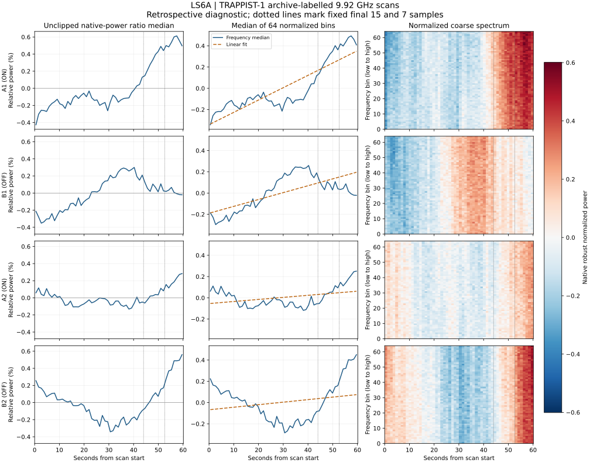

# LS6A TRAPPIST-1 scan-end diagnostic

**Completed: strong shared frequency variation; instrumental origin remains unproven.**

All four original files (58,721,848 bytes) match their LS6 SHA-256 digests. Replaying the original screen reproduces every scan record, score and retained window exactly. The 47 primary ON survivors remain unchanged. This is a retrospective diagnostic on previously exposed data, not independent confirmation.

Both ON scans have a positive final-window contrast in every one of the 64 frequency bins, for both fixed tail lengths. Shared time variation is also strong in the OFF scans. Subtracting one across-bin median trace removes 87.6–97.2% of the time-centered squared energy across the four scans. This supports the common-mode/baseline concern; zero retained OFF events does not imply a stable OFF baseline.

| Scan | Role | Energy removed by common trace | Positive bins, final 7 | Positive bins, final 15 |
|---|---|---:|---:|---:|
| A1 | ON | 97.23% | 64/64 | 64/64 |
| B1 | OFF | 95.27% | 53/64 | 64/64 |
| A2 | ON | 87.64% | 64/64 | 64/64 |
| B2 | OFF | 96.57% | 64/64 | 64/64 |

The energy fraction uses unit subtraction of the median of time-mean-centered bin traces. It is descriptive, not calibrated variance explained by an instrumental model, and has no detection significance.

## Time shape

| Scan | Linear R² | Final-7 step R² | Final-15 step R² | Raw relative-power range (%) |
|---|---:|---:|---:|---:|
| A1 | 0.764 | 0.511 | 0.855 | -0.427 to +0.613 |
| B1 | 0.485 | 0.001 | 0.026 | -0.352 to +0.300 |
| A2 | 0.134 | 0.542 | 0.449 | -0.132 to +0.283 |
| B2 | 0.049 | 0.521 | 0.414 | -0.342 to +0.561 |

The fixed final-15 step fits A1 better than a straight line (R² 0.855 versus 0.764); the final-7 step fits A2 better than a straight line (0.542 versus 0.134). A simple linear-drift explanation alone is therefore insufficient. These comparisons use two-parameter descriptive fits, with no breakpoint search or inferential model selection. Raw-power ranges refer to the frequency median of each native channel divided by its own temporal median, minus one; they are not calibrated flux changes.



All panels use full scans and shared scales within each column. The heatmap uses all 64 bins, ascending in frequency over 9826.466–10013.963 MHz; it is native robust normalization before the detector’s second temporal normalization. Dotted lines mark final 15 and 7 samples (44.023 and 52.613 seconds).

## Scientific disposition

The 47 windows are consistent with two scan-ending broadband elevations that warrant baseline and observing-state checks. This diagnostic cannot distinguish instrumental gain, interference, pointing changes, or a true broadband sky variation. A pulse can also continue beyond the recorded boundary. No candidate is promoted, and no additional veto is imposed. Pointing uncertainty and missing conjunction qualification from LS6 remain. No HTR data, other subband, or independent epoch was opened.

A useful next step is a separately frozen comparison of other archived medium-resolution X-band subbands at these same scan times, with frequency selection determined from metadata. That could test how far the shared behavior extends; it would still not provide an independent epoch or establish a celestial origin.

## Verification and reproduction

All 147 LS tests passed, including three synthetic diagnostic checks: shared linear drift, a localized step, and a negative step with an invalid frequency bin. The full repository test suite is not claimed. The report generator verifies configuration/code hashes, the sealed result, and every checkpoint before rendering.

Public diagnostic freeze: `b446ae4435f90893fc06bdbcfb322f46f2402021`; tree `28b1d4f0afaa42ee81ddd1b20400db0055dee5e1`. The public branch ref was verified before rereading spectra.

Result identity: `a6831cc8b440561a2881e01afa57c35b3a06e9b25155367be629b811892f87c7`.

Per-scan JSON checkpoints and the combined diagnostic retain the full 56×64 coarse matrices, signed contrasts, fits, raw-ratio traces, channel-validity counts and original file digests/URLs. Per-scan CSV files export all time-mean-centered coarse traces. Raw files were deleted after processing. The original LS6 files and report were not changed.

```bash
PYTHONPATH=src:scripts python -m unittest discover -s tests -p 'test_ls*.py' -v
PYTHONPATH=src:scripts python scripts/ls6a_scan_end.py
PYTHONPATH=src:scripts python scripts/ls6a_result_report.py
```
