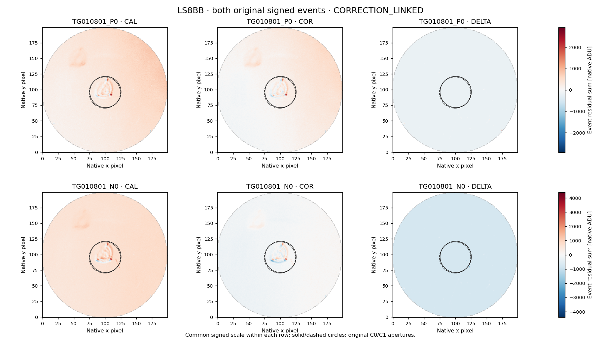

# LS8BA–LS8BB — 2MASS J11285624+1010395 result and exact continuation

23 September 2026. The predetermined rank-21 pair and its complete signed-event
image follow-up are **complete and closed**. Both original representatives are
**CORRECTION_LINKED** under the unchanged two-convention gate. No representative
is unresolved, so no residual-study branch is triggered. No qualified SETI
candidate, detector, sensitivity or observing-coverage claim is added.

The pair supplies **97 retained L2 rows and 90 eligible overlapping windows**.
Six positive crossings form one positive cluster; three negative crossings form
one negative cluster. Both representatives come from the first visit. The second
visit has **zero eligible windows and provides no tested null**. Scores are not
calibrated Gaussian significances or false-alarm probabilities.

## Full scope, including unassessed points

Both visits independently verify NEXP=1, EXPTIME=TEXPTIME=60 seconds and pipeline
14.1.2. Each uses its own verified cadence. The rule remains one/two/three-row
durations, 12-row sidebands on each side, two-row guards, +/-8.5 endpoints,
finite BJD/FLUX/FLUXERR, positive error, STATUS=0 throughout the complete context,
and adjacent BJD steps within 0.5–1.5 own cadences. Gaps are not bridged. EVENT is
metadata. Local linear baselines use sidebands only; display medians do not enter
the scorer. Positive and negative clusters remain separate.

| Visit | Rows | STATUS=0 finite | Eligible windows, 1 / 2 / 3 rows | Positive / negative crossings | Positive / negative clusters |
|---|---:|---:|---:|---:|---:|
| CH_PR100018_TG010801_V0300 | 59 | 59 | 31 / 30 / 29 | 6 / 3 | 1 / 1 |
| CH_PR100018_TG010802_V0300 | 38 | 36 | 0 / 0 / 0 | 0 / 0 | 0 / 0 |

Indices below are zero-based. In the first visit, the eligible event-row union
is rows 14–44 inclusive. Row 25 is the display maximum, **1.089038587 times**
the STATUS=0 visit median, and row 24 is the minimum, **0.953179868 times** that
median. Both belong to six eligible overlapping windows and receive all fixed
follow-up. **The last point, row 58, is also high: 1.087587210 times the median,
but has no complete eligible context. It remains retained and unassessed.**
It is not substituted for a selected event or treated as a null.

The second visit has flagged rows 17 and 30 and cadence gaps after rows 16 and
29. Its display maximum at row 28 is **1.011936491 times** its STATUS=0 visit
median. None of its points belongs to an eligible event window. Its minimum,
row 30, has STATUS=1. Zero eligible windows cannot constrain variability,
sensitivity or false alarms. All 97 rows remain visible and preserved.

[Full L2 report and original figure](results_ls8ba_l2_screen/REPORT.md) retain
all points and window outcomes. The row union is bookkeeping, not qualified
observing coverage.

## Both original signed representatives

| Representative | Event row | Duration | Original score | Excess / local baseline | Fixed label | DELTA/COR, C0 / C1 |
|---|---:|---|---:|---:|---|---:|
| TG010801_P0 | 25 | 1 row, 60 s | +65.277455650071 | +8.778835% | CORRECTION_LINKED | -1.485049 / -1.534163 |
| TG010801_N0 | 24 | 1 row, 60 s | -35.043142304665 | -4.788958% | CORRECTION_LINKED | +9.886640 / +9.536732 |

Exposure integration does not establish the duration of a possible shorter
physical pulse. Local baseline excesses in this table differ from visit-median
display ratios. These adjacent events occur in each other's original guard
rows, never in each other's sideband training. Keep both original fits and
signs; their outcomes are **not independent replication**.

Their half-open contexts are P0 [11,40) and N0 [10,39). The 58 context-row
occurrences contain **30 distinct L2 exposures**, with **28 shared rows**.
The metadata audit verifies all 116 context-specific CAL/COR joins, each with
unique matching exposure, exact UTC/CE and MJD/BJD agreement within 1 ms.
There are only **60 distinct CAL/COR exposure rows**.

The independently frozen retained-data verification confirms the 28 shared
rows are byte-identical in CAL, COR and smearing. The originally acquired
37,120,000 image bytes and 92,800 smearing bytes include duplicates; the distinct
unions are **19,200,000 image bytes and 48,000 smearing bytes**. No new archive
bytes or native fits were needed for this check. The second visit's images
remain unopened because it supplies no eligible representative.

## Image interpretation and fixed gate order

Both original radius-25 apertures are complete and both COR signs match their
L2 signs in C0 and C1. The correction gate is evaluated first: absolute DELTA/COR
or column-DELTA/COR >=0.5 in both conventions. Both events pass it. DELTA means
COR minus CAL; its signed ratio may exceed one or be negative.

| Representative | COR brightness explained, C0 / C1 | COR displacement explained, C0 / C1 | Column-DELTA/COR, C0 / C1 |
|---|---:|---:|---:|
| TG010801_P0 | 25.64076% / 24.58081% | 87.21472% / 86.99564% | -1.483655 / -1.532798 |
| TG010801_N0 | 3.93318% / 4.16202% | 87.87662% / 87.88613% | +9.878309 / +9.528262 |

The displacement fits would also exceed the later spatial thresholds, but the
predeclared correction gate takes precedence. There is no relabeling. All
smearing fits are rank deficient (rank 1) and unavailable; they do not isolate
a physical correction component.

The maps show broad positive CAL background and signed stellar-profile
structure. COR retains signed structure around the source; DELTA shows a broad
predominantly negative change. The ratios and maps establish material coupling
to the delivered processing. They identify neither a unique physical cause
nor an artificial origin, and they do not exclude underlying source variability.

This combined figure uses the retained map values, finite footprints, original
centers, apertures and common signed scale within each event. Only layout was
changed to resolve crowded labels in an original panel. All original figures
remain untouched. Figures do not feed selection, fitting or classification.

## Verification and closure

All four data-reading/analysis workflows and the retained verification workflow
finish successfully at their exact public freeze commits. The 5 transport,
2 stable L2 and 11 image tests pass before their corresponding calculations.
Independent audits pass **1,080 L2 comparisons**, **534 metadata checks** and
**189,074 numerical / 321,158 exact image checks**, with zero disagreements.
Full own-header schemas, exposure tuples and byte boundaries are independently
verified before L2 values. No scientific failure or result-dependent rerun
occurred in this cohort.

There are 175 added scientific/verification files across ten commits after the
previous closure, with no inherited file changed or removed. **171 match public
Git blobs locally**; four large CAL/COR gzip files could not be downloaded
locally through the available transport. Those four are retained in public Git
and verified by the independent image audit and the frozen retained CI check.
Of 143 manifest entries, 139 are recomputed locally and four are verified in
those published CI checks. All six compressed/raw receipts and all three exact
overlap comparisons pass. All four figures have been visually reviewed.

The optional Actions artifact uploaded successfully, but its local download
returned HTTP 403; no local ZIP verification is claimed. The public scientific
files and verification records remain available. See the
[publication record](PUBLICATION_2026-09-23_LS8BA_LS8BB.md) and
[machine-readable verification](verification_ls8bb/release_verification.json).

## Exact next action

**Prepare LS8BC for rank-22 GJ 422**, the next target in the original reconciled
cohort order. Select only its exact chronological pair below. These are both
eligible visits in the ledger; their science values remain unopened.

| Visit | Exact key | Ledger start MJD | Ledger tuple, subject to own header verification |
|---|---|---:|---|
| 1 | CH_PR100018_TG012201_V0300 | 58977.1106305392 | NEXP=1; EXPTIME=TEXPTIME=60 s; pipeline 14.1.2 |
| 2 | CH_PR100018_TG012202_V0300 | 58981.0175723509 | NEXP=1; EXPTIME=TEXPTIME=60 s; pipeline 14.1.2 |

Freeze the pair and bounded header reader before archive access. Independently
verify each identity, full schema, row count, exposure tuple and source receipt.
Then separately freeze exact DEFAULT-L2 identities and byte ranges before
values. Transfer the unchanged signed screen and scalar audit using each
independently verified cadence. Any selected representatives receive the full
fixed signed-event follow-up; no threshold is inferred from this closed pair.

The original 1,000-row census, 452 eligible visits and 107-cohort order remain
equal to their independent reconciliation. The historical limitation that
LS8J discarded its first full product responses remains documented; later
reconciliation responses remain preserved. Earlier labels, unassessed points,
closed studies and reserved TESS/M43 panels are unchanged. GJ 536's P1/P6 keep
their unresolved labels and its single bounded study stays closed. No target
is reopened or widened. Calibration NOT_READY; technical request UNSENT.
Standing research/publication authorization continues; delegation is deferred.
