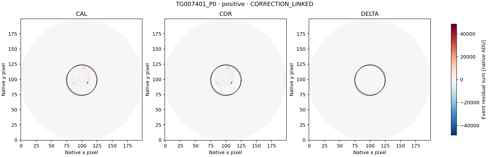

# LS8BD–LS8BE — GJ 494 pair closed and exact continuation

24 September 2026. The predetermined rank-23 first pair and its complete
signed-event image follow-up are **complete and closed**. The single positive
representative is **CORRECTION_LINKED** under the unchanged gate. No event
remains unresolved, so no residual-study branch is triggered. No qualified
SETI candidate, detector, sensitivity or observing coverage is added.

## Full L2 result and scope

| Exact visit | Retained rows | STATUS=0 finite | Eligible windows, 1 / 2 / 3 rows | Positive / negative crossings | Positive / negative clusters |
|---|---:|---:|---:|---:|---:|
| CH_PR100018_TG007401_V0300 | 83 | 81 | 40 / 39 / 38 | 2 / 0 | 1 / 0 |
| CH_PR100018_TG007402_V0300 | 65 | 64 | 17 / 16 / 15 | 0 / 0 | 0 / 0 |

The pair supplies **148 retained rows and 165 eligible overlapping windows**.
Each own header independently verifies NEXP=1, EXPTIME=TEXPTIME=42 seconds
and pipeline 14.1.2. The fixed screen tests one/two/three rows (42/84/126
seconds), with 12-row sidebands, two guards, finite BJD/FLUX/FLUXERR,
positive error, STATUS=0 throughout and adjacent steps within 0.5–1.5 own
cadence. Gaps are not bridged. EVENT is metadata. Baselines use sidebands
only, and the symmetric +/-8.5 endpoints and signed clustering are unchanged.
Scores are not Gaussian significances or calibrated false-alarm probabilities.

Both crossings belong to the same first-visit cluster: the one-row event at
row 53 and the two-row interval starting at 52. The strongest representative
is row **53**, score **+17.588818768661**, local excess **+0.433469321%**.
One 42-second integrated exposure does not establish the duration of any
shorter physical pulse. The two overlapping windows are not independent
detections. No negative window crosses.

All rows remain in the [full L2 report and figure](results_ls8bd_l2_screen/REPORT.md).
Indices below are zero-based. First-visit eligible event rows are 14–53
inclusive; flagged rows 68/69 and the gap after 68 limit contexts. Row 53 is
also its maximum, **1.004064433 times** the STATUS=0 visit median, and is
included in three eligible windows. Its minimum at row 73 has STATUS=0 but
no eligible event window. Second-visit eligible event rows are 14–30;
row 45 is flagged and a gap follows row 44. The second visit's maximum,
row **13**, is **1.003669573 times its STATUS=0 visit median**, but has no
complete eligible context. It remains preserved and unassessed; it is not
substituted into image follow-up. Its minimum at row 5 is also unassessed.
Visit-median ratios are display values, not fitted event excesses.

[Retained scope bookkeeping](verification_ls8be/eligible_scope.json) does
not constitute qualified observing coverage. The two later GJ 494 visits,
TG007403 and TG007404, remain outside the selected pair.

## Complete image follow-up and interpretation

The sole representative TG007401_P0 uses unchanged context **[39,68)**:
29 distinct L2 exposures with 58 unique CAL/COR exposure joins. Independent
metadata decoding checks MJD/BJD within 1 ms, exact UTC, counters and
integrity. No image/L2 index equivalence was presumed. Exact native source
identities and all three image/smearing ranges were frozen before pixels.

| Quantity | C0 | C1 |
|---|---:|---:|
| CAL signed aperture event sum, native ADU | 375457.978091 | 370988.151459 |
| COR signed aperture event sum, native ADU | 83493.496394 | 79023.709248 |
| DELTA = COR − CAL signed aperture sum, native ADU | -291964.481697 | -291964.442211 |
| DELTA/COR | -3.496853 | -3.694644 |
| Column-DELTA/COR | -3.500347 | -3.698375 |
| COR brightness explained | 0.08148% | 0.08193% |
| COR displacement explained | 81.79546% | 81.79735% |

Both apertures are complete and both COR signs match the original positive
L2 sign. The correction gate passes first because the absolute DELTA/COR
ratios exceed 0.5 in both conventions. The later spatial gate would also
pass, but its priority is lower; the label remains CORRECTION_LINKED.
Both smearing fits are rank deficient (rank 1) and unavailable.

The common-scale figure shows strong signed source structure in CAL and
COR. DELTA has much weaker contrast per pixel on that shared scale; its
aperture-integrated change is nevertheless large relative to the net COR
sum. Do not confuse a large signed aperture ratio with dominance of every
pixel or a unique physical explanation. The label demonstrates material
coupling to delivered processing; it identifies neither one correction
component nor artificial origin and does not exclude source variability.

The [complete image report](results_ls8be_images/REPORT.md) retains every
map, fit, original label and independent reconstruction. The unresolved set
is empty; no additional pixels, masks, visits or residual study are added.

## Verification and publication

All four data-reading/analysis workflows succeed at their original public
freezes. The 5 transport, 2 stable L2 and 11 image tests pass before their
corresponding data calculations. Independent audits pass **1,980 L2
comparisons**, **269 metadata checks**, and **94,537 numerical / 160,581
exact image checks**, with zero disagreements. Original tolerances remain
unchanged. Both full figures were visually inspected.

Eight scientific commits add **157 files** without changing inherited files.
**155 match public Git blobs locally**. The two large compressed CAL/COR
payloads could not be retrieved locally through the contents connector;
both remain public and are verified by the published independent image
audit, which checks compressed/raw hashes, exact ranges and reconstructed
maps/fits. No local raw-byte verification is claimed for those two files.
Of **129 manifest entries**, 127 pass locally and two pass that CI audit.
All **68 pinned-input checks** pass locally. Source receipts, image maps,
fits, audits, reports, figures and the smaller smearing payload are local.

Acquisition: 40,320 L2-header bytes, 20,424 L2-table bytes, 119,766 image
header/metadata bytes, 18,560,000 CAL/COR image bytes and 46,400 smearing bytes.
Every URL resolution and payload range succeeds on its first attempt.
Retained release/scope verification adds zero archive bytes or new fits.

[Publication record](PUBLICATION_2026-09-24_LS8BD_LS8BE.md),
[release verifier](scripts/ls8be_release_verify.py), and
[machine-readable verification](verification_ls8be/release_verification.json).

## Exact next action

**Prepare LS8BF for rank-24 2MASS J11474440+0048164**, next in the unchanged
reconciled cohort order. These are both eligible visits in its original ledger:

| Exact visit | Ledger start MJD | Ledger tuple, subject to own header verification |
|---|---:|---|
| CH_PR100018_TG007101_V0300 | 58973.7203424506 | NEXP=1; EXPTIME=TEXPTIME=60 s; pipeline 14.1.2 |
| CH_PR100018_TG007102_V0300 | 58985.2610662136 | NEXP=1; EXPTIME=TEXPTIME=60 s; pipeline 14.1.2 |

Freeze the exact pair and bounded header reader/auditor before access.
Independently verify each identity, complete schema, row count, exposure
tuple and receipt; then separately freeze exact DEFAULT-L2 identities and
ranges before values. Transfer the unchanged screen and scalar audit using
each own cadence; do not inherit 42 seconds. Every selected representative
gets the fixed signed follow-up. These science values remain unopened.

The original 1,000-row census, 452 eligible visits and 107-cohort order are
unchanged. The historical LS8J discarded-response limitation and preserved
later reconciliation remain documented. Earlier labels, unassessed points,
closed studies and reserved TESS/M43 panels stay unchanged. Calibration
NOT_READY; technical request UNSENT. Publication authorized; delegation deferred.
