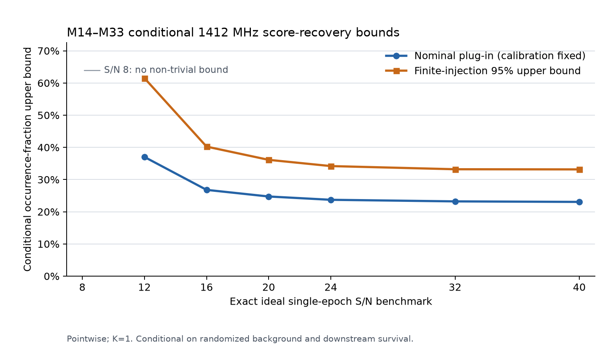

# Milestone 35 report: retrospective 1412 MHz survey synthesis

Status: **COMPLETE — CONDITIONAL SCORE-RECOVERY BOUNDS PUBLISHED; PRIMARY
FINITE-INJECTION POINTWISE 95% UPPER BOUND ON `f(40)` IS 33.16%; `f(40)` IS
THE COMMON ARCHIVE-COHORT SYSTEM-OCCURRENCE PROBABILITY FOR THE FROZEN
INJECTED CLASS; NO NON-TRIVIAL UNCONDITIONAL END-TO-END LIMIT OR DETECTION
CLAIM**.

Milestone 35 combines the detector-v0.5 held-out searches from Milestones
14--33 into the first target-level sensitivity synthesis for this repository.
It is retrospective rather than blind: all search and candidate records were
already public when the protocol was designed. The protocol, inputs, cohort,
statistic, and stopping rule were nevertheless frozen in a separate commit
before the final scripted execution.

The result is deliberately narrow. It uses the 1412.0--1413.0 MHz outcome
window because every target's injection experiment used its corresponding
`mXX_1412p5` background. It evaluates only the exact ideal single-epoch S/N
benchmarks 8, 12, 16, 20, 24, 32, and 40. It is not a five-window, fixed-
frequency, flux, EIRP, civilization, or Galaxy-wide constraint.

## Complete matched-band accounting

The primary cohort is the complete administrative sequence M14--M33: 20
held-out target systems. Every 1412 MHz cluster list is fully retained. The
matched band contains 267 clusters, of which 49 exceed the target-specific
operational threshold. Forty-eight have a frozen physical OFF-source or
receiver-frame veto. The only remaining candidate-positive system is M16 at
1412.485745176673 MHz.

M16 is counted as one possible true detection even though its later independent
cadence did not redetect it. Non-redetection is neither a physical veto of the
primary event nor a calibrated two-cadence completeness experiment. This is a
conservative counting choice, not a detection claim.

The secondary complete-retention check is the contiguous M23--M33 cohort: 11
systems, 192 matched-band clusters, two above threshold, both with M27
local-OFF vetoes, and zero candidate-positive systems.

| Cohort | Systems | Complete clusters | Above threshold | Physical vetoes | Candidate-positive systems used as upper count |
|---|---:|---:|---:|---:|---:|
| M14--M33 primary | 20 | 267 | 49 | 48 | 1 (M16) |
| M23--M33 secondary | 11 | 192 | 2 | 2 | 0 |

M14, M15, M16, and M33 have candidate records in other frequency windows;
those cases do not enter the frequency-matched 1412 MHz count. M33's unresolved
1425 MHz case is unchanged. The outcome-selected M17--M32 clean-null subset was
explicitly rejected as a primary analysis.

## Statistical result

At exact benchmark `S`, the model assigns every system in a cohort the same
independent Bernoulli occurrence probability `f(S)` for the frozen injected
signal class. This is a model probability, not the observed fraction of these
systems in the finite cohort. Target `i` has score-recovery efficiency `c_i(S)`,
and recovered true signals follow an exact Poisson-binomial distribution with
probabilities `f(S) c_i(S)`.

The nominal plug-in upper limit treats each observed `k_i/32` recovery fraction
as fixed and solves the inclusive lower-tail equation `P(T <= K) = 0.05`. It is
not a finite-calibration 95% confidence bound.

The conservative column accounts for finite injection counts. It assigns 0.025
error probability to simultaneous target-level calibration and 0.025 to the
survey tail. Target lower bounds use the inhomogeneous-Bernoulli construction
of [Mattner and Tasto, *Confidence intervals for average success probabilities*](https://arxiv.org/abs/1403.0229),
Theorem 1.2, with Bonferroni allocation across targets. The exact
Poisson-binomial tail is then inverted at 0.025. This yields a pointwise 95%
upper confidence bound under the model assumptions; it is not simultaneous
over S/N levels or between the primary and secondary analyses.

### Primary M14--M33 (`K = 1`)

| Exact ideal S/N | Observed effective exposure `sum(c_i)` | Nominal plug-in upper limit | Finite-injection pointwise 95% upper bound |
|---:|---:|---:|---:|
| 8 | 1.7813 | no non-trivial bound | no non-trivial bound |
| 12 | 11.1875 | 37.02% | 61.51% |
| 16 | 15.8750 | 26.79% | 40.23% |
| 20 | 17.2813 | 24.74% | 36.12% |
| 24 | 18.0938 | 23.71% | 34.19% |
| 32 | 18.5000 | 23.22% | 33.20% |
| 40 | 18.6563 | 23.06% | **33.16%** |

### Secondary M23--M33 (`K = 0`)

| Exact ideal S/N | Observed effective exposure `sum(c_i)` | Nominal plug-in upper limit | Finite-injection pointwise 95% upper bound |
|---:|---:|---:|---:|
| 8 | 0.4688 | no non-trivial bound | no non-trivial bound |
| 12 | 4.5938 | 51.02% | 84.80% |
| 16 | 7.6875 | 32.97% | 51.95% |
| 20 | 8.9688 | 28.58% | 42.80% |
| 24 | 9.7188 | 26.60% | 38.92% |
| 32 | 10.0000 | 25.89% | 37.31% |
| 40 | 10.1563 | 25.58% | 37.22% |

The S/N 8 rows have no non-trivial result because even `f = 1` leaves the
relevant lower-tail probability above its inversion threshold.

## Two additional mandatory sensitivity-transport conditions

In addition to the common independent-occurrence model and independent-trial
model above, the numerical bounds are valid only with both of the following
sensitivity-transport conditions.

First, a true injected-class signal recovered above the operational score
threshold is assumed not to be lost during candidate peak retention,
clustering, report capping, physical vetoing, or adjudication. The injection
endpoint executes none of those downstream stages.

Second, a true signal's local background and RFI relationship is assumed to
follow the frozen randomized injection distribution. Truth frequencies are
placed around 1412.5 MHz with a uniform +/-0.010 MHz offset and half-channel
jitter. Each epoch's real noise-vector/RFI-mask pair is circularly shifted
together, with shifts independent across epochs, trials, and S/N levels. The
result is an average over this generator, not a lower efficiency at every fixed
frequency in the 1 MHz outcome window.

Without either condition, the documented lower bound on relevant detection
efficiency can be zero. The only unconditional end-to-end occurrence upper
bound then supported by these records is the trivial value **100%**. This is
why 33.16% must always be described as a conditional randomized-background
score-recovery bound.

## Further interpretation limits

- Only `multi_channel_recovered` is used; one-channel recovery is not
  substituted.
- Each target contributes 32 trials at each exact S/N, balanced across four
  truth templates and active only in scans 1 and 3.
- Arbitrary duty cycles and signal morphologies are not covered.
- There is no interpolation or `S/N >= S` claim. Downstream end-to-end
  monotonicity has not been calibrated.
- M31--M33 use widths `[1, 3, 5, 9, 17, 33]`; M14--M30 use
  `[1, 3, 5, 9]`. Target-specific recovery absorbs this difference only for
  the frozen injected class.
- Ideal S/N is target-specific and is not a common flux or EIRP threshold.
- Target occurrence and injection-trial independence are model assumptions.
- The archive/rank-selected cohort is not a random exoplanet population sample.
- No raw spectral arrays were read, no new target or cadence was opened, and no
  candidate disposition changed.

## Reproducibility

The frozen protocol execution commit is
`187bcbee1f32bf8fb3a83740012e2a1541205ec9`; the machine-readable result
publication commit is `ec1ab88196323d4b7f849c3a9bc4ae0c9e19d1ce`.
Workflow run `32975816724` and test-suite run `32975816650` both succeeded.

The synthesis artifact is `9609412002`, named
`milestone-35-survey-synthesis`, with digest
`sha256:d806ae0885d0ace322bdaae4ec90e871dc0eab0ff682b3a72525109b17277cf9`.
It is retained for 90 days.

`RESULTS_MANIFEST_M35_SURVEY_SYNTHESIS.sha256` verifies all seven files in the
published result directory and has SHA-256
`97f9c64a57f58ea8d4086508adf19ed7ae642a485361f3f836b3cad107ee7bb0`.
The analysis-summary SHA-256 is
`0cdda11d0a8122168952fccb8d54fcf3bea1f8f1ff5c01d61ab33387f04890ef`.
The 42-source input manifest, target audit table, exact bound table, runtime
metadata, chart, nested manifest, plan, protocol, and script are committed.
A separate workflow independently recomputes the accounting and statistical
inversions without importing the synthesis script, then appends a
machine-readable publication-verification receipt.
