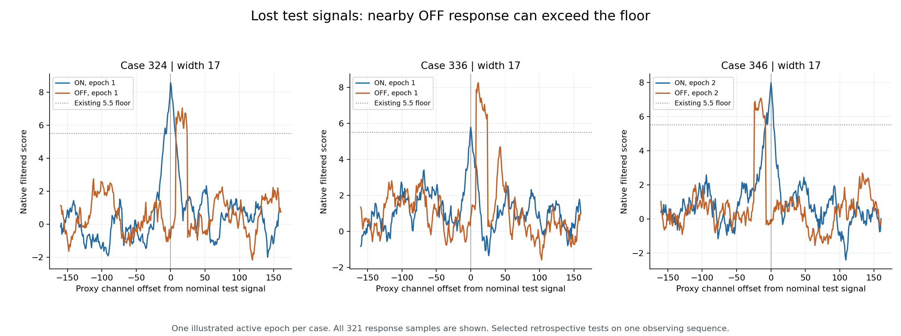
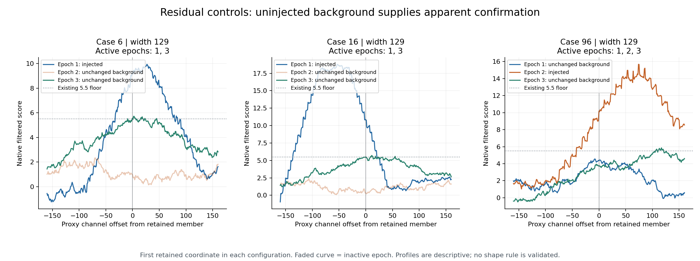

# M43AA: native shapes expose an upstream signal cost and a correlation trap

Completed 8 September 2026. The retrospective comparison explains why a change
to the final confirmation floor alone cannot repair all M43Z failures. In two
mixed-input families, the unchanged receiver-alias stage vetoes narrow signal
members whose central ON/OFF scores are identical to their signal-only counterparts.
Separately, background-supported interference can have higher inter-epoch shape
correlation than a known weak test signal.

**The detector is unchanged. No rule is adopted and no astronomical candidate is
claimed. M43X/Z signal losses and failed qualification gates remain.**

## Scope and evidence

| Completed item | Count |
|---|---:|
| Historical M43Z input replays | 28 |
| New moderate-OFF component-only inputs | 3 |
| Separate uninjected baseline | 1 |
| Total executions / four-policy endpoints, including baseline | 32 / 128 |
| Distinct native patch inventories, including baseline | 32 |
| Probed stage coordinates across inputs | 754 |
| Template/carrier response neighborhoods across inputs | 266 |
| Direct native scalar comparisons | 12,768 |

Every historical reference audit, confirmation evidence list and complete policy
decision list replays exactly. The baseline replays exactly. All 96 original
arrays and 48 native gathers match. The sealed M43Z calibration is restored
without recalculating it or drawing new shifts. Three focused unit tests and the
complete artifact audit pass. Numerical execution took **293.261 seconds**.

Each response contains all 321 samples in the fixed +/-160 proxy-channel
neighborhood, all eight existing filter widths and all three ON/OFF epoch pairs.
Native checks independently reconstruct full point/sinc profiles, verify receipt
hashes, apply ordered float32 additions and sum explicit raw windows. These
repeated arithmetic checks are not independent observations. All data come from
the existing observing sequence; no observing coverage or physical false-alarm
probability has been added.

The exact selection is in [the plan](MILESTONE_43AA_NATIVE_RESPONSE_PLAN.md) and
[config](config/m43aa_native_response.json). Code/config were committed locally as
`6edf2b28bfc1f53dc1d16bd3bdddcedee7f378f5` before execution. Automatic approval
review rejected public pushing despite the owner's prior ongoing authorization.
This was therefore a **local pre-execution freeze of a retrospective diagnostic**,
not a verified public prospective freeze. No alternative publication route was
used. Publication can follow completion without changing that provenance.

## 1. Nearby OFF responses differ, but simple peak/width rules overlap

The ON payloads in cases 324/336/346 exactly equal their respective signal-only
counterparts 42/162/262. Isolated moderate-OFF payloads exactly equal the OFF
parts of the corresponding mixtures. Thus the added OFF-window signal cost is
not caused by altered ON data. Strong nearby OFF cases still lose association
upstream; far-OFF counterparts preserve it.

At the nominal signal template/carrier and filter width 17, the descriptive
measurements over the six active epochs are:

| Feature | Three moderate-OFF signal-loss inputs | Three matched ON-OFF controls |
|---|---:|---:|
| Absolute separation of ON/OFF maxima, proxy bins | 9–24 | 0–16 |
| ON contiguous half-height lobe width, bins | 15–22 | 17 |
| OFF contiguous half-height lobe width, bins | 17 | 17 |
| Unshifted ON/OFF response correlation | −0.225 to 0.245 | 0.530 to 0.803 |

Centers and widths alone overlap. Response correlation contains apparent
separation information in this selected comparison, but these three matched
ON-OFF controls already have zero reference survivors. This is **not** evidence
that a new correlation rule repairs the eight original leaking ON-OFF cases.
The reported widths are zero-referenced filtered-response lobes, not fitted
physical line widths. Injected-minus-baseline profiles are explanatory only;
their clean counterfactual baseline would be unknown for a sky signal.

## 2. Receiver-alias rejection removes narrow signal tracks first

| Pair | Signal-only retained associated members | Mixed-input retained associated members |
|---|---|---|
| 170 → 171 | 43 pass physical vetoes, widths 1–33 | 38 receiver-alias vetoes, widths 1–65; 8 width-129 survivors |
| 280 → 281 | 15 pass physical vetoes, widths 1–9 | 13 receiver-alias vetoes, widths 1–9; 6 width-129 survivors |

These are inventories within each input; unequal totals are not one-to-one
transition counts. The full coordinate comparison is preserved separately.
In both mixed inputs the later aggregate rule removes all remaining
truth-associated broad members. This clarifies the stage ordering behind the
previously reported aggregate losses.

For an exact paired width-1 example at template 0 / proxy index 3201, the ON/OFF
scores do not change when interference is added. Neither the retained-OFF track
match nor the exact-coordinate adjacent-OFF check rejects the narrow member.
The receiver signature does change:

| Pair / affected epoch | Local peak offset from prediction, signal-only → mixed | Peak score, signal-only → mixed |
|---|---:|---:|
| 170 → 171 / epoch 1 | +3.594 → +29.114 Hz | 6.639 → 35.381 |
| 280 → 281 / epoch 3 | −7.790 → +31.907 Hz | 3.876 → 19.694 |

The existing +/-100 Hz receiver peak search can pick the nearby injected
interferer and provide a rejecting alias witness. The sealed examples preserve
the complete witness and signatures. This is a measured signal cost of the
existing decision semantics, **not a demonstrated arithmetic implementation bug**.
Fixing the downstream support score alone cannot restore these narrow members.

Cases 260/261/265 remain a different mechanism: each preserves the same three
narrow associated members (one width 1, two width 3), then rejects all three at
the remaining-epoch floor. The isolated weak unequal signal already fails;
interference is not needed for that loss.

## 3. Background can look more correlated than the real injected signal

The residual configurations 6/16/96 retain 12/3/19 members under the combination.
These are the three native configurations represented by seven labels in M43Z;
the reduced replay panel does not replace that original denominator.
Every uninjected supporting epoch's **entire probed response vector** matches
the baseline exactly. Case 96's survivors have three actual active epochs and
pool two individually sub-5.5 background scores after excluding the injected epoch.

For the fixed mean-subtracted correlation across 321 samples at each retained
member's filter width:

| Selected family | Active-epoch pair correlation range |
|---|---:|
| Residual control 6 | 0.901–0.926 |
| Residual control 16 | 0.003–0.054 |
| Residual control 96, all three active pairs | −0.137–0.887 |
| Signal-only weak unequal case 260 | 0.076–0.193 |

A single global lower-bound cutoff on this statistic cannot reject every
residual control while retaining these known signal associations. Broad
background structure is particularly convincing in case 6. This finding does
not rule out width-conditioned or physically modeled response tests, but it
rules out treating this simple similarity score as sufficient confirmation.

## Next useful experiment

Prioritize attribution of receiver peaks to the candidate track: compare
candidate-centered signatures with the current unrestricted local maximum,
explicitly retaining the paired 170/171 and 280/281 signal costs and genuine
receiver-alias controls. Jointly evaluate centered ON/OFF response agreement
against all eight original leaking ON-OFF inputs and all signal-loss families.
Do not introduce a global inter-epoch correlation floor from this selected panel.

Any changed endpoint needs a separate public prospective freeze, explicit
false-veto costs, unchanged historical denominators and fresh evaluation inputs.
Fresh null rows, if needed, must exclude all 1,792 prior rows. No floor/window
retuning or independent validation is inferred from the present diagnostic.

## Reproducible artifacts

- [Sealed result](results_m43aa_native_response/result.json) and [audit](results_m43aa_native_response/artifact_validation.json).
- [Stage transitions](results_m43aa_native_response/stage_summary.json) and [paired receiver-alias proofs](results_m43aa_native_response/receiver_alias_examples.json).
- [ON/OFF shapes](results_m43aa_native_response/shape_summary.json), [correlations](results_m43aa_native_response/correlation_summary.json) and [residual background support](results_m43aa_native_response/residual_summary.json).
- Complete sealed per-input ledgers in `results_m43aa_native_response/inputs/`, closed run/test/audit logs, and `RESULTS_MANIFEST_M43AA_NATIVE_RESPONSE.sha256`.
