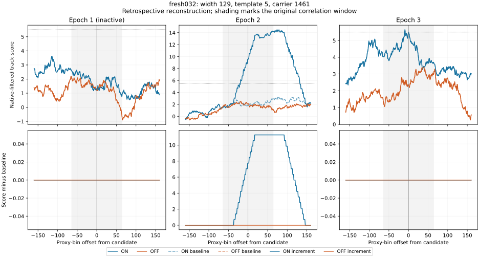
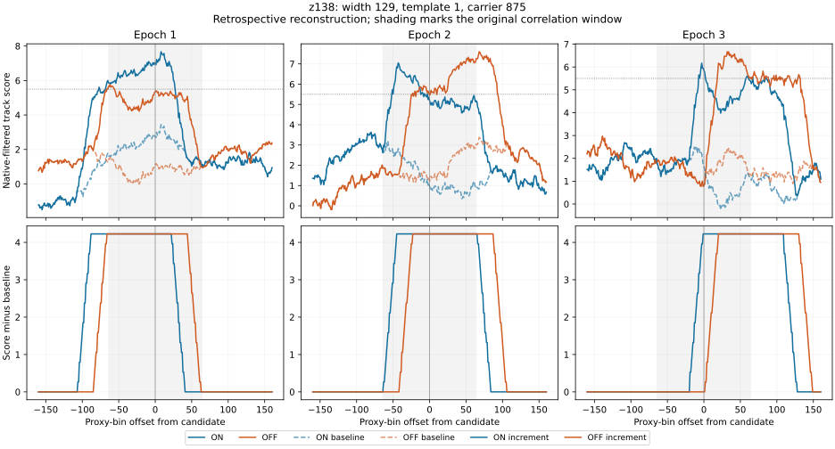

# M43AC: centered sampling removes alias evidence; broad response edges matter

Completed 9 September 2026. This retrospective analysis explains two M43AB
control failures without changing a detector decision or selecting a threshold.
All source results came from published M43AB commit
`2612645426a348bcbf02917c110751e24671be57`.

The fresh control's supporting epoch is entirely background at the probed
response. The broad ON/OFF control has displaced filter-response edges, with
unshifted correlations below 0.8 even after subtracting the known background.
Replacing a local peak with one centered sample also releases **every one of
868 rank-eligible original alias rejections** in the stored M43AB panel.
These findings explain development limitations; they do not qualify a new rule.

## Complete stored-panel accounting

All 149 input seals and file hashes match the M43AB inventory. The accounting
covers 13,632 retained members; the separate baseline contains no alias release.

| Panel | Inputs | Original rank-eligible alias rejections | Released by centered receiver | Released members surviving new combination |
|---|---:|---:|---:|---:|
| Historical signal-present | 19 | 164 | 164 | 83 |
| Historical pure controls | 17 | 18 | 18 | 11 |
| Fresh signal-present | 64 | 492 | 492 | 211 |
| Fresh pure controls | 48 | 194 | 194 | 1 |
| Separate baseline | 1 | 0 | 0 | 0 |
| Total | 149 | 868 | 868 | 306 |

These are correlated **member counts**, not independent signals, events or
truth associations. Members in signal-present inputs can belong to background
or interference. M43AB's original input recovery counts remain unchanged:
the new combination recovers 13/19 historical and 52/64 fresh signal inputs,
with 4/17 and 1/48 leaking controls respectively.

For 861 released members, the original best alias witness loses two shared
epochs with both centered scores at least 5.5. For the other seven, enough
scores remain above the floor but the centered frequencies fail the existing
two-epoch, 20 Hz agreement. This is a trace of the original best witness,
including all shared active epochs, not an exhaustive new pair search.
Floor loss has precedence in this description when both problems occur.
The original M43AB centered-alias product independently records the releases.

## fresh032: one injected epoch, one background-supported epoch

The sole new-combination survivor has template 5, carrier 1461, width 129,
active epochs 2 and 3 (one-based here). It was originally alias-vetoed against
template 7, carrier 1458, also width 129. Their unrestricted receiver peaks
coincide exactly in both active epochs.

| Quantity at the surviving member | Epoch 2 | Epoch 3 |
|---|---:|---:|
| Original receiver maximum | 14.193203 | 5.806940 |
| Centered receiver sample | 12.626034 | 5.217046 |
| Original peak offset from predicted midpoint, Hz | +86.189294 | -40.866543 |
| Gathered ON score | 9.520672 | 5.501475 |
| Baseline gathered ON score | 1.772705 | 5.501475 |
| ON increment at candidate | 7.747967 | 0 |

The entire 321-sample ON neighborhood in epoch 3 matches the baseline exactly
at width 129; all OFF neighborhoods there are also unchanged. The injected
interferer contributes only in epoch 2. Removing that strongest epoch leaves
5.5014748573, only 0.0014748573 above the unchanged 5.5 aggregation floor.
This is background support, not repeat injected emission. No floor is retuned.

The old best witness also loses centered strength in epoch 3 (4.620611), and
its centered frequency lies 99.242620 Hz from the survivor's centered frequency.
The old two-epoch maxima were identical, so centered sampling loses both useful
strength and common-peak information in this pair. The witness itself does not
survive aggregation: its epoch-3 gathered ON score is 4.453455.

## Width and track geometry distinguish two illustrative mechanisms

At width 129 the filter half span is 181.472219 Hz, already wider than the
entire original +/-100 Hz peak-search radius. Both fresh032 peak centers lie
inside the candidate's midpoint filter span and its track-plus-filter envelope.
A displacement of tens of Hz therefore does not by itself establish an
unrelated peak for this broad member.

For the recovered z171 width-1 member at template 0/carrier 3201, epoch 1's
maximum lies +29.113745 Hz from the midpoint. Its track-plus-filter envelope,
including half-channel quantization allowance, spans approximately -11.223 to
+11.294 Hz. This peak center is outside that envelope, consistent with the
nearby-interferer contamination previously demonstrated by the paired 170/171
intervention. Its centered score is 6.532250 rather than the maximum 35.380695.
The second epoch's +4.988992 Hz peak is inside its track envelope.

These are descriptive geometric observations, not a tested attribution rule.
Envelope overlap does not prove common physical origin. The focal files retain
both measurements and geometry for 269 members across 13 named histories or
fresh inputs, including the two mixed pairs, control 96, the three moderate-OFF
recoveries and the weak 260/261/265 family. z171 retains its 32 final associated
members and z281 its 13; control 96 retains the previously reported increase
from 19 to 30 final members. No recovery count is redefined.

## z138: broad ON/OFF plateaus have displaced edges

The surviving ON/OFF control is template 1/carrier 875, width 129. Its ON and OFF
increment plateaus have nearly equal height, approximately 4.226165, but their
edges are displaced in proxy frequency. The measured half-height intervals are:

| Epoch | ON increment interval, proxy index | OFF increment interval | Raw centered correlation | Increment-only centered correlation |
|---|---|---|---:|---:|
| 1 | 778–906 | 800–927 | 0.658342 | 0.680323 |
| 2 | 822–948 | 842–970 | -0.198710 | 0.673447 |
| 3 | 865–992 | 887–1013 | 0.471416 | 0.793515 |

All intervals are fully contained in the sampled neighborhood. The OFF left
edge is 20–22 proxy bins later than ON. This gives a concrete shape explanation
for failure of an unshifted centered correlation, beyond background noise alone.
At the candidate center in epoch 3, the OFF increment is exactly zero even
though the wider OFF window contains its substantial response. The old OFF
maxima remain 5.774149, 7.327806 and 6.669077, so the original OFF-window veto
rejects this member while the correlation-qualified veto does not.

Background subtraction here uses known injection/baseline pairs for diagnosis.
It is not information available for an unknown astronomical event. No fitted
shift, adjusted correlation floor or new background-subtracted endpoint was
evaluated. The measured interval is a filtered-response width, not source width.

## Verification and reproducibility

Three selected neighborhoods (two survivors and fresh032's old alias witness)
were reconstructed across all eight widths: 288 ON/OFF/baseline vectors of 321
samples, with 144 independent direct native-window comparisons exact. All 96
original arrays and 48 native gathers match their established hashes. The
original and centered signatures match exactly in all seven selected active
member-epochs; overlay receipts, retained center scores and frozen ON/OFF
agreement evidence also match. Three focused witness-accounting tests pass.
The first shell test invocation lacked a pytest executable on PATH; the module
invocation passed. Both logs are preserved.

The plan and reconstruction code were committed locally before their respective
runs. Because the failures were already known, this is retrospective regardless
of publication timing. No detector execution, new injection specification,
null row, observing sequence, physical false-alarm estimate or astronomical
candidate is added. Original M43X/Z failed gates and denominators remain intact.

See `M43AC_CONTINUATION.md` for exact replay commands and
`RESULTS_MANIFEST_M43AC_DUAL_EVIDENCE.sha256` for checksums. Raw telescope files
are not republished. All new response vectors are plain, sealed JSON.

## Next scientific step

Design a joint attribution endpoint that retains the unrestricted peak and
centered measurement, conditions its interpretation on width and full track
geometry, and explicitly accounts for displaced broad ON/OFF response edges.
Preserve the narrow mixed-family gains and test the price on broad alias
controls. Treat background-supported weak-epoch aggregation separately; raising
5.5 to remove this single near-boundary control would be post-selection tuning.
Any new decision rule needs another public prospective freeze and additional
inputs. No endpoint is adopted from M43AC.
