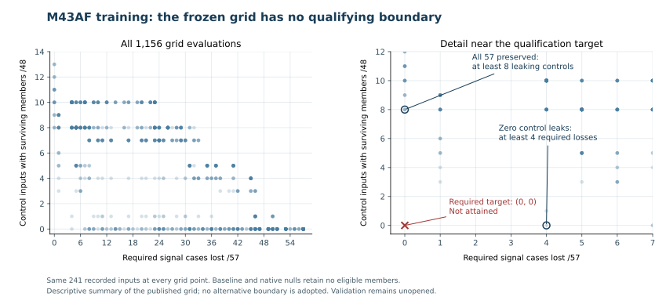

# M43AF complete: the frozen joint response rule does not qualify

**All 502 prescribed evaluations and the independent whole-study audit are complete.**
The 1,156-point training grid has no feasible boundary. No model is selected,
no new detector is adopted, and both validation panels remain unopened.
The remaining 261 historical response acquisitions were completed only after
the immutable failed model decision was publicly verified. They preserve the
original detector endpoints and are diagnostic measurements, not new detections.

## Study accounting

| Input group | Recorded inputs | Role |
|---|---:|---|
| Original historical panel | 149 (83 signals /66 controls) | Reused detector endpoints; response acquisition |
| Former additional panel | 112 (64 signals /48 controls) | Historical diagnostic, not validation |
| Baseline | 1 | Reused original input |
| Training injection/control panel | 112 (64 signals /48 controls) | Frozen joint fitting panel |
| Native training nulls | 128 | Native translations within the original observing sequence |
| Total | 502 | 262 reused upstream inputs and 240 new upstream training/null executions |

The validation injection panel (112 inputs) and held-out native nulls (128)
were not opened. All data share one observing sequence; different injections
and translations do not create independent astronomical observations.

## Training failure remains unchanged

The frozen rule accepts when x >= a and y < b. Here x is the
remaining-epoch ON projection mean divided by sqrt(2w+1); y is the
larger of the two OFF projection means, using the same scale. Signed
values are retained. These coordinates are not calibrated SNR values.

The required recovery set contains 57 specific signal cases. The independent
auditor verifies all 1,156 frozen grid points against the same 241 training,
baseline and native-null records. There are zero feasible points.

| Requirement within the frozen grid | Best competing cost |
|---|---|
| No control, baseline or null members survive | At least 4 required signal cases are lost |
| All 57 required signal cases are recovered | At least 8 of 48 control inputs retain members |



These are descriptive properties of this fixed grid, not a new optimized
boundary or a proof against every continuous boundary or classifier.
An absent model is not credited with rejecting every control, recovering a
signal, or measuring zero-valued detector performance.

## Unchanged reference outcomes

The following counts are read from the sealed original endpoints. No M43AF
learned endpoint exists, and the historical detector executions were not repeated.

### Training

| Original reference | Signals recovered | Leaking control inputs |
|---|---:|---:|
| Neighbor9 | 57/64 | 13/48 |
| Centered receiver + ON/OFF agreement + aggregation | 54/64 | 4/48 |
| Geometry + original OFF + aggregation | 48/64 | 4/48 |
| Geometry + aligned OFF + aggregation | 54/64 | 5/48 |

### Original historical panel

| Original reference | Signals recovered | Leaking control inputs |
|---|---:|---:|
| Neighbor9 | 73/83 | 29/66 |
| Centered receiver + ON/OFF agreement + aggregation | 70/83 | 10/66 |
| Geometry + original OFF + aggregation | 65/83 | 6/66 |
| Geometry + aligned OFF + aggregation | 69/83 | 14/66 |

### Former additional panel (now historical)

| Original reference | Signals recovered | Leaking control inputs |
|---|---:|---:|
| Neighbor9 | 58/64 | 13/48 |
| Centered receiver + ON/OFF agreement + aggregation | 58/64 | 0/48 |
| Geometry + original OFF + aggregation | 57/64 | 0/48 |
| Geometry + aligned OFF + aggregation | 58/64 | 1/48 |

## The three inherited weak-epoch cases

[M43AE](MILESTONE_43AE_JOINT_RESPONSE_RESULT.md) identified the following three losses against neighbor9. M43AF now
records their associated weak-member response coordinates before the old
remaining-epoch cut. The original 5.5 failures and original endpoint outcomes
remain unchanged. Measured projections are not credited as restored detections.

| Historical case | Associated weak members | Widths | Old remaining score | ON coordinate | OFF coordinate |
|---|---:|---|---|---|---|
| `ad_ab_z260` | 3 | 1, 3 | 3.702628 to 5.037367 | 0.282708 to 1.647275 | 0.424416 to 1.047501 |
| `ad_ab_z261` | 3 | 1, 3 | 3.702628 to 5.037367 | 0.282708 to 1.647275 | 0.424416 to 1.047501 |
| `ad_ab_z265` | 3 | 1, 3 | 3.702628 to 5.037367 | 0.282708 to 1.647275 | 0.424416 to 1.047501 |

Ranges include every associated weak member of each named case.
The three cases repeat 3 distinct member identifiers; their repeated coordinates do not constitute nine independent weak-signal examples.
Exact per-member coordinates and all 261 historical diagnostic records are
retained in the sealed result and lossless archive.

## Evidence and reproducibility

- 23,538 retained member records and 15,272 eligible member measurements.
- 54,140 complete profiles: 44,746 newly acquired and 9,394 reused exact profiles.
- 64,620 member/profile links; zero incomplete profiles and zero undefined member measurements.
- 19,754 direct native profile comparisons, plus 55,296 independent original-source native-null probes.
- The full scalar/coordinate oracle and independent grid audit pass; all 940 pinned scientific files remain unchanged.
- The reconstructed runtime reproduces all six sources, 96 arrays, 48 inherited gathers, 7,503,600 score values and the 432 zero-translation probes exactly.
- All 61 focused tests pass in the reconstructed environment. The original closed training records were restored without rerunning training.

The saved historical run log has 198 completion lines; all 261 historical records are present and audited.
The frozen collector does not emit a new completion line when it returns an
existing matching sealed record. The execution reconciliation names the 63
records absent from this log. Scientific denominators come from the complete
sealed inventory and independent audit, not console-line counts.

The native nulls and baseline have no eligible members and therefore supply
no conditional profile-tail observations. No physical false-alarm probability,
additional sky coverage, production qualification or astronomical candidate is claimed.

Scientific freeze: `75b271b4b92819783692375687586d6df4f40c57`.

Verified model publication: `bdab6b0af39d6bc6c81ce9d5f07ef24c103ca833`.

Complete result seal: `4fdab085bfceb08207eea63c3ce1386ae237320a054b443a6771069b86e64cd5`.

Complete audit seal: `dfc2c4a7734dffe1c033a33567c8fbbecfe4aab76880f1bda5c52137e6239d30`.

The complete archive reconstructs **508 original files** in **69 parts** (26,903,484 compressed bytes).
Archive SHA256: `b66e2a2dbe41d3dda4a63254c4528185e761aae7fdcf4745ef8e3764ca6c9443`.

```bash
PYTHONPATH=src:scripts python scripts/m43af_archive.py restore --stage complete
PYTHONPATH=src:scripts python scripts/m43af_archive.py verify --stage complete
```

The earlier 244-file training archive and its publication remain intact.

## Consequence for the next study

M43AF is closed with an explicit failed qualification. Any change to the
grid, response representation or acceptance rule belongs to a newly named
and prospectively frozen study with fresh evaluation inputs. Historical
coordinates may motivate that design but cannot serve as independent validation.
General adoption also requires evidence from an independent observing sequence.

See `M43AF_CURRENT_CONTINUATION.md` for the current restart point.
