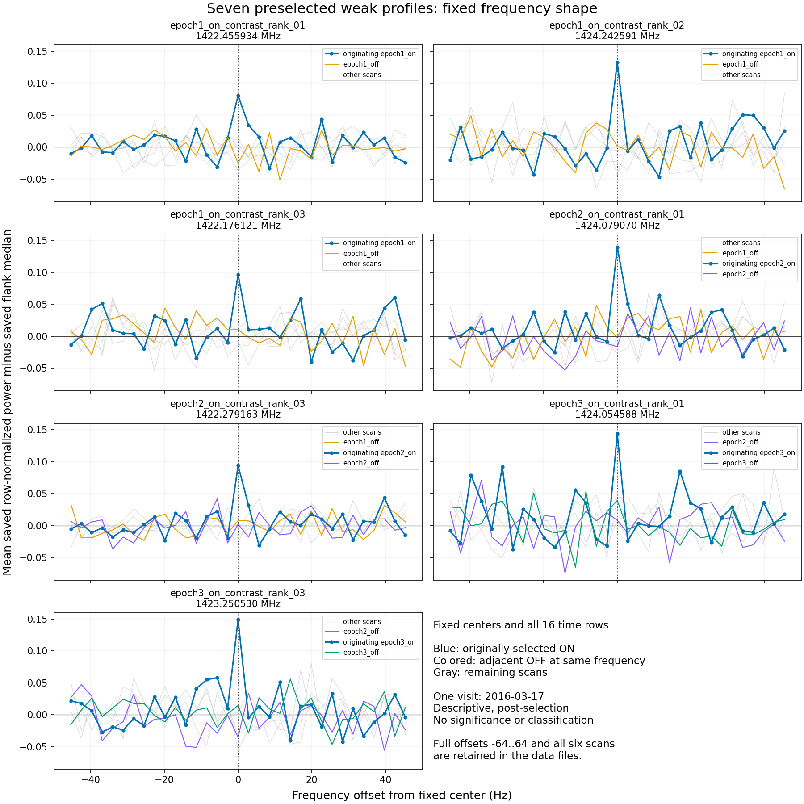
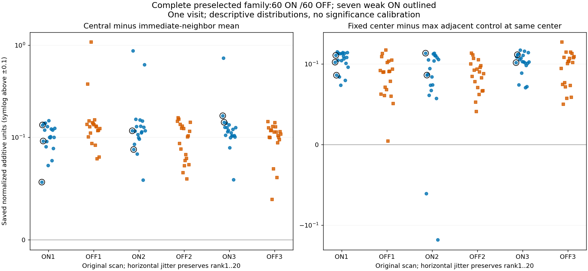

# SETI — frekvensform og kontrolpanel, 9. oktober 2026

Den længere sammenhængende arbejdsomgang er afsluttet med tre evidensblokke: udvidet søgning efter et andet målbesøg, frekvensform for de syv faste svage ON-spor og samme formmål i hele det tidligere frosne top20-panel med 60 ON- og 60 OFF-profiler.

**Nyt resultat:** et overskud i centralkanalen i forhold til de to nærmeste kanaler findes også blandt de udvalgte OFF-profiler. Medianen er **0,116577 i ON** og **0,115920 i OFF**, i gemte normaliserede additive enheder. Det er deskriptiv lighed i et udvalgt kontrolpanel; hverken en støjklassifikation, en kalibreret falskalarmrate eller uafhængig bekræftelse.

**Alle syv svage spor forbliver UNRESOLVED. A/B er fortsat FAIL_CLOSED; kvalificeret pilot er blokeret.** Ingen ny kandidat, sky-SNR, fysisk linjebredde, flux eller generel nuldetektion er fastslået.

## De syv faste profiler

For hver allerede valgt frekvens er alle 16 tidsrækker og alle seks scanninger bevaret. Profilen er gennemsnittet af gemt række-normaliseret power minus den tidligere gemte flankmedian. Der er ingen ny drift-, frekvens-, tidsvindue- eller breddeoptimering. De faste gennemsnitsvinduer har 1, 3, 5, 9 og 17 kanaler.

| Oprindelig profil | MHz | Centralt overskud | Middel i nabokanalerne | Central minus naboer | Middel over 17 kanaler |
| --- | ---: | ---: | ---: | ---: | ---: |
| ON1 rang 1 | 1422,455934 | 0,080559 | 0,024244 | 0,056315 | 0,010089 |
| ON1 rang 2 | 1424,242591 | 0,132511 | −0,003816 | 0,136327 | 0,003727 |
| ON1 rang 3 | 1422,176121 | 0,096605 | 0,000174 | 0,096431 | 0,012978 |
| ON2 rang 1 | 1424,079070 | 0,139187 | 0,021350 | 0,117837 | 0,019105 |
| ON2 rang 3 | 1422,279163 | 0,093948 | 0,005801 | 0,088146 | 0,009385 |
| ON3 rang 1 | 1424,054588 | 0,143539 | −0,028014 | 0,171553 | 0,015651 |
| ON3 rang 3 | 1423,250530 | 0,148762 | 0,002955 | 0,145806 | 0,022090 |

Alle syv oprindelige ON-profiler har større centralt end nærmeste-nabo-middel. De brede faste vinduers middel er mindre end centrum. Det beskriver de allerede udvalgte værdier og giver ikke i sig selv evidens for celestial oprindelse. Bredere vinduer kan både fortynde centrum og medtage negative flanker, bandpasstruktur eller signaldrift; målet er ikke en fysisk linjebredde. Vinduerne på 9 og 17 kanaler overlapper desuden kanaler, der indgik i den gamle flankmedian, så vinduesmiddel og baggrund er afhængige.

For **1424,079070 MHz** er det centrale ON-middel 0,139187. De to tilstødende OFF-midler ved præcis samme frekvens er −0,001747 og −0,016272. ON-midlerne over 3/5/9/17 kanaler er henholdsvis 0,060629/0,036455/0,030269/0,019105. Disse faste center-sammenligninger adskiller sig fra den oprindelige udvælgelses ±32-kanalers OFF-envelope; den oprindelige kontrast er ikke genberegnet eller erstattet.

## Hele det frosne top20-panel

Panelet indeholder **120 profil-ID'er og 118 forskellige præcise centerkanaler**, ikke 120 uafhængige signaler eller hele millionkanalsøgningens familie. Det er top20 fra hver af de seks scanninger. Kendte stærke kontrollinjer er beholdt. De syv færdige formprofiler er genbrugt uden genmåling; de resterende 113 formprofiler er nye deskriptive målinger i allerede gemte udsnit.

Det fælles nye formmål er centralkanalens middel minus de to umiddelbare nabokanalers middel. Det er lokal trekanalskrumning; den fælles flankbaggrund annulleres algebraisk. Alle vinduer er faste, også for de tre profiler, hvis oprindelige udvælgelse brugte bredde 3. Deres gamle residualer er verificeret ved deres oprindelige bredde.

| Frosset panel/stratum | ON antal | OFF antal | ON median, central minus naboer | OFF median, central minus naboer |
| --- | ---: | ---: | ---: | ---: |
| Alle top20-profiler | 60 | 60 | 0,116577 | 0,115920 |
| Én tilstødende kontrol | 20 | 20 | 0,101148 | 0,111089 |
| To tilstødende kontroller | 40 | 40 | 0,117714 | 0,122055 |
| Oprindeligt valgt bredde 1 | 58 | 59 | 0,115268 | 0,115142 |

De næsten ens samlede medianer optræder også i stratum med oprindelig bredde 1. Grupperne med én og to kontroller er vist separat. Samme antal kontroller gør ikke ON og OFF udskiftelige: observationstid, frekvens, modtagerforhold og udvælgelse kan stadig påvirke profilerne.

OFF-profilerne er ikke certificeret støj. De kan indeholde interferens og anden ukendt baggrund. Korrelationer, delte kontroller og gentagne frekvenser forhindrer, at panelkvartiler eller rangplaceringer bruges som sandsynligheder. Formlighed ved andre frekvenser afgør ikke de syv ON-profiler enkeltvis.

Frosne tekniske navne og figurens “complete preselected family” betegner her det fulde gemte **120-profils top20-panel**, ikke alle søgte kanaler eller en kalibreret nulfordeling.

## Afgrænset arkivsøgning efter et andet besøg

Det fuldt bevarede officielle pipelineindeks indeholder 1.286 rækker. Målmatchene ligger i de samme syv kendte sessioner; HIP98505_OFF findes kun i 2016-sessionen. Seks nye katalogforespørgsler for HD189733, HD 189733, HD_189733, GJ4130, V452Vul og V452 gav hver nul poster. Der er ikke identificeret en ny brugbar uafhængig observation omkring 1424 MHz.

Dette beviser ikke globalt arkivfravær, ikke fravær af upublicerede data og ikke frekvensdækningen af alle splitfiler fra 2019. De fem tidligere kontrollerede senere filheaders er ikke genhentet.

De otte nye metadata-GETs gav 638.686 målte application-body-bytes. Bodies og hashreceipts er bevaret i [arkivevidensen](results/radio_shape_20261009/ARCHIVE_ALIAS_EVIDENCE.zip). En filnavnskollision overskrev én original HTTP-headerreceipt; præcise tidligere udlæste resultatmetadata og den identiske bodyhash er dokumenteret, men de oprindelige headers er ikke rekonstrueret. Der blev ikke foretaget en ny request for at skjule fejlen. Websøgetjenestens interne netværksbytes er ikke opgjort.

## Verifikation og ressourceforbrug

- Første formjob: 3,314611 process-CPU-s, 3,337515 s vægtid, 80.876 KiB maxRSS.
- Kontrolpanelets formjob: 1,584665 process-CPU-s, 1,602919 s vægtid, 95.884 KiB maxRSS.
- Samlet målte analyseprocesser: **4,899276 CPU-s**. Hele aktiviteten er ikke samlet CPU-målt. **200 CPU-s** er konservativt debiteret for forberedelse, arkivarbejde, genetablering af gemte udsnit, begge jobs, fejl og publicering; ubrugt reservation refunderes ikke.
- Begge cachearkivers og alle anvendte patchmedlemmers størrelse/hash er verificeret. Normaliseringen er genbrugt. De gamle valgte-vindue-midler er verificeret for alle 120 profiler og alle seks scanninger.
- For 113 patches var flankmedianen ikke gemt særskilt. Den er algebraisk rekonstrueret som gammel valgt-vindue-power minus gemt residual, aldrig genestimeret. Rekonstruktionskontrollen bruger den på forhånd fastlagte tolerance 1e−12.
- Kode og scopes er offentliggjort og nøjagtigt genlæst før nye formmålinger. Uafhængig kodegennemgang før data rettede håndhævelse af væggrænse/hashchecks og gentagen NPZ-dekomprimering. Begge jobs bestod inden for deres CPU-, hukommelses- og væggrænser; begge figurer er visuelt inspiceret.
- **0 nye teleskop-powerbytes, 0 s ny observations­eksponering, 0 DKK.** Gemte cachearkiver på 77.022.050 og 86.165.383 bytes er gendannet; disse er genbrug af eksisterende data, ikke nye observationer.

Saldo efter reservation: **1.402,705145 CPU-s**, heraf **1.400 beskyttet til afslutningen 20. oktober**. Omfordelingen kommer fra assistentens interne afslutningsreserve under brugerens fortsatte ønske om længere signalarbejde. Den samlede godkendte 12-CPU-timers ramme og tidligere debiteringer er uændrede.

Gamle holdouts er lukkede. Den afsluttede millionkanal/driftsøgning, den oprindelige kontrastudvælgelse, de afsluttede tidsprofiler og A/B-kvalifikation er ikke genkørt. Næste afgørende bevistrin er fortsat en brugbar uafhængig observation/kontrol eller en særskilt kvalificeret model, der bevarer korrelationerne og dækker hele den oprindelige søge- og udvælgelsesfamilie.

## Filer og reproduktion

[Syv-profils resultater](results/radio_shape_20261009/seven/FREQUENCY_SHAPE_RESULT.json) · [120-profils resultater](results/radio_shape_20261009/panel/ALL_120_SHAPE_RESULT.json) · [Panelmåltal CSV](results/radio_shape_20261009/panel/ALL_120_SHAPE_METRICS.csv) · [Reproduktion](results/radio_shape_20261009/REPRODUCTION.md) · [Aktuel ressourceledger](results/radio_shape_20261009/RESOURCE_LEDGER.json).

Den første analyse var frosset ved `e470c95b2db4d8e05e9af2760e707d75afc9be1c`; paneludvidelsen ved `b79f4dcb747c5fa90f09c4746a12dfc6846ea5ac`. De komplette fulde frekvensprofiler, figurer, måltal og receipts er gemt sammen med kode og scopes. Ingen ekstern kontakt, betaling eller booking er foretaget.
