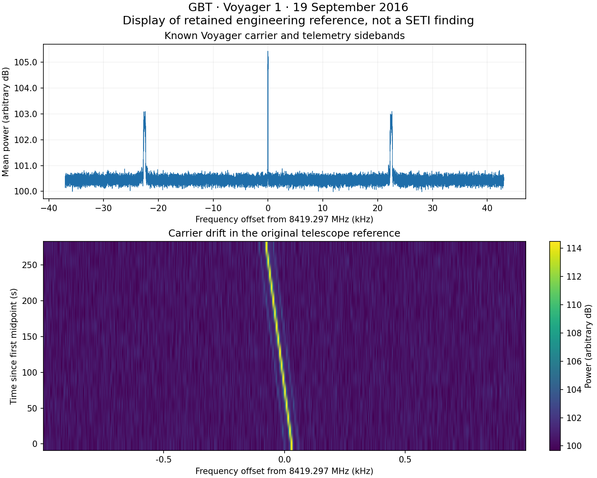

# Voyager reference completed — 7 October 2026

**Result: REFERENCE_CARRIER_DEMONSTRATED.** The distinct second and final local engineering route completed once with exit code 0. The earlier CI route remains FAILED_CLOSED. This is an authentic known telescope reference, separate from the later scientific pilot and fresh validation.

The source is the official Berkeley `Voyager1.single_coarse.fine_res.fil`: 67,109,246 bytes, SHA256 `49af50577e136d6e1184e1709fda54d1f48562290df34aa5ed5df34e96e2baf7`. Its source receipt was persisted before header and array reading. The GBT header identifies Voyager1 with telescope_id 6, 16 complete time rows and 1,048,576 channels. The file's authoritative timestamp is MJD 57650.78209490741 (19 September 2016, about 18:46:13 UTC); the official tutorial's older December 2015 narrative is inconsistent with this particular file and is not used as its observation date.

The prospectively frozen script, configuration and contract are at commit [`ebbdfe02ee32fcf89d0ebd4f4e3fac3fc3678d37`](https://github.com/andersenmartin-blip/setisearch/tree/ebbdfe02ee32fcf89d0ebd4f4e3fac3fc3678d37/tools/radio_reference_local_20261007). Executed script SHA256 `d3f21419202cd3acbba653b4f7ef6a3ca2f82e8382a6e3e7ce3e7bcf3a8c98dd` matches that freeze. The code and chosen gates were unchanged after reading power values.

## Actual coverage and retained results

| Item | Observed result |
|---|---|
| File values checked | 16,777,216 finite, nonnegative float32 powers |
| Reference band | 8419.260002207011–8419.339999090880 MHz channel centers |
| Search carriers | 28,633 native channels, all 16 time rows |
| Channel/time resolution | −2.7939677238464355 Hz/channel; 18.253611008 s/integration |
| Drift trials | 785 between −4 and +4 Hz/s; 0.010204081632653 Hz/s step |
| Full carrier halo | 522 channels each side, including median-filter margin |
| First–last midpoint span | 273.80416512 s |
| Strongest known carrier | 8419.297027867287 MHz at first integration midpoint; −0.377551020408164 Hz/s |
| Maximum robust engineering track score | 1004.1205388466 |
| Full threshold-channel list | 2,369 rows at score ≥10, all retained |
| Separate representative frequency peaks | 116 rows, descriptive only |
| Known-carrier threshold gate | Passed within 8419.296–8419.298 MHz |
| Analysis command wall/CPU | 3.750069 s / 3.747761 CPU-s |
| Peak process RSS | 224,813,056 bytes (214.4 MiB) |

The spectrum and carrier waterfall were saved before detection or acceptance judgment. The runtime limits passed. Python 3.12.14, numpy 2.3.5, scipy 1.17.0 and matplotlib 3.10.8 are recorded in `versions.json`. The initially completed download and pre-run documentation are outside the analysis-command runtime. The two-case synthetic index/sign check is engineering only and contributes no fresh validation count.

The nominal zero drift in the floating-point grid is −4.44×10⁻¹⁶ Hz/s. Its largest displacement is below 4.4×10⁻¹⁴ channel and every rounded row shift is exactly zero, so it is the same searched trajectory as exact zero drift. The original frozen grid is retained without alteration.

The 2,369 rows are threshold **channels**, often associated with the same physical feature; they are not 2,369 independent signals or candidates. The row-MAD-standardized track score is a distinct frozen engineering statistic, separate from turboSETI S/N and any calibrated significance. There is one reference scan, with no OFF data or independent observation. The known Voyager carrier demonstrates reading, plotting, drift searching and output retention. It does not qualify the later ON/OFF scientific pilot or establish its false-positive rate.

## Evidence and reproduction

Published source files belong under `tools/radio_reference_local_20261007/`; all retained original outputs belong under `results/radio_reference_local_20261007/`. Key outputs are:

- `source_receipt.json`, `header.json`, `coverage.json`, `versions.json`, `resource_receipt.json` and `public_freeze.json`.
- `reference_spectrum.png` and `reference_waterfall.png`, created before the search.
- `all_threshold_channels.csv`, which retains every threshold channel, and the separate `representative_frequency_peaks.csv`.
- `all_search_channels.npz`, retaining the frequency, winning drift and maximum score for every searched channel, including those below threshold, plus the full drift grid.
- `analysis.log`, `summary.json`, `synthetic_engineering_check.json` and `result_manifest.json`.

The original spectrum code already uses `10*log10(linear power)` and a linear y axis, so its arbitrary dB interpretation is correct. A separate presentation-only rendering makes the decimal dB ticks explicit and uses kHz offsets to avoid crowded waterfall labels. `reference_spectrum_display.png`, `reference_waterfall_display.png` and the combined `reference_display.png` come from the same pinned reference power values; the detector is not invoked again. All original outputs remain byte-for-byte unchanged. The additional formatting phase is measured separately: 1.269175 s wall, 1.268920 CPU-s and 159,092,736 bytes peak RSS. Its code is `tools/radio_reference_local_20261007/make_display_figures.py`, with `display_resource_receipt.json` and a separate display hash manifest retained beside the outputs.



After placing the published source files in one folder and installing the recorded Python library versions:

```sh
OPENBLAS_NUM_THREADS=1 OMP_NUM_THREADS=1 timeout 1800s python run_reference.py --download --output results_reproduction
```

The command refuses an existing output directory and verifies the downloaded source hash before reading array values. This instruction describes reproducibility and does not activate an additional run. The source file can be retrieved from its documented public URL using the retained receipt; it need not be duplicated in git. Historical holdouts, HD189733 pilot values and fresh validation identities remain unopened.
