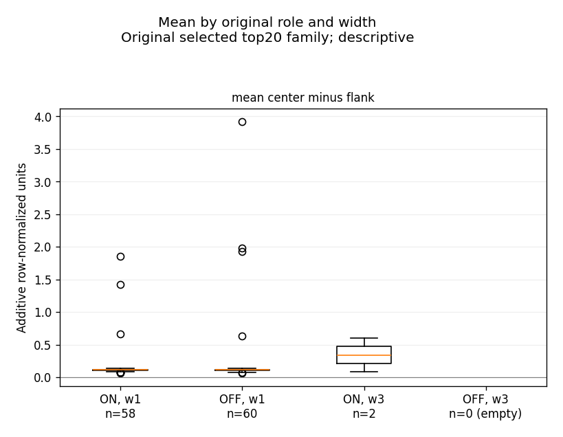
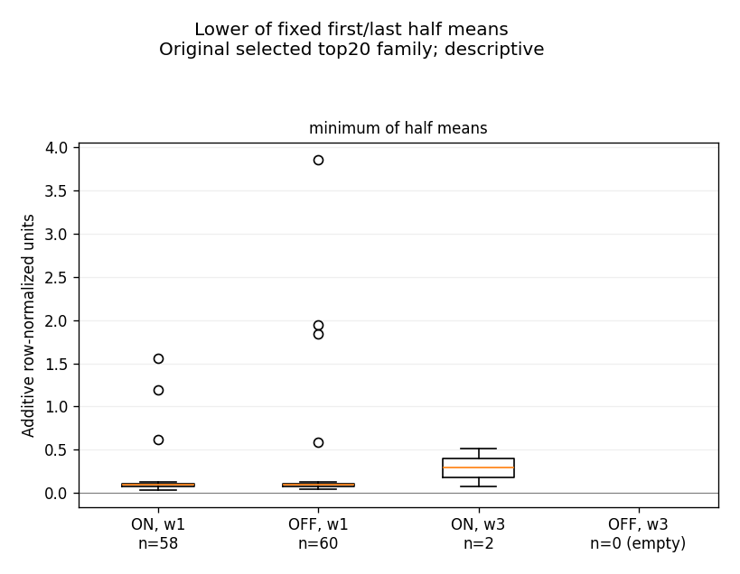
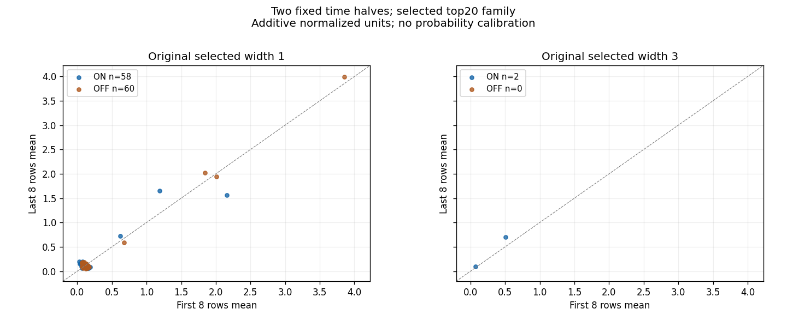
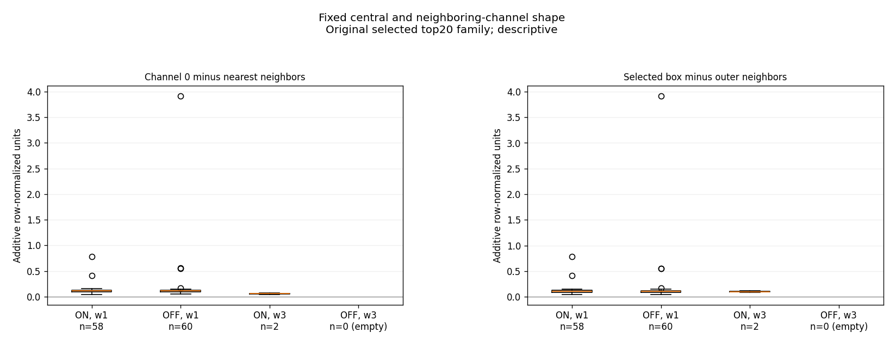

# SETI — kontrolpanel og faste tidsvinduer, 10. oktober 2026

**Det nye resultat er deskriptiv lighed mellem de valgte ON- og OFF-profiler.** For de oprindeligt valgte bredde1-profiler er medianen af center-minus-flanke **0,116305 i ON** og **0,115910 i OFF**. Medianen af det mindste af de to faste halvmidler er **0,092240 i ON** og **0,092513 i OFF**. Det centrale trekanalsmål har median **0,114243 i ON** og **0,112607 i OFF**. Et smalt centralt overskud og positive faste halvvinduer forekommer således også blandt de udvalgte OFF-profiler.

De seks på forhånd udpegede svage ON-profiler har fortsat større faste center-midler end deres tilstødende OFF-profiler ved præcis samme frekvens. Alle seks har positivt middel i begge faste otterækkershalvdele. **Alle seks forbliver uafklarede.** Liggende tæt på et udvalgt kontrolpanels typiske formmål er hverken en støjklassifikation, en falskalarmrate eller bevis for celestial oprindelse. A/B er fortsat **FAIL_CLOSED**; den kvalificerede sky-pilot er fortsat blokeret.

## Hvad denne omgang tilføjer

Den allerede afsluttede stationære top20-familie fra 9. oktober er udvidet til samme faste tids- og frekvensprojektioner for **alle 120 profil-ID'er**: 20 fra hver af de seks scanninger, 60 valgt i ON og 60 valgt i reciprokke OFF-rangeringer. Alle 120 har forskellige præcise centerkanaler, men er ikke uafhængige signaler. Panelet har fælles kontroller og nærliggende frekvensområder; de lokale 129-kanalers udsnit kan overlappe, selv om de præcise centerkanaler er forskellige. Det er ét historisk besøg af HIP98505/HD189733 den **17. marts 2016**.

De ni eksisterende stationære ON-profiler med rang 1–3 blev genbrugt uden genmåling: raw-power, normaliseret power, flankmedianer, 16 residualrækker, middelprofiler samt de gamle middel-, median- og positiv-række-tællinger er bevaret. Præcis **111** resterende cases blev målt én gang fra de allerede gemte native chunk151-filer med de allerede gemte full-chunk-rækkemedianer. De nye halvvindue- og frekvensformmål blev afledt for alle 120 cases.

Resultatet indeholder **720 scan-profiler** med alle 16 rækker, svarende til **11.520 tidsrække-forekomster**. Forekomsterne er dokumentationsrækker; de er ikke 11.520 uafhængige observationer. Der er ikke hentet nye teleskopdata, genkørt en søgning eller tilpasset frekvens, drift, bredde, kanalskift, tærskel eller tidsvindue.

## Hele det valgte panel

| Oprindelse | Oprindelig bredde | Antal | Median, center-minus-flanke | Median, mindste halvmiddel | Median, central minus naboer | 16/16 positive rækker |
| --- | --- | --- | --- | --- | --- | --- |
| ON | 1 | 58 | 0,116305 | 0,092240 | 0,114243 | 6/58 |
| OFF | 1 | 60 | 0,115910 | 0,092513 | 0,112607 | 7/60 |
| ON | 3 | 2 | 0,345343 | 0,289777 | 0,058160 | 1/2 |
| OFF | 3 | 0 | — | — | — | Tomt stratum |

De oprindelige bredde1-grupper indeholder 58 ON-profiler og 60 OFF-profiler. Bredde3 har kun to ON-profiler og **ingen OFF-profiler**. OFF-bredde3 er derfor eksplicit `EMPTY_UNSUPPORTED_COMPARISON`; der er ingen indsatte nulværdier eller sammenlægning af bredder for at skabe en kunstig sammenligning.

Seks af de 58 ON-bredde1-profiler og syv af de 60 OFF-bredde1-profiler har 16 positive residualrækker. ON-bredde3 har én sådan profil blandt to. Disse tal tilhører et udvalgt, korreleret top20-panel. De er ikke binomialforsøg eller en kalibrering af hele den oprindelige millionkanalsøgning.

ON og OFF er ikke dokumenteret udskiftelige. Hver oprindelse er valgt af sin egen kontrast-rangering, antallet af tilstødende kontroller varierer, flere cases bruger samme kontrolscanninger, og de individuelle normaliseringer og observationstidspunkter kan påvirke profilerne. OFF er heller ikke certificeret ren støj.

## De seks faste svage cases

Alle seks har oprindelig bredde 1. Tabellen genbruger deres allerede gemte center-middel, median og antal positive rækker. De tilstødende OFF-værdier gælder præcis samme native kanal og bredde; der er ikke søgt efter et nyt OFF-maksimum.

| Case | MHz | ON-middel | ON-median | Positive rækker | Faste tilstødende OFF-midler |
| --- | --- | --- | --- | --- | --- |
| ON1 rang 3 | 1426,035351749 | 0,122145 | 0,132296 | 15/16 | OFF1: 0,034048 |
| ON2 rang 1 | 1424,970072963 | 0,134119 | 0,129818 | 13/16 | OFF1: 0,015388; OFF2: 0,014629 |
| ON2 rang 2 | 1425,519434737 | 0,106362 | 0,108728 | 15/16 | OFF1: 0,015756; OFF2: −0,002563 |
| ON2 rang 3 | 1426,118193816 | 0,120947 | 0,089459 | 15/16 | OFF1: 0,031122; OFF2: 0,003716 |
| ON3 rang 1 | 1425,836880687 | 0,134680 | 0,109308 | 14/16 | OFF2: 0,004889; OFF3: 0,005729 |
| ON3 rang 2 | 1424,648895491 | 0,130013 | 0,121957 | 13/16 | OFF2: −0,006260; OFF3: −0,005781 |

Den oprindelige stationære udvælgelse brugte derimod et ±32-kanalers kontrol-envelope i en anden fraktionel spektral størrelse. De nye additive center-profiler erstatter ikke den udvælgelsesregel. Større middel i ON ved den valgte kanal kan være en konsekvens af udvælgelsen og afgør ikke oprindelsen.

## To faste halvdele

**Alle 120 udvalgte oprindelsesprofiler, inklusive de 60 OFF-profiler, har positive middelværdier i begge faste halvdele.** Dette er dokumenteret af de positive minima for det mindste halvmiddel i samtlige ikke-tomme strata. Persistens over netop disse to halve vinduer er derfor almindelig i det udvalgte panel og giver ingen falskalarmrate.

Halvdelene er på forhånd defineret som rækker 0–7 og 8–15 i hver enkelt scanning. Der er ingen søgning efter det bedste starttidspunkt eller den bedste varighed. Det mindste af de to halvmidler beholder fortegnet og beskriver kun disse to faste vinduer.

| Case | Første 8 rækker | Sidste 8 rækker | Mindste halvmiddel |
| --- | --- | --- | --- |
| ON1 rang 3 | 0,069296 | 0,174994 | 0,069296 |
| ON2 rang 1 | 0,137822 | 0,130416 | 0,130416 |
| ON2 rang 2 | 0,116122 | 0,096601 | 0,096601 |
| ON2 rang 3 | 0,075354 | 0,166539 | 0,075354 |
| ON3 rang 1 | 0,103540 | 0,165820 | 0,103540 |
| ON3 rang 2 | 0,119499 | 0,140527 | 0,119499 |

De seks ON-profiler har positive middelværdier i begge halvdele, med mindste halvmiddel fra **0,069296 til 0,130416**. Deres positive rækker er fortsat 13–15 af 16. Nogle profiler ændrer amplitude mellem halvdelene; tabellen estimerer hverken en begivenhedsvarighed eller en sandsynlighed for vedvarende emission.

| Case | Tilstødende OFF | OFF-middel | Positive OFF-rækker | Første 8 | Sidste 8 | Mindste OFF-halvmiddel |
| --- | --- | --- | --- | --- | --- | --- |
| ON1 rang 3 | OFF1 | 0,034048 | 9/16 | 0,072092 | −0,003996 | −0,003996 |
| ON2 rang 1 | OFF1 | 0,015388 | 7/16 | −0,007820 | 0,038596 | −0,007820 |
| ON2 rang 1 | OFF2 | 0,014629 | 8/16 | 0,021886 | 0,007373 | 0,007373 |
| ON2 rang 2 | OFF1 | 0,015756 | 8/16 | 0,002692 | 0,028821 | 0,002692 |
| ON2 rang 2 | OFF2 | −0,002563 | 6/16 | 0,013969 | −0,019094 | −0,019094 |
| ON2 rang 3 | OFF1 | 0,031122 | 9/16 | 0,004074 | 0,058169 | 0,004074 |
| ON2 rang 3 | OFF2 | 0,003716 | 8/16 | 0,015881 | −0,008449 | −0,008449 |
| ON3 rang 1 | OFF2 | 0,004889 | 7/16 | −0,013662 | 0,023439 | −0,013662 |
| ON3 rang 1 | OFF3 | 0,005729 | 7/16 | 0,025988 | −0,014529 | −0,014529 |
| ON3 rang 2 | OFF2 | −0,006260 | 6/16 | −0,006626 | −0,005894 | −0,006626 |
| ON3 rang 2 | OFF3 | −0,005781 | 8/16 | −0,029149 | 0,017587 | −0,029149 |

De tilstødende OFF-profiler ved disse præcise kanaler har små positive eller negative faste halvmidler. Det bredere panel af særskilt udvalgte OFF-cases indeholder samtidig positive og smalle profiler, inklusive 16/16-positive eksempler. Sammenligningen skal derfor fastholde både de konkrete parrede kontroller og udvælgelsesfamilien; ingen af dem er alene en kvalificeret nulmodel.

## Fast frekvensform

Profilen e(offset) er middel over de 16 rækker af række-normaliseret raw power minus hver rækkes faste flankmedian. Den faste flank bruger |offset| > 3 inden for ±64 native kanaler. Alle offsets, de oprindelige centerkanaler og bredder er bevaret.

Trekanalsmålet er e(0) minus middel af e(−1) og e(+1) for alle cases. Boxmålet er middel over den oprindeligt valgte bredde minus middel af de to nærmeste kanaler umiddelbart uden for denne bredde. **For bredde 1 er disse to mål algebraisk identiske og dermed samme evidens**, ikke to uafhængige indikatorer. For bredde 3 bruges ydernaboerne ved ±2; bredderne er ikke genrangeret.

Et tredje mål er det valgte center-boxmiddel minus medianen af den fulde middelprofils ikke-centrale offsets med |offset| > 3. De faste supportmidler over 3, 5 og 9 kanaler er også gemt. Disse overlappende mål er indbyrdes afhængige; supportbredde9 bruger også offsets, som indgik i flankmedianen. De er ikke fysiske linjebredder.

| Case | Central minus naboer | Box minus median af ikke-centrale offsets | Middel over 3 | Middel over 5 | Middel over 9 |
| --- | --- | --- | --- | --- | --- |
| ON1 rang 3 | 0,130381 | 0,121502 | 0,035225 | 0,032169 | 0,019138 |
| ON2 rang 1 | 0,133917 | 0,132342 | 0,044841 | 0,022803 | 0,012905 |
| ON2 rang 2 | 0,101266 | 0,100427 | 0,038851 | 0,033993 | 0,013160 |
| ON2 rang 3 | 0,119904 | 0,118081 | 0,041011 | 0,025869 | 0,022176 |
| ON3 rang 1 | 0,108666 | 0,129884 | 0,062236 | 0,037102 | 0,013023 |
| ON3 rang 2 | 0,118688 | 0,124112 | 0,050888 | 0,031038 | 0,028047 |

## Tidsfigurer og reproducerbar dokumentation

- `epoch1_on_stationary_rank_03`: [Alle seks scanninger og 16 rækker](results/radio_stationary_family_20261010/measurement/epoch1_on_stationary_rank_03_all_six_times.png)
- `epoch2_on_stationary_rank_01`: [Alle seks scanninger og 16 rækker](results/radio_stationary_family_20261010/measurement/epoch2_on_stationary_rank_01_all_six_times.png)
- `epoch2_on_stationary_rank_02`: [Alle seks scanninger og 16 rækker](results/radio_stationary_family_20261010/measurement/epoch2_on_stationary_rank_02_all_six_times.png)
- `epoch2_on_stationary_rank_03`: [Alle seks scanninger og 16 rækker](results/radio_stationary_family_20261010/measurement/epoch2_on_stationary_rank_03_all_six_times.png)
- `epoch3_on_stationary_rank_01`: [Alle seks scanninger og 16 rækker](results/radio_stationary_family_20261010/measurement/epoch3_on_stationary_rank_01_all_six_times.png)
- `epoch3_on_stationary_rank_02`: [Alle seks scanninger og 16 rækker](results/radio_stationary_family_20261010/measurement/epoch3_on_stationary_rank_02_all_six_times.png)

Alle raw float32-patches, normaliserede float64-patches, residualer, middelprofiler, metadata, faktiske scan-tider og gemte normaliseringer findes i `ALL_120_FIXED_STATIONARY_PATCHES.npz`. Alle 720 scan-profiler og deres 16 residualrækker er også bevaret i JSON. De to CSV-filer er direkte serialisering af de gemte tal: `ALL_720_SCAN_PROFILE_ROWS.csv` og `ALL_11520_TIME_ROW_OCCURRENCES.csv`.

De tre rapporterede summaryfigurer under `measurement/presentation/` er layoutkopier fra allerede gemte data. Oprindelige outputfigurer og arrays er bevaret uændret. Den oprindelige halvdelssammenligning og de seks svage tidsfigurer bruges direkte. Ingen analyse er genkørt for at rette figurernes etiketter eller margener.

## Afgrænsning og næste evidenstrin

Denne scope var prospective for de nye afledte mål, **efter** at de gamle kildedata og rangeringer allerede var åbnet. Den er ikke blind eller uafhængig validering. Det fulde top20-panel er heller ikke hele den oprindelige søgningshypotesefamilie. Fordelingslighed i det valgte panel gør ikke de seks cases til certificeret støj; individuelle positive forskelle gør dem heller ikke til fund.

Det primære næste evidenstrin er fortsat et uafhængigt besøg med frekvensoverlap eller en separat kvalificeret korrelationsbevarende kontrolmodel, som omfatter den relevante fulde udvælgelsesfamilie. De gamle kvalifikationsfejl og holdouts er ikke genåbnet. Der er ikke udledt sky-SNR, falskalarmrate, flux, følsomhedsgrænse eller celestial oprindelse.

## Freeze og udførelse

Kode, inputhashes, faste cases, metrikker og ressourcegrænser blev offentliggjort og læst tilbage før kørsel i [03de4adda318905f3c0685af827e62a8d1af72a3](https://github.com/andersenmartin-blip/setisearch/commit/03de4adda318905f3c0685af827e62a8d1af72a3). Den autoritative forrige offentliggørelse er `08d0bc6b7a09a4cc6cd238fc9626515eef842398`.

Den ene signalanalyse blev afsluttet på **8,696 CPU-sekunder** og 8,598 vægsekunder; maksimal RSS var 573.505.536 byte. Loftet var 80 CPU-sekunder, 1.800 vægsekunder og 4 GiB. Aktivitetens samlede konservative CPU-reservation var 250 sekunder. Nye teleskopkildebyte: **0**.

De komplette afledte artefakter er gemt i `SETI_STATIONARY_FAMILY_2026-10-10.zip` (20.369.402 byte, 47 arkivmedlemmer). ZIP-kontrolsummer og samtlige medlemsfiler er verificeret. SHA256: `acb5e6fce192bd7962fdb7f96a4d075d80bda36bd39830ad2e1ea6a0ffa0a0ea`. [Den afsluttende kvittering](results/radio_stationary_family_20261010/PUBLICATION_RECEIPT.json) dokumenterer lagring og offentliggørelse. Arkivet bevarer rapportens checkpoint før offentliggørelse; kun denne afsluttende lagringsnote er opdateret bagefter. De ni genbrugte NPZ-filers inputhashes blev kontrolleret før og efter analysen og forblev uændrede.
