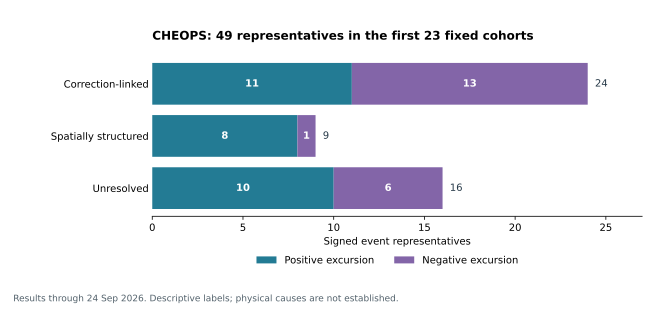

# SETI period review — 26 September 2026

The **original 14–27 September plan is complete through its negative-result
branch**. Its work packages and [first consolidated report](TWO_WEEK_REPORT_2026-09-14.md)
were completed early, on **13 September**, during active sessions. Calendar
day 13 is therefore not a measure of unfinished scientific work. The later
TESS diagnostics and CHEOPS studies are separately specified follow-on work.

This review consolidates the original decision and the published continuation
through **LS8BD–LS8BE, 24 September**, using science commit
`0432c9d42fa7c6849369fb652f1a36f121e85304`. It adds a reproducible cohort/event
register and clear restart instructions. It acquires no new archive science
data, refits no event and introduces no new numbered science milestone.

## Original plan: completed evidence and decision

| Planned work | Completed outcome |
|---|---|
| Restore the two closed TESS sectors | All 6,720 historical trial recipes and 300 old training vectors reproduced exactly. |
| Freeze one protected background model | LS7I fixed a ridge predictor and static ablation, with eight synthetic tests and prospective publication. |
| Joint evaluation | 6,720 historical cases plus 360 separately declared sector-32 shape controls: **7,080 digital cases**, and 420 native prediction windows. |
| Independent audit and signal-loss accounting | Independent arithmetic audit passed; all additional stellar losses and failed cells were retained. |
| Choose the prescribed decision branch | **FAIL:** six of twelve signal cells, two of sixty control cells and both native prediction gates failed. No unused-sector qualification followed. |
| Consolidate and specify the next information needed | Report, figure, ledgers, code, logs and limitation analysis were already published; subsequent work assessed additional instrumental observables. |

These cases reuse twenty development backgrounds. They are neither 7,080
independent observations nor additional observing time. The result rejects
this fixed model as a jointly adequate method; it does not reject the
possibility of an artificial signal in general.

The follow-on findings are also preserved. [LS7J](LS7J_CONTINUATION.md) and
[LS7N](LS7N_CONTINUATION.md) measured unsuccessful native corrections;
[LS7O](LS7O_CONTINUATION.md) instead encountered an eligibility obstruction:
zero of 420 windows met its complete-reference rule, so it measured no new
native correction. The explicit LS7P reconstruction validates centroid
arithmetic, not a useful pointing correction. Closed outcomes do not become
new opportunities to tune gains, thresholds, templates or reference selection.

## CHEOPS follow-on: a checked aggregate for the fixed queue

The completed first **23 of 107 fixed cohorts** contain **46 selected visits**,
**18,865 retained L2 rows** and **34,271 eligible overlapping windows**. This
is progress through a target queue, not a percentage completion of the old
two-week plan or a calibrated survey completeness measure. Earlier CHEOPS
pilots and targets outside this LS8J queue are excluded from these totals.

The 113 positive and 67 negative threshold-crossing windows form **29 positive
and 20 negative clusters**. Every one of the **49 signed representatives** has
its prescribed image follow-up:

| Original image classification | Positive | Negative | Total |
|---|---:|---:|---:|
| CORRECTION_LINKED | 11 | 13 | **24** |
| SPATIALLY_STRUCTURED | 8 | 1 | **9** |
| UNRESOLVED_WITHIN_FIXED_SCOPE | 10 | 6 | **16** |
| Total | **29** | **20** | **49** |



Correction-linked means substantial coupling to delivered processing under
the fixed gate. Spatially structured describes a fit. Neither label assigns
a unique physical cause or excludes source variability. **None of the 16
unresolved events is a qualified SETI candidate.** They comprise ten positive
and six negative events across eight targets; their original labels remain.
Each corresponding bounded residual study is complete and closed, while the
physical explanation remains open.

The [full cohort table and unresolved register](results_two_week_review_2026-09-26/TABLES.md)
list every target and unresolved event. Of the 46 visits, one has **zero
eligible windows**: the second 2MASS J11285624+1010395 visit,
`CH_PR100018_TG010802_V0300`. Its 38 retained rows provide no tested null.
Other visits also retain flagged, edge or gapped points outside the eligible
contexts. All 18,865 rows must not be counted as screened exposure.

Windows overlap, signed representatives need not be independent, and the
fixed +/-8.5 screen is not a Gaussian significance or false-alarm probability.
This review computes no qualified observing coverage, laser sensitivity,
event rate or astrophysical/artificial prevalence.

## What remains scientifically open

- **A qualified detector:** the failed TESS gates remain failed; descriptive
  CHEOPS screening and arithmetic checks do not supply a replacement
  qualification. A future detector claim needs its own prospective signal,
  instrumental-control and native-background evaluation.
- **The 16 unresolved events:** retained local controls do not determine their
  causes. HD 106315 TG000801_P0 has a large local residual mismatch; GJ 536
  TG023501_P6 has a much larger mismatch associated with a broad bright band
  in its saved images. Neither observation establishes clean point-source
  emission. See [LS8AN](LS8AN_CONTINUATION.md) and [LS8AZ](LS8AZ_CONTINUATION.md).
  Preserve all 16 events, including the less extreme comparisons; no ranking
  here authorizes renewed fitting or selective reclassification.
- **Native calibration:** the separate CHEOPS native-image study remains
  **NOT_READY**. Delivered-product comparisons do not resolve the outstanding
  gain/stacking/offline/reference contract. The [input request](CHEOPS_REQUIRED_INPUTS.json)
  and [technical message](CHEOPS_CALIBRATION_REQUEST.md) remain **UNSENT**;
  there is no pending reply. No external message is sent by this review.

## Exact next work package

Continue with the already prescribed **LS8BF, rank 24:
2MASS J11474440+0048164**. Its fixed first pair is:

| Visit | Ledger exposure, subject to independent header verification |
|---|---|
| CH_PR100018_TG007101_V0300 | NEXP=1; EXPTIME=TEXPTIME=60 s; pipeline 14.1.2 |
| CH_PR100018_TG007102_V0300 | NEXP=1; EXPTIME=TEXPTIME=60 s; pipeline 14.1.2 |

1. Freeze this pair and the bounded header reader/auditor before access.
2. Verify each identity, complete schema, row count, exposure and receipt.
   Then separately freeze exact DEFAULT-L2 source identities and byte ranges
   before reading values; use each verified cadence.
3. Transfer the unchanged signed one/two/three-row screen and independent
   audit. Follow every selected signed representative through the existing
   image rule and, when required, the single bounded residual study.
4. Close the pair with its complete result, including untestable scope and
   negative controls, then use the next original cohort. Preserve the fixed
   107-cohort order; no new census or target choice from observed amplitudes.

The detailed scientific restart remains [LS8BE_CONTINUATION.md](LS8BE_CONTINUATION.md).
The rank-24 science values remain unopened by this review. TESS unused-sector
qualification and M43 held-out panels remain reserved. Any future reopening
of a closed unresolved case must have a concrete new information requirement
and a separate prospective specification; large residuals alone are not a
reason for an indefinite tuning sequence. No unattended job is scheduled.

## Reproduction and verification scope

The [review script](scripts/review_20260926.py) consumes **80 existing text
records**, verifying their Git blob identities and SHA-256 digests against
the pinned source commit. It checks the first-pair selection for every rank,
uniqueness of visits and representatives, all visit/duration/pair counts,
every signed cluster's image follow-up and agreement of original labels
with the image summaries. These bookkeeping checks all pass. Existing
scientific numerical audits are reused; no new raw-pixel verification is
claimed here, including for earlier large files verified only in published CI.

From a checkout containing the pinned commit:

```bash
python scripts/review_20260926.py --output-dir /tmp/seti-review-20260926 --plot
```

The tabulation needs Python's standard library; `--plot` additionally needs
matplotlib. Outputs are [summary JSON](results_two_week_review_2026-09-26/summary.json),
[cohorts CSV](results_two_week_review_2026-09-26/cohorts.csv),
[all events CSV](results_two_week_review_2026-09-26/events.csv),
[unresolved events CSV](results_two_week_review_2026-09-26/unresolved_events.csv),
the figure and the [source manifest](results_two_week_review_2026-09-26/source_manifest.json).
The original trial denominators, data, classifications and closed decisions
are preserved. This completes the current period's consolidated review;
ongoing research continues from the unchanged LS8BF queue entry.
