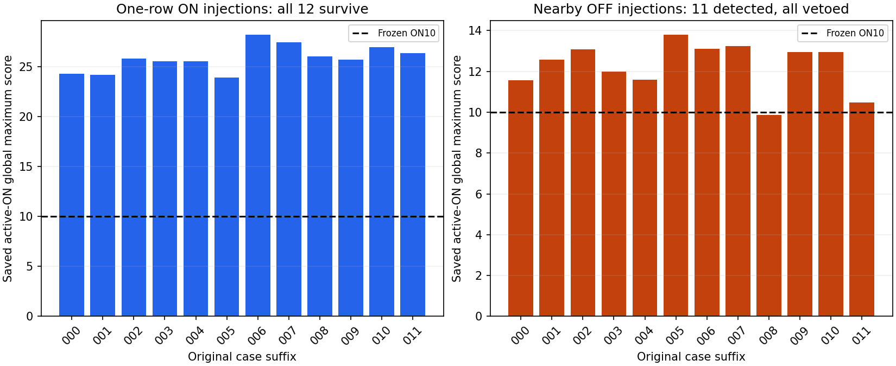
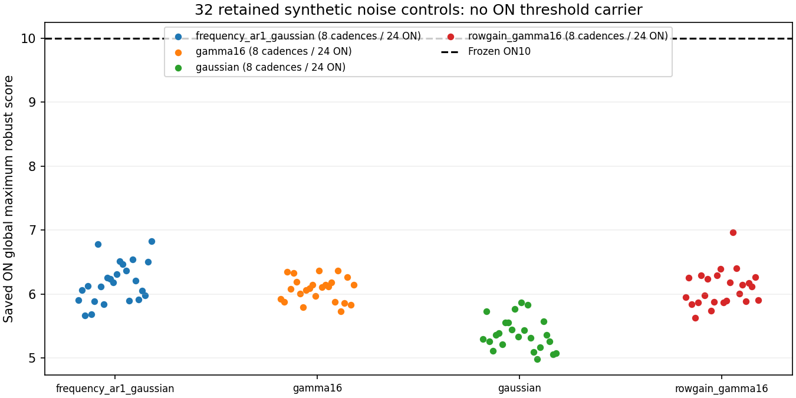

# Transienter, nær-OFF-tab og støjdækning — 8. oktober 2026

Den uændrede metode har to dokumenterede begrænsninger i de gemte syntetiske forsøg: **alle 12 stærke enkelt-række-indsprøjtninger overlever**, og **alle 11 oprindeligt genfundne ON-signaler i nær-OFF-forsøgene mistes ved OFF-veto**. Det tolvte nær-OFF-forsøg lå allerede under ON-tærsklen. Støjbanken giver nul ON-hits i 32 forløb fordelt på fire støjlove; den kalibrerer ikke falskalarmraten i himmeldata.

Analysen omfatter de præcise originale B-cases086–141: 12 transienter, 12 nær-OFF-diagnostikker og 32 støjforløb. Vi har læst gemte vinderkort, parametre og dispositioner, ikke genereret power eller kørt detektoren igen. Diagnostikfamilierne har eligibility_case=false og var ikke nye kvalifikationskrav. A/B forbliver FAIL_CLOSED; METHOD64 er beskrivende, og teleskoppiloten er ikke kvalificeret.

## Stærke indsprøjtninger i én tidsrække

Hvert transientforsøg indeholder en smal frekvensprofil i **én af 16 integrationer** i ét ON-scan: række0 eller15. Det er ikke en bredbåndspuls. Signalet har drift±4 Hz/s, intrinsisk bredde1/3 og idealniveau24. Amplituden er skaleret efter den støjfri fuld-scan boksprojektion, selv om profilen kun findes i én række; tallet24 er ikke en målt SNR. Integrationens frekvensudtværing giver oracle-bredde33.

Alle 12 har sandhedslokaliserede overlevende vinderspor. Tilsammen overlever **8114 carriers**, hvoraf **428** opfylder den uændrede sandhedslokalisering ved begge ON-endepunkter. De resterende **7686** er uden for den definition. Alle originale OFF-familier for disse spor blev udtømt under8. Tusindvis af carriers er korrelerede svar på de samme 12 indsprøjtninger; de er ikke tusindvis af uafhængige signaler.

| Forsøg | ON | Række | Bredde / drift | Alle overlevende carriers | Sandhedslokaliserede | Gemt ON-maksimum |
|---|---|---:|---|---:|---:|---:|
| 000 | epoch1_on | 0 | 1 / -4 | 20 | 19 | 24.284630 |
| 001 | epoch1_on | 0 | 3 / 4 | 19 | 19 | 24.158104 |
| 002 | epoch1_on | 15 | 1 / -4 | 1042 | 74 | 25.820915 |
| 003 | epoch1_on | 15 | 3 / 4 | 1043 | 71 | 25.545351 |
| 004 | epoch2_on | 0 | 1 / -4 | 19 | 19 | 25.536635 |
| 005 | epoch2_on | 0 | 3 / 4 | 20 | 18 | 23.910946 |
| 006 | epoch2_on | 15 | 1 / -4 | 123 | 17 | 28.216202 |
| 007 | epoch2_on | 15 | 3 / 4 | 122 | 21 | 27.446847 |
| 008 | epoch3_on | 0 | 1 / -4 | 1037 | 24 | 26.018527 |
| 009 | epoch3_on | 0 | 3 / 4 | 1037 | 19 | 25.692950 |
| 010 | epoch3_on | 15 | 1 / -4 | 1815 | 64 | 26.971995 |
| 011 | epoch3_on | 15 | 3 / 4 | 1817 | 63 | 26.382627 |

Sandhedslokalisering efterprøver det gemte lineære spors to fuld-ON-endepunkter. Den efterprøver ikke, at signalpower findes i mellemliggende rækker. At et spor er lokaliseret og uden OFF-match beviser derfor ikke en tidsmæssigt vedvarende linje. Vi har ingen gemte rå power-arrays eller per-række-scorebidrag til en ny morfologisk måling, og vi genskaber dem ikke. [Den afgrænsede puls-geometri](PULSE_GEOMETRY.md) viser, at8103/8114 gemte vinderbaner passerer inden for18,5 kanalbredder af sandhedssporet ved den indsprøjtede integrations midtpunkt, mens kun428 passer ved begge ON-endepunkter. De7675 punktmatches uden fuld lokalisering er ikke nye genfund. En [uafhængig Decimal-kontrol](PEER_PULSE_AUDIT.md) har bekræftet alle8114 rækker; geometriens punktmatch måler ikke bidrag til scoren eller en rå tidsprofil.

Bredde1 er i denne diagnostik koblet til drift−4 og bredde3 til+4; række/placering er også koblet i bankens design. Antalsforskelle mellem forsøg fastslår derfor ingen isoleret effekt af bredde, drift, ON-besøg eller båndkant. De store carrier-antal kan beskrive spor-degenerering omkring en tidslokal hændelse, men bidrag fra støj og preprocessing er ikke isoleret kontrafaktisk.

## En separat nærliggende linje i OFF

Disse forsøg har en nuldrift-linje med idealniveau12 i ét ON og en **separat** linje med samme intrinsiske bredde og idealniveau24 i det straks efterfølgende OFF. OFF-linjen placeres +2 eller+8 native kanaler fra ON-linjen. Native df er negativ, så frekvensforskellen er henholdsvis **−5,671006837 eller−22,684027348 Hz**. OFF-diagnostikken er defineret i case_definition og generatoren; den gemte flux_by_scan-sandhed beskriver hoved-ON-linjen og indeholder ikke OFF-linjens særskilte oracle.

| Forsøg | ON | Intrinsisk bredde | OFF-offset, native kanaler | ON-maksimum | Initialt lokaliserede carriers | Endeligt | Tabstrin |
|---|---|---:|---:|---:|---:|---:|---|
| 000 | epoch1_on | 1 | 2 | 11.571152 | 9 | 0 | OFF_VETO_LOSS |
| 001 | epoch1_on | 1 | 8 | 12.573049 | 9 | 0 | OFF_VETO_LOSS |
| 002 | epoch1_on | 3 | 2 | 13.082150 | 11 | 0 | OFF_VETO_LOSS |
| 003 | epoch1_on | 3 | 8 | 11.980582 | 9 | 0 | OFF_VETO_LOSS |
| 004 | epoch2_on | 1 | 2 | 11.578653 | 2 | 0 | OFF_VETO_LOSS |
| 005 | epoch2_on | 1 | 8 | 13.802525 | 3 | 0 | OFF_VETO_LOSS |
| 006 | epoch2_on | 3 | 2 | 13.093495 | 3 | 0 | OFF_VETO_LOSS |
| 007 | epoch2_on | 3 | 8 | 13.234485 | 3 | 0 | OFF_VETO_LOSS |
| 008 | epoch3_on | 1 | 2 | 9.877218 | 0 | 0 | NO_ON_THRESHOLD_HIT |
| 009 | epoch3_on | 1 | 8 | 12.942020 | 7 | 0 | OFF_VETO_LOSS |
| 010 | epoch3_on | 3 | 2 | 12.942299 | 7 | 0 | OFF_VETO_LOSS |
| 011 | epoch3_on | 3 | 8 | 10.469322 | 3 | 0 | OFF_VETO_LOSS |

De 11 initialt genfundne forløb indeholder tilsammen **66 ON-hits**, alle sandhedslokaliserede. Hvert blev vetoet af et originalt OFF-witness på mindst8 i netop den efterfølgende kontaminerede OFF. Vi har kontrolleret samtlige **66 witnesses** mod den originale kompatibilitetsregel ved de to **oprindelige ON-endepunkter**, med tilladt frekvensafstand ((ON-bredde+OFF-bredde)/2+2)·|df|.

Forsøg008 er en særskilt tærskelfejl: gemt ON-maksimum **9,877217747885116**, intet ON-hit og dermed intet OFF-veto at tillægge tabet. Det er forkert at omtale alle12 som OFF-forårsagede tab. De målte tab er11/11 blandt initialt genfundne, med11/12 initialt og0/12 endeligt lokaliserede forløb.

Et witness er det første kvalificerende spor i den fastlagte traversal; OFF-familien stoppes tidligt. Dets gemte maximum_checked_score og checked_template_count er delvise, ikke hele familiens globale maksimum eller antal. Et witness behøver ikke være det tætteste spor på den erklærede OFF-linje. Som en særskilt beskrivende geometri falder19/66 inden for en lokalisationstolerance beregnet med det gemte **ON-oracle** som reference ved OFF-scannets egne endepunkter. Det er ikke en original OFF-recovery-gate eller en måling af en gemt OFF-oracle; de øvrige47 kan ikke derfor kaldes falske witnesses. Den originale afgørelse bruger ON-kompatibilitet og OFF-score, som er verificeret for alle66.

Resultatet dokumenterer tab af hoved-ON-signalet i tilstedeværelse af en separat nær-OFF-linje. Det kvantificerer ikke tab uden den linje og beviser ikke den præcise støj-/RFI-andel i witness-scoren. En senere metodeændring skal afveje signalbevarelse ved nærliggende interferens mod de dokumenterede RFI-aliasrester; blot at gøre alle OFF-matches bredere løser ikke begge problemer.

## Hvad nul støjhits dækker

Alle32 støjforløb er gennemført med originale, separate identiteter:8 gamma16,8 gaussian,8 rowgain_gamma16 og8 frequency_ar1_gaussian. De omfatter96 ON-scans og192 gemte ON/OFF-vinderkort. I alle96 ON-scans ligger det gemte globale maksimum under10; **ingen ON-carrier blev udvalgt**, så resultatet skyldes ikke en senere OFF-afvisning af støjhits.

| Støjlov | Forløb | ON-scans | ON-hits | Gemt ON-maksimum, min / median / max | Mindste afstand under ON10 |
|---|---:|---:|---:|---:|---:|
| frequency_ar1_gaussian | 8 | 24 | 0 | 5.670501 / 6.154532 / 6.828822 | 3.171178 |
| gamma16 | 8 | 24 | 0 | 5.733686 / 6.101061 / 6.369621 | 3.630379 |
| gaussian | 8 | 24 | 0 | 4.988511 / 5.349061 / 5.866631 | 4.133369 |
| rowgain_gamma16 | 8 | 24 | 0 | 5.630276 / 6.061693 / 6.966548 | 3.033452 |

Nævneren er8 forløb pr. støjlov eller32 heterogene forløb samlet. Tre ON-scans inden for et forløb og de mange korrelerede drifts-/bredde-/carrier-svar må ikke tælles som ekstra uafhængige forløb. Tallene dækker de fastlagte syntetiske støjlove og det søgte bånd, ikke ukendte teleskopartefakter, frekvensmiljøer eller en kalibreret himmel-falskalarmrate.

En matematisk illustration viser, hvor lidt nul i otte alene fastslår: **hvis** otte forløb inden for én lov var uafhængige Bernoulli-forsøg med samme hændelsessandsynlighed p, ville P(0)=(1−p)⁸. Den ensidige95%-nul-observationsgrænse ville være p≤1−0,05^(1/8)=**0,312343978**, altså31,23%. Dette er en betinget modelgrænse, ikke et estimat af vores himmel-falskalarmrate. Vi pooler ikke de fire love til en homogene32-forsøgs-grænse.

## Idealniveau og robust søgemaksimum

[Den nye dækningsanalyse af METHOD64](METHOD_COVERAGE.md) sammenholder de eksisterende128 aktive ON-maksima med de erklærede idealniveauer. Ved ideal10 var21/32 aktive scans genfundet, ved12 var30/32, ved16 og24 var32/32. Alle13 misses i12 celler skyldtes gemt maksimum underON10. Det tidligere ALL52/64 og ANY59/64 er uændret.

Den nye tabel viser den målte variation, ikke en SNR-/fluxkalibrering: ved ideal12 spænder det gemte aktive-ON globale maksimum fra9,630511 til13,999, og ved ideal10 fra8,555767 til12,091345. Et udvalgt maksimum over søgte skabeloner er en anden størrelse end den støjfri idealprojektion. Der er fortsat én realization pr. præcis celle, korrelerede scans og ingen blind ny kvalifikation. En [separat kontrol af de autentificerede rapportprodukter](PEER_METHOD_COVERAGE.md) efterprøver128 scan-rækker,64 forsøgsrækker og25 beskrivende grupper.

## Konklusion til den næste plan

Vi har nu konkret evidens for tre separate udviklingsbehov: fastlæg den ønskede tidsprofil og kontroller tidslokale artefakter; vurder RFI som sammenhængende spor-familier samtidig med at nær-OFF-signaler bevares; mål en på forhånd fastlagt sand-bane-statistik særskilt fra et udvalgt søgemaksimum med friske gentagelser i en senere plan. Disse er forslag til en **senere** godkendt metodeudvikling. Ingen regel, tærskel eller søgebank ændres i denne periode.

De afsluttede analyser af RFI, transienter, nær-OFF, støjdækning og METHOD-statistik gentages ikke som dagligt fremskridt. Den gamle periodes særskilte afslutning9. oktober, den afgrænsede friske-proces-verifikation af et gemt METHOD-resultat19. oktober og slutrapport20. oktober bevares. Der startes ingen automatisk ny kampagne eller teleskopsøgning.

## Evidens, review og ressourcer

Kildecommit `13131757641c06d7bfcb10790a79811c750b1178`. Alle56 arkiver er autentificeret med SHA256, Git blob SHA1 og byteantal. Alle1120 originale artefakthashes og336 kort er kontrolleret før tabelafledning. Detektor-/generator-/kontrakthashes er uændrede. Den uafhængige diagnostiske kontrol har status **PASS_INDEPENDENT_RETAINED_DIAGNOSTIC_TABLE_AUDIT**; dens præcise testomfang fremgår af [review](PEER_DIAGNOSTIC_AUDIT.md). Scores og originale claims er bevaret, ikke genberegnet.

[Maskinevidens](DIAGNOSTIC_EVIDENCE.json) · [Alle56 cases](diagnostic_cases.csv) · [336 scan-maksima](saved_scan_maxima.csv) · [8114 transient-carriers](transient_original_carriers.csv) · [66 nær-OFF-hits](near_OFF_original_carriers.csv) · [66 originale witnesses](near_OFF_original_witnesses.csv) · [Støjlov-tabellen](noise_law_coverage.csv) · [Scope](SCOPE.md) · [Budget](ANALYSIS_LEDGER.json).

Ny konservativ reservation200CPU-sekunder efter den forrige RFI-analyse efterlader **6312,705144981004 CPU-sekunder**, med mindst2000 bevaret til rapport/reproduktion. Alle metrede hele jobs indgår som komponenter af reservationen, uden dobbeltdebitering eller refundering. Den tidligere1200-forberedelsesreservation og100-RFI-reservation er uændrede. Ikke alt setup-/publiceringsforbrug er fuldt målt; den konservative reservation dækker dette. Hvert child er afgrænset til45CPU-sekunder/120wall-sekunder/4GiB address space; originale kvitteringer og eventuelle fejl bevares.
