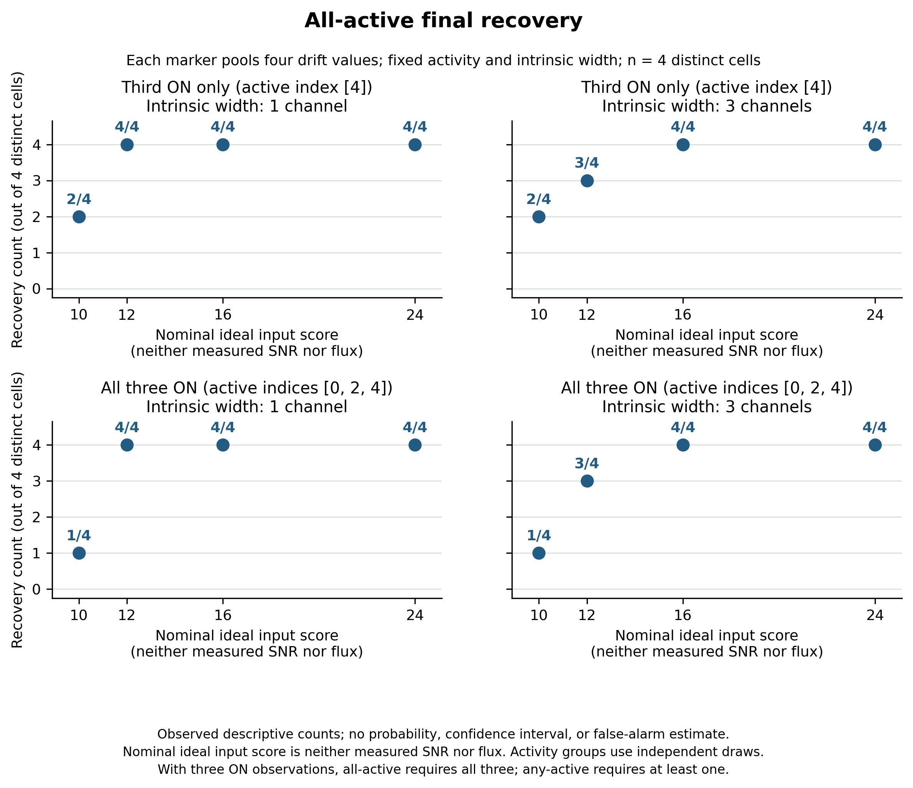
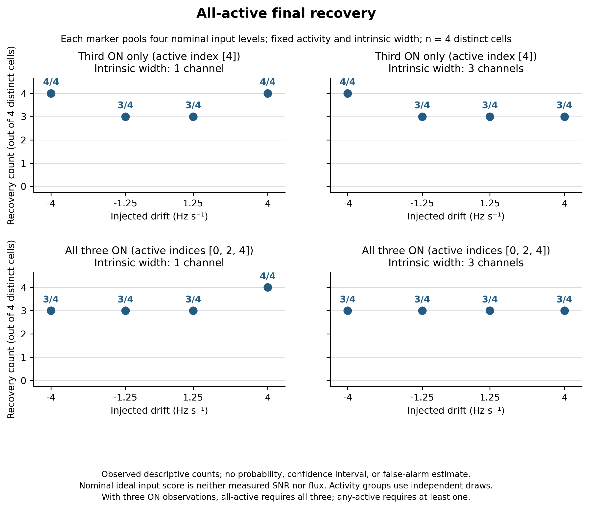
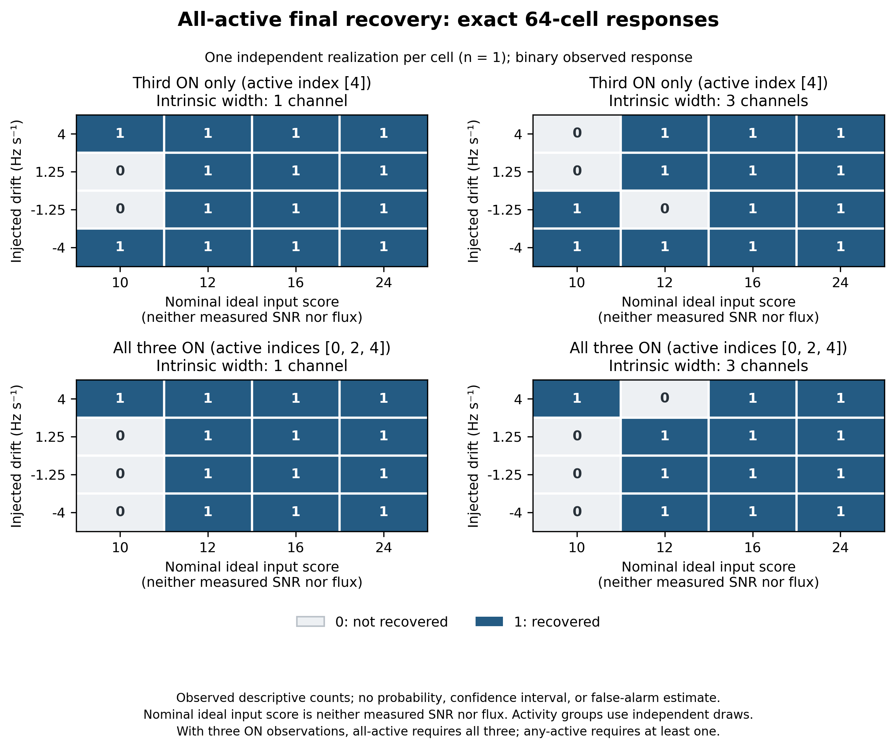
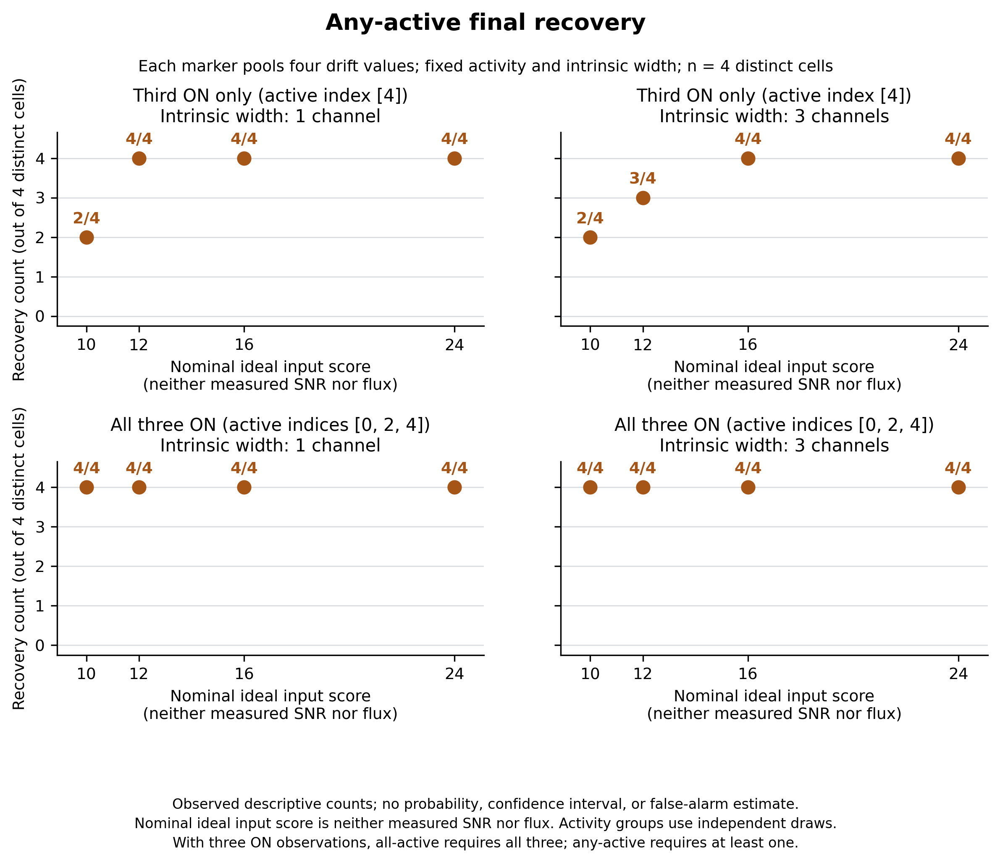
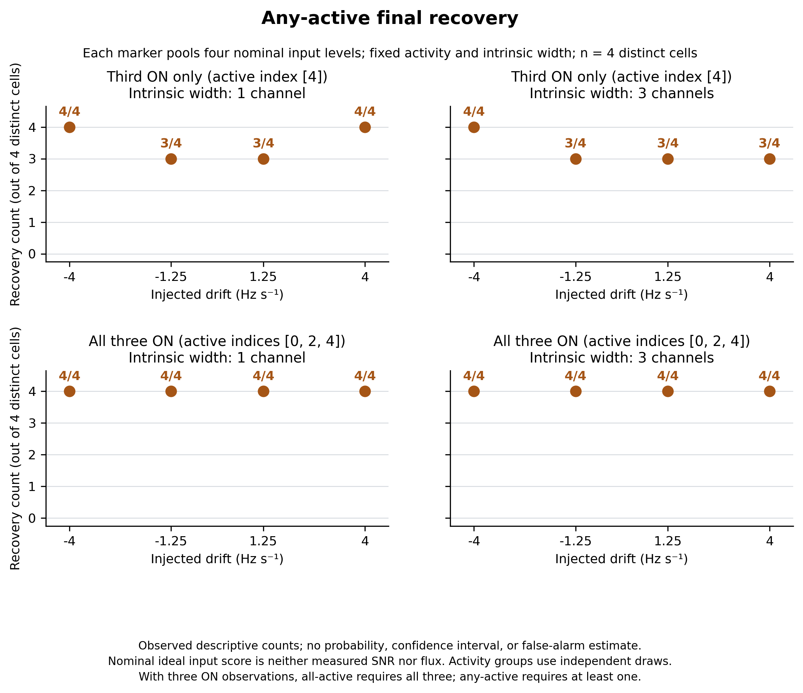
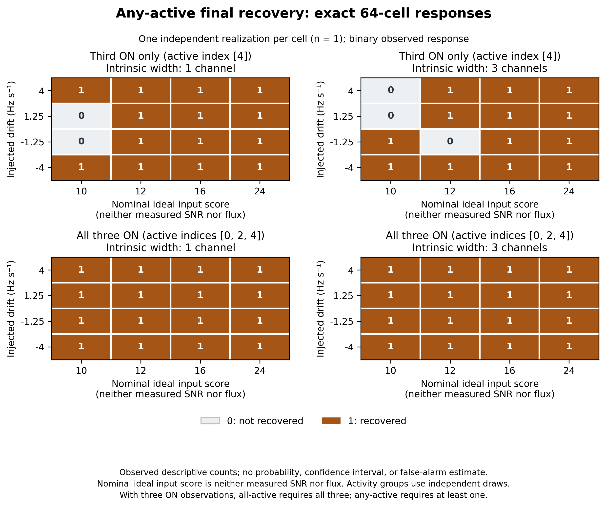

# Descriptive fixed-method recovery study

All 64 prespecified synthetic cells completed and passed independent retained-output audit. Final all-active recovery was observed in **52/64** cells; final any-active recovery was observed in **59/64** cells. These are descriptive counts. Both original validation A and B remain **FAIL_CLOSED**; this study has no qualification authority and uses no telescope values.

## Interpretation

There is one independent synthetic realization per exact strength, drift, width and activity cell. Each plotted strength/drift aggregate fixes width and activity and pools four cells across the other factor (**n=4**, not four repeated draws at the same setting). Binary cell panels have **n=1 per cell**. No probabilities, confidence intervals, sensitivity interpolation or false-alarm bounds are estimated.

The nominal input level is the declared noise-free ideal box projection in Gamma16 noise units (raw sigma 0.25); it is neither measured detector S/N nor physical flux. All-active recovery across three ON scans is stricter than single-third-ON recovery; any-active recovery is a union. The two activity groups have independent noise draws and do not provide a paired causal comparison. Width means intrinsic injected width (1 or 3 channels), not winning search width.

The design followed observed B losses, so it is an exploratory method study rather than blind validation. Placement is a deterministic balanced blocking factor, with one placement/seed per cell; placement interactions are not independently identified.

## Figures

### Final all-active recovery versus nominal input level

[Vector PDF](method_strength_final_all_active_recovered.pdf). Discrete observed counts out of four distinct cells; width/activity fixed, opposite factor pooled. No interpolated curve or uncertainty estimate.

### Final all-active recovery versus drift

[Vector PDF](method_drift_final_all_active_recovered.pdf). Discrete observed counts out of four distinct cells; width/activity fixed, opposite factor pooled. No interpolated curve or uncertainty estimate.

### Final all-active recovery: exact binary cells

[Vector PDF](method_cells_final_all_active_recovered.pdf). One realization per exact cell (n=1); binary observed response.

### Final any-active recovery versus nominal input level

[Vector PDF](method_strength_final_any_active_recovered.pdf). Discrete observed counts out of four distinct cells; width/activity fixed, opposite factor pooled. No interpolated curve or uncertainty estimate.

### Final any-active recovery versus drift

[Vector PDF](method_drift_final_any_active_recovered.pdf). Discrete observed counts out of four distinct cells; width/activity fixed, opposite factor pooled. No interpolated curve or uncertainty estimate.

### Final any-active recovery: exact binary cells

[Vector PDF](method_cells_final_any_active_recovered.pdf). One realization per exact cell (n=1); binary observed response.

## Strength and drift aggregate counts

| Factor | Activity | Width | Value | Valid / expected | All-active final | Any-active final |
| --- | --- | --- | --- | --- | --- | --- |
| strength | single_third_ON | 1 | 10.0 | 4 / 4 | 2/4 | 2/4 |
| strength | single_third_ON | 1 | 12.0 | 4 / 4 | 4/4 | 4/4 |
| strength | single_third_ON | 1 | 16.0 | 4 / 4 | 4/4 | 4/4 |
| strength | single_third_ON | 1 | 24.0 | 4 / 4 | 4/4 | 4/4 |
| strength | single_third_ON | 3 | 10.0 | 4 / 4 | 2/4 | 2/4 |
| strength | single_third_ON | 3 | 12.0 | 4 / 4 | 3/4 | 3/4 |
| strength | single_third_ON | 3 | 16.0 | 4 / 4 | 4/4 | 4/4 |
| strength | single_third_ON | 3 | 24.0 | 4 / 4 | 4/4 | 4/4 |
| strength | all_three_ON | 1 | 10.0 | 4 / 4 | 1/4 | 4/4 |
| strength | all_three_ON | 1 | 12.0 | 4 / 4 | 4/4 | 4/4 |
| strength | all_three_ON | 1 | 16.0 | 4 / 4 | 4/4 | 4/4 |
| strength | all_three_ON | 1 | 24.0 | 4 / 4 | 4/4 | 4/4 |
| strength | all_three_ON | 3 | 10.0 | 4 / 4 | 1/4 | 4/4 |
| strength | all_three_ON | 3 | 12.0 | 4 / 4 | 3/4 | 4/4 |
| strength | all_three_ON | 3 | 16.0 | 4 / 4 | 4/4 | 4/4 |
| strength | all_three_ON | 3 | 24.0 | 4 / 4 | 4/4 | 4/4 |
| drift | single_third_ON | 1 | -4.0 | 4 / 4 | 4/4 | 4/4 |
| drift | single_third_ON | 1 | -1.25 | 4 / 4 | 3/4 | 3/4 |
| drift | single_third_ON | 1 | 1.25 | 4 / 4 | 3/4 | 3/4 |
| drift | single_third_ON | 1 | 4.0 | 4 / 4 | 4/4 | 4/4 |
| drift | single_third_ON | 3 | -4.0 | 4 / 4 | 4/4 | 4/4 |
| drift | single_third_ON | 3 | -1.25 | 4 / 4 | 3/4 | 3/4 |
| drift | single_third_ON | 3 | 1.25 | 4 / 4 | 3/4 | 3/4 |
| drift | single_third_ON | 3 | 4.0 | 4 / 4 | 3/4 | 3/4 |
| drift | all_three_ON | 1 | -4.0 | 4 / 4 | 3/4 | 4/4 |
| drift | all_three_ON | 1 | -1.25 | 4 / 4 | 3/4 | 4/4 |
| drift | all_three_ON | 1 | 1.25 | 4 / 4 | 3/4 | 4/4 |
| drift | all_three_ON | 1 | 4.0 | 4 / 4 | 4/4 | 4/4 |
| drift | all_three_ON | 3 | -4.0 | 4 / 4 | 3/4 | 4/4 |
| drift | all_three_ON | 3 | -1.25 | 4 / 4 | 3/4 | 4/4 |
| drift | all_three_ON | 3 | 1.25 | 4 / 4 | 3/4 | 4/4 |
| drift | all_three_ON | 3 | 4.0 | 4 / 4 | 3/4 | 4/4 |

The complete 64-cell table and before/after OFF counts are retained in CSV and JSON.

## Marginal descriptive counts

| Factor | Value | Valid / expected | Pre-OFF all-active | Pre-OFF any-active | Final all-active | Final any-active |
| --- | --- | --- | --- | --- | --- | --- |
| nominal_ideal_box_score | 10.0 | 16/16 | 6 | 12 | 6 | 12 |
| nominal_ideal_box_score | 12.0 | 16/16 | 14 | 15 | 14 | 15 |
| nominal_ideal_box_score | 16.0 | 16/16 | 16 | 16 | 16 | 16 |
| nominal_ideal_box_score | 24.0 | 16/16 | 16 | 16 | 16 | 16 |
| drift_hz_s | -4.0 | 16/16 | 14 | 16 | 14 | 16 |
| drift_hz_s | -1.25 | 16/16 | 12 | 14 | 12 | 14 |
| drift_hz_s | 1.25 | 16/16 | 12 | 14 | 12 | 14 |
| drift_hz_s | 4.0 | 16/16 | 14 | 15 | 14 | 15 |
| intrinsic_width_channels | 1 | 32/32 | 27 | 30 | 27 | 30 |
| intrinsic_width_channels | 3 | 32/32 | 25 | 29 | 25 | 29 |
| active_scan_indices | [4] | 32/32 | 27 | 27 | 27 | 27 |
| active_scan_indices | [0,2,4] | 32/32 | 25 | 32 | 25 | 32 |
| reference_native_offset | 0.25 | 16/16 | 14 | 15 | 14 | 15 |
| reference_native_offset | 4094.75 | 16/16 | 14 | 15 | 14 | 15 |
| reference_native_offset | 1024.25 | 16/16 | 12 | 15 | 12 | 15 |
| reference_native_offset | 3070.75 | 16/16 | 12 | 14 | 12 | 14 |

Level, drift, and placement marginals each pool 16 distinct cells; width and activity marginals each pool 32. They mix the other factors and remain observed descriptive counts, not repeated-realization response estimates.

## Retained originating-ON loss stages

| Activity | Width | Cases | Originating ON scans | Localized survivor | Localized but OFF-vetoed | No ON threshold hit | ON hits not localized |
| --- | --- | --- | --- | --- | --- | --- | --- |
| single_third_ON | 1 | 16 | 16 | 14 | 0 | 2 | 0 |
| single_third_ON | 3 | 16 | 16 | 13 | 0 | 3 | 0 |
| all_three_ON | 1 | 16 | 48 | 45 | 0 | 3 | 0 |
| all_three_ON | 3 | 16 | 48 | 43 | 0 | 5 | 0 |

These stage labels are read from the original audited outcomes; no detector is rerun. Multiple active ON scans within a cadence are not independent replicated cells. ON global maximum robust box-track scores are retained per cell in the report data for threshold misses.

## Complete closed B evidence

All 142 prespecified B attempts are retained. The original B scientific summary remains FAIL_CLOSED. The following tables include every RFI, noise and diagnostic family, plus the strong/operating families for context. Recovery and hit counts use integrity-valid cases; invalid attempts remain separate and are not treated as measured nonrecovery. Noise has no injected active-ON recovery truth (shown as —).

| B family | Valid / expected | Failed | Pre-OFF all-active | Final all-active | Final any-active | Cadences with survivor |
| --- | --- | --- | --- | --- | --- | --- |
| matched_rfi | 24/24 | 0 | 24 | 0 | 0 | 2 |
| noise | 32/32 | 0 | — | — | — | 0 |
| single_row_transient | 12/12 | 0 | 12 | 12 | 12 | 12 |
| near_off_contamination | 12/12 | 0 | 11 | 0 | 0 | 0 |
| strong | 14/14 | 0 | 14 | 14 | 14 | 14 |
| operating | 48/48 | 0 | 45 | 45 | 46 | 46 |

| B family | Raw ON threshold carriers | Surviving ON carriers |
| --- | --- | --- |
| matched_rfi | 5685 | 14 |
| noise | 0 | 0 |
| single_row_transient | 8114 | 8114 |
| near_off_contamination | 66 | 0 |
| strong | 2236 | 2236 |
| operating | 2333 | 2333 |

These are retained counts from failed qualification. In particular, noise/RFI survivor counts are not calibrated sky probabilities or false-alarm limits.

### Original B checks

| Prespecified check | Closed B result |
| --- | --- |
| complete_and_integrity | PASS |
| each_activity_at_least_7_of_8 | FAIL |
| each_drift_at_least_10_of_12 | PASS |
| each_width_at_least_22_of_24 | FAIL |
| matched_rfi_all_primary_on_detected_before_off | PASS |
| matched_rfi_no_surviving_cadence | FAIL |
| noise_at_most_one_surviving_cadence | PASS |
| operating_at_least_44_of_48 | PASS |
| strong_14_of_14 | PASS |

The original closed B summary, all its checks, and input SHA256 provenance are retained verbatim in `report_data.json`. This report does not change them.
