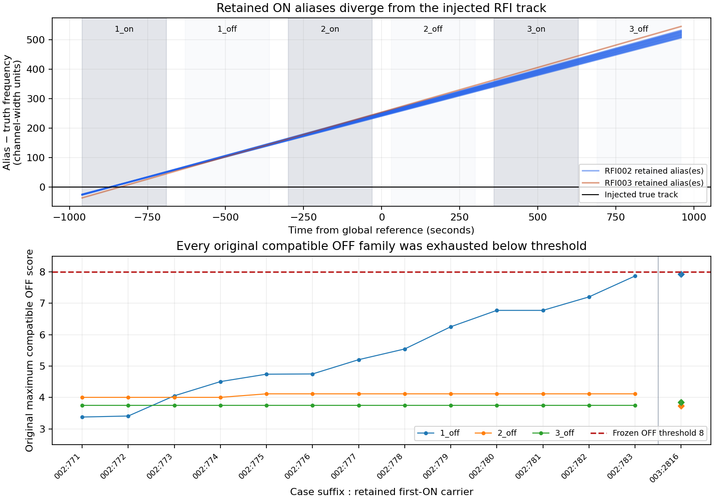

# RFI-resternes geometri — 8. oktober 2026

Den gemte B-test viser en konkret begrænsning i OFF-matchningen: **alle 14 overlevende spor udelukker det indsprøjtede RFI-spors drift fra deres tilladte OFF-matchfamilie**, selv hvis referencefrekvensen frit kunne flyttes. Dette er en deterministisk geometrisk konklusion fra de originale sporparametre. Forklaringen på, hvor stor en del af deres ON-score der skyldes RFI, støj og preprocessing, er fortsat en fortolkning.

Analysen bruger alene B matched_rfi002/003, case064/065. De indeholder henholdsvis 13 sammenhængende første-ON-carriers 771–783 og én carrier 2816. De er 14 korrelerede detektorsvar fra to syntetiske RFI-forløb. Der er ingen nye signaltræk eller scores, og detektor, generator, tærskler og originale claims er uændrede. A og B forbliver FAIL_CLOSED; teleskoppiloten er ikke kvalificeret.

## Det nye resultat

OFF-kompatibilitet bedømmes ved **det oprindelige ON-scans to integrationsmidtpunkter**, også når det sammenlignede spektrum kommer fra et andet tidspunkt. For referencefrekvensforskel Δf og driftforskel Δd kræves begge uligheder:

$$|\Delta f + \Delta d\,t_0|\le T,\qquad |\Delta f + \Delta d\,t_1|\le T.$$

Ved at trække endepunkterne fra hinanden fås den nødvendige betingelse:

$$|\Delta d|\le \frac{2T}{t_1-t_0}.$$

ON-span er 269,793361920 sekunder; kanalafstanden er 2,835503418 Hz. Alle rester bruger bredde 33. OFF-bredderne 1/3/9/33 giver henholdsvis 19/20/23/35 kanalbredders tolerance. Selv den største tolerance, 35, tillader derfor kun **0,735693561 Hz/s** driftforskel. Resterne afviger fra sand drift −4 Hz/s med **0,784632434–0,859992612 Hz/s**. Alle fire OFF-bredder udelukker dermed det præcise indsprøjtede spors drift.

Dette afhænger ikke blot af det gemte frekvensoffset. Med en frit valgt referencefrekvens er den mindst mulige største endepunktsfejl |Δd|·span/(2·|df|): **37,328226–40,913422 kanalbredder**. Det er 2,328226–5,913422 over den største tilladte OFF-tolerance. En diskret carrier-familie kan ikke gøre en umulig kontinuert matchning mulig.

Sandhedslokalisering bruger en anden regel: 2 + max(ON-bredde, støjfri oracle-bredde)/2. Her er oracle-bredden 33, og lokalisationstolerancen **18,5 kanalbredder**, mens den bredeste OFF-matchning tillader 35. De to definitioner må ikke blandes sammen. Alle rester er uden for sandhedslokaliseringen.

## Hvad de gemte OFF-resultater viser

Alle **42 originale OFF-sammenligninger** (14 spor × tre OFF-scans) er markeret udtømte uden veto. De gemte maksimumscores for de kompatible familier ligger mellem **3,379418101 og 7,926772881**, under den faste tærskel 8. RFI002's højeste er 7,865466139; RFI003's er 7,926772881. De mindste tærskelmargener er henholdsvis 0,134533861 og 0,073227119. Disse er observerede margener, ikke usikkerheder eller falsk-alarm-sandsynligheder.

OFF-kortenes globale maksimumscores er samtidig 22,270732–24,818143. Vi sammenlignede alle seks globale OFF-vinderspor med hvert tilhørende overlevende ON-spor: **alle 42 par fejler mindst ét ON-endepunktskrav**. Et lyst globalt OFF-maksimum er derfor ikke i sig selv et kompatibelt veto. Kun de originale udtømte OFF-familiers records dokumenterer, at intet kompatibelt template nåede 8; vinderkortene alene ville ikke dokumentere dette.

De to forløbs **472 oprindeligt sandhedslokaliserede ON-hits** fordelt på seks ON-scans blev alle vetoet. Det ophæver ikke den fastlagte gate, der krævede nul rester af enhver placering i RFI-forløb. Analysen forklarer dermed, hvordan korrekt afvisning af den lokaliserede RFI-kerne kan sameksistere med rester på andre vinderspor.

Øverst vises lineær frekvensforskel mellem hvert gemt ON-vinderspor og det indsprøjtede spor over kadencen. Skygger viser de seks scans. Det er extrapoleret geometri fra parametrene, ikke målt signalindhold i senere scans. Nederst vises alle originale OFF-familie-maksimumscores. RFI003 vises som særskilte diamanter; nabocarriers i RFI002 er korrelerede svar.

## Alle 14 rester

| Case / carrier | ON-score | Drift Hz/s | Minimax endpoint error* | Largest compatible OFF score | OFF margin below 8 |
|---|---:|---:|---:|---:|---:|
| 002 / 771 | 10.069503 | -3.173993351 | 39.296569 | 4.005385 | 3.994615 |
| 002 / 772 | 10.088348 | -3.178426302 | 39.085675 | 4.005385 | 3.994615 |
| 002 / 773 | 10.159119 | -3.181381603 | 38.945079 | 4.054730 | 3.945270 |
| 002 / 774 | 10.329542 | -3.184336904 | 38.804483 | 4.506305 | 3.493695 |
| 002 / 775 | 10.264305 | -3.187292205 | 38.663887 | 4.742407 | 3.257593 |
| 002 / 776 | 10.380866 | -3.191725157 | 38.452993 | 4.749918 | 3.250082 |
| 002 / 777 | 10.468647 | -3.194680458 | 38.312397 | 5.203351 | 2.796649 |
| 002 / 778 | 10.484133 | -3.199113410 | 38.101503 | 5.544276 | 2.455724 |
| 002 / 779 | 10.456413 | -3.200591060 | 38.031205 | 6.250813 | 1.749187 |
| 002 / 780 | 10.595908 | -3.205024012 | 37.820311 | 6.772244 | 1.227756 |
| 002 / 781 | 10.610839 | -3.209456963 | 37.609417 | 6.772244 | 1.227756 |
| 002 / 782 | 10.585166 | -3.212412264 | 37.468822 | 7.200501 | 0.799499 |
| 002 / 783 | 10.508355 | -3.215367566 | 37.328226 | 7.865466 | 0.134534 |
| 003 / 2816 | 10.055698 | -3.140007388 | 40.913422 | 7.926773 | 0.073227 |

\* Kanalbredders fejl efter den teoretisk bedste frie referencefrekvensjustering mod den præcise indsprøjtede drift. Det er en geometrisk nedre grænse, ikke et nyt template-scoreforsøg. Original ON-score og OFF-score er uændrede gemte værdier.

## Fortolkning og næste arbejde

Mønstret stemmer med brede, forskudte driftspor, der reagerer på stærk integrationsudtværet RFI og extrapolerer væk fra den indsprøjtede bane. Vi har nu bevist den præcise indsprøjtede driftbanes udelukkelse fra aliasernes OFF-familier; vi har ikke isoleret årsagen til deres ON-scores med et kontrafaktisk forsøg. Vi har heller ikke rekonstrueret alternative, ikke-vindende ON-templates: originalsystemet klassificerede én vinder pr. carrier.

Til en **senere plan** bør et konkret udviklingsforsøg undersøge, om sammenhængende frekvens-/driftfamilier omkring stærk RFI kan kontrolleres samlet. Det skal ledsages af signalbevarelseskontroller ved nærliggende RFI og en ny, separat kvalifikation, fastlagt før nye data. Denne rapport ændrer ingen regel eller tærskel nu; de 14 fejl må ikke bruges som både udvikling og efterfølgende blind godkendelse.

Den godkendte periode fortsætter med analyser af gemte begrænsninger, den gamle periodes særskilte afslutning 9. oktober, afgrænset frisk-proces-verifikation af ét gemt METHOD-resultat 19. oktober og slutrapport 20. oktober. Reproduktionen kontrollerer kort→hits/veto/genfund, ikke rå preprocessing eller nye scores. Ingen gentagelse af lukkede paneler som dagligt fremskridt.

## Evidens og kontrol

Kildecommit: `6b8259099721b3acdb98b604fb5c9ea192577d68`. Begge arkivers SHA256, Git blob SHA1 og byteantal er verificeret før udpakning. Begge originale COMMITTED-manifester og deres 40 artefakthashes er kontrolleret, inklusive 12 NPZ-vinderkort. De uændrede detektor-/generator-/kontrakthashes er bundet i evidensfilen. Ingen nye rå arrays er genereret eller scoret.

Den uafhængige kontrol bestod: **PASS_RETAINED_DERIVATIONS_ONLY**. Separat 45-cifret Decimal-aritmetik finder tomme frekvensintersektioner i **56/56 kombinationer** af 14 rester og fire OFF-bredder. Alle fire CSV-tabeller, 42 originale OFF-poster, 84 geometrier og 42 globale OFF-vinderpar er kontrolleret mod de originale filer. Største talafvigelse er 4,46·10⁻⁸ mod kontrollens absolutte tolerance 10⁻⁶. Dette efterprøver afledninger og tro gengivelse af gemte scores; det gentager ikke de numeriske scoreberegninger fra rå power.

Filer: [maskinlæsbar evidens](RFI_GEOMETRY_EVIDENCE.json), [14 rester](survivors.csv), [42 originale OFF-sammenligninger](original_OFF_comparisons.csv), [84 sandhedsrelative scan-geometrier](truth_track_geometry.csv), [42 globale OFF-vinderpar](OFF_global_winner_compatibility.csv), [uafhængig kontrol](PEER_AUDIT.md), [geometrisk review](peer_scope_review.md), [analysens ramme](SCOPE.md), [budget](ANALYSIS_LEDGER.json). Beregningen importerer ikke den originale detektor eller generator. Uafhængig audit kontrollerer gemte parametre og afledninger; den udfører ikke nye scoreberegninger.

Figuren er udgivet som [PNG](retained_rfi_geometry.png) og [PDF](retained_rfi_geometry.pdf). Visual kontrol af den endelige PNG viser læselige labels uden overlap; geometri- og scorepaneler er tydeligt adskilt.

En konservativ ny reservation på **100 CPU-sekunder** dækker dette arbejde. Restbudgettet er **6512,705144981004 CPU-sekunder**, med mindst 2000 bevaret til rapport/reproduktion. Metrede hele jobs, inklusive wrapper, opgøres som komponenter af reservationen; den tilbagebetales ikke, og den tidligere 1200-sekunders forberedelsesreservation er uændret. Ingen ukendt historisk CPU er omtalt som fuldt målt. Hvert analyse-child har loft 30 CPU-sekunder, 120 vægsekunder og 4 GiB address space. De konkrete kvitteringer bevares.
