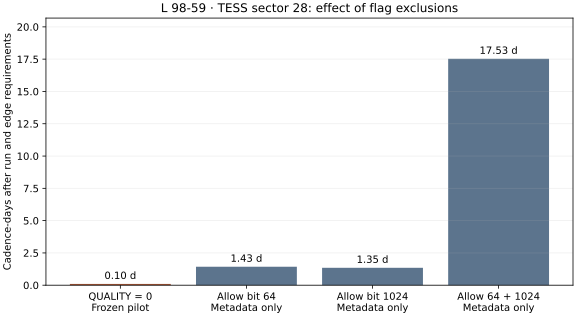

# LS7: L 98-59 TESS sector 28 — not qualified

Completed and reviewed 12 September 2026. **The first optical pilot did not
qualify: its strict quality mask and requirement for contiguous backgrounds
left no eligible injection anchors.** No sensitivity estimate, astronomical
null result, adopted detector or light-sail candidate follows from this run.

The prospective [protocol](../LS7_TESS_L9859_PROTOCOL.md), configuration, code and
eight known-answer tests were published at
[`ef94093`](https://github.com/andersenmartin-blip/setisearch/commit/ef940930572e13d871eb8bfa5f756778bca16993)
before opening the measured arrays. No scientific threshold or mask was changed
afterward. The original partial outputs remain intact. A separate closure script
records the failure and inspects quality/time metadata; it performs no alternative
flux search or injection experiment.

## Data actually retrieved and checked

| Property | Verified value |
|---|---|
| Target | L 98-59, TIC 307210830 |
| Product | TESS/SPOC sector 28 FAST-LC and FAST-TP |
| Observation start, UTC | 2020-07-31 08:22:44.954 |
| Observation end, UTC | 2020-08-25 14:18:21.229 |
| Time sampling | 20 seconds; BTJD = BJD_TDB − 2457000 |
| Nominal photometric band | Approximately 600–1000 nm |
| Input volume | 278,746,560 bytes across the two public FITS products |
| Time-series rows | 109,095 |
| Optimal aperture | 19 pixels in an 11 × 11 pixel stamp |
| Ground cosmic-ray correction records restored | 58,328; all matched a cadence and detector pixel |
| Corrected aperture vs SPOC SAP | Median absolute fractional difference 2.37 × 10⁻⁸ |

Exact public MAST URLs, byte counts and SHA-256 identities are recorded in the
[source manifest](source_manifest.json). Both FITS products passed structural,
target, sector, time-reference, sampling and flux-unit checks. LC and TPF quality
flags agree at every row. Restoration adds the archived ground-subtracted flux
back to calibrated pixels; it does not reconstruct raw detector counts.

## Why the frozen pilot could not measure recovery

`QUALITY == 0` accepts 87,721 samples, representing **20.3058 cadence-days**.
However, those samples form **3,779 separated runs**, with a median length of 16
samples and a maximum of **182 samples (60 minutes 40 seconds)**.

Only 16 runs satisfy the frozen screening-length requirement. Their median-filter
edge guards leave **431 cadence centers: 0.09977 cadence-days, or 2.39 hours**.
All cadences with a nonzero restored aperture correction are excluded by the mask.

The digital tests need 200 accepted samples on each side of an anchor: a
401-sample context, approximately 2 hours 14 minutes. There are **zero eligible
anchors**, so the runner correctly refuses to manufacture or select a shorter
context. It exits with:

```text
ValueError: not enough unbroken data for fixed injection anchors
```

The original run exited with code 1 before any digital trial. **None of the
planned 240 stellar-profile injections, 40 nuisance controls or 20 unchanged
controls was executed.** Recovery and nuisance-acceptance fractions are missing,
not zero. The eight synthetic implementation tests pass; they do not replace
qualification on observed backgrounds.

The retained positive/negative event ledger is empty for the small searchable
coverage. This is not a negative search result over 20 days of observations.

## Diagnostic of correction flags

The [MAST quality-flag documentation](https://outerspace.stsci.edu/spaces/TESS/pages/14563420/2.0%2B-%2BData%2BProduct%2BOverview)
distinguishes correction flags from spacecraft or calibration failures. Bit 64
marks an optimal-aperture cosmic-ray correction; bit 1024 marks a cosmic ray in
a collateral row or column. A correction flag by itself need not mean that a
cadence is unusable. Our initial blanket rejection was too strict for the chosen
contiguous-background method.

After closing the frozen run, the following **time/quality feasibility comparison**
was made. The other three policies have not been used to screen measured flux or
measure injection recovery. Every other nonzero flag remains excluded in this
comparison, including the scattered-light and bad-calibration flags.

| Allowed correction flags | Accepted cadence-days | After run/edge requirements | Longest run, samples | Eligible anchor indices |
|---|---:|---:|---:|---:|
| None: frozen `QUALITY == 0` | 20.306 | 0.100 days | 182 | 0 |
| 64 only | 20.742 | 1.432 days | 409 | 9 |
| 1024 only | 20.738 | 1.345 days | 286 | 0 |
| 64 and 1024 | 21.182 | **17.527 days** | 3,650 | 50,346 |



The substantial increase comes mainly from avoiding fragmentation, not from
adding a large number of samples. The 50,346 eligible indices are overlapping
possible locations, not independent experiments. This comparison identifies a
concrete route to a useful next pilot, but it does not validate the relaxed mask,
cosmic-ray rejection, native false alarms or signal sensitivity.

## Conjunction geometry and relation to LS1

The existing LS3 b/c/d ephemerides were evaluated in the frozen one-dimensional,
circular, edge-on, common-node model using BJD_TDB. Of the **431 searched cadence
centers**, 12.993% have b–c projected separation within one stellar radius
(0.01296 cadence-days, about 18.7 minutes). None meet that criterion for b–d or
c–d. These fractions describe only the highly fragmented searched coverage.

Unknown nodes, inclination differences and ephemeris uncertainties are not
included. These numbers are not precise conjunction forecasts, planet occultation
predictions or evidence that a propulsion beam would reach Earth. Geometry did
not select search windows or promote events.

TESS would complement LS1 with optical photometry on a different target and
30–100-second timescales. Its single broad band cannot establish a narrow laser
spectrum or distinguish every stellar flare from a propulsion signature. A narrow
1.06-micron beam lies outside its nominal band. The radio LS1 analysis and its
original result remain unchanged.

## Concrete continuation

Keep sector 28 as development evidence and preserve the failed freeze. Before
the next sector is opened:

1. Freeze an explicit correction-aware flag policy, provisionally accepting bits
   64 and 1024 while retaining the other exclusions. Check the documented meaning
   and calibration implications of each accepted flag.
2. Add an eligibility preflight before native screening, and structured reporting
   for zero eligible anchors. Require enough separated backgrounds, not merely
   many overlapping candidate indices. Preserve exposure and flag denominators.
3. Test injected glints and single-pixel/background nuisance events on an unopened
   sector. Include corrected/restored comparison, off-profile injections and
   real-flare/pointing diagnostics before adopting a scientific detector.

No other target or sector was downloaded or analyzed in this pilot. This bounded
run establishes the data path and its first concrete limitation without expanding
to the full TESS inventory.

## Reproduction and audit

```sh
python -m pip install -r requirements_ls7.txt
PYTHONPATH=src python -m unittest discover -s tests -p test_ls7_tess.py -v
sha256sum -c LS7_FREEZE.sha256
```

Use a new output directory to preserve the published result. The frozen runner
reproduces the documented exit code 1 and refuses to overwrite existing output.

```sh
PYTHONPATH=src python scripts/ls7_tess_pilot.py --output data_ls7_repeat
```

After that expected failure, run the reporting closure separately:

```sh
PYTHONPATH=src python scripts/ls7_tess_close.py --output data_ls7_repeat
```

It
checks the original input identities and completes the numerical closure and
quality-metadata diagnostic. The closure script is a post-run reporting addition,
not part of the prospective detector freeze. This readable report was written
from the resulting ledgers. Output checksums cover the report as well.

- [Machine-readable closure and missing endpoints](summary.json)
- [Original instrument checks](metadata.json)
- [Original screenable segments](segments.json)
- [Original native event ledger](native_events.json)
- [Complete quality feasibility comparison and run-length histogram](quality_feasibility.json)
- [Output checksums](SHA256SUMS)
- [NASA TESS processing reference](https://heasarc.gsfc.nasa.gov/docs/tess/TESS-CosmicRayPrimer.html)

Primary processing and quality-flag documentation checked 12 September 2026.
