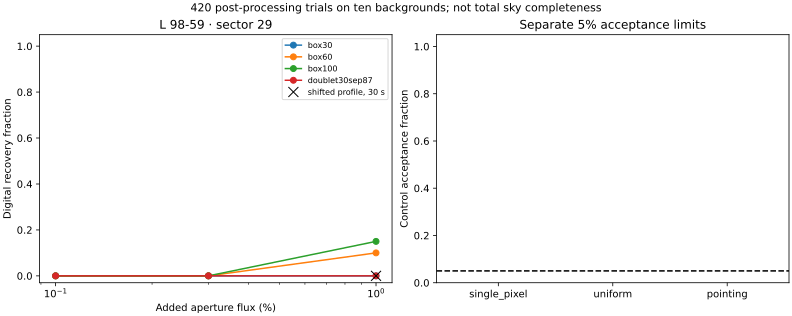
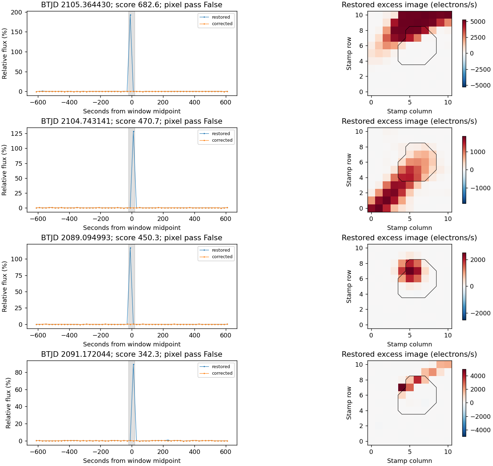

# LS7B reviewed result: useful coverage, insufficient weak-glint recovery

12 September 2026. **The revised flag handling works for coverage, but the
complete detector fails the predeclared 1%-glint qualification.** All **420
digital trials** completed on L 98-59 sector 29. The sensitivity limitation is
now measured, rather than an inability to place the tests. No event is promoted
as a light-sail candidate.

This review interprets the original sealed outputs. It does not change the
frozen detector, trial amplitudes, anchors, thresholds, masks, ledgers or
qualification result. [Original generated report](REPORT.md) and
[prospective protocol](../LS7B_TESS_PROTOCOL.md).

## Coverage and data

The public 20-second TESS/SPOC products cover **26 August–21 September 2020**
(2020-08-26 17:41:59.413 to 2020-09-21 22:22:48.799 UTC), nominally **600–1000 nm**.
Allowing correction flags 64/1024 retains 95,002 of 113,190 samples and **21.9912
cadence-days**. Run-length and edge requirements leave **19.6620 cadence-days**
for screening. Ten nonoverlapping 401-sample backgrounds span 24.6823 days.

All 48,517 archived target-pixel cosmic-ray correction records matched a cadence
and detector pixel. Corrections affect 1,669 accepted aperture sums. The median
absolute difference between corrected aperture sums and SPOC SAP is 2.31 × 10⁻⁸
of SAP. The two input FITS files total 289,062,720 bytes; exact public source URLs
and SHA-256 identities are in the [source manifest](source_manifest.json).

Sector 28 remains unchanged development evidence. Its previous 17.53-day estimate
was a metadata feasibility comparison; the **19.66-day value here is actual
screened coverage on the different, prospectively selected sector 29**.

## Where signal recovery is lost

The 60 baseline single-pulse trials at **1% added aperture flux** separate as:

| Outcome | Trials |
|---|---:|
| Below the fixed screening score of 8 | 35 |
| Reach screening threshold, then fail pixel morphology | 20 |
| Recovered after both stages | **5** |
| Total | 60 |

The retained fraction is **8.33%**, below the frozen 90% requirement. None of
these trials is baseline-confounded.

| Injected single pulse at 1% | Reaches screening | Finally recovered |
|---|---:|---:|
| 30 seconds | 0/20 | 0/20 |
| 60 seconds | 9/20 | 2/20 |
| 100 seconds | 16/20 | 3/20 |

All 20 morphology-rejected, above-threshold cases fail the fixed cosine-similarity
cut of 0.90; 12 of them also fail the centroid cut. None fails the concentration
or outside-background cut. These rejection categories overlap. Thus both the
temporal threshold and the spatial test limit sensitivity; changing only the
quality mask does not produce a qualified search.

The 0.1% and 0.3% baseline injections are not recovered. Neither the 1% doublets
nor the 80 displaced-profile 30-second signals reach screening threshold. This
does **not** determine sensitivity to stronger flashes; the frozen amplitude
grid stops at 1%, and no brighter trials were added after seeing the result.

## What the controls can establish

None of the 80 instrumental controls or 20 unchanged controls is accepted.
However, **none of the instrumental controls reaches the temporal screening
threshold at all**. Their zero acceptance therefore supplies no above-threshold
test of the pixel discriminator. It is not a false-alarm rate or proof of
effective rejection of stronger nuisance events. The simple shifted-image
controls also do not cover all pointing or detector errors.

All 420 trials share ten backgrounds. Digital signals were added after mission
processing and quality selection. These are conditional recovery measurements,
not a telescope detection-efficiency curve, independent sky trials or an LS
population limit.

## The 343 native excursions

The restored stream contains **343 positive retained windows** and no negative
windows. All 343 include the optimal-aperture cosmic-ray flag, all fail the
pixel test, and all fall below threshold when the same window is measured on
corrected flux using the same primary noise scale. Corrected same-window scores
range from −2.09 to 6.19. The separate corrected-stream search has no triggers.

The four strongest events were visually inspected according to the frozen
selection rule. Their excess images show diagonal, extended or displaced pixel
patterns; their large flux spikes disappear after the archived corrections.
Together with the recorded flags, these observations are **consistent with
cosmic-ray contamination**. This is a retrospective interpretation of these
four displayed events, supported by the all-event accounting, not independent
physical identification of every excursion. No new veto was introduced.

The empty final native set is not a strong astronomical null: the low measured
recovery prevents an inference that comparable astrophysical flashes are absent.

## Geometry and relation to LS1

The unchanged circular, edge-on, common-node 1D model places 2.113%, 1.890% and
1.231% of searched cadence centers within one stellar radius in projected b–c,
b–d and c–d separation, respectively. The corresponding summed cadence coverage
is 0.41551, 0.37153 and 0.24213 days. These pair windows may overlap; they must
not be added as independent coverage.

The model uses the frozen LS3 ephemerides and BJD_TDB, omits inclination, node
and ephemeris uncertainty, and was not used to select or promote events. It is
not a prediction of a propulsion beam reaching Earth. Optical observations
complement LS1's radio band and timescales but require their own qualification;
TESS's single wide band does not identify a coherent laser spectrum.

## Concrete next work

Use these closed ledgers as development evidence. Before another independent
sector is opened, specify a spatial comparison that accounts for pixel noise
and explicitly measures how often real stellar-profile signals are vetoed near
the screening threshold. The hard cosine cut has now demonstrated substantial
signal loss at that threshold.

Expand the next *predeclared* amplitude grid above 1% so that signal and nuisance
examples both cross the screening threshold. Match nuisance controls in observed
screening strength, and retain the existing no-gap-filling and separated-background
requirements. A revised spatial rule must be frozen and evaluated jointly with
those stronger positive and nuisance controls before survey expansion.

No other TESS sector was opened during LS7B. We have not adjusted this completed
experiment or claimed a sensitivity limit for stronger light-sail flashes.

## Audit and reproduction

The original output manifest remains unchanged. The ledger audit checks all
420 trial records, all 343 native records, case identities, anchor assignments,
score/morphology/recovery logic, group totals and qualification-gate accounting.
The 15 implementation tests pass. All original LS7 and LS7B scientific hashes
remain unchanged. An integrity audit passing does not make the detector pass.

- [Machine-readable loss attribution](review_accounting.json)
- [Audit record](AUDIT.json)
- [Original output checksums](SHA256SUMS)
- [Review supplement checksums](REVIEW_SHA256SUMS)
- [Audit/review code](../scripts/ls7b_review.py)

Reproduce the ledger review with
`PYTHONPATH=src python scripts/ls7b_review.py`. The original numerical run and
its source identities are documented in the [frozen protocol](../LS7B_TESS_PROTOCOL.md).

Processing references: [MAST quality flags](https://outerspace.stsci.edu/spaces/TESS/pages/14563420/2.0%2B-%2BData%2BProduct%2BOverview),
[NASA TESS cosmic-ray processing](https://heasarc.gsfc.nasa.gov/docs/tess/TESS-CosmicRayPrimer.html).
