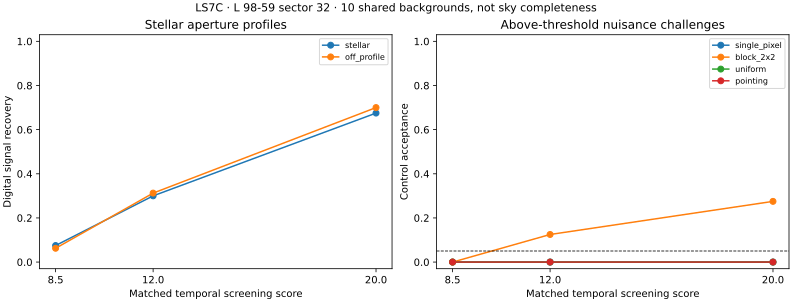
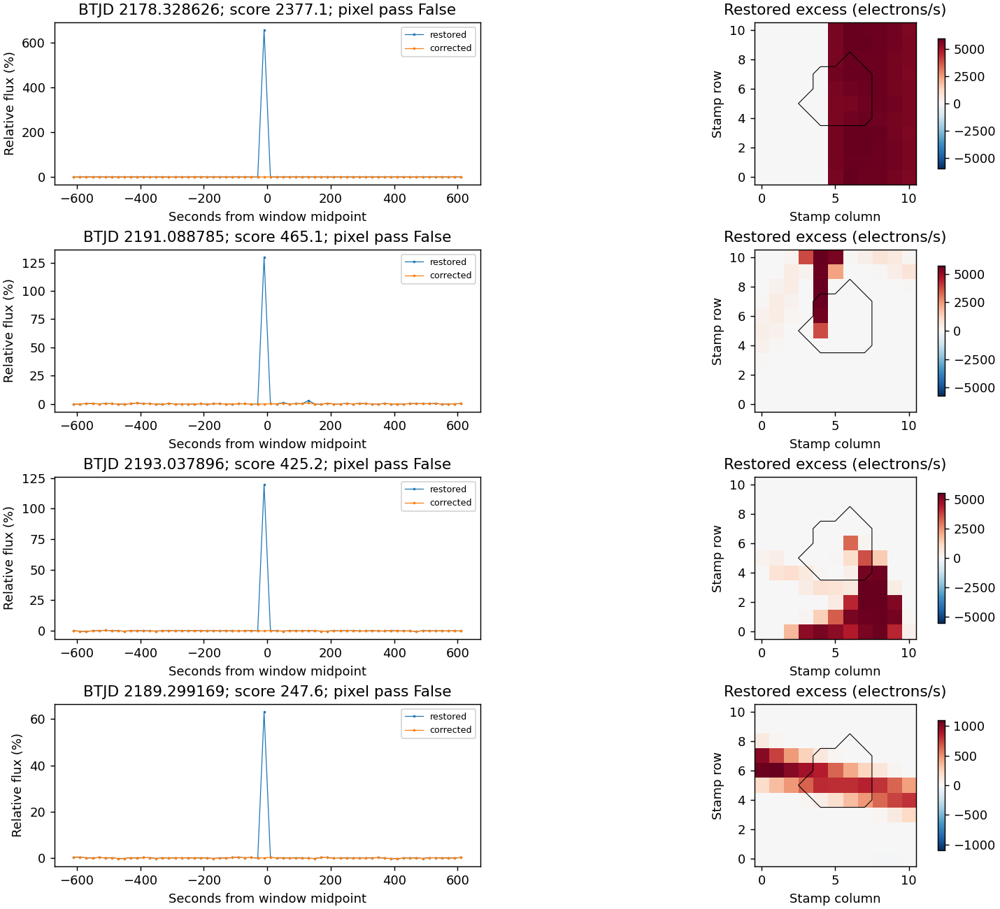

# LS7C reviewed result: matched controls reveal two unresolved limitations

12 September 2026. **All 1,460 digital trials completed, but the noise-aware
detector fails the joint qualification.** Strength matching now succeeds for
every planned signal and nuisance. The spatial test still rejects too many
stellar-profile injections and accepts some compact detector patterns. No LS
candidate is promoted, and the detector is not adopted.

The [code and protocol were published](https://github.com/andersenmartin-blip/setisearch/commit/baa514347c8466b78a82689a84ffb5b82f83237d)
before sector 32 was downloaded. This review preserves the sealed
[original report](REPORT.md), all decisions and the failed gates. Residual
attribution below is explicitly retrospective; no threshold has been changed.

## Data and coverage

L 98-59, TIC 307210830, TESS/SPOC **sector 32**, nominal **600–1000 nm** and
**20-second cadence**: **20 November–16 December 2020**, specifically
2020-11-20 17:10:18.955 to 2020-12-16 17:33:36.547 UTC.

The two verified public FITS products contain 112,388 samples, an 11×11 pixel
stamp and an 18-pixel optimal aperture. Allowing only correction flags 64/1024
retains 105,611 samples, or **24.4470 cadence-days**. Run and edge guards leave
**18.7771 searchable cadence-days**. Ten nonoverlapping 401-sample backgrounds
span 25.6402 days. Coverage is summed sample duration, not exact photon live time.

All 55,307 archived target-pixel cosmic-ray correction records were restored;
1,712 accepted aperture sums change. The corrected aperture sum agrees with
SPOC SAP to median absolute fractional difference 2.38×10⁻⁸. Both source hashes,
exact download URLs and the combined 287,098,560-byte input size are recorded
in the [source manifest](source_manifest.json). There were no runtime warnings.

## The controls are now strong enough to test the spatial rule

All **1,200 matched trials** achieve their predeclared temporal scores within
0.01, and every one reaches the unchanged screening threshold of 8. This fixes
LS7B's lack of above-threshold nuisance trials. It does not itself qualify the
detector. The remaining 260 trials comprise 240 fixed-amplitude signals and
20 unchanged controls. No trial is baseline-confounded.

| Matched temporal score | Nominal stellar profiles recovered | Displaced profiles recovered | Compact 2×2 controls accepted |
|---|---:|---:|---:|
| 8.5 | 3/40 (7.5%) | 10/160 (6.25%) | 0/40 |
| 12 | 12/40 (30%) | 50/160 (31.25%) | 5/40 (12.5%) |
| 20 | 27/40 (67.5%) | 112/160 (70%) | 11/40 (27.5%) |

Requirements were at least 90% nominal and 80% displaced recovery at **each**
level, and at most 5% acceptance for **each** nuisance kind at each level.
Every signal-level gate fails; compact-block rejection also fails at 12 and 20.

Across all strengths, **16/120 compact-block controls pass**. The single-pixel,
uniform-stamp and pointing-pattern controls have 0/120, 0/120 and 0/240 acceptance,
respectively. All 20 unchanged controls fail screening. All 240 pointing patterns
happen to reduce aperture flux in this sector and are tested with the negative
screen; they do not supply a positive-pointing control here. These scaled patterns
are stress tests, not a complete physical pointing model.

The aperture-amplitude magnitudes needed to match the positive scores range
from 0.564% to 4.732% of the local stellar aperture baseline; the negative
pointing controls range from 0.651% to 4.794%. The same temporal strengths are
used for signals and nuisances without consulting the spatial decision.

## Stronger fixed-amplitude signals do not solve the problem

| Added aperture light, single pulses | Reach temporal threshold | Finally recovered |
|---|---:|---:|
| 1% | 34/60 | 6/60 |
| 3% | 60/60 | 39/60 |
| 10% | 60/60 | 44/60 |

The 10% single-pulse recovery is **73.3%**, below the fixed 90% gate. The separate
doublet recovery is 0/20, 14/20 and 19/20 at 1%, 3% and 10%. Neither the brighter
grid nor a noise-aware fit establishes reliable sensitivity near threshold.
The 6/60 sector 32 result at 1% is not a controlled improvement estimate over
LS7B's 5/60: the detector, sector, aperture and noise backgrounds differ.

## What the closed-data residual review explains

Among the 120 nominal matched signals, the source-amplitude cut fails 70 times,
the nuisance-separation cut 52 times and the weighted-residual cut 30 times.
These failure categories overlap. **42/120** survive all cuts. For displaced
signals the corresponding failures are 270, 183 and 120 of 480; 172/480 survive.

A separate [residual attribution](NOISE_REVIEW.json) reconstructs only the
120 already-recorded nominal windows, verifies their original weighted residual
sums and makes no new acceptance decisions. It finds:

- The aperture noise implied by quadrature of the local diagonal pixel variances
  is **2.56–6.35 times** the original run-level aperture noise, median **4.66**.
  Thus the temporal and spatial stages assign substantially different noise
  scales. This points to a need to measure covariance and local noise consistency;
  it does not identify a cause or justify simply dividing all pixel errors by 4.66.
- All **30** nominal matched windows failing the residual cut contain pixels
  with restored ground cosmic-ray contributions. **70.9–94.8%**, median **83.3%**,
  of their weighted residual sum falls on those pixels. The global stamp fit is
  sensitive to these residuals even in trials containing a deliberately added
  stellar profile. This is an attribution, not a newly applied cosmic-ray veto
  or proof that removing the pixels would produce a valid astronomical event.

The compact-block leaks separately show that the finite nuisance library does
not cover every pattern the stellar fit can accept. Rejecting known single-pixel
and uniform templates cannot replace a broader contamination challenge.

## Native screening and conjunction geometry

All **325 positive restored-stream excursions** fail the spatial rule. There
are no negative restored triggers and no corrected-stream triggers. Every
restored window includes aperture cosmic-ray flag 64; all corrected same-window
scores are below 8, ranging from −2.63 to 5.30 using the primary noise scale.

The prescribed strongest four failures were visually inspected. Their excess
images show broad detector-column changes or extended tracks rather than an
isolated stellar-profile excess; their spikes disappear with the archived
ground correction. This is consistent with instrumental/cosmic-ray contamination,
without claiming independent physical identification of every one of the 325.

The unchanged circular, edge-on, common-node geometry places 1.810%, 1.106% and
0.926% of searched cadence centers within one stellar radius of projected b–c,
b–d and c–d separation: 0.33981, 0.20764 and 0.17384 cadence-days, respectively.
Intervals may overlap. Geometry did not select observations or promote events;
inclination, node and ephemeris uncertainties are omitted. It is not a prediction
of a propulsion beam reaching Earth.

The single TESS band complements LS1 radio coverage, but cannot identify laser
coherence or reject stellar flares. The poor measured recovery precludes an
astrophysical null or light-sail population limit.

## Continuation and audit

**Develop on the now-closed sectors before spending another unopened sector.**
First measure the spatial covariance and consistency of pixel-versus-aperture
noise, then evaluate how a local spatial fit behaves when unrelated corrected
pixels coexist with a real stellar-profile addition. Include compact and extended
contamination absent from the fitted nuisance library, with both signs where
relevant. Any revised detector needs a new joint protocol and independent
evaluation. Do not lower the current cuts or discard failed backgrounds.

This is not yet a survey expansion or an adopted detector. Sectors beyond
28/29/32 remain unopened by this optical pilot. The 1,460 trials share ten
backgrounds and are conditional digital tests after mission processing, with
no added photon shot noise. They are not independent sky observations.

All **30 implementation tests pass**. The [ledger audit](AUDIT.json) verifies
all 1,460 design identities, scores/decisions, group counts, qualification gates,
325 native records, the prescribed visual selection and original output hashes.
All LS7, LS7B and LS7C scientific manifests remain intact. The ledger audit
passing does not turn the detector's failed qualification into a pass.

- [Unchanged original output checksums](SHA256SUMS)
- [Review supplement checksums](REVIEW_SHA256SUMS)
- [Ledger auditor](../scripts/ls7c_review.py)
- [Retrospective noise attribution code](../scripts/ls7c_noise_review.py)
- [Original execution log](RUN.log)

Reproduce the ledger audit with `python scripts/ls7c_review.py`; the optional
noise attribution requires the two pinned FITS in `data_ls7c_tess` and runs as
`PYTHONPATH=src python scripts/ls7c_noise_review.py`.
