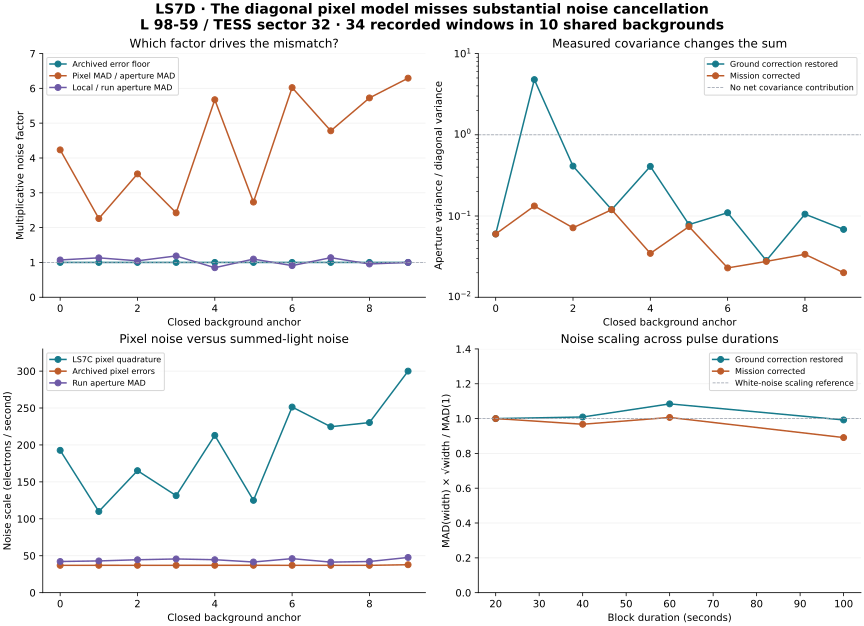

# LS7D result: spatial covariance explains a major part of the noise mismatch

12 September 2026. **The closed-data diagnosis finds strong cancellation between
pixel fluctuations that LS7C's diagonal noise model cannot represent.** Archived
FLUX_ERR floors have negligible influence on the discrepancy, and local versus
run-level aperture noise is a much smaller effect. This identifies a concrete
model limitation; no revised detector has been qualified and no LS candidate
is promoted.

## Evidence and exact scope

The calculation reuses the **120 nominal matched-signal records** from the
completed, prospectively frozen LS7C sector 32 challenge. They map to **34 distinct
recorded event windows in ten backgrounds**. Sidebands within a background
overlap, so even 34 windows are not 34 independent observations. All 120 prior
noise ratios and original spatial decisions reproduce. The original **42/120**
nominal spatial passes and the full **1,460-trial qualification failure** remain
unchanged. This work adds no digital injections or sky coverage.

The [diagnostic protocol](../LS7D_NOISE_PROTOCOL.md) and code were frozen locally
at `13ab25a` before these calculations. LS7D is a retrospective diagnosis, with
no claim of public preregistration or independent validation. The two sector 32
FITS files retain their original hashes and compatible electron-per-second
units. All prior code and output manifests remain intact.

## The ratio separates into three measurable terms

Let Qmax denote LS7C's quadrature of per-pixel noise, Qmad the quadrature using
only the pixel first-difference MAD, L the local aperture first-difference MAD,
and R the original run-level aperture MAD. Each recorded ratio obeys

`Qmax/R = (Qmax/Qmad) × (Qmad/L) × (L/R)`.

| Quantity | Median over 120 trial links | Median over 34 unique windows |
|---|---:|---:|
| Original spatial/aperture noise ratio, Qmax/R | 4.663 | 4.774 |
| Archived error-floor factor, Qmax/Qmad | 1.000 | 1.000 |
| Marginal pixel MAD / aperture MAD, Qmad/L | 4.618 | 4.795 |
| Local / run aperture MAD, L/R | 1.050 | 1.034 |

The largest archived-error contribution is only **0.0083%** in the noise ratio.
The local/run factor ranges **0.830–1.192**. The dominant mismatch is between
individual-pixel fluctuations combined diagonally and fluctuations in their
actual sum. The second factor itself is not a covariance estimator: marginal
MAD scales are not additive. The separate covariance calculation below supplies
direct evidence of cross-pixel cancellation. Products of marginal medians need
not equal the median total ratio.

The archived pixel-error quadrature is about **37.0 electrons/s**, compared with
a trial-weighted median LS7C pixel-noise quadrature of **202.5 electrons/s**.
Across unique windows, the median simultaneous pixel-error quadrature divided
by archived SAP_FLUX_ERR is **0.961**, with window medians **0.949–0.962**. These
columns are reasonably similar in scale; this is not an independent validation
of their calibration or a reason to substitute them for measured covariance.

## Direct covariance accounting confirms cancellation

For each sideband pair, compute `C = cov(pixel first differences)/2` using
every difference, including restored outliers. No difference crosses the event
gap. Save each 18×18 aperture matrix and check its sum against a separate scalar
variance of the summed differences.

| Difference-domain statistic | Restored pixels | Mission-corrected pixels |
|---|---:|---:|
| Unique windows with negative net cross-covariance | 31/34 | 34/34 |
| Median aperture variance / diagonal variance, trial weighted | 0.1064 | 0.04720 |
| Median aperture variance / diagonal variance, unique windows | 0.1081 | 0.03471 |
| Full range of aperture variance / diagonal variance | 0.0272–4.7874 | 0.0194–0.1346 |

For the corrected data, the trial-weighted median aperture variance is only
**4.72%** of the sum of the individual pixel variances. Negative cross terms
cancel much of the marginal variation. Restored cosmic-ray contributions can
alter that balance sharply: three unique windows instead have positive net
cross terms, including a variance ratio above four. A single global noise
rescaling would ignore these differences and the spatial directions of the noise.

This establishes a limitation of the diagonal approximation on these sidebands.
It does not establish whether spacecraft motion, calibration or another process
causes the correlations. Nor does it prove that every lost LS7C signal would
be recovered by including covariance.

## A direct full-stamp covariance inverse is not available here

All windows have **121 valid stamp pixels** but only **108 within-sideband
difference vectors**. Their centered sample covariance has rank at most **107**.
A direct 121-dimensional inverse is therefore singular. Any future covariance
model needs explicit regularization, dimensional reduction or additional
training context, with its behavior checked on separate backgrounds.

The difference-domain covariance is also not the covariance of the actual
event mean minus sideband median. Temporal correlations, median-reference
uncertainty and restored contamination still need treatment. Replacing the
old diagonal matrix with this singular matrix would not solve those issues.

## Pulse-duration diagnostics

For block widths 1/2/3/5 cadences, compare the aperture MAD of adjacent block
means with the white-noise `1/sqrt(width)` reference. Blocks stay within each
sideband; every unused tail sample is accounted for.

At 100 seconds, the unique-window median ratio to white-noise scaling is
**0.992** for restored data and **0.891** for corrected data. Individual windows
span **0.530–1.770** and **0.530–1.683**, respectively. The short sidebands and
shared windows preclude a precision claim about temporal whiteness. A median
near one is not sufficient calibration of the detection statistic.

The first three panels show medians within each of ten anchors. The final
panel shows medians across the 34 unique recorded windows, without an independence
assumption. Lines connect the diagnostic points; no trend fit is used.

## Concrete continuation

Develop the next spatial model on **closed sectors 28/29/32**. Plan one combined
experiment that addresses:

1. A noise model retaining relevant cross-pixel modes, with fixed regularization
   and training/assessment separation by background. Estimate noise for the
   actual event-minus-reference statistic; do not merely divide scores by 4.66.
2. Local stellar excess coexisting with unrelated sparse residual pixels. Keep
   those backgrounds in the denominator and evaluate both losses and leakage.
3. Compact 2×2 and extended detector contamination beyond the fitted nuisance
   templates, plus physically bounded pointing controls with explicit signs.

Carry the original temporal threshold and all reference outcomes into the
comparison. Require recovery and nuisance rejection jointly before freezing
another independent-sector evaluation. LS7C's failure remains closed; LS7D
does not change a threshold or adopt a detector.

## Audit and reproducibility

Eight analytical implementation tests pass, including an exact covariance
matrix, perfect common-mode and anticorrelated examples, gap protection,
unit scaling and error-floor separation. The separate scalar ledger auditor
checks **120 trial links**, **34 windows**, **68 covariance matrices**, every
original spatial decision and **22 hash checks**. Maximum matrix/scalar variance
disagreement is **5.82×10⁻¹¹ (electrons/s)²**; maximum ratio-factorization error
is **8.88×10⁻¹⁶**. Passing these checks is accounting validation, not scientific
detector qualification.

The extraction additionally checks all earlier scientific freezes and both
original LS7C output manifests before and after array analysis. Environment:
Python 3.12.14, NumPy 2.2.6, SciPy 1.15.3, Astropy 7.0.2, Matplotlib 3.10.3.

- [Full numerical summary](summary.json)
- [All 34 windows, pixel scales and covariance matrices](windows.json)
- [All 120 links to original trials](trial_links.json)
- [Source identities](source_manifest.json), [audit](AUDIT.json), [checksums](SHA256SUMS)
- [Frozen extractor](../scripts/ls7d_noise_diagnostic.py), [scalar auditor](../scripts/ls7d_review.py)

NASA documents that recorded ground cosmic-ray corrections can be restored
to 20-second target-pixel products. That processing fact supports the stream
comparison, without establishing covariance or uncertainty calibration:
[NASA cosmic-ray primer](https://heasarc.gsfc.nasa.gov/docs/tess/TESS-CosmicRayPrimer.html).

Publication identities and the distinction between the two historical LS7C
snapshots are recorded in [continuation notes](../LS7D_CONTINUATION.md).
