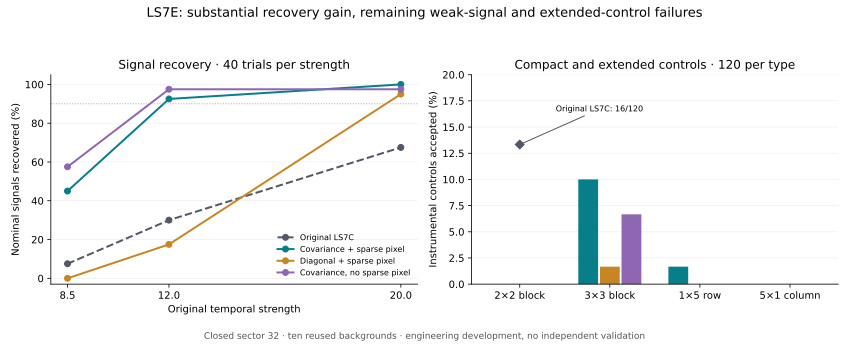

# LS7E: covariance and sparse residuals improve recovery, but the joint requirements still fail

12 September 2026. **The combined prototype recovers substantially more digital
stellar pulses and rejects the original compact controls. It still loses too
many weak signals and accepts some extended contamination. No detector is
adopted and no astronomical candidate is promoted.**

This is development on the already closed **L 98-59 TESS sector 32**. All
**3,180 paired trials** share the ten original backgrounds. The comparison
adds no observing coverage and does not revise LS7C's prospectively obtained
qualification failure. All 1,460 original temporal scores and selected windows
reproduce exactly; the original spatial outcomes remain in the paired ledger.

## The model addresses the limitations identified by LS7D

The prototype estimates covariance for the actual event mean minus sideband
median, using only the other nine backgrounds when assessing one background.
Each of 30 folds uses 45 overlapping event-statistic vectors and fixed 5%
diagonal shrinkage. This avoids inversion of the singular 121-pixel matrix and
retains cross-pixel correlations in the 18-pixel optimal aperture. Neither the
training samples nor the folds are independent validation observations.

Each stellar and nuisance hypothesis can fit one additional arbitrary aperture
pixel with the same fixed penalty. Pixels outside the optimal aperture no
longer enter a global residual veto. The nuisance bank includes every
overlapping 2×2 block, as well as single pixels, uniform changes and the original
pointing templates. The original temporal threshold remains 8. The new spatial
statistics retain the numerical gates 5, 2 and 9 as engineering choices; they
are not significance or probability estimates.

The configuration was fixed locally at
`70e9ee5cb81dbfebee4a0b4b5cf0de4ba77f18e3` before extraction.
The [protocol](../LS7E_JOINT_PROTOCOL.md), [configuration](../config/ls7e_joint.json)
and [source checksums](../LS7E_FREEZE.sha256) define the comparison. The
[source Git bundle](../publication_records/2026-09-12/ls7e_source.bundle)
preserves that exact local commit against the preceding public branch head.
Publication of this completed retrospective experiment is not preregistration.

## Nominal stellar recovery improves

Each cell contains 40 trials at the same original temporal strength.

| Temporal strength | Original LS7C | Covariance + sparse pixel | Diagonal + sparse pixel | Covariance without sparse pixel |
|---|---:|---:|---:|---:|
| 8.5 | 3/40 | **18/40** | 0/40 | 23/40 |
| 12 | 12/40 | **37/40** | 7/40 | 39/40 |
| 20 | 27/40 | **40/40** | 38/40 | 39/40 |

The full prototype also recovers **60/60** fixed 10%-flux single pulses,
compared with the original 44/60. For displaced stellar profiles it recovers
83/160, 153/160 and 159/160 at strengths 8.5, 12 and 20. The corresponding
original outcomes are 10/160, 50/160 and 112/160.

The controlled covariance/diagonal comparison supports retaining correlations
in this prototype: with the same aperture, templates and sparse option, nominal
recovery at strength 12 changes from 7/40 to 37/40. The full improvement relative
to LS7C also includes a different fit domain and nuisance model; it must not all
be attributed to covariance alone.

The weak-signal requirement remains unmet. All **22** nominal failures at 8.5
fail the stellar-versus-nuisance separation gate; two also fail the amplitude
gate. None fail the residual gate. The remaining weak-end limitation is thus
primarily model separation in this comparison, not the old global residual veto.

The bars aggregate strengths for display. The tables and ledger retain each
strength separately; the joint requirement applies to individual cells.

## Original compact controls are rejected; broader controls expose leakage

The covariance-plus-sparse prototype accepts **0/120** original 2×2 controls,
versus LS7C's 16/120. It also accepts 0/120 single-pixel, 0/120 uniform and
0/240 original strength-matched pointing controls. These cases all cross the
temporal threshold. All three new methods reject these original control sets.

The new extended patterns are absent from the fitted nuisance bank. Every one
of their 360 trials reaches its intended temporal strength.

| Extended pattern | Strength 8.5: accepted / 40 | Strength 12: accepted / 40 | Strength 20: accepted / 40 |
|---|---:|---:|---:|
| 3×3 block | **4/40** | **8/40** | 0/40 |
| 1×5 row | 2/40 | 0/40 | 0/40 |
| 5×1 column | 0/40 | 0/40 | 0/40 |

The 3×3 block leakage is 10% and 20% in the first two cells, above the 5%
development requirement. Rejecting the fitted 2×2 class therefore does not
establish general compact/extended contamination rejection.

The separate physically bounded pointing suite uses reference-image shifts of
0.05 or 0.2 pixel with multiplier exactly one, instead of amplifying a pointing
pattern until it reaches a chosen temporal score. **154/320** cross the temporal
threshold and **0/154** of those pass any prototype. The other 166 trials do not
test spatial rejection. These are digitally displaced reference images, not a
complete spacecraft-motion or detector simulation.

## The sparse option helps when a stellar event contains another bad pixel

The 1,040 stress trials add one positive or negative pixel to the original
nominal stellar, 2×2 and null cases. The added magnitude is fixed from the
training-only event-noise model. The table shows stellar cases with the extra
pixel **inside** the aperture; each denominator is 80.

| Parent strength | Cross temporal threshold | Covariance + sparse pixel | Diagonal + sparse pixel | Covariance without sparse pixel |
|---|---:|---:|---:|---:|
| 8.5 | 40/80 | 23/80 | 0/80 | 0/80 |
| 12 | 80/80 | **78/80** | 19/80 | 2/80 |
| 20 | 80/80 | **79/80** | 75/80 | 2/80 |

The strongest gains here require the explicit sparse option. At strength 8.5,
negative contamination pushes half the cases below the unchanged temporal
threshold; these losses remain in the denominator. Outside-aperture stress
leaves this prototype's input unchanged and reproduces each parent's decision.
That is a consequence of its fit domain, not new sensitivity evidence.

All **480** stressed 2×2 controls are rejected; 440 cross the temporal threshold.
All 80 stressed null cases remain below threshold, so their zero acceptance
does not demonstrate spatial rejection of a strong isolated artifact. No trial
is baseline-confounded. Digital injections add no extra photon shot noise and
do not establish physical laser sensitivity or astrophysical completeness.

## Verification

- Eight analytical tests pass, including an exact stellar-plus-residual case,
  covariance cancellation, unit/pixel invariance, and exclusion of the assessed
  background from covariance estimation.
- A separate scalar covariance calculation checks all **30 folds**; maximum
  entry disagreement is 4.44×10⁻¹⁶ in normalized units.
- Independent whitened least squares checks **19,080 winning fits** and searches
  **101,400 alternatives** over one fixed representative from each of the
  40 background/suite combinations. Maximum objective disagreement is 9.31×10⁻⁹.
- Every one of the 3,180 acceptance decisions and all reported summary cells
  are audited. All **1,460 original temporal scores match exactly** and their
  original spatial decisions remain unchanged.
- Original FITS identities and LS7/LS7B/LS7C/LS7D scientific/result manifests
  pass the extraction preflight. The pinned inputs are checked again afterwards.

Environment: Python 3.12.14, NumPy 2.2.6, SciPy 1.15.3, Astropy 7.0.2,
Matplotlib 3.10.3. All methods fail at least one original matched-strength
requirement. Passing implementation checks does not qualify a detector.

## Concrete continuation

Keep LS7E closed and retain its parameters and full paired comparison.
The useful next question is how well weak stellar profiles can be distinguished
from compact and extended image changes after fitting an unrelated pixel.
Use the saved event vectors and covariance matrices for a joint separation
study, including broad controls and explicit accounting of signal losses.
Adding 3×3 templates or relaxing a margin without checking that tradeoff is not
a demonstrated repair. Any subsequent transfer comparison should first use
another already closed sector under its own fixed protocol. No new sector,
threshold adjustment, native-candidate promotion or M43 panel opening follows
from this result.

- [Full summary](summary.json), [audit and per-background outcomes](AUDIT.json)
- [All 3,180 paired trials, event vectors and decisions](trials.jsonl.gz)
- [Every fitted model](models.json), [training vectors and fold matrices](training.json)
- [Source identities](source_manifest.json), [output checksums](SHA256SUMS)
- [Extractor](../scripts/ls7e_joint_development.py), [independent auditor](../scripts/ls7e_review.py)
- [Continuation](../LS7E_CONTINUATION.md)
