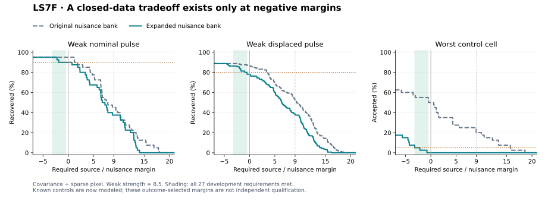

# LS7F: broader nuisance models expose a conditional development tradeoff

13 September 2026. **The expanded nuisance bank removes all matched control acceptances at the old margin 9, but loses additional stellar tests. All 27 development requirements can be met together only after allowing negative margins, where a nuisance fit may be better than the stellar fit. No detector is adopted and no astronomical candidate is promoted.**

This study reuses all **3,180 saved LS7E trials**, spanning **ten shared L 98-59 sector-32 backgrounds**. There are **zero new injections and zero added observing days**. It does not rerun or revise the earlier LS7C qualification. The enlarged bank and tradeoff sweep were fixed before LS7F scoring, but were motivated by already known LS7E failures: this is retrospective development.

## What changed

Add **108 rectangular nuisance templates**: every intersecting 3×3, 1×5 and 5×1 placement in the 11×11 stamp. Partial overlaps and duplicate aperture projections are retained. The original 18-pixel aperture, stellar fits, 94 model contexts, covariance folds, temporal selection, source/residual gates and optional sparse-pixel penalty are unchanged. Both full-covariance methods are compared, with and without the sparse option.

All **12,720** replayed original fit checks reproduce exactly in the recorded LS7F runtime. The original nuisance templates remain in the expanded bank. Because this can only reduce the source/nuisance margin, it cannot improve recovery at the same threshold.

## Keeping margin 9 removes controls and loses signals

Counts below use the covariance-plus-sparse method. Nominal denominators are 40 per strength; displaced denominators are 160.

| Strength | Nominal: original → expanded | Displaced: original → expanded | 3×3 controls: original → expanded |
|---|---:|---:|---:|
| 8.5 | 18/40 → 15/40 | 83/160 → 61/160 | 4/40 → 0/40 |
| 12 | 37/40 → 34/40 | 153/160 → 131/160 | 8/40 → 0/40 |
| 20 | 40/40 → 40/40 | 159/160 → 159/160 | 0/40 → 0/40 |

At this unchanged threshold, every one of the **600 original matched controls and 360 extended controls** is rejected. All crossed the temporal screening threshold in LS7E. The added rectangles now explicitly model the previously omitted extended shapes; this does not establish rejection of unmodeled artifacts.

The expanded bank loses **74** previously recovered stellar trial rows at margin 9: 53 original replay rows, 9 inside-aperture stress rows and 12 outside-aperture stress rows. These include shared/identical backgrounds, not independent losses. Each loss flag and trial ID is retained in the feature ledger.

For stellar pulses with an extra inside-aperture pixel, fixed-9 recovery changes from 23/80, 78/80, 79/80 to **18/80, 74/80, 79/80** across strengths 8.5, 12 and 20. The unchanged weak negative-pixel cases remain below the temporal threshold. Without the sparse option, corresponding expanded-bank counts remain 0/80, 2/80 and 2/80. The sparse mechanism still addresses a distinct residual problem.

## Exhaustive threshold accounting

Every distinct eligible margin is evaluated, with ties handled together, the unchanged 9 included explicitly, and a final reject-all sentinel. All other gates stay fixed. The **27 cells** require nominal ≥36/40 and displaced ≥128/160 at each of three strengths, plus ≤5% acceptance in each of 21 original/extended control cells. Fixed-flux, stress, null and bounded-pointing trials retain separate full descriptions.

| Method / bank | Evaluated cut positions | Positions meeting all 27 requirements |
|---|---:|---:|
| Covariance + sparse pixel / original | 1,075 | **0** |
| Covariance + sparse pixel / broad | 1,073 | **26** |
| Covariance without sparse pixel / original | 805 | **0** |
| Covariance without sparse pixel / broad | 805 | **6** |

With the original nuisance bank, **no threshold** satisfies the joint requirements in either method. For example, the first enumerated control-safe sparse margin is 15.7364, which recovers only **3/40** weak nominal and **17/160** weak displaced trials. The last signal-safe original margin, 1.84628, accepts **14/40** weak 3×3 controls. A simple relaxation of the original margin therefore cannot meet the joint requirements.

With the expanded bank, the following exact feasible intervals describe the recorded floating-point scores; the lower boundary is open and the upper boundary closed. Printed decimals are summaries; use the full JSON values for exact decisions.

| Method | Feasible margin interval on the closed records |
|---|---|
| Covariance + sparse pixel | (-3.188797044, -0.515808971] |
| Covariance without sparse pixel | (-3.188797044, -2.500599401] |

The first enumerated control-safe expanded sparse margin is **-2.981392**. It recovers **38/40, 40/40 and 40/40** nominal pulses and **138/160, 160/160 and 159/160** displaced pulses. It accepts **2/40 weak 2×2 controls and 2/40 weak 3×3 controls**, with zero accepted cases in the other 19 core control cells. This is an outcome-selected diagnostic endpoint, not a chosen search threshold.

**The entire feasible interval is negative.** The margin is `best nuisance objective − best stellar objective`, so a negative margin allows some accepted cases whose nuisance model fits better. At a nonnegative margin of 0, the expanded sparse method recovers **36/40** weak nominal pulses but only **125/160** weak displaced pulses, below the required 128. Without the sparse option, these counts are 35/40 and 121/160. Thus this exercise does not show that all required weak events favor a stellar origin.

The figure displays weak strength 8.5 and the worst acceptance fraction over all 21 control cells for the sparse method. The shaded interval satisfies **all six signal and 21 control requirements**, including the stronger cells retained in the tables and complete sweep. The displayed margin range is a zoom; the machine-readable sweep includes every cut position.

## Verification and limits

- Six analytical tests pass: geometry, tied boundaries, eligibility, empty eligible sets, a known signal-loss example and nuisance-template rescaling.
- Independent direct whitened least squares checks **12,720** stellar/new winning fits; maximum absolute disagreement is 1.3e-08.
- Independent QR-based enumeration checks **6,868,800** rectangle/pixel alternatives across every trial and both methods; maximum minimum-objective disagreement is 2.05e-08.
- Independent Boolean accounting checks all **101,466** threshold/cell counts, every endpoint accepted/rejected/lost ID, and every descriptive/per-background count.
- Historical freeze/result manifests pass before and after scoring. All prior LS7C/LS7E decisions are preserved, and M43 held-out panels remain unopened.

Source freeze **`6f70ebcdc41d956524f395e1f6a3ffa99a35e308`** was published before LS7F extraction. Runtime: Python 3.12.14, NumPy 2.3.5, SciPy 1.17.0; the figure uses Matplotlib 3.10.8. The source freeze and passed code audit do not make these previously seen data an independent evaluation.

There are only ten shared backgrounds. The rectangle controls are digital, post-mission-processing cases without added photon noise. Their acceptance fractions are not calibrated false-alarm probabilities, astrophysical completeness or laser-population limits. The 18-pixel fit cannot resolve all full-image spatial ambiguities.

## Concrete continuation

LS7F identifies a testable expanded-bank tradeoff and rules out repairing the original bank by changing its margin alone. Keep every result closed. The next useful step is a **separately frozen transfer comparison on already closed sector 29**, with any outcome-selected margin explicitly labeled as development, broad and additional unmodeled nuisances, inside-aperture residual stress and the nonnegative-margin comparison reported alongside it. Freeze the rule and transfer-specific training/eligibility plan before inspecting transfer outcomes. Do not treat a negative-margin acceptance as identification of a stellar or artificial source. No independent sector is warranted for qualification from LS7F alone.

- [Protocol](../LS7F_SEPARATION_PROTOCOL.md), [configuration](../config/ls7f_separation.json), [source freeze](../LS7F_FREEZE.sha256)
- [Summary and per-background counts](summary.json), [all threshold counts](sweeps.json), [endpoint case certificates](certificates.json)
- [All 3,180 feature rows and paired losses](features.jsonl.gz), [rectangle templates](bank.json), [independent audit](AUDIT.json)
- [Source identities](source_manifest.json), [output checksums](SHA256SUMS), [continuation](../LS7F_CONTINUATION.md)
