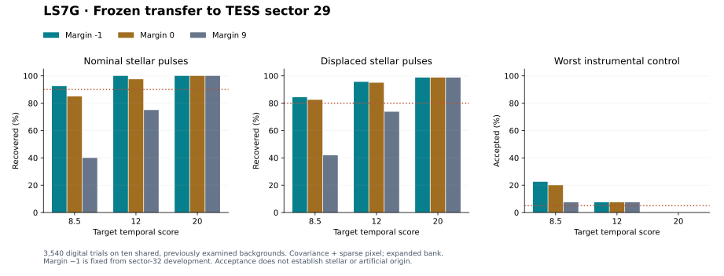

# LS7G: fixed transfer of the expanded TESS model to sector 29

**Primary joint development result: FAIL. No detector is adopted and no astronomical candidate is promoted.**

All **3,540** fixed digital trials completed on the ten previously examined L 98-59 sector-29 backgrounds. The primary rule is covariance plus an optional sparse pixel, an expanded nuisance bank and a margin of **−1**, chosen from sector-32 LS7F development before this transfer. Margins 0 and 9, the original bank and the no-sparse ablation are retained. There is no sector-29 retuning, independent qualification, native candidate search or added observing coverage.

## Nominal and displaced recovery

| Target score | Nominal, margin −1 | Nominal, margin 0 | Nominal, margin 9 | Displaced, margin −1 | Displaced, margin 0 | Displaced, margin 9 |
|---|---:|---:|---:|---:|---:|---:|
| 8.5 | 37/40 | 34/40 | 16/40 | 135/160 | 132/160 | 67/160 |
| 12 | 40/40 | 39/40 | 30/40 | 153/160 | 152/160 | 118/160 |
| 20 | 40/40 | 40/40 | 40/40 | 158/160 | 158/160 | 158/160 |

Each strength requires at least **36/40** nominal and **128/160** displaced recoveries. Temporally missed, unmatched and baseline-confounded cases stay in their denominators.

## Original, modeled and omitted control shapes

Primary-rule counts follow; each individual kind/strength cell permits at most 5% acceptance. The 3×3, 1×5 and 5×1 patterns are modeled. The cross, ring and triangle are omitted as named fit shapes; some aperture projections can nevertheless resemble or coincide with modeled shapes.

| Suite / kind | Score 8.5 | Score 12 | Score 20 |
|---|---:|---:|---:|
| base / single_pixel | 0/40 | 0/40 | 0/40 |
| base / block_2x2 | 4/40 | 0/40 | 0/40 |
| base / uniform | 0/40 | 0/40 | 0/40 |
| base / pointing | 0/80 | 0/80 | 0/80 |
| known_extended / block3x3 | 2/40 | 0/40 | 0/40 |
| known_extended / row1x5 | 0/40 | 0/40 | 0/40 |
| known_extended / column5x1 | 0/40 | 0/40 | 0/40 |
| unmodeled_shapes / cross3x3 | 8/40 | 2/40 | 0/40 |
| unmodeled_shapes / ring3x3 | 0/40 | 0/40 | 0/40 |
| unmodeled_shapes / triangle3x3 | 9/40 | 3/40 | 0/40 |

**4/30** primary control cells exceed their declared allowance. Control counts reuse ten backgrounds and are not false-alarm probabilities. Every tuning success/failure and screening count is retained in the ledger.

## All fixed rule outcomes

| Method / bank / margin | Joint descriptive gate |
|---|---|
| covariance_sparse/original/-1 | FAIL |
| covariance_sparse/original/0 | FAIL |
| covariance_sparse/original/9 | FAIL |
| covariance_sparse/broad/-1 | FAIL |
| covariance_sparse/broad/0 | FAIL |
| covariance_sparse/broad/9 | FAIL |
| covariance_plain/original/-1 | FAIL |
| covariance_plain/original/0 | FAIL |
| covariance_plain/original/9 | FAIL |
| covariance_plain/broad/-1 | FAIL |
| covariance_plain/broad/0 | FAIL |
| covariance_plain/broad/9 | FAIL |

The joint gate includes all 36 core cells, matched strengths, fixed 10% single-pulse recovery, base nulls, confounding and acceptance of screened physically bounded pointing. The primary failed subrequirements are: **all_core_cells**.

## Residual stress, pointing and ambiguity

| Parent target score, inside-pixel stress | Cross temporal threshold / 80 | Primary recovered / 80 |
|---|---:|---:|
| 8.5 | 40/80 | 35/80 |
| 12 | 80/80 | 74/80 |
| 20 | 80/80 | 76/80 |

Of 320 physically bounded pointing trials, **119** cross the temporal threshold; **0** are accepted by the primary rule. Subthreshold cases do not demonstrate spatial rejection.

The primary rule loses **0** stellar trial rows recovered by the same method with the original bank and margin 9. All IDs are retained; aggregate recovery gains do not erase individual losses.

**21** accepted primary-rule rows have a better nuisance than stellar fit: **17** injected stellar/displaced rows and **4** non-signal rows. They are explicitly listed with their margins. A negative-margin acceptance does not identify a stellar, laser or artificial source.

## Provenance, covariance and verification

The exact original MAST product hashes and LS7B eligibility reproduce. The **21-pixel** sector-29 aperture and **19.662037** already searched cadence-days are used. Run noise reproduces the archived LS7B values. Each of 30 width/background covariance folds uses 45 event-statistic vectors from the other nine backgrounds, with fixed 5% diagonal shrinkage. The full model contexts, 150 training vectors and original restored background extracts are published. No sector-32 covariance or mask is imported.

- Five analytical tests and the complete **3,540-case artificial smoke fixture** pass; the latter is explicitly not telescope evidence.
- The independent auditor reconstructs all **3,540** trial event vectors and temporal decisions, all injection patterns and all 30 covariance folds.
- **21,240** direct whitened fits and **19,947,900** independent alternative fits pass.
- Maximum event-vector error: 0; temporal-score error: 0; direct-fit error: 2.47e-10.
- Every group, fixed-rule gate and **360** background/cell counts is checked. Historical manifests remain unchanged.

Source freeze: `4ca4d558a79d72ceec45a9ab482820b92dd45512`. Runtime: python 3.12.14, numpy 2.3.5, scipy 1.17.0, astropy 7.0.2, matplotlib 3.10.8.

The source freeze was public before this transfer, but sector 29 had already been inspected in LS7B and historical LS7C development. This result is not an independent test on unseen data. Digital injections occur after mission processing and add no photon shot noise. No physical laser sensitivity, astrophysical completeness, population limit or detection claim follows.

## Continuation

Keep this transfer closed. Diagnose the failed cells using the saved background extracts, separating temporal/source-score losses, covariance scaling, residual failures and morphology ambiguity. Use the existing records for that diagnosis; do not rerun or retune LS7G or open another observing sector merely because this transfer failed.

- [Frozen protocol](../LS7G_TRANSFER_PROTOCOL.md), [configuration](../config/ls7g_transfer.json), [source checksums](../LS7G_FREEZE.sha256)
- [Summary and per-background outcomes](summary.json), [all trials](trials.jsonl.gz), [audit with loss and ambiguity IDs](AUDIT.json)
- [Background extracts](backgrounds.npz), [training and folds](training.json), [all model templates](models.json), [injection patterns](patterns.json)
- [Source identities](source_manifest.json), [output checksums](SHA256SUMS), [continuation](../LS7G_CONTINUATION.md)
