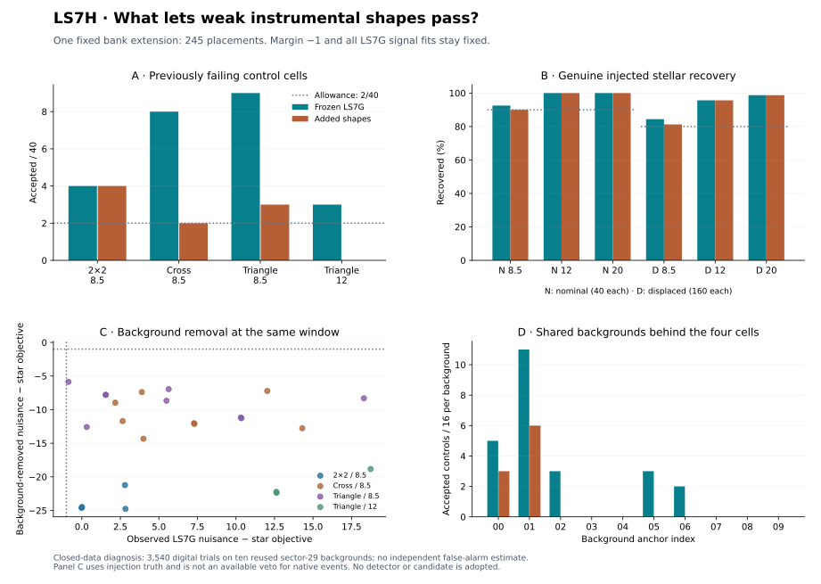

# LS7H: weak instrumental morphology, native background and signal cost

**The one fixed shape-bank extension FAILS the inherited joint descriptive gate. No detector or candidate is adopted.**

All **3,540 saved LS7G trials** are diagnosed at their original selected time windows. Adding **245** cross, ring and four-rotation triangle placements leaves **2/30** control cells and **0/6** stellar-recovery cells failing. It loses **10** previously recovered stellar trial rows across the full ledger. The source bank, covariance, sparse-pixel penalty, temporal outcomes and margin **−1** remain unchanged. There is one declared extension and no threshold sweep.

Of the **24** accepted controls in the four failing LS7G cells, **24** have a background-removed nuisance margin below −1 when both model banks are refitted. For these cases, the observed native contribution changes the same-window spatial comparison from rejection to acceptance. This is a conditional diagnostic using known injection truth; it is not a usable native-event veto or a noise probability. The extended bank leaves **9** accepted controls in these four cells.

## Four failing cells: missing templates and background effects

| Control / target score | LS7G accepted / 40 | Added shapes accepted / 40 | Accepted LS7G cases rejected by clean margin | LS7G accepted cases using a stellar sparse pixel | Plain ablation accepted / 40 |
|---|---:|---:|---:|---:|---:|
| block_2x2 / 8.5 | 4 | 4 | 4 / 4 | 4 / 4 | 0 |
| cross3x3 / 8.5 | 8 | 2 | 8 / 8 | 7 / 8 | 4 |
| triangle3x3 / 8.5 | 9 | 3 | 9 / 9 | 9 / 9 | 0 |
| triangle3x3 / 12 | 3 | 0 | 3 / 3 | 3 / 3 | 0 |

Each control cell permits at most **2/40** acceptances. The last column reuses LS7G’s already computed no-sparse method at margin −1; its full signal cost appears below. A 2×2 shape was already represented in LS7G, so an omitted shape family cannot by itself explain all transfer leakage. Different placements can have identical aperture projections. The augmented bank includes every in-stamp placement intersecting the 21-pixel aperture, retaining duplicates and four triangle rotations. The bank was selected as a development response to LS7G’s known failures, so this is not a fresh validation.

## Signal protection and complete control accounting

| Signal / target | LS7G | Added shapes | No-sparse ablation | Required |
|---|---:|---:|---:|---:|
| stellar / 8.5 | 37/40 | 36/40 | 35/40 | ≥36/40 |
| stellar / 12 | 40/40 | 40/40 | 37/40 | ≥36/40 |
| stellar / 20 | 40/40 | 40/40 | 37/40 | ≥36/40 |
| off_profile / 8.5 | 135/160 | 130/160 | 135/160 | ≥128/160 |
| off_profile / 12 | 153/160 | 153/160 | 139/160 | ≥128/160 |
| off_profile / 20 | 158/160 | 158/160 | 141/160 | ≥128/160 |

Each row keeps its full original denominator, including any temporal miss, confounding or strength failure. All six LS7G signal cells passed before this extension. Counts alone do not erase individual signal losses.

| Control kind | Score 8.5: LS7G → added | Score 12: LS7G → added | Score 20: LS7G → added |
|---|---:|---:|---:|
| single_pixel | 0 → 0 / 40 | 0 → 0 / 40 | 0 → 0 / 40 |
| block_2x2 | 4 → 4 / 40 | 0 → 0 / 40 | 0 → 0 / 40 |
| uniform | 0 → 0 / 40 | 0 → 0 / 40 | 0 → 0 / 40 |
| pointing | 0 → 0 / 80 | 0 → 0 / 80 | 0 → 0 / 80 |
| block3x3 | 2 → 2 / 40 | 0 → 0 / 40 | 0 → 0 / 40 |
| row1x5 | 0 → 0 / 40 | 0 → 0 / 40 | 0 → 0 / 40 |
| column5x1 | 0 → 0 / 40 | 0 → 0 / 40 | 0 → 0 / 40 |
| cross3x3 | 8 → 2 / 40 | 2 → 0 / 40 | 0 → 0 / 40 |
| ring3x3 | 0 → 0 / 40 | 0 → 0 / 40 | 0 → 0 / 40 |
| triangle3x3 | 9 → 3 / 40 | 3 → 0 / 40 | 0 → 0 / 40 |

| Rule at margin −1 | Joint gate | Failed subrequirements |
|---|---|---|
| ls7g | FAIL | all_core_cells |
| augmented | FAIL | all_core_cells |
| plain_ablation | FAIL | all_core_cells, ten_percent_single_recovery |

The inherited gate also checks matched strengths, ≥54/60 fixed 10%-flux single-pulse recoveries, zero base-null acceptances, ≤20% signal confounding and ≤5% acceptance among temporally screened bounded-pointing controls. All groups, sparse-stress cases and 360 background/cell counts are saved in [summary.json](summary.json).

### Every additional stellar loss

**10** rows recovered by LS7G become unrecovered with the added shapes. The acceptance set can only shrink: the old nuisance models remain available, and only the minimum nuisance objective changes. All new losses therefore occur at the nuisance-margin step, with temporal, source-score, residual and confounding decisions fixed.

| Suite / kind / target score | Lost recovered stellar rows |
|---|---:|
| base / off_profile / 8.5 | 5 |
| base / stellar / 8.5 | 1 |
| base / stellar / None | 2 |
| sparse_stress / stellar / 8.5 | 2 |

Complete lost stellar trial IDs

- `base_a03_p0_c16`
- `base_a03_p10_c16`
- `base_a05_p0_c13`
- `base_a08_p10_c06`
- `base_a08_p10_c12`
- `base_a08_p10_c12_outside_-1`
- `base_a08_p10_c12_outside_1`
- `base_a08_p10_c14`
- `base_a09_p0_c10`
- `base_a09_p10_c43`

### Disjoint recovery paths over all stellar rows

This table includes fixed-flux, matched nominal/displaced and sparse-stress stellar rows. The first failing condition is counted in the order temporal, source score, residual, margin, then confounding.

| Rule | Temporal | Source score | Residual | Nuisance margin | Confounded | Recovered |
|---|---:|---:|---:|---:|---:|---:|
| ls7g | 95 | 18 | 26 | 20 | 0 | 1161 |
| augmented | 95 | 18 | 26 | 30 | 0 | 1151 |
| plain_ablation | 95 | 39 | 271 | 11 | 0 | 904 |

## Exact same-window decomposition

For every trial the injected cube is reconstructed from its saved spatial pattern, integrated pulse, amplitude and any residual pixel. Let y be its signed selected-window mean-minus-sideband-median vector, b the same statistic of the native cube, and s = y − b. All counterfactual fits retain the recorded window, reference templates and covariance; neither temporal selection nor strength matching is repeated.

The largest difference between s and the event statistic of the injection-only cube is **2.00018e-12 e⁻/s per pixel**. This explicitly checks the possible nonlinearity of the sideband median; the code does not assume that medians add.

With the **observed** winning stellar and nuisance designs and active source-amplitude sets fixed, let D be the difference between their residual precision matrices. The recorded margin is exactly

$$m=s^T D s+b^T D b+2b^T D s+(P_n-P_s).$$

The three terms separate the injected shape, native background and their interaction; the last term is the difference in the unchanged sparse-pixel penalties. This is a conditional algebraic attribution of an already selected winner, not a new fitted classifier. Separately, both banks are genuinely refitted to s to obtain the clean margins above, allowing a different winner or active amplitude constraint.

| Failing cell | Median shape term | Median background term | Median interaction term | Median penalty difference |
|---|---:|---:|---:|---:|
| block_2x2 / 8.5 | -16.587 | -7.392 | 25.865 | 0.000 |
| cross3x3 / 8.5 | -2.010 | -0.344 | 9.648 | 0.000 |
| triangle3x3 / 8.5 | -7.798 | -0.102 | 14.553 | 0.000 |
| triangle3x3 / 12 | -12.582 | -4.160 | 29.375 | 0.000 |

These column medians need not sum to a median margin. The identity is checked trial by trial in the ledger.

## All accepted controls from the four original failures

The paired signal ledger links each of these controls to the five nominal/displaced stellar trials with the same anchor, phase, pulse duration and target temporal score. These pairs share backgrounds and can overlap across control families; they are not additional independent samples.

| Trial ID | LS7G margin | Clean LS7G margin | Added-shape margin | Added shapes accept? |
|---|---:|---:|---:|---|
| `base_a00_p0_c18` | 2.8004 | -21.2306 | 2.8004 | yes |
| `base_a00_p10_c48` | 2.8347 | -24.7633 | 2.8347 | yes |
| `base_a01_p0_c48` | 0.0141 | -24.4807 | 0.0141 | yes |
| `base_a01_p10_c48` | -0.0180 | -24.6204 | -0.0180 | yes |
| `unmodeled_shapes_a0_p0_box30_t8.5_cross3x3` | 12.0316 | -7.2198 | -4.6140 | no |
| `unmodeled_shapes_a1_p0_box30_t8.5_cross3x3` | 2.1683 | -8.9675 | -5.5600 | no |
| `unmodeled_shapes_a1_p0_box100_t8.5_cross3x3` | 7.2812 | -12.0157 | 0.0502 | yes |
| `unmodeled_shapes_a1_p10_box30_t8.5_cross3x3` | 2.6472 | -11.7012 | -14.6270 | no |
| `unmodeled_shapes_a1_p10_box100_t8.5_cross3x3` | 7.3065 | -12.1242 | -0.0708 | yes |
| `unmodeled_shapes_a2_p0_box30_t8.5_cross3x3` | 3.8923 | -7.3887 | -5.3671 | no |
| `unmodeled_shapes_a6_p0_box30_t8.5_cross3x3` | 14.3021 | -12.7687 | -8.7436 | no |
| `unmodeled_shapes_a6_p10_box30_t8.5_cross3x3` | 3.9996 | -14.3343 | -16.4740 | no |
| `unmodeled_shapes_a0_p0_box30_t8.5_triangle3x3` | 18.3001 | -8.3139 | -0.8696 | yes |
| `unmodeled_shapes_a1_p0_box30_t8.5_triangle3x3` | 5.4911 | -8.6719 | -7.2203 | no |
| `unmodeled_shapes_a1_p0_box100_t8.5_triangle3x3` | 10.3174 | -11.1760 | 1.2931 | yes |
| `unmodeled_shapes_a1_p10_box100_t8.5_triangle3x3` | 10.3541 | -11.2768 | 1.2012 | yes |
| `unmodeled_shapes_a2_p0_box100_t8.5_triangle3x3` | 5.6359 | -6.9470 | -23.8743 | no |
| `unmodeled_shapes_a2_p10_box100_t8.5_triangle3x3` | -0.8658 | -5.8662 | -20.7224 | no |
| `unmodeled_shapes_a5_p0_box100_t8.5_triangle3x3` | 1.5537 | -7.7980 | -21.3727 | no |
| `unmodeled_shapes_a5_p10_box30_t8.5_triangle3x3` | 0.3195 | -12.5845 | -27.4368 | no |
| `unmodeled_shapes_a5_p10_box100_t8.5_triangle3x3` | 1.5537 | -7.7980 | -21.3728 | no |
| `unmodeled_shapes_a0_p0_box30_t12_triangle3x3` | 18.7395 | -18.8358 | -12.8694 | no |
| `unmodeled_shapes_a1_p0_box100_t12_triangle3x3` | 12.6199 | -22.2268 | -11.5439 | no |
| `unmodeled_shapes_a1_p10_box100_t12_triangle3x3` | 12.6334 | -22.3690 | -11.7348 | no |

## Verification and limits

- Five known-answer tests check rotations/edge projections, signed partial-window residuals, sideband-median nonadditivity, sparse-design attribution and fixed-cut/confounding semantics.
- The independent audit reconstructs **3,540** component vectors and attributions, checks **14,160** direct whitened fits and **52,413,240** fit alternatives.
- It verifies every new acceptance, disjoint recovery path, stellar loss, control pair, 36 core cells and 360 background/cell counts. Maximum minimum-objective error: **1.86e-10**.
- LS7G’s unchanged temporal selection, covariance construction and original fits retain their prior independent audit, with all inputs and audit evidence checked by hash. They are not rerun as another challenge.
- Source freeze: `503a159f7bc3337f314565fc4858d130a524626d`. Runtime: python 3.12.14, numpy 2.3.5, scipy 1.17.0, matplotlib 3.10.8.

Sector 29 and the four failure cells were already inspected. These 3,540 digital rows reuse ten backgrounds; the counts are not independent rates or calibrated false-alarm probabilities. Background subtraction here requires injection truth. Digital signals are added after mission processing without added photon noise. The optical detector remains unqualified; there is no new observing coverage, physical sensitivity limit, native candidate search or evidence of an extraterrestrial signal. Earlier LS results and M43 held-out panels are unchanged.

## Continuation

Use this completed diagnosis to choose the next integrated model study. Any new model requires a separate freeze and joint signal/control accounting on the already closed sectors before an unseen evaluation. Do not change the LS7G or LS7H margin, silently remove difficult controls, or treat a truth-dependent background subtraction as an available detector feature. The maintained next action is in [PROJECT_STATUS.md](../PROJECT_STATUS.md).

- [Protocol](../LS7H_MORPHOLOGY_PROTOCOL.md), [configuration](../config/ls7h_morphology.json), [source checksums](../LS7H_FREEZE.sha256)
- [Complete new trial features](features.jsonl.gz), [added bank](bank.json), [paired signal decisions](paired_signals.json)
- [Summary, groups and all loss IDs](summary.json), [independent audit](AUDIT.json), [output checksums](SHA256SUMS)
