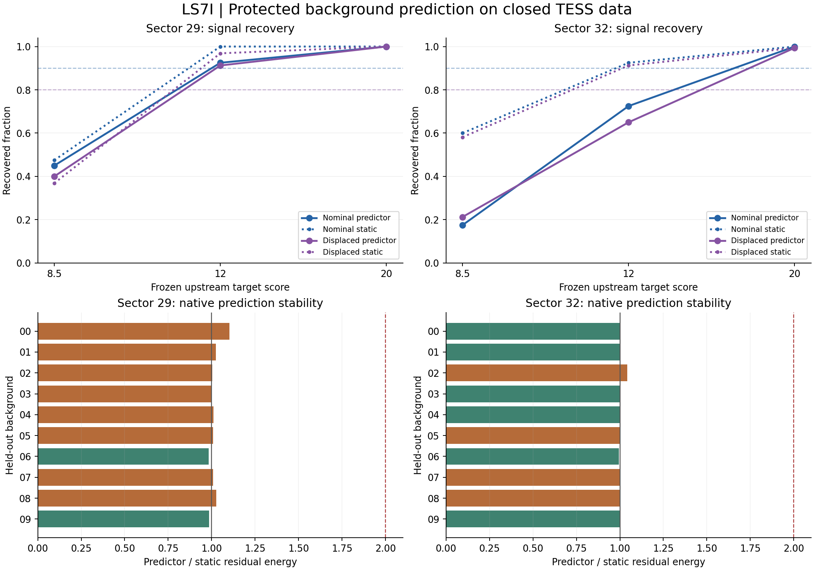

# LS7I: protected background prediction — FAIL

**The fixed model does not satisfy the joint two-sector requirements. The independent arithmetic audit passes. This is a completed negative method result; no detector is adopted and no unused sector is opened.**

LS7I completed **7,080 digital cases** on the two closed sectors: **6,720 historical cases plus a separately declared 360-case sector-32 shape supplement**. The primary rule fails **6/12 signal cells** and **2/60 control cells**. The joint development requirement is **FAIL**; the independent audit passes.

All cases reuse **twenty background contexts**. The model uses only the surrounding observable cadences; the pulse interval and five-cadence guards are protected. This adds no observing coverage, contains no blind native-candidate search, and does not measure physical laser sensitivity or an operational false-alarm rate.

Solid recovery curves show the primary predictor; dotted curves show the paired static ablation. The horizontal recovery requirements are 90% nominal and 80% displaced. Native bars compare both models using the same static covariance with a free uniform component projected out: values below one improve on static prediction; two is the maximum permitted for any single background.

## Joint result by sector

| Sector | Historical + supplement | Failed signal cells / 6 | Failed control cells / 30 | Trial gate | Native gate |
|---|---:|---:|---:|---|---|
| 29 | 3,540 + 0 | 2 | 0 | FAIL | FAIL |
| 32 | 3,180 + 360 | 4 | 2 | FAIL | FAIL |

The same six signal and thirty control cells apply to each sector. The new sector-32 cross/ring/triangle rows remain labeled `sector32_shape_supplement`; they do not change the original 3,180-row archive denominator.

## Signal recovery, including headroom

| Sector | Signal | Target | Primary recovered | Required | Headroom | Static recovered |
|---|---|---:|---:|---:|---:|---:|
| 29 | off_profile | 12 | 146/160 | 128 | +18 | 155/160 |
| 29 | off_profile | 20 | 160/160 | 128 | +32 | 160/160 |
| 29 | off_profile | 8.5 | 64/160 | 128 | -64 | 59/160 |
| 29 | stellar | 12 | 37/40 | 36 | +1 | 40/40 |
| 29 | stellar | 20 | 40/40 | 36 | +4 | 40/40 |
| 29 | stellar | 8.5 | 18/40 | 36 | -18 | 19/40 |
| 32 | off_profile | 12 | 104/160 | 128 | -24 | 146/160 |
| 32 | off_profile | 20 | 159/160 | 128 | +31 | 159/160 |
| 32 | off_profile | 8.5 | 34/160 | 128 | -94 | 93/160 |
| 32 | stellar | 12 | 29/40 | 36 | -7 | 37/40 |
| 32 | stellar | 20 | 40/40 | 36 | +4 | 40/40 |
| 32 | stellar | 8.5 | 7/40 | 36 | -29 | 24/40 |

Headroom counts rows above the requirement; a negative value is a failed cell. The ledger also retains fixed-flux, doublet, inside/outside residual-stress, duration and displacement groups. None are silently removed from signal-loss accounting.

## Every failed primary control cell

| Sector | Cohort / suite | Control | Target | Accepted | Allowed | Static accepted |
|---|---|---|---:|---:|---:|---:|
| 32 | historical / base | block_2x2 | 8.5 | 3/40 | 2 | 0 |
| 32 | historical / known_extended | block3x3 | 8.5 | 6/40 | 2 | 1 |

All 72 cells, their acceptance/recovery counts and all 720 per-background cell counts are in [summary.json](summary.json). Every row carries the temporal, source-score, residual and margin gates and the first-failure path.

## Retained joint checks

| Sector | Method | 10% single-pulse recovery / 60 (min 54) | Null accepted / 20 | Screened bounded pointing: accepted / screened | Confounded stellar rows | Other failed gates |
|---|---|---:|---:|---:|---:|---|
| 29 | conditional | 60/60 | 0/20 | 0/119 | 0/1320 | None |
| 29 | static | 60/60 | 0/20 | 0/119 | 0/1320 | None |
| 32 | conditional | 60/60 | 0/20 | 0/154 | 0/1320 | None |
| 32 | static | 60/60 | 0/20 | 0/154 | 0/1320 | None |

## Is the surrounding information useful?

| Sector | Native windows | Total energy ratio | Backgrounds improved / 10 | Worst background ratio | Native gate |
|---|---:|---:|---:|---:|---|
| 29 | 210 | 1.008294 | 2 | 1.102896 | FAIL |
| 32 | 210 | 1.001058 | 6 | 1.042017 | FAIL |

The fixed native prediction requirements do not pass on both sectors. The table and per-background ratios locate the observed benefit or instability. This limits the present cross-background ridge specification; it does not prove that all observable background models are impossible.

Native starts were fixed in advance and each whole assessed background was excluded from global training and covariance calibration. These 420 windows still share contexts and overlapping sidebands. No binomial independence, observing-rate estimate or native event promotion is inferred from them.

| Sector | Background | Conditional energy | Static energy | Ratio |
|---|---:|---:|---:|---:|
| 29 | 00 | 642.429145 | 582.493074 | 1.102896 |
| 29 | 01 | 501.567069 | 489.485340 | 1.024683 |
| 29 | 02 | 2339.178866 | 2329.023112 | 1.004361 |
| 29 | 03 | 2933.972897 | 2926.737297 | 1.002472 |
| 29 | 04 | 280.391347 | 277.215744 | 1.011455 |
| 29 | 05 | 423.932811 | 420.621342 | 1.007873 |
| 29 | 06 | 1335.145700 | 1358.245368 | 0.982993 |
| 29 | 07 | 358.440993 | 355.365492 | 1.008654 |
| 29 | 08 | 311.057746 | 303.000171 | 1.026593 |
| 29 | 09 | 388.541719 | 394.208769 | 0.985624 |
| 32 | 00 | 343.470875 | 343.702898 | 0.999325 |
| 32 | 01 | 189.762647 | 189.808651 | 0.999758 |
| 32 | 02 | 265.321031 | 254.622462 | 1.042017 |
| 32 | 03 | 175.176052 | 175.291216 | 0.999343 |
| 32 | 04 | 551.629927 | 552.010967 | 0.999310 |
| 32 | 05 | 374.040730 | 374.030324 | 1.000028 |
| 32 | 06 | 264.565975 | 265.841544 | 0.995202 |
| 32 | 07 | 408.128584 | 407.229549 | 1.002208 |
| 32 | 08 | 274.926659 | 274.581405 | 1.001257 |
| 32 | 09 | 2412.520594 | 2416.867920 | 0.998201 |

## Full signal cost against the frozen references

| Sector | Reference | Paired rows | Stellar recovered: reference → primary | Stellar losses | Stellar gains | Controls newly accepted | Controls newly rejected |
|---|---|---:|---:|---:|---:|---:|---:|
| 29 | ls7g_broad_minus1 | 3,540 | 1161 → 1007 | 174 | 20 | 2 | 33 |
| 29 | ls7h_augmented_minus1 | 3,540 | 1151 → 1007 | 165 | 21 | 2 | 16 |
| 29 | static | 3,540 | 1024 → 1007 | 32 | 15 | 2 | 4 |
| 32 | ls7f_broad_minus1 | 3,180 | 1178 → 821 | 365 | 8 | 16 | 0 |
| 32 | static | 3,540 | 1065 → 821 | 261 | 17 | 18 | 0 |

**Every lost stellar row** appears in [SIGNAL_LOSSES.md](SIGNAL_LOSSES.md). All changed row/reference pairs, including gains and control changes, appear in [changes.jsonl.gz](changes.jsonl.gz). A row can occur against more than one reference; those pair counts must not be presented as unique lost observations. Reference comparisons include all stellar fixed-flux and residual-stress rows. The new supplement has no historical reference; it enters the paired static comparison.

The static ablation uses the same training mean, templates and cuts, with its own independently calibrated residual covariance. Thus the trial comparison evaluates prediction plus the corresponding error model. The native energy comparison deliberately holds the metric fixed to isolate predictive improvement. Historical references additionally differ in local scale, training and nuisance coverage, so the full change must not be attributed to a single coefficient.

## Audit and inference boundary

- Eight synthetic known-answer tests pass. All **7,080** trial additions are zero in the prediction/reference bands; feature, reference and scale protection are exact.
- **780** observable training records, **330** ridge regressions and **60** nested outer folds were independently reconstructed. The ridge audit uses augmented least squares, not the predictor’s normal equations.
- No training or calibration fit includes the assessed background. Inner covariance predictions additionally exclude the predicted sample’s entire background. Final fits use nine backgrounds; inner fits use eight.
- **28,320** winning fits and **120,069,720** alternatives were checked with independent whitened least squares / QR. All templates, decisions, 72 cells, 720 background/cell counts and complete changed-row accounting pass.
- The sealed historical recipe, temporal and raw-FITS audit is reused by SHA-256. All 360 new supplement selections are independently enumerated. Historical upstream windows and screens stay fixed.
- The inference API receives only observable outside-event features plus the event response for fitting. Injection truth is restricted to construction and preservation checks. No truth-removed event vector enters prediction.

The empirical covariance, residual dof, negative nuisance margin and upstream score are descriptive engineering statistics. Reused contexts, training overlap, post-processed digital injections and the absence of new photon noise limit interpretation. A two-sector development result cannot establish an operational false-alarm probability or a physical transmitter limit.

## Decision and next work

Close this fixed ridge-prediction route. The next useful information would be an independently measured instrumental state: time-resolved image motion/centroid indicators and pixel variations outside the target aperture, together with a response model that preserves an injected stellar pulse. First establish whether those observables predict the remaining spatial contamination on these same closed contexts. A separately specified auxiliary-observable study is a proposed next project direction, not a hidden ridge, margin or template-bank retry. The present result alone does not establish that those extra observables will succeed.

The remaining plan work is consolidated in [the two-week result](../TWO_WEEK_REPORT_2026-09-14.md). The calendar dates were work estimates, not waiting periods; these computations ran during an explicitly started active session. No recurring job or unattended future analysis is implied.

Source freeze: `918797f2b33c1062a39c5360d2074700b075e17d`. [Execution and audit](https://github.com/andersenmartin-blip/setisearch/actions/runs/34766057139).

- [Frozen protocol](../LS7I_BACKGROUND_PROTOCOL.md), [configuration](../config/ls7i_background.json), [source hashes](../LS7I_BACKGROUND_FREEZE.sha256)
- [Verified inputs](../results_ls7i_inputs/REPORT.md), [training records](training.jsonl.gz), [regressions](regressions.jsonl.gz), [nested folds](folds.jsonl.gz)
- [Complete trial ledger](trials.jsonl.gz), [spatial frames](frames.jsonl.gz), [native windows](native_windows.jsonl.gz)
- [Separate supplement recipes](supplement_recipes.jsonl.gz), [supplement patterns](supplement_patterns.json), [summary](summary.json)
- [Independent audit](AUDIT.json), [test log](TESTS.log), [execution log](RUN.log), [audit log](AUDIT.log), [output hashes](SHA256SUMS)
- [Exportable vector figure](comparison.svg), [current status](../PROJECT_STATUS.md), [continuation](../LS7I_CONTINUATION.md)
