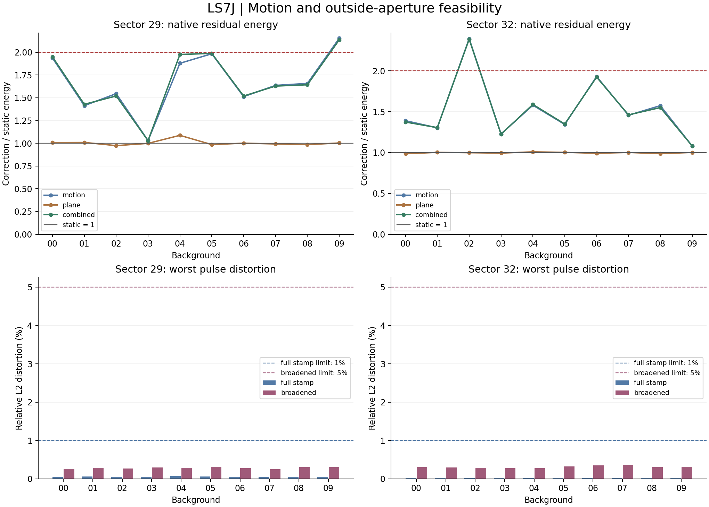

# LS7J auxiliary-observable feasibility — FAIL

LS7J completed **420 fixed native windows and 9,480 digital response rows** on the same twenty closed-sector contexts. The combined motion/outside-aperture correction has joint feasibility **FAIL**; the independent audit passes. There are no new detector decisions or added observing days.

The primary method predicts reference-image motion from verified mission fields, then fits a protected background plane using simultaneous pixels outside the aperture. The native comparison holds the LS7I static covariance and mean fixed. Digital pulse responses measure downstream signal distortion; they do not measure detection efficiency or physical laser sensitivity.

Top: lower energy ratios improve on static prediction; one is the aggregate ceiling and two the single-background ceiling. Bottom: each bar is the largest distortion among sixty response rows in that background/class. Dashed lines show the predeclared 1% and 5% limits. Missing methods have no point/bar; their rows remain in the failing availability denominator.

## Fixed primary requirements by sector

| Sector | Combined native ratio | Backgrounds improved / 10 | Native gate | Operator gate | Historical pulses | Full-stamp pulses | Broadened pulses | Feasibility |
|---|---:|---:|---|---|---|---|---|---|
| 29 | 1.45737 | 0 | FAIL | PASS | PASS | PASS | PASS | FAIL |
| 32 | 1.34514 | 0 | FAIL | PASS | PASS | PASS | PASS | FAIL |

## Native prediction and fixed component ablations

| Sector | Method | Available / 210 | Total energy ratio | Improved / 10 | Worst background ratio | Native gate |
|---|---|---:|---:|---:|---:|---|
| 29 | static | 210/210 | 1 | 0 | 1 | FAIL |
| 29 | motion | 210/210 | 1.45981 | 0 | 2.15383 | FAIL |
| 29 | plane | 210/210 | 0.99561 | 5 | 1.08714 | FAIL |
| 29 | combined | 210/210 | 1.45737 | 0 | 2.1362 | FAIL |
| 32 | static | 210/210 | 1 | 0 | 1 | FAIL |
| 32 | motion | 210/210 | 1.34596 | 0 | 2.39352 | FAIL |
| 32 | plane | 210/210 | 0.999325 | 5 | 1.0083 | FAIL |
| 32 | combined | 210/210 | 1.34514 | 0 | 2.3872 | FAIL |

Static is the reference and cannot meet the strict six-background improvement requirement. The primary method was fixed as `combined`; component results do not select a replacement. All methods use the same paired native metric. This is not a new calibration of covariance, discovery significance or false-alarm rate.

| Sector | Background | Motion / static | Plane / static | Combined / static | Combined windows / 21 |
|---|---:|---:|---:|---:|---:|
| 29 | 00 | 1.93675 | 1.00812 | 1.94961 | 21/21 |
| 29 | 01 | 1.41362 | 1.00918 | 1.42808 | 21/21 |
| 29 | 02 | 1.54553 | 0.974051 | 1.51994 | 21/21 |
| 29 | 03 | 1.02952 | 0.998815 | 1.0289 | 21/21 |
| 29 | 04 | 1.87912 | 1.08714 | 1.97607 | 21/21 |
| 29 | 05 | 1.98363 | 0.985368 | 1.98755 | 21/21 |
| 29 | 06 | 1.51258 | 1.00093 | 1.51951 | 21/21 |
| 29 | 07 | 1.63612 | 0.992553 | 1.62856 | 21/21 |
| 29 | 08 | 1.65778 | 0.985104 | 1.64306 | 21/21 |
| 29 | 09 | 2.15383 | 1.00294 | 2.1362 | 21/21 |
| 32 | 00 | 1.38985 | 0.984989 | 1.37357 | 21/21 |
| 32 | 01 | 1.30258 | 1.00228 | 1.30505 | 21/21 |
| 32 | 02 | 2.39352 | 0.998078 | 2.3872 | 21/21 |
| 32 | 03 | 1.22799 | 0.993381 | 1.22415 | 21/21 |
| 32 | 04 | 1.57911 | 1.0083 | 1.58846 | 21/21 |
| 32 | 05 | 1.34415 | 1.00213 | 1.34923 | 21/21 |
| 32 | 06 | 1.93033 | 0.991385 | 1.9232 | 21/21 |
| 32 | 07 | 1.45654 | 1.0009 | 1.46102 | 21/21 |
| 32 | 08 | 1.57429 | 0.986596 | 1.55037 | 21/21 |
| 32 | 09 | 1.0795 | 1.00127 | 1.08061 | 21/21 |

## Pulse protection including light outside the aperture

| Sector | Cohort | Available / rows | Distortion limit | Maximum distortion | Gain min–max | Failed rows |
|---|---|---:|---:|---:|---|---:|
| 29 | aperture_limited_historical | 1320/1320 | 1e-10 | 0 | 1–1 | 0 |
| 29 | full_stamp | 600/600 | 0.01 | 0.000709546 | 0.999955–1.00043 | 0 |
| 29 | broadened_full_stamp | 600/600 | 0.05 | 0.00311752 | 0.997594–0.999374 | 0 |
| 32 | aperture_limited_historical | 1320/1320 | 1e-10 | 0 | 1–1 | 0 |
| 32 | full_stamp | 600/600 | 0.01 | 0.000287754 | 0.999939–1.00023 | 0 |
| 32 | broadened_full_stamp | 600/600 | 0.05 | 0.00364556 | 0.996943–0.99973 | 0 |

Distortion is norm(corrected pulse − expected pulse)/norm(expected pulse), not a fraction of missed detections. Gain is the projection onto the expected pulse. Sparse residual stress is held identical in both members of each pulse-response pair. This separates the pulse itself from changes caused by an outside residual pixel.

The 2,640 historical stellar rows have aperture-limited profiles. The 2,400 new rows retain full-stamp wings and use separately labeled standard and broadened profiles. They derive from 240 fixed parents without retuning their amplitude or event window. The injection proxy uses the whole native context; the inference proxy uses protected sidebands. A proxy can contain neighbors and background structure, and is not an independently calibrated target PRF. Even a passing wing test would have that limit.

Every failed gated response is in [RESPONSE_FAILURES.md](RESPONSE_FAILURES.md); the complete ledger also retains all instrumental and null responses. The original 6,720-row and 360-row cohorts remain intact.

| Sector | Valid operators / frames | Available motion frames | Maximum protected-basis distortion |
|---|---:|---:|---:|
| 29 | 290/290 | 290 | 2.92543e-17 |
| 32 | 304/304 | 304 | 7.53492e-17 |

Exact protection of the declared nine-dimensional source family is a mathematical check. The separately broadened and whole-context profiles test mismatch against that family. These are different requirements.

## Verified auxiliary fields

| Field | Sector 29 finite / 4,010 | Sector 32 finite / 4,010 | Use |
|---|---:|---:|---|
| POS_CORR2 | 4010/4010 | 4010/4010 | Motion, in YX order |
| POS_CORR1 | 4010/4010 | 4010/4010 | Motion, in YX order |
| MOM_CENTR2 | 4010/4010 | 4010/4010 | Inventory only |
| MOM_CENTR1 | 4010/4010 | 4010/4010 | Inventory only |
| MOM_CENTR2_ERR | 4010/4010 | 4010/4010 | Inventory only |
| MOM_CENTR1_ERR | 4010/4010 | 4010/4010 | Inventory only |
| PSF_CENTR2 | 0/4010 | 0/4010 | Inventory only |
| PSF_CENTR1 | 0/4010 | 0/4010 | Inventory only |
| PSF_CENTR2_ERR | 0/4010 | 0/4010 | Inventory only |
| PSF_CENTR1_ERR | 0/4010 | 0/4010 | Inventory only |
| SAP_BKG | 4010/4010 | 4010/4010 | Inventory only |
| SAP_BKG_ERR | 4010/4010 | 4010/4010 | Inventory only |

The [frozen protocol](../LS7J_AUXILIARY_PROTOCOL.md#fixed-inputs-and-field-verification) links the mission field definitions. Units, formats, missingness and processing metadata are recorded in [sources.json](sources.json). Every extracted value was checked against the two original hashed light-curve products by an independent cadence lookup. Missing data are retained without interpolation.

Mission moment/PSF centroids are excluded from correction inputs. The ledger also records the change in a simple aperture-moment proxy after adding each pulse. That illustrates target-flux dependence without claiming to reproduce the mission algorithm. Holding POS_CORR fixed in a digital injection does not prove the upstream mission motion estimate is independent of a real stellar pulse.

Historical pixel-only pointing injections leave motion metadata unchanged, so their responses are not physically consistent instrumental-control qualification. There is no new accept/reject ledger in LS7J.

## Independent audit and provenance

Nine synthetic known-answer tests pass. The audit verifies **594 spatial frames**, **60,312 outside unit-input columns**, all **420 native windows**, and all **9,480 response rows**. Scalar geometry and simultaneous source-plus-plane least squares provide independent checks of the projected operator. Actual injected cubes, coefficients, gains, distortions and gate counts are reconstructed. Earlier extraction and static-baseline audits are reused by hash, including exclusion of the assessed background from all sixty static baseline pairs.

Raw audit: **8,020 rows**, **96,240 auxiliary field values**, two original products. Preserved manifests verify all earlier scientific records unchanged. [AUDIT.json](AUDIT.json) records numerical differences.

Source commit: `816a28f757e0da5ffe0f55ec56708b9f1ac3854b`. Source manifest SHA-256: `98efc135312eec4a5acaf935f8a36d3e57a9b023d2226c3b2332cb6c0392b472`.

[Execution run](https://github.com/andersenmartin-blip/setisearch/actions/runs/34819942153), [configuration](../config/ls7j_auxiliary.json), [summary](summary.json), [source extracts](sources.json), [operators](frames.jsonl.gz), [native windows](native_windows.jsonl.gz), [all responses](responses.jsonl.gz), [new recipes](full_stamp_recipes.jsonl.gz), [new patterns](full_stamp_patterns.jsonl.gz), [tests](TESTS.log), [run log](RUN.log), [audit log](AUDIT.log), [environment](environment.txt), [checksums](SHA256SUMS).

## Decision and next work

Close this fixed unit-gain motion plus protected-plane correction as a failed feasibility route. Use the saved component ratios and full-stamp mismatch responses to identify whether native prediction, source-wing protection or missing motion information limits it. Any next information study must address that measured limitation explicitly; no gain, profile, plane or threshold retry follows within LS7J. No unused sector or detector qualification follows from this result.

This result adds no observing coverage, promotes no native candidate and leaves unused TESS sectors and M43 held-out panels closed. The twenty repeated contexts limit generalization; row counts are not independent observations. Earlier LS7I failures remain unchanged.
