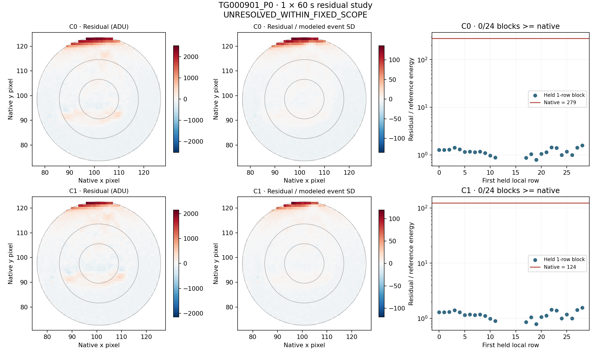

# LS8AH: PG 1207-033 residual and duration-matched noise study

The retained LS8AG positive context, both products and both coordinate conventions are included. No new archive bytes or exposures were acquired. TG000901_P0 remains **UNRESOLVED_WITHIN_FIXED_SCOPE** under the original LS8AG gate.

**Retrospective diagnostics only: energy ratios, covariance models and held-sideband comparisons are not calibrated significances, probabilities or completeness measurements.**

Independent audit **PASS**: 305,224 numerical comparisons and 320,118 exact checks; no disagreements. Eighteen pre-analysis tests pass (ten duration/cadence/boundary tests and eight inherited spatial tests). All 24 signed known-template controls, 40 signed compact controls and 64 additive checks pass.

## Fixed durations, covariance and residual comparison

TG000901_P0 is one 60-second exposure. The IID reference uses the exact OLS prediction weights, including the d²/n baseline-estimation term. A pooled lag-1/lag-2 correlation estimated from training-only pixel residuals, with a Bartlett taper, supplies the second model. All event/baseline covariance enters the same quadratic form for the native and held rows. Adjacent time differences outside 0.5–1.5 times that context’s cadence split covariance blocks. This estimated separable model is descriptive: longer correlations, nonstationarity and template-estimation uncertainty are not calibrated. Both the correlated and IID references remain visible.

The positive context has 24 single-row control targets. Each excludes two neighboring rows on each side from training, in addition to the original native event and its guards. Templates, variances and correlations are refitted without held values; the original geometric center and aperture stay fixed. These controls share training data and differ in leverage and position from the selected native event. Their counts are not p-values.

| Control | Product / center | Combined weighted explained | Residual/reference, correlated | Residual/reference, IID | Held blocks >= native | Correlated/IID variance | Top 10 residual pixels |
|---|---|---:|---:|---:|---:|---:|---:|
| TG000901_P0 | CAL / C0 | 7.7799% | 175.274115 | 186.757858 | 0/24 | 1.065519 | 35.3047% |
| TG000901_P0 | COR / C0 | 9.3954% | 278.663206 | 283.052164 | 0/24 | 1.015750 | 36.7278% |
| TG000901_P0 | CAL / C1 | 8.5134% | 80.463731 | 85.719383 | 1/24 | 1.065317 | 47.2243% |
| TG000901_P0 | COR / C1 | 10.0504% | 124.118239 | 126.205858 | 0/24 | 1.016820 | 49.7609% |

## Exact boundary accounting

Both apertures retain radius 25 and their original centers. The C0/C1 intersection cancels exactly in the difference. For each product, C1 minus C0 equals the sum over C1-only pixels minus the sum over C0-only pixels. The full signed pixel list and the analogous squared-energy identity are retained in diagnostics.json. This accounts for aperture sums; it does not uniquely assign a physical cause or explain every change in a fitted model, whose training profile/background also depend on the convention.

| Control | Product | C0-only pixels / sum ADU | C1-only pixels / sum ADU | C1 − C0 ADU |
|---|---|---:|---:|---:|
| TG000901_P0 | CAL | 71 / 45107.818636 | 71 / -1262.198326 | -46370.016962 |
| TG000901_P0 | COR | 71 / 46229.609381 | 71 / -140.378101 | -46369.987482 |
| TG000901_P0 | DELTA | 71 / 1121.790744 | 71 / 1121.820224 | 0.029480 |

## Paired correction and brightness protection

Residual CAL and DELTA use the same COR combined projector. Their energies and the signed cross term add to COR residual energy; they are not independent cause fractions.

| Control / center | CAL / COR residual energy | DELTA / COR | Twice cross / COR |
|---|---:|---:|---:|
| TG000901_P0 / C0 | 1.001958 | 0.001267 | -0.003225 |
| TG000901_P0 / C1 | 1.003085 | 0.002826 | -0.005911 |

Pure brightness additions are ±0.1% per exposure: summed coefficients are ±0.001 for this one-row context. Displacement additions are ±0.05 gradient units per exposure, a linearized template rather than nonlinear resampling. Five fixed compact positions receive both signs with total amplitude five modeled event-pixel SDs, interpreted as equal additions over the event duration. The table shows losses from hypothetical displacement plus constant subtraction. No subtraction, veto or new mask is adopted.

| Control | Product / center | Brightness weighted energy retained | Brightness signed flux retained |
|---|---|---:|---:|
| TG000901_P0 | CAL / C0 | 72.8858% | 39.8699% |
| TG000901_P0 | COR / C0 | 77.3493% | 57.0070% |
| TG000901_P0 | CAL / C1 | 72.8069% | 39.8271% |
| TG000901_P0 | COR / C1 | 77.1148% | 56.4651% |

## All COR residual maps and held-block controls

Each panel has its own symmetric scale and retains the unchanged aperture. Standardized pixels are divided by the modeled event SD, not Gaussian sigmas. Only the plotting viewport is cropped; no analysis pixels are removed.

## Stop and interpretation boundaries

A high ratio establishes a mismatch with these local sidebands under the stated model; a low ratio does not prove an ordinary-noise origin. Fixed ring/quadrant partitions and top-pixel concentrations describe the residual without selecting pixels to refit. The LS8AG classifications and LS8AF thresholds remain unchanged. No technical-origin interpretation, qualified candidate, detector or coverage is established.

This single bounded study is closed regardless of result. Rank-11 EC13080-1508 is next for a separately frozen independent transfer from the unchanged target ledger, exact pair CH_PR100002_TG005201_V0300 and CH_PR100002_TG005202_V0300. Its science values remain unopened. Further PG 1207-033 tuning is not part of this study. Raw imagettes, reserved TESS/M43 material and the unsent calibration request remain unchanged.

[Protocol](../LS8AH_RESIDUAL_NOISE_PROTOCOL.md) · [Full diagnostics](diagnostics.json) · [Signed injections](injection_controls.json) · [Audit](audit.json) · [Original LS8AG report](../results_ls8ag_images/REPORT.md)
