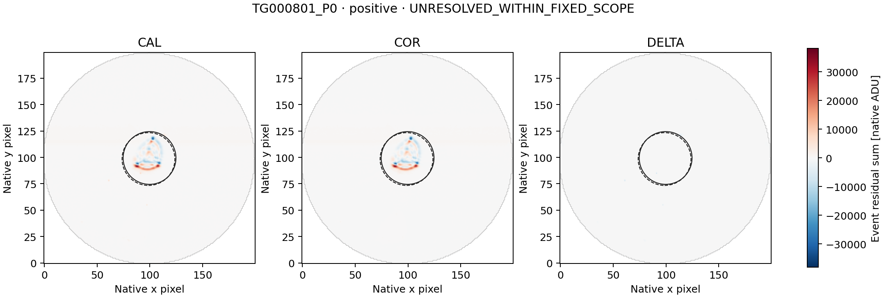
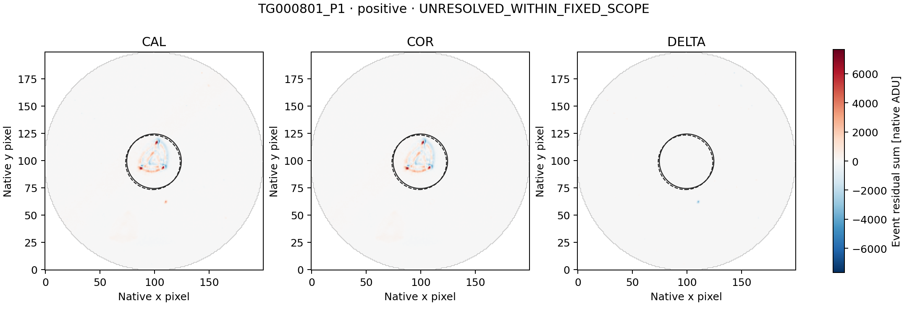
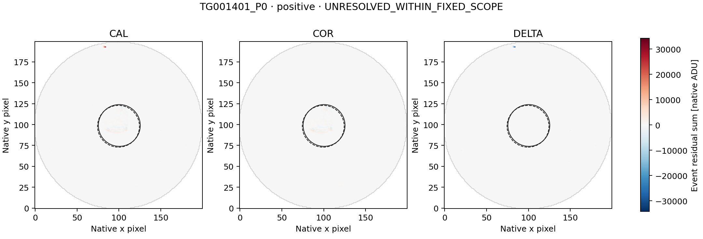

# LS8AM — HD 106315 complete positive-event paired-image follow-up

Completed 22 September 2026. **COMPLETE_AUDITED**, independent audit **PASS**.

The separately frozen diagnostic retains the complete LS8AL signed representative
set: three positive and zero negative events. No representative is added or substituted.
The image outcomes are: **{"UNRESOLVED_WITHIN_FIXED_SCOPE": 3}**.
These are descriptive image labels, not a determination of artificial or
astrophysical origin, and not detector qualification or a SETI-candidate claim.

| Representative | Sign | Fixed classification | DELTA/COR C0 / C1 | COR brightness explained C0 / C1 | COR displacement explained C0 / C1 |
|---|---|---|---:|---:|---:|
| TG000801_P0 | positive | UNRESOLVED_WITHIN_FIXED_SCOPE | -0.16695 / -0.15305 | 3.01835% / 2.98551% | 77.57754% / 77.58310% |
| TG000801_P1 | positive | UNRESOLVED_WITHIN_FIXED_SCOPE | -0.05108 / -0.05087 | 5.08258% / 5.06973% | 60.38468% / 60.38728% |
| TG001401_P0 | positive | UNRESOLVED_WITHIN_FIXED_SCOPE | 0.35528 / 0.36555 | 3.20429% / 3.20018% | 37.64951% / 37.59867% |

All three representatives are one 41-second exposure with NEXP=1:

| Representative | L2 row, zero-based | Original L2 score | L2 excess / local baseline |
|---|---:|---:|---:|
| TG000801_P0 | 223 | +44.503884094991555 | +1.020259% |
| TG000801_P1 | 363 | +9.691535552281110 | +0.244514% |
| TG001401_P0 | 178 | +28.143188663326402 | +0.646338% |

These scores are not Gaussian significances. Both selected visits' complete
signed cluster sets were checked; all three representatives are followed up.

## Scope and method

The metadata-only preflight established **174 unique CAL/COR exposure joins**
for the 87 fixed L2 context rows, with <=1 ms MJD/BJD differences and exact UTC
and CE agreement. The public config fixed every source identity and future
range before image access. The run acquired exactly
**55,680,000 paired image bytes** and
**139,200 smearing-row bytes**.

The unchanged LS8D/LS8H method constructs CAL, COR and DELTA=COR-CAL temporal
event maps on the common finite mask. It retains the original 12-row sidebands,
two-row guards, both coordinate conventions C0/C1, r<=25 source aperture,
30<r<=40 background annulus and r>35 smearing regression. Source pixel centers
come only from the saved sideband centroids; none is moved to fit the event.

CORRECTION_LINKED is evaluated first: complete apertures and matching COR/L2
signs in both conventions, plus |DELTA/COR| or |column-DELTA/COR| >=0.5 in both.
Otherwise SPATIALLY_STRUCTURED requires displacement explained energy >=0.8
and an advantage >=0.2 over brightness in both conventions. Remaining events
are UNRESOLVED_WITHIN_FIXED_SCOPE. Missing/rank-deficient fits stay unavailable.

A correction-linked label identifies material coupling to delivered processing;
it does not identify one physical correction component or exclude source
variability. A spatial label identifies a morphological fit, not a unique
physical cause. An unresolved label does not establish that the event is
astrophysical or artificial.

## Verification

The nine existing synthetic image tests, including one/three-row known-answer
controls and brightness preservation in both signs, run unchanged before
payload access. The independent
struct/long-double/scalar-normal-equation audit checks source ranges and
hashes, metadata joins, masks, event maps, fits and classifications:

- numerical comparisons: **283,611**;
- exact checks: **481,739**;
- disagreements: **0**.

LS8AL's L2 audit remains PASS. Historical LS8B's original FAIL and later
arithmetic repair remain unchanged. This is diagnosis of already selected
events, not an independent sensitivity or false-alarm calibration. Raw
imagettes, alternative apertures and additional visits remain unopened.

[Summary](summary.json) · [all diagnostics](diagnostics.json) ·
[independent audit](audit.json) · [independent reference](independent_reference.json) ·
[checksums](SHA256SUMS).

## Event maps

Each three-panel figure uses one common signed scale for its representative.
Solid/dashed circles show the C0/C1 apertures. Figures are presentation only;
they do not feed the diagnostic or any threshold.

### TG000801_P0

### TG000801_P1

### TG001401_P0

## Next action

Preserve TG000801_P0, TG000801_P1, TG001401_P0 as unresolved under this fixed diagnostic. Any next analysis must first state the specific limitation and freeze a separate diagnostic using only the already retained tables/maps. Do not widen image ranges, switch apertures or classify these as SETI candidates merely because the two descriptive closure gates did not pass.
