# LS8AR — GJ 581 complete signed-event paired-image follow-up

Completed 22 September 2026. **COMPLETE_AUDITED**, independent audit **PASS**.

The separately frozen diagnostic retains the complete LS8AQ signed representative
set: nine positive and five negative events. No representative is added or substituted.
The image outcomes are: **{"CORRECTION_LINKED": 9, "SPATIALLY_STRUCTURED": 3, "UNRESOLVED_WITHIN_FIXED_SCOPE": 2}**.
These are descriptive image labels, not a determination of artificial or
astrophysical origin, and not detector qualification or a SETI-candidate claim.

| Representative | Sign | Fixed classification | DELTA/COR C0 / C1 | COR brightness explained C0 / C1 | COR displacement explained C0 / C1 |
|---|---|---|---:|---:|---:|
| TG023701_P0 | positive | CORRECTION_LINKED | 3.04530 / 3.02869 | 0.99310% / 0.99185% | 87.07175% / 87.07818% |
| TG023701_P1 | positive | CORRECTION_LINKED | 0.71061 / 0.65577 | 0.89291% / 0.87673% | 86.09852% / 86.09792% |
| TG023701_P2 | positive | SPATIALLY_STRUCTURED | 0.03389 / 0.03378 | 0.20359% / 0.20889% | 95.18515% / 95.18725% |
| TG023701_P3 | positive | UNRESOLVED_WITHIN_FIXED_SCOPE | -0.03688 / -0.03643 | 10.13317% / 10.13718% | 42.46252% / 42.55592% |
| TG023701_P4 | positive | CORRECTION_LINKED | 0.64264 / 0.54290 | 0.34015% / 0.39557% | 94.95696% / 94.90087% |
| TG023701_P5 | positive | UNRESOLVED_WITHIN_FIXED_SCOPE | 0.36876 / 0.39003 | 6.18916% / 6.05217% | 16.68186% / 16.36840% |
| TG023701_P6 | positive | SPATIALLY_STRUCTURED | -0.03367 / -0.04521 | 0.19675% / 0.18469% | 92.93438% / 92.93479% |
| TG023701_P7 | positive | CORRECTION_LINKED | 0.91705 / 0.90774 | 1.15575% / 1.15348% | 88.13183% / 88.13245% |
| TG023701_P8 | positive | SPATIALLY_STRUCTURED | 0.18821 / 0.17541 | 0.92041% / 1.03798% | 94.18914% / 94.17987% |
| TG023701_N0 | negative | CORRECTION_LINKED | 2.49063 / 2.55151 | 1.48611% / 1.47073% | 84.97674% / 84.97906% |
| TG023701_N1 | negative | CORRECTION_LINKED | 4.36086 / 4.56624 | 4.01450% / 3.99359% | 69.31735% / 69.31568% |
| TG023701_N2 | negative | CORRECTION_LINKED | -1.62804 / -1.66939 | 0.02636% / 0.02626% | 96.11600% / 96.11618% |
| TG023701_N3 | negative | CORRECTION_LINKED | 1.95655 / 2.00291 | 1.97584% / 1.98024% | 87.66566% / 87.67204% |
| TG023701_N4 | negative | CORRECTION_LINKED | 1.20524 / 1.22714 | 0.85011% / 0.85250% | 64.13564% / 64.12756% |

Thirteen representatives are one 60-second exposure; N1 is a two-exposure
120-second sum. NEXP=1 for each exposure.

| Representative | L2 row, zero-based | Duration | Original L2 score | L2 excess / local baseline |
|---|---:|---|---:|---:|
| TG023701_P0 | 1070 | 60 s | +10.117099458039316 | +0.248385% |
| TG023701_P1 | 2033 | 60 s | +11.029749181602263 | +0.352781% |
| TG023701_P2 | 2209 | 60 s | +15.415871544973099 | +0.653250% |
| TG023701_P3 | 2528 | 60 s | +61.514729501873468 | +1.502999% |
| TG023701_P4 | 2581 | 60 s | +15.370472148046623 | +0.534193% |
| TG023701_P5 | 2761 | 60 s | +29.757440687203143 | +1.089442% |
| TG023701_P6 | 2833 | 60 s | +9.187940675968894 | +0.224409% |
| TG023701_P7 | 3044 | 60 s | +11.554082508851558 | +0.282332% |
| TG023701_P8 | 3133 | 60 s | +59.493137161459714 | +1.504279% |
| TG023701_N0 | 975 | 60 s | -17.154258654577312 | -0.433973% |
| TG023701_N1 | 1511 | 120 s | -10.622953693161483 | -0.187652% |
| TG023701_N2 | 1587 | 60 s | -9.189141427759484 | -0.224489% |
| TG023701_N3 | 2679 | 60 s | -21.763188969336206 | -0.532478% |
| TG023701_N4 | 3264 | 60 s | -8.693767275408362 | -0.212390% |

Scores are not Gaussian significance. Both visits' complete signed sets were
checked; all 14 representatives are in CH_PR100011_TG023701_V0300. The second
visit has no eligible crossing and receives no image acquisition. Its large
displayed point at row 66 is too close to the end for complete context; the
null result applies only to its 84 eligible windows. The two displayed >3%
points at first-visit rows 3307/3308 fail the original status/context rule.
They are not newly selected, scored or substituted by this image follow-up.

## Scope and method

The metadata-only preflight established **814 unique CAL/COR exposure joins**
for the 407 fixed L2 context rows, with <=1 ms MJD/BJD differences and exact UTC
and CE agreement. The public config fixed every source identity and future
range before image access. The run acquired exactly
**260,480,000 paired image bytes** and
**651,200 smearing-row bytes**.

The unchanged LS8D/LS8H method constructs CAL, COR and DELTA=COR-CAL temporal
event maps on the common finite mask. It retains the original 12-row sidebands,
two-row guards, both coordinate conventions C0/C1, r<=25 source aperture,
30<r<=40 background annulus and r>35 smearing regression. Source pixel centers
come only from the saved sideband centroids; none is moved to fit the event.

CORRECTION_LINKED is evaluated first: complete apertures and matching COR/L2
signs in both conventions, plus |DELTA/COR| or |column-DELTA/COR| >=0.5 in both.
Otherwise SPATIALLY_STRUCTURED requires displacement explained energy >=0.8
and an advantage >=0.2 over brightness in both conventions. Remaining events
are UNRESOLVED_WITHIN_FIXED_SCOPE. Missing/rank-deficient fits stay unavailable.

A correction-linked label identifies material coupling to delivered processing;
it does not identify one physical correction component or exclude source
variability. A spatial label identifies a morphological fit, not a unique
physical cause. An unresolved label does not establish that the event is
astrophysical or artificial.

## Verification

All nine inherited image tests plus two native 60-second-cadence two-row
known-answer tests run before payload access (11 tests). They protect signed
event sums, guards, masks, brightness preservation and both conventions.
Scientific functions and gates are unchanged. The independent
struct/long-double/scalar-normal-equation audit checks source ranges and
hashes, metadata joins, masks, event maps, fits and classifications:

- numerical comparisons: **1,323,518**;
- exact checks: **2,248,091**;
- disagreements: **0**.

LS8AQ's L2 audit remains PASS. Historical LS8B's original FAIL and later
arithmetic repair remain unchanged. This is diagnosis of already selected
events, not an independent sensitivity or false-alarm calibration. Raw
imagettes, alternative apertures and additional visits remain unopened.

[Summary](summary.json) · [all diagnostics](diagnostics.json) ·
[independent audit](audit.json) · [independent reference](independent_reference.json) ·
[checksums](SHA256SUMS).

## Event maps

Each three-panel figure uses one common signed scale for its representative.
Solid/dashed circles show the C0/C1 apertures. Figures are presentation only;
they do not feed the diagnostic or any threshold.

### TG023701_P0

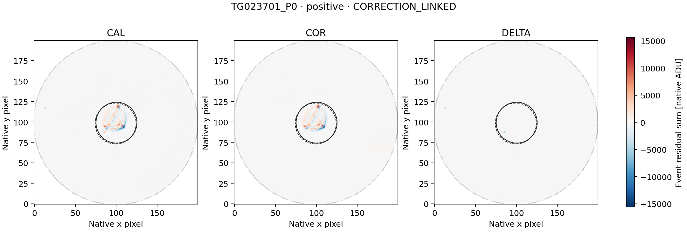

### TG023701_P1

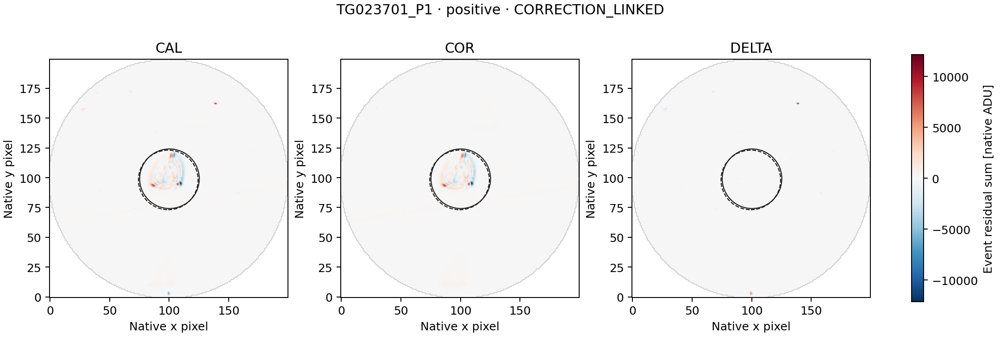

### TG023701_P2

### TG023701_P3

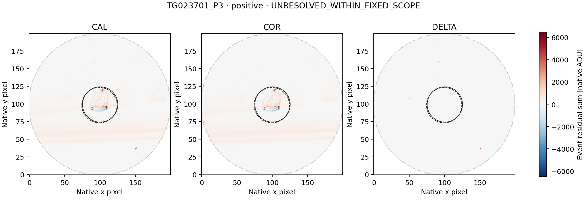

### TG023701_P4

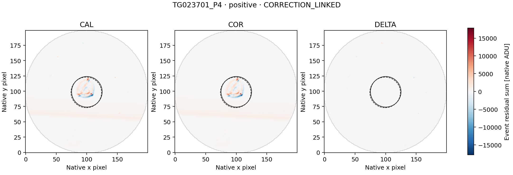

### TG023701_P5

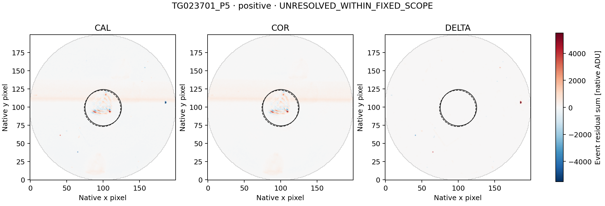

### TG023701_P6

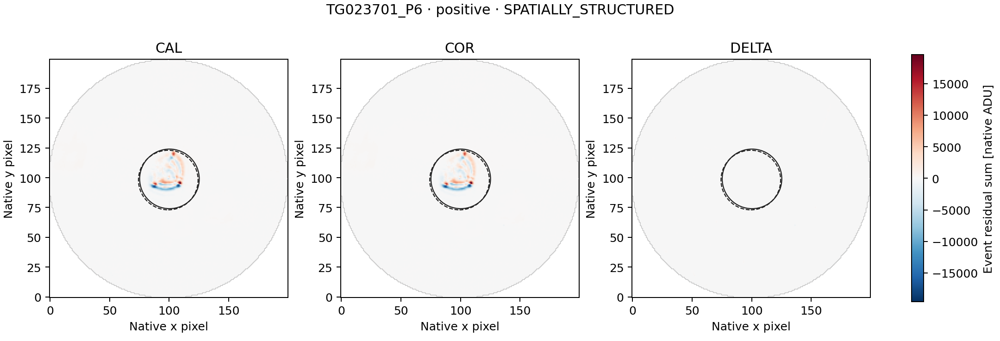

### TG023701_P7

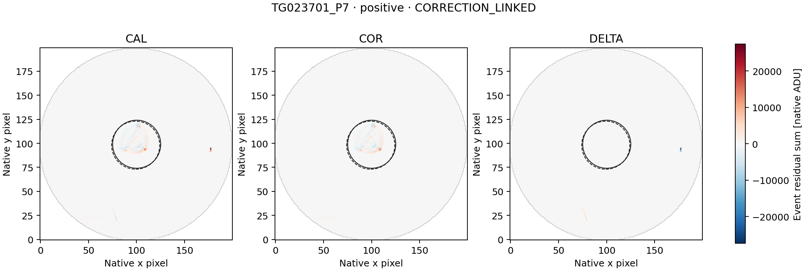

### TG023701_P8

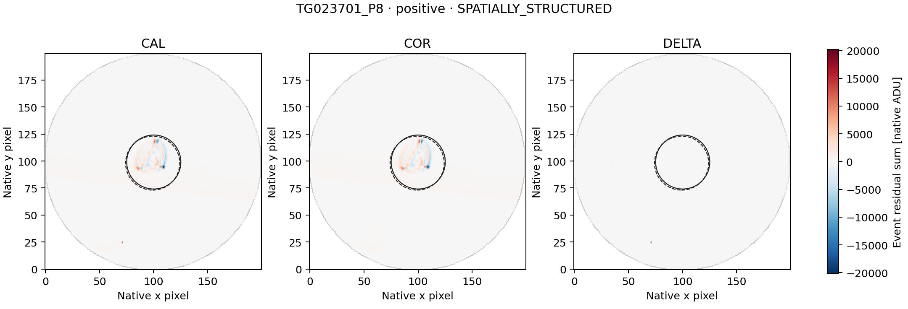

### TG023701_N0

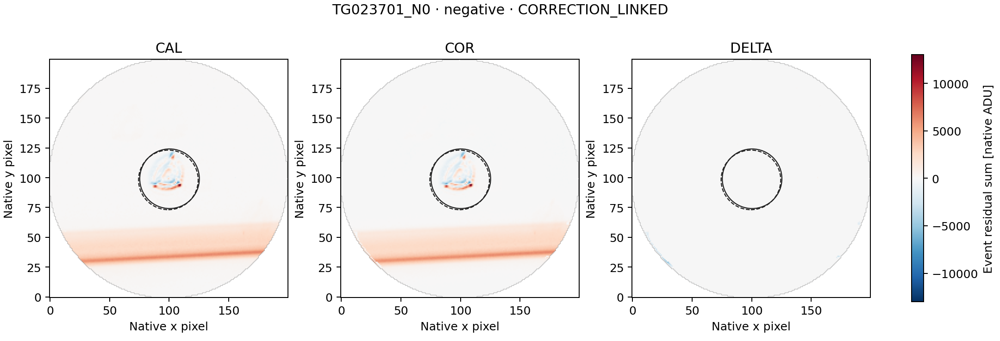

### TG023701_N1

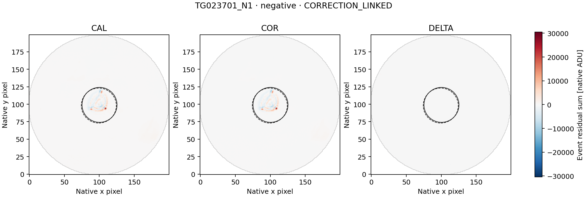

### TG023701_N2

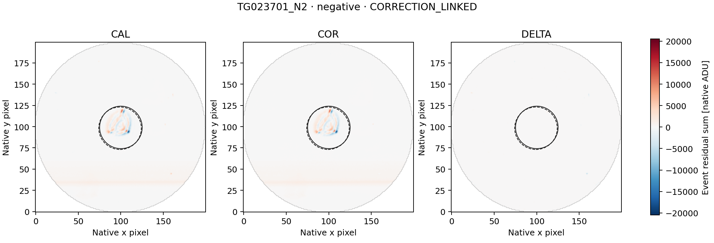

### TG023701_N3

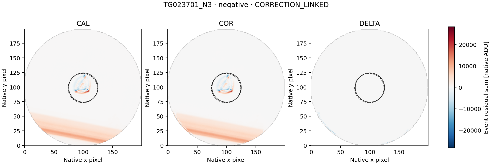

### TG023701_N4

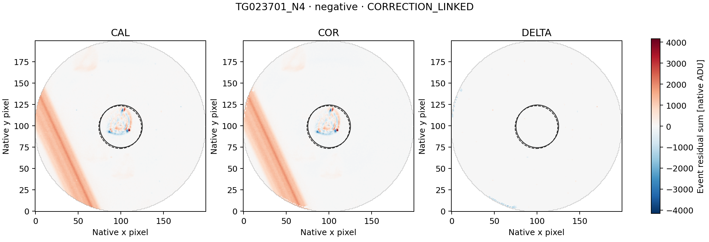

## Next action

Preserve TG023701_P3, TG023701_P5 as unresolved under this fixed diagnostic. Any next analysis must first state the specific limitation and freeze a separate diagnostic using only the already retained tables/maps. Do not widen image ranges, switch apertures or classify these as SETI candidates merely because the two descriptive closure gates did not pass.
