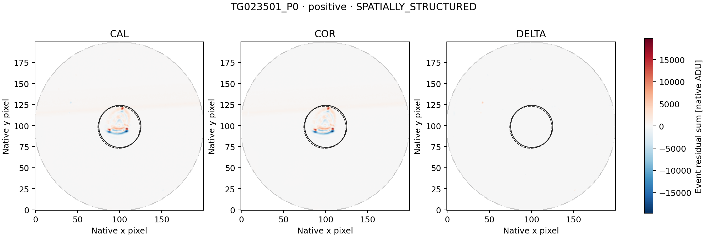
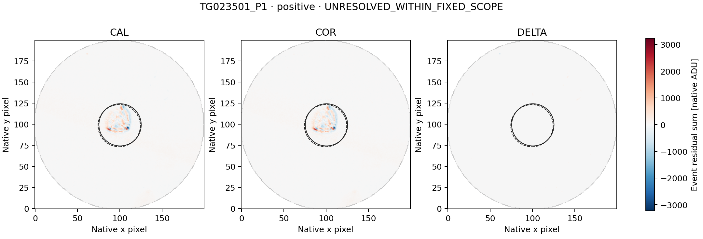
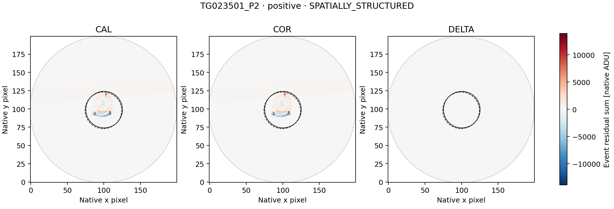
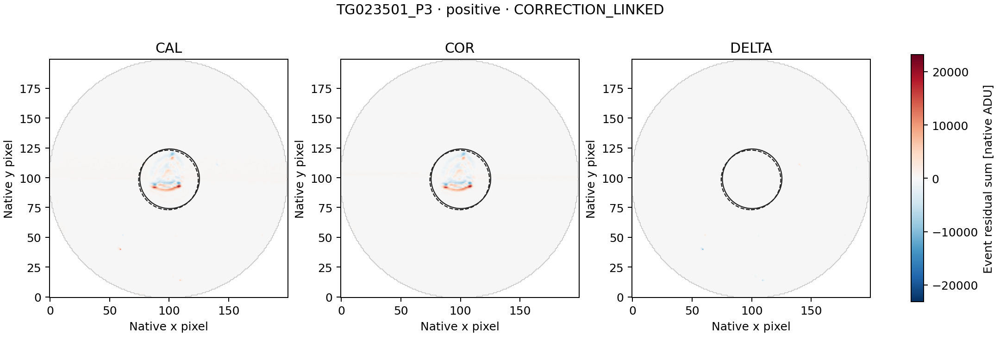
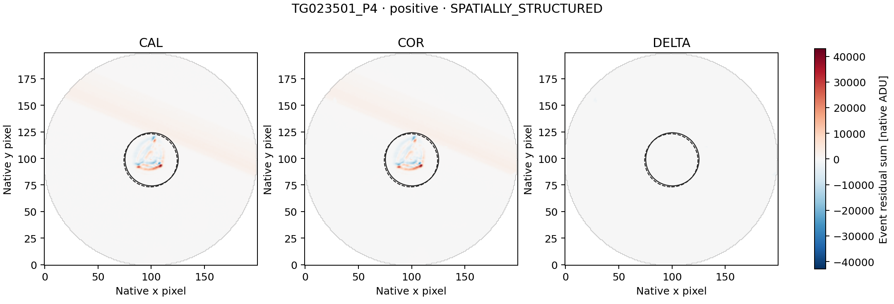
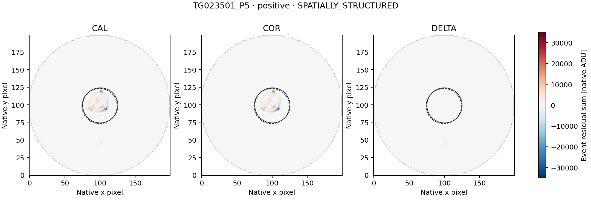
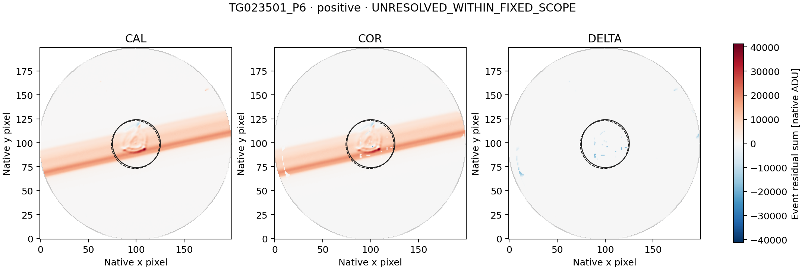
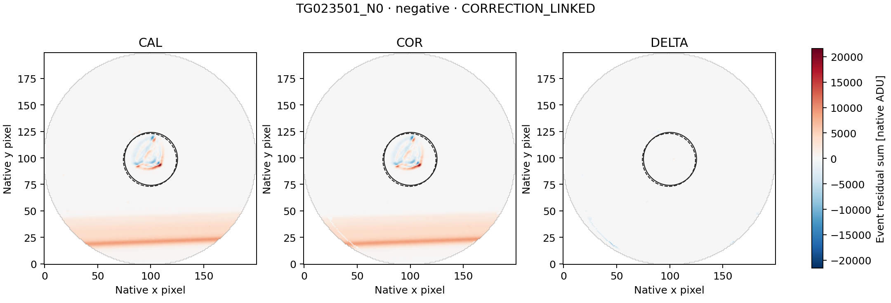
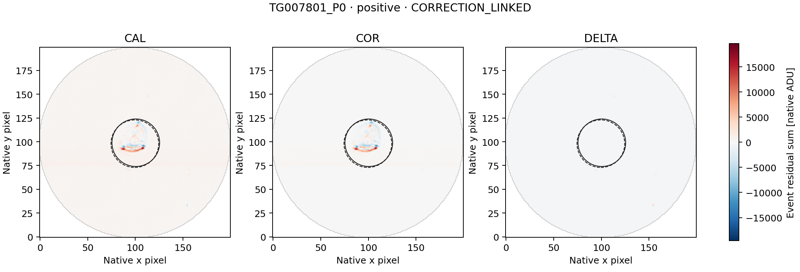

# LS8AY — GJ 536 complete signed-event paired-image follow-up

Completed 23 September 2026. **COMPLETE_AUDITED**, independent audit **PASS**.

The separately frozen diagnostic retains the complete LS8AX signed representative
set: eight positive and one negative event. No representative is added or substituted.
The image outcomes are: **{"CORRECTION_LINKED": 3, "SPATIALLY_STRUCTURED": 4, "UNRESOLVED_WITHIN_FIXED_SCOPE": 2}**.
These are descriptive image labels, not a determination of artificial or
astrophysical origin, and not detector qualification or a SETI-candidate claim.

| Representative | Sign | Fixed classification | DELTA/COR C0 / C1 | COR brightness explained C0 / C1 | COR displacement explained C0 / C1 |
|---|---|---|---:|---:|---:|
| TG023501_P0 | positive | SPATIALLY_STRUCTURED | -0.32195 / -0.40987 | 0.09643% / 0.06670% | 92.33617% / 92.38055% |
| TG023501_P1 | positive | UNRESOLVED_WITHIN_FIXED_SCOPE | -0.06033 / -0.06020 | 4.65712% / 4.64243% | 38.88464% / 38.87776% |
| TG023501_P2 | positive | SPATIALLY_STRUCTURED | -0.09529 / -0.11396 | 0.47966% / 0.49740% | 87.87911% / 87.90254% |
| TG023501_P3 | positive | CORRECTION_LINKED | -0.97674 / -0.99298 | 0.40556% / 0.40176% | 91.96790% / 91.97550% |
| TG023501_P4 | positive | SPATIALLY_STRUCTURED | -0.47031 / -0.79921 | 0.94961% / 0.87293% | 88.00190% / 88.18360% |
| TG023501_P5 | positive | SPATIALLY_STRUCTURED | 0.05680 / 0.05657 | 0.52655% / 0.53497% | 90.71332% / 90.71545% |
| TG023501_P6 | positive | UNRESOLVED_WITHIN_FIXED_SCOPE | -0.05102 / -0.05077 | 55.16456% / 55.27847% | 70.41623% / 70.43642% |
| TG023501_N0 | negative | CORRECTION_LINKED | 1.26917 / 1.28895 | 0.42785% / 0.42879% | 95.08072% / 95.08538% |
| TG007801_P0 | positive | CORRECTION_LINKED | -4.10745 / -3.80623 | 0.55036% / 0.56338% | 85.63036% / 85.62789% |

All nine representatives are one exposure with NEXP=1. The first visit uses
40.1699981689453 seconds; the second uses 40.2000007629395 seconds. Display
durations below are rounded; native BJD times and full header values are retained.

| Representative | L2 row, zero-based | Duration | Original L2 score | L2 excess / local baseline |
|---|---:|---|---:|---:|
| TG023501_P0 | 1816 | 40.169998 s | +18.968233631134 | +0.576269% |
| TG023501_P1 | 1849 | 40.169998 s | +9.877824201574 | +0.226988% |
| TG023501_P2 | 2573 | 40.169998 s | +13.572894443593 | +0.384290% |
| TG023501_P3 | 2770 | 40.169998 s | +31.864099484625 | +0.759873% |
| TG023501_P4 | 3082 | 40.169998 s | +20.039903364472 | +0.462369% |
| TG023501_P5 | 3323 | 40.169998 s | +15.723832564690 | +0.361474% |
| TG023501_P6 | 3408 | 40.169998 s | +2923.687794814557 | +69.592873% |
| TG023501_N0 | 802 | 40.169998 s | -14.861686433842 | -0.387849% |
| TG007801_P0 | 17 | 40.200001 s | +47.629871839031 | +1.104699% |

Scores are not Gaussian significances. Both original visits contribute to the
complete signed set: seven positive and one negative event in TG023501, one
positive in TG007801. Excluded points in the full L2 figure are not newly
selected or substituted. The three other eligible GJ 536 visits stay outside
the pair.

## Scope and method

The metadata-only preflight established **522 unique CAL/COR exposure joins**
for the 261 fixed L2 context rows, with <=1 ms MJD/BJD differences and exact UTC
and CE agreement. The public config fixed every source identity and future
range before image access. The run acquired exactly
**167,040,000 paired image bytes** and
**417,600 smearing-row bytes**.

The unchanged LS8D/LS8H method constructs CAL, COR and DELTA=COR-CAL temporal
event maps on the common finite mask. It retains the original 12-row sidebands,
two-row guards, both coordinate conventions C0/C1, r<=25 source aperture,
30<r<=40 background annulus and r>35 smearing regression. Source pixel centers
come only from the saved sideband centroids; none is moved to fit the event.

CORRECTION_LINKED is evaluated first: complete apertures and matching COR/L2
signs in both conventions, plus |DELTA/COR| or |column-DELTA/COR| >=0.5 in both.
Otherwise SPATIALLY_STRUCTURED requires displacement explained energy >=0.8
and an advantage >=0.2 over brightness in both conventions. Remaining events
are UNRESOLVED_WITHIN_FIXED_SCOPE. Missing/rank-deficient fits stay unavailable.

A correction-linked label identifies material coupling to delivered processing;
it does not identify one physical correction component or exclude source
variability. A spatial label identifies a morphological fit, not a unique
physical cause. An unresolved label does not establish that the event is
astrophysical or artificial.

## Verification

All nine inherited image tests plus two native 60-second-cadence two-row
known-answer tests run before payload access (11 tests). They protect signed
event sums, guards, masks, brightness preservation and both conventions.
Scientific functions and gates are unchanged. The independent
struct/long-double/scalar-normal-equation audit checks source ranges and
hashes, metadata joins, masks, event maps, fits and classifications:

- numerical comparisons: **850,833**;
- exact checks: **1,445,201**;
- disagreements: **0**.

LS8AX's L2 audit remains PASS. Historical LS8B's original FAIL and later
arithmetic repair remain unchanged. This is diagnosis of already selected
events, not an independent sensitivity or false-alarm calibration. Raw
imagettes, alternative apertures and additional visits remain unopened.

[Summary](summary.json) · [all diagnostics](diagnostics.json) ·
[independent audit](audit.json) · [independent reference](independent_reference.json) ·
[checksums](SHA256SUMS).

## Event maps

Each three-panel figure uses one common signed scale for its representative.
Solid/dashed circles show the C0/C1 apertures. Figures are presentation only;
they do not feed the diagnostic or any threshold.

### TG023501_P0

### TG023501_P1

### TG023501_P2

### TG023501_P3

### TG023501_P4

### TG023501_P5

### TG023501_P6

### TG023501_N0

### TG007801_P0

## Next action

Preserve TG023501_P1, TG023501_P6 as unresolved under this fixed diagnostic. Any next analysis must first state the specific limitation and freeze a separate diagnostic using only the already retained tables/maps. Do not widen image ranges, switch apertures or classify these as SETI candidates merely because the two descriptive closure gates did not pass.
