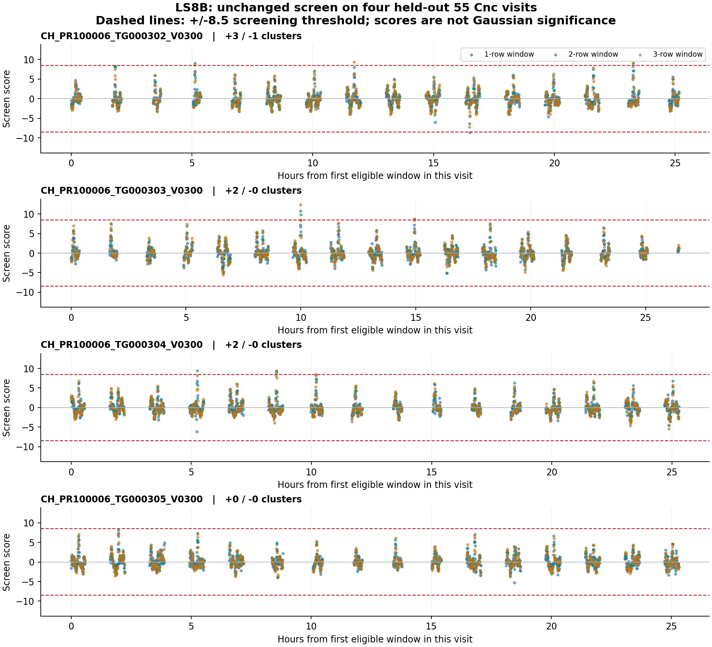

# LS8B: four held-out CHEOPS DEFAULT L2 visits

Completed 19 September 2026. All four visits were fixed before metadata,
and metadata/code identities were published before the first L2 table read.
The LS7X/LS8A score and +/-8.5 thresholds are unchanged.

**The frozen audit failed two near-zero event-sum comparisons.**
Complete independent accounting verifies all scores, eligibility, signed clusters
and counts. A separate 60-decimal reference and a subsequently frozen numerical
repair are reported below. The original failed gate and every original result
are preserved; they are not relabeled PASS.

| Visit | Cadence (s) | Rows | Eligible windows | Positive windows / clusters | Negative windows / clusters | Max score | Min score |
|---|---:|---:|---:|---:|---:|---:|---:|
| CH_PR100006_TG000302_V0300 | 44.220001 | 1,171 | 1,920 | 5 / 3 | 1 / 1 | 9.380789 | -8.661270 |
| CH_PR100006_TG000303_V0300 | 44.220001 | 1,189 | 1,908 | 5 / 2 | 0 / 0 | 12.356327 | -5.572537 |
| CH_PR100006_TG000304_V0300 | 44.220001 | 1,194 | 2,013 | 5 / 2 | 0 / 0 | 9.433685 | -6.170845 |
| CH_PR100006_TG000305_V0300 | 44.220001 | 1,200 | 2,076 | 0 / 0 | 0 / 0 | 8.182662 | -5.296866 |

Descriptive totals: **7,917 windows** in **4,754 rows**; **15 positive windows in 7 clusters**, and **negative windows / clusters: 1 / 1**.

Overlapping and adjacent windows are grouped within each visit; different visits
are never joined. Negative clusters use the same predeclared rule after sign reversal.

## Interpretation

These are held-out tail-behavior measurements, not a qualified detection method.
Positive excursions are L2 diagnostics, not identified astronomical or artificial signals.
Negative crossings cannot be interpreted as negative light-sail pulses; they are controls
for how strongly this screen responds to the actual processed time series.
Neither the window counts nor cluster counts are independent noise-trial denominators.
The local score is not a calibrated Gaussian significance or false-alarm probability.
No raw imagette, CAL/COR image, other aperture or additional visit was inspected.
No threshold or model was changed and no detector, candidate or qualified coverage is claimed.

## Numerical review and transparent repair

The two original differences concern event sums near zero after subtracting
backgrounds near 390 million electrons per row:

| Visit | Start row | Duration | Scalar minus producer (electrons) |
|---|---:|---:|---:|
| CH_PR100006_TG000303_V0300 | 699 | 2 | 2.38418579102e-07 |
| CH_PR100006_TG000304_V0300 | 522 | 3 | 8.94069671631e-07 |

The 60-decimal reference checks all **7,917 windows**.
Its largest score difference from the frozen producer is **4.5711e-11**;
**0** positive/negative threshold decisions change.
It confirms that finite-arithmetic cancellation, rather than a different selection
or statistic, explains the tiny discrepancies. The fixed gate remains FAIL.

The separately frozen centered implementation subtracts a constant flux offset
before solving the same OLS model and summing excesses. It preserves the raw-flux
noise floor and every scientific rule. On these already closed data, its result is
**PASS** across **31,668** comparisons with the 60-decimal
reference at the original tolerances; **0** signed decisions change.
This is retrospective numerical verification, not another held-out test, and does
not replace the original failure or qualify a detector.

- [Failure and repair specification](../LS8B_NUMERICAL_REVIEW.md).
- [First frozen failure](AUDIT_INITIAL_FAILURE.log), [complete accounting](audit.json).
- [60-decimal comparison](precision_review.json), [centered implementation result](stable_review.json).
- Original, Decimal and centered ledgers are retained separately.

## Evidence and verification

- Evaluation freeze: `98d647770bbbdaa6ab66e9333f2a286e438dba6e`.
- [Fixed protocol](../LS8B_FOUR_VISIT_PROTOCOL.md) and [prior selection](../LS8B_FOUR_VISIT_SCOPE.md).
- [Header-only metadata and exact file identities](../results_ls8b_l2_metadata/summary.json).
- Each visit directory retains the original table bytes, acquisition receipt, every
  eligible window, both signed cluster memberships, and per-duration summaries.
- [All cluster representatives](cluster_representatives.csv); row starts are zero-based.
- Complete original audit accounting: 71,253 numerical/discrete
  window comparisons, with the two explicit failures above. All other window
  comparisons and the eligibility, signed clustering, count, union, source-identity
  and summary checks pass. [Full audit](audit.json).
- All 10 pre-acquisition known-answer and transport-boundary tests passed.
- Four later known-answer tests for precision and centered arithmetic also pass.
- SHA256SUMS preserves every file in this result directory.
