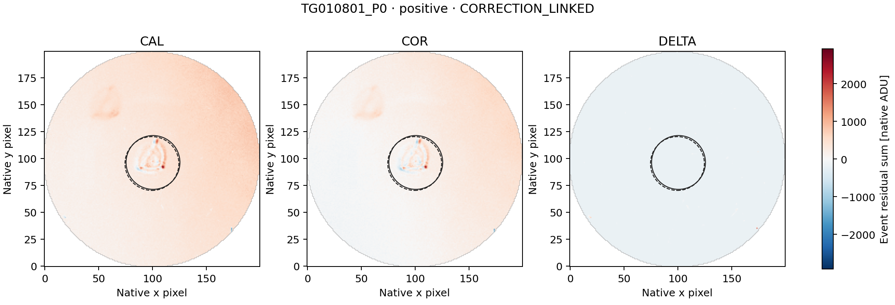
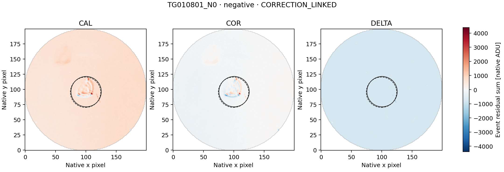

# LS8BB — 2MASS J11285624+1010395 complete signed-event paired-image follow-up

Completed 23 September 2026. **COMPLETE_AUDITED**, independent audit **PASS**.

The separately frozen diagnostic retains the complete LS8BA signed representative
set: one positive and one negative event. No representative is added or substituted.
The image outcomes are: **{"CORRECTION_LINKED": 2}**.
These are descriptive image labels, not a determination of artificial or
astrophysical origin, and not detector qualification or a SETI-candidate claim.

| Representative | Sign | Fixed classification | DELTA/COR C0 / C1 | COR brightness explained C0 / C1 | COR displacement explained C0 / C1 |
|---|---|---|---:|---:|---:|
| TG010801_P0 | positive | CORRECTION_LINKED | -1.48505 / -1.53416 | 25.64076% / 24.58081% | 87.21472% / 86.99564% |
| TG010801_N0 | negative | CORRECTION_LINKED | 9.88664 / 9.53673 | 3.93318% / 4.16202% | 87.87662% / 87.88613% |

Both representatives are one 60-second exposure with NEXP=1 in the first
visit. Native BJD times and full verified header values are retained.

| Representative | L2 row, zero-based | Duration | Original L2 score | L2 excess / local baseline |
|---|---:|---|---:|---:|
| TG010801_P0 | 25 | 60 s | +65.277455650071 | +8.778835% |
| TG010801_N0 | 24 | 60 s | -35.043142304665 | -4.788958% |

Scores are not Gaussian significances. Both signed events are in TG010801;
TG010802 has zero eligible windows and supplies no testable null. The events
are adjacent and lie in each other's original guard rows. Their contexts share
28 rows; they are not independent. Excluded edge points in the full L2 figure
are retained without reselection or substitution.

## Scope and method

The metadata-only preflight established **116 context-specific CAL/COR joins**,
each uniquely matched within 1 ms MJD/BJD with exact UTC and CE agreement.
The 58 context-row occurrences cover only 30 distinct L2 exposures, or 60
distinct CAL/COR exposure rows. Repeated bytes remain retained in both
overlapping contexts and are not counted as independent observations. The public config fixed every source identity and future
range before image access. The run acquired exactly
**37,120,000 paired image bytes** and
**92,800 smearing-row bytes**.

The unchanged LS8D/LS8H method constructs CAL, COR and DELTA=COR-CAL temporal
event maps on the common finite mask. It retains the original 12-row sidebands,
two-row guards, both coordinate conventions C0/C1, r<=25 source aperture,
30<r<=40 background annulus and r>35 smearing regression. Source pixel centers
come only from the saved sideband centroids; none is moved to fit the event.

CORRECTION_LINKED is evaluated first: complete apertures and matching COR/L2
signs in both conventions, plus |DELTA/COR| or |column-DELTA/COR| >=0.5 in both.
Otherwise SPATIALLY_STRUCTURED requires displacement explained energy >=0.8
and an advantage >=0.2 over brightness in both conventions. Remaining events
are UNRESOLVED_WITHIN_FIXED_SCOPE. Missing/rank-deficient fits stay unavailable.

A correction-linked label identifies material coupling to delivered processing;
it does not identify one physical correction component or exclude source
variability. A spatial label identifies a morphological fit, not a unique
physical cause. An unresolved label does not establish that the event is
astrophysical or artificial.

## Verification

All nine inherited image tests plus two native 60-second-cadence two-row
known-answer tests run before payload access (11 tests). They protect signed
event sums, guards, masks, brightness preservation and both conventions.
Scientific functions and gates are unchanged. The independent
struct/long-double/scalar-normal-equation audit checks source ranges and
hashes, metadata joins, masks, event maps, fits and classifications:

- numerical comparisons: **189,074**;
- exact checks: **321,158**;
- disagreements: **0**.

LS8BA's L2 audit remains PASS. Historical LS8B's original FAIL and later
arithmetic repair remain unchanged. This is diagnosis of already selected
events, not an independent sensitivity or false-alarm calibration. Raw
imagettes, alternative apertures and additional visits remain unopened.

[Summary](summary.json) · [all diagnostics](diagnostics.json) ·
[independent audit](audit.json) · [independent reference](independent_reference.json) ·
[checksums](SHA256SUMS).

## Event maps

Each three-panel figure uses one common signed scale for its representative.
Solid/dashed circles show the C0/C1 apertures. Figures are presentation only;
they do not feed the diagnostic or any threshold.

### TG010801_P0

### TG010801_N0

## Next action

Close this 2MASS J11285624+1010395 follow-up under its fixed descriptive label without widening. The next independent target is rank 22 of the unchanged reconciled LS8J ledger, GJ 422; freeze its exact pair and header preflight before science values.
