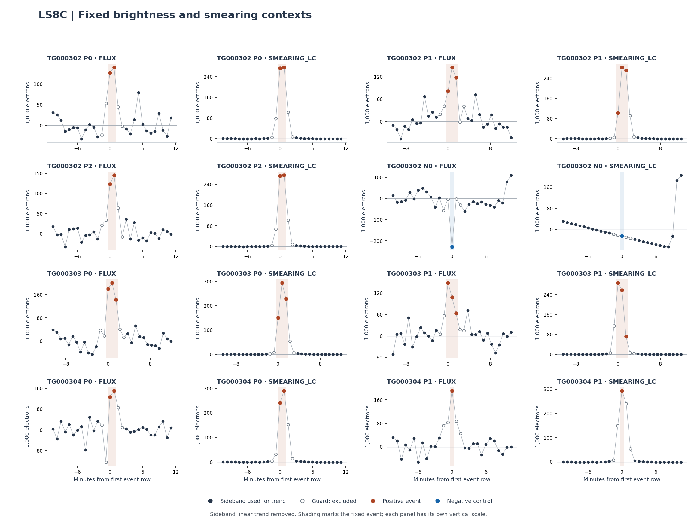

# LS8C: all seven positive excursions coincide with a smearing feature

Completed 19 September 2026 using only the four saved LS8B DEFAULT-L2 tables. The seven positive representatives each coincide with a large positive SMEARING_LC residual and have mean event roll angles between **16.39 and 20.42 degrees**. The negative representative has neither that smearing pattern nor that roll range. This repeated auxiliary pattern motivates a bounded image/correction study. It does not establish a correction operator, a unique physical cause or a SETI candidate.

The [diagnostic protocol](../LS8C_AUXILIARY_PROTOCOL.md), configuration, code and six known-answer tests were published at [`971b91c`](https://github.com/andersenmartin-blip/setisearch/commit/971b91ccef711408798d6dc5abe2db7801ed5edf) before these auxiliary calculations. This is a retrospective diagnosis of closed data. All eight original representatives, both signs and the original LS8B audit **FAIL** are preserved.

## Complete event accounting

P/N denotes the original positive/negative cluster label. All residuals are **mean per event row** after the frozen 12+12-sideband linear trend; they are not event-integrated sums. Native electron units do not establish common aperture/pixel normalization. MAD multiples describe displacement from local side behavior and are not significances.

| Representative | Start / rows | FLUX residual (10³ e) | Smearing residual (10³ e) | Smearing / side MAD | Background residual (10³ e) | Mean event roll (°) |
|---|---:|---:|---:|---:|---:|---:|
| TG000302 P0 | 217 / 2 | 133.821 | 274.673 | 641.86 | -19.141 | 18.746 |
| TG000302 P1 | 517 / 3 | 115.065 | 218.874 | 527.31 | -16.947 | 20.425 |
| TG000302 P2 | 1064 / 2 | 134.046 | 274.689 | 698.01 | -16.828 | 18.805 |
| TG000302 N0 | 738 / 1 | -227.051 | -24.225 | -0.51 | 7.885 | 83.860 |
| TG000303 P0 | 444 / 3 | 174.338 | 224.613 | 652.36 | -16.621 | 19.351 |
| TG000303 P1 | 681 / 3 | 106.664 | 205.662 | 582.69 | -17.065 | 16.388 |
| TG000304 P0 | 274 / 2 | 138.640 | 265.830 | 765.76 | -18.042 | 19.668 |
| TG000304 P1 | 434 / 1 | 191.034 | 293.495 | 639.57 | -11.926 | 19.454 |



[Vector PDF](flux_smearing_contexts.pdf). Dark points are the sidebands used for the fit; open points are guards excluded from fitting; colored points and shading show the fixed event. The seven positive representatives have smearing residuals **205,662–293,495 e** against side MADs **344–459 e**, giving **527–766 local MAD units**. These large ratios reflect the selected event lying far outside its local sideband smearing behavior. They are not Gaussian tail probabilities and cannot be multiplied across events. The negative control is **−24,225 e / 47,409 e = −0.51 MAD units**.

The positive event roll interval above is a description of all seven preselected representatives, not a newly fitted roll filter. Their background residuals are all negative (−11,926 to −19,141 e); dark and contamination residuals are also retained below. Repeated excursions at similar spacecraft orientation could share an instrumental origin; independence has not been established.

## Remaining fields and intended/measured motion

| Representative | Dark residual (e) | Contamination residual (10⁻⁶ ratio) | Roll residual (°) | Offset X (px) | Offset Y (px) | Offset-vector norm (px) |
|---|---:|---:|---:|---:|---:|---:|
| TG000302 P0 | 13.378 | -0.1513 | -9.006 | -0.00329 | 0.10693 | 0.10698 |
| TG000302 P1 | 23.309 | -0.1637 | -9.460 | 0.02092 | 0.13795 | 0.13953 |
| TG000302 P2 | 18.796 | -0.1377 | -8.704 | -0.01692 | 0.13436 | 0.13542 |
| TG000302 N0 | 10.398 | 0.8076 | 6.371 | 0.00786 | -0.04791 | 0.04855 |
| TG000303 P0 | 8.274 | -0.1056 | -9.084 | 0.05537 | 0.10002 | 0.11432 |
| TG000303 P1 | -8.746 | -0.3273 | -9.095 | -0.07210 | 0.09720 | 0.12102 |
| TG000304 P0 | -101.127 | -0.2781 | -6.298 | -0.13627 | -0.00684 | 0.13645 |
| TG000304 P1 | 52.039 | -0.1248 | -5.815 | 0.14814 | -0.02714 | 0.15061 |

OFFSET is calculated centroid minus intended location. Intended locations are constant at (280, 828) pixels within every context, so measured-centroid and OFFSET residuals coincide here. The two intended-location fields, CONTA_LC_ERR and SMEARING_LC_ERR have zero side residual scatter in all eight contexts: their **32 MAD ratios are unavailable**, not set to zero. SMEARING_LC_ERR itself is zero throughout the retained contexts; this supplies no usable uncertainty for the large smearing excursions. All **112 field diagnoses** otherwise have finite inputs.

The matching [SCI_COR_Lightcurve v13.1 schema](https://github.com/davefutyan/common_sw/blob/1e45b3be84edd18a60e9a0ea8ef65444dfa2a254/fits_data_model/resources/SCI_COR_Lightcurve.fsd) declares CONTA_LC and both contamination/smearing error columns as ratios. SMEARING_LC is in electrons. No electron-error conversion, contamination correction or re-addition to FLUX is made. The schema fixes column meaning but not the precise DRP correction/scaling operator. Centroid estimates can depend on brightness or image structure, so centroid association would not by itself show causation.

## Sideband-only extrapolations do not provide a reliable correction

Each cell is **sideband correlation / predicted fraction of observed FLUX residual** for one separate predeclared predictor. All 56 fits use sideband rows only after time detrending. A fraction is not explained variance; values may be negative or greater than one. No predictors are selected, combined or used to veto events.

| Representative | Dark | Background | Contamination | Smearing | Roll | Offset X | Offset Y |
|---|---:|---:|---:|---:|---:|---:|---:|
| TG000302 P0 | 0.181 / 0.007 | -0.348 / 0.279 | 0.069 / -0.007 | -0.007 / -0.387 | 0.167 / -0.052 | 0.397 / -0.002 | -0.424 / -0.077 |
| TG000302 P1 | 0.167 / 0.013 | -0.031 / 0.025 | -0.541 / 0.087 | 0.133 / 7.647 | -0.671 / 0.295 | 0.207 / 0.007 | 0.027 / 0.008 |
| TG000302 P2 | -0.047 / -0.002 | -0.169 / 0.074 | 0.069 / -0.004 | 0.279 / 8.966 | -0.014 / 0.003 | -0.047 / 0.001 | -0.070 / -0.010 |
| TG000302 N0 | -0.011 / 0.000 | -0.414 / 0.046 | -0.463 / 0.219 | 0.829 / 0.052 | -0.064 / 0.018 | 0.080 / -0.001 | 0.301 / 0.020 |
| TG000303 P0 | 0.128 / 0.002 | -0.293 / 0.151 | 0.261 / -0.014 | 0.328 / 13.590 | 0.255 / -0.066 | -0.017 / -0.001 | 0.030 / 0.004 |
| TG000303 P1 | 0.094 / -0.004 | -0.240 / 0.239 | -0.234 / 0.062 | 0.405 / 31.784 | -0.333 / 0.148 | 0.116 / -0.015 | -0.030 / -0.007 |
| TG000304 P0 | -0.087 / 0.030 | -0.204 / 0.142 | -0.141 / 0.025 | -0.009 / -0.422 | -0.043 / 0.014 | 0.085 / -0.024 | -0.196 / 0.003 |
| TG000304 P1 | -0.106 / -0.012 | -0.326 / 0.087 | -0.048 / 0.003 | 0.159 / 4.162 | -0.034 / 0.007 | 0.087 / 0.017 | -0.126 / 0.006 |

For the seven positive representatives, smearing extrapolations range from **−0.42 to 31.78 times** the observed brightness residual, while their sideband correlations range from **−0.009 to 0.405**. The sidebands sample smearing fluctuations hundreds of times smaller than the event departure; their local linear coupling cannot establish the correction at the event. The strongest original FLUX screen (TG000303 P0, score 12.3563) has a smearing extrapolation of 13.59 times its flux residual. It receives the same unresolved status as every other representative.

For the negative control, smearing has side correlation 0.829 but predicts only 0.052 of the negative flux residual. None of its seven separately evaluated predictors reproduces the observed mean drop (predicted fractions −0.0007 to 0.219). This is a limited diagnostic result, not a calibrated rejection of instrumental explanations or a reason to promote the control.

## Independent verification and retained limits

The independent big-endian `struct` / 60-decimal scalar audit passes **11,635 numerical comparisons and 1,009 exact checks**, with no disagreement. It checks identities, side/event rows, units, availability, every context value, trend, residual and diagnostic. The eight flux residual sums also agree with the saved LS8B Decimal reference. All six synthetic known-answer tests passed before evaluation. The new agreement tolerances were frozen in the LS8C protocol; the original LS8B failure and tolerances are unchanged.

**Outcome for every representative: L2_ONLY_UNRESOLVED.** No automatic causal classification, statistical significance, detector qualification, artificial origin or qualified observing coverage is claimed. No new archive science bytes were obtained. LS7X/Y/Z branches remain closed; the raw-imagette gate remains NOT_READY and its technical request remains unsent.

**Next substantive work:** specify one bounded CAL/COR image-and-correction study of all eight fixed representatives, including the negative control. First establish exact metadata identities and time joins, then freeze byte/row/pixel scope and stopping criteria before image access. Test whether the common smearing/roll signature corresponds to spatial correction structure rather than merely fitting another L2 nuisance curve. No image bytes are included in LS8C. [Continuation](../LS8C_CONTINUATION.md).

## Reproduction and files

From a fresh checkout at the frozen source commit, with the already tracked LS8B inputs, run:

```sh
PYTHONPATH=src:scripts OPENBLAS_NUM_THREADS=1 OMP_NUM_THREADS=1 python -m unittest discover -s tests -p test_ls8c_auxiliary.py -v
PYTHONPATH=src:scripts OPENBLAS_NUM_THREADS=1 OMP_NUM_THREADS=1 python scripts/ls8c_auxiliary_diagnosis.py
PYTHONPATH=src:scripts OPENBLAS_NUM_THREADS=1 OMP_NUM_THREADS=1 python scripts/ls8c_auxiliary_audit.py
```

The producer refuses an existing output directory. To reproduce plots, use the report script from the result commit on that fresh generated output. It only presents saved measurements. The retained original data are never rewritten.

- [112 measurements](measurements.csv) and [56 complete couplings](couplings.csv).
- [Full context diagnostics](diagnostics.json), [independent reference](decimal_reference.json), [audit](audit.json), [summary](summary.json).
- [Input/source manifest](../config/ls8c_auxiliary.json), [preflight tests](../results_ls8c_preflight/tests.log), [checksums](SHA256SUMS).

All-field context plots, including constants and error columns:

- TG000302 P0: [PNG](TG000302_P0_all_fields.png), [PDF](TG000302_P0_all_fields.pdf).
- TG000302 P1: [PNG](TG000302_P1_all_fields.png), [PDF](TG000302_P1_all_fields.pdf).
- TG000302 P2: [PNG](TG000302_P2_all_fields.png), [PDF](TG000302_P2_all_fields.pdf).
- TG000302 N0: [PNG](TG000302_N0_all_fields.png), [PDF](TG000302_N0_all_fields.pdf).
- TG000303 P0: [PNG](TG000303_P0_all_fields.png), [PDF](TG000303_P0_all_fields.pdf).
- TG000303 P1: [PNG](TG000303_P1_all_fields.png), [PDF](TG000303_P1_all_fields.pdf).
- TG000304 P0: [PNG](TG000304_P0_all_fields.png), [PDF](TG000304_P0_all_fields.pdf).
- TG000304 P1: [PNG](TG000304_P1_all_fields.png), [PDF](TG000304_P1_all_fields.pdf).
