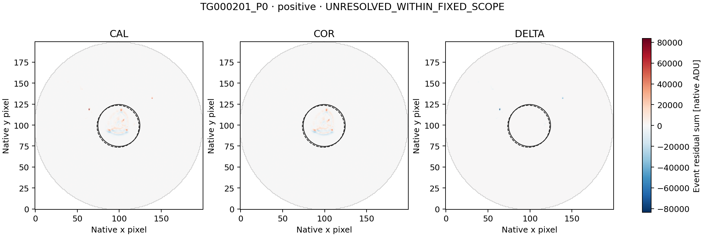
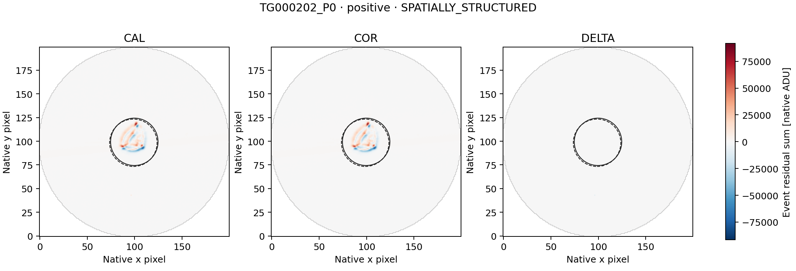
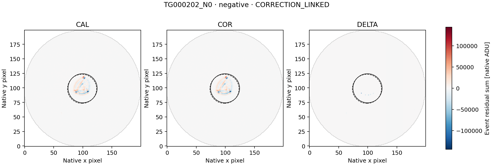

# LS8L — all three WASP-189 paired-image follow-ups

Completed 20 September 2026. **COMPLETE_AUDITED**, independent audit **PASS**.

The separately frozen diagnostic retains both positive LS8K excursions and
the negative control. Its outcomes are: **{"CORRECTION_LINKED": 1, "SPATIALLY_STRUCTURED": 1, "UNRESOLVED_WITHIN_FIXED_SCOPE": 1}**.
These are descriptive image labels, not a determination of artificial or
astrophysical origin, and not detector qualification or a SETI-candidate claim.

| Representative | Sign | Fixed classification | DELTA/COR C0 / C1 | COR brightness explained C0 / C1 | COR displacement explained C0 / C1 |
|---|---|---|---:|---:|---:|
| TG000201_P0 | positive | UNRESOLVED_WITHIN_FIXED_SCOPE | -0.10789 / -0.11186 | 5.65966% / 5.66143% | 48.61397% / 48.61487% |
| TG000202_P0 | positive | SPATIALLY_STRUCTURED | -0.05041 / -0.05087 | 0.49704% / 0.49280% | 88.33089% / 88.33077% |
| TG000202_N0 | negative | CORRECTION_LINKED | 0.92196 / 0.94371 | 12.14413% / 12.13758% | 23.84616% / 23.84540% |

The original L2 representatives remain TG000201 row 521 (+8.982074701),
TG000202 row 678 (+60.894785514), and TG000202 row 119 (-23.271648387),
all one 33.6-second row. Those scores are not calibrated Gaussian significances.

## Scope and method

The metadata-only preflight established **174 unique CAL/COR exposure joins**
for the 87 fixed L2 context rows, with <=1 ms MJD/BJD differences and exact UTC
and CE agreement. The public config fixed every source identity and future
range before image access. The run acquired exactly
**55,680,000 paired image bytes** and
**139,200 smearing-row bytes**.

The unchanged LS8D/LS8H method constructs CAL, COR and DELTA=COR-CAL temporal
event maps on the common finite mask. It retains the original 12-row sidebands,
two-row guards, both coordinate conventions C0/C1, r<=25 source aperture,
30<r<=40 background annulus and r>35 smearing regression. Source pixel centers
come only from the saved sideband centroids; none is moved to fit the event.

CORRECTION_LINKED is evaluated first: complete apertures and matching COR/L2
signs in both conventions, plus |DELTA/COR| or |column-DELTA/COR| >=0.5 in both.
Otherwise SPATIALLY_STRUCTURED requires displacement explained energy >=0.8
and an advantage >=0.2 over brightness in both conventions. Remaining events
are UNRESOLVED_WITHIN_FIXED_SCOPE. Missing/rank-deficient fits stay unavailable.

A correction-linked label identifies material coupling to delivered processing;
it does not identify one physical correction component or exclude source
variability. A spatial label identifies a morphological fit, not a unique
physical cause. An unresolved label does not establish that the event is
astrophysical or artificial.

## Verification

Seven existing synthetic tests run before payload access. The independent
struct/long-double/scalar-normal-equation audit checks source ranges and
hashes, metadata joins, masks, event maps, fits and classifications:

- numerical comparisons: **283,611**;
- exact checks: **481,739**;
- disagreements: **0**.

LS8K's L2 audit remains PASS. Historical LS8B's original FAIL and later
arithmetic repair remain unchanged. This is diagnosis of already selected
events, not an independent sensitivity or false-alarm calibration. Raw
imagettes, alternative apertures and additional visits remain unopened.

[Summary](summary.json) · [all diagnostics](diagnostics.json) ·
[independent audit](audit.json) · [independent reference](independent_reference.json) ·
[checksums](SHA256SUMS).

## Event maps

Each three-panel figure uses one common signed scale for its representative.
Solid/dashed circles show the C0/C1 apertures. Figures are presentation only;
they do not feed the diagnostic or any threshold.

### TG000201_P0

### TG000202_P0

### TG000202_N0

## Next action

Preserve TG000201_P0 as unresolved under this fixed diagnostic. Any next analysis must first state the specific limitation and freeze a separate diagnostic using only the already retained tables/maps. Do not widen image ranges, switch apertures or classify these as SETI candidates merely because the two descriptive closure gates did not pass.
