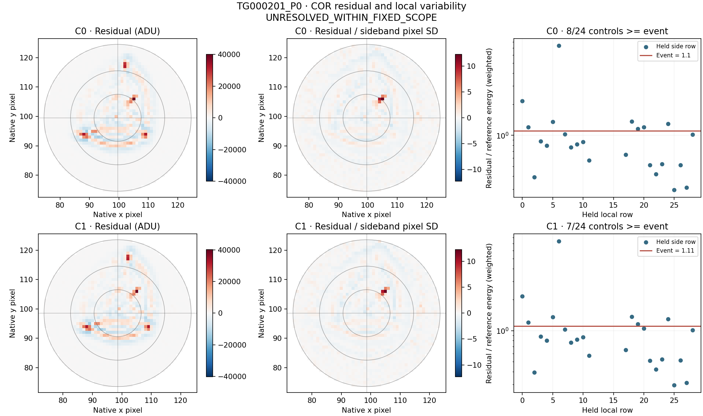
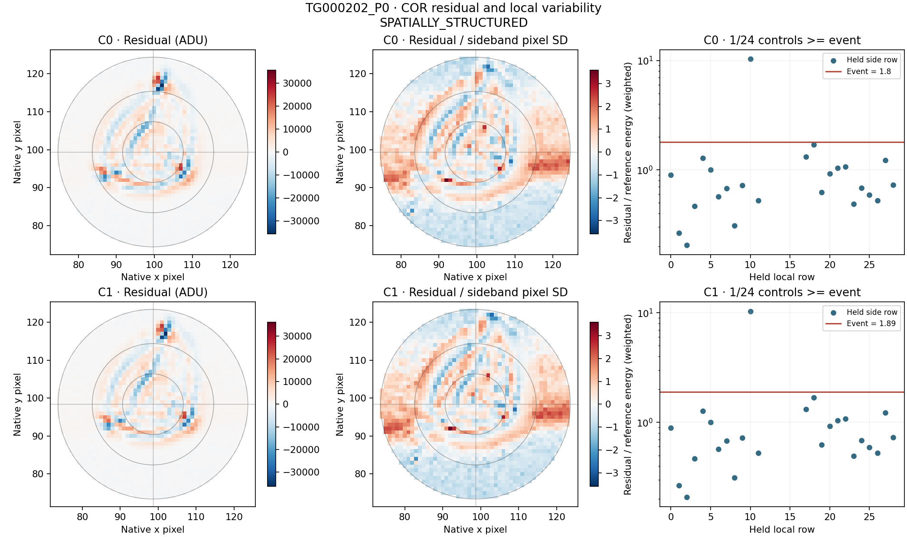
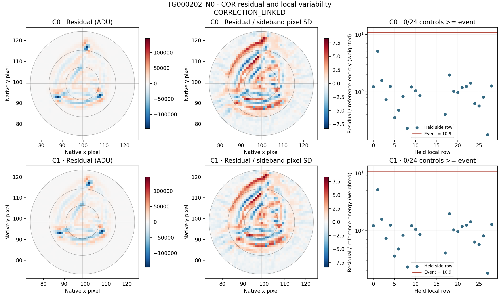

# LS8M: retained WASP-189 residuals and local variability

All three fixed events, both CAL/COR products and both coordinate conventions are complete. No new native source bytes were acquired. Original LS8L labels remain unchanged.

**This is descriptive development on previously selected events. Energy ratios and overlapping sideband ranks are not detection significances or source probabilities.**

Independent audit: **PASS**, 790,128 numerical comparisons and 911,228 exact checks; zero disagreements. Eight pre-analysis tests, 72 signed known-template cases, 120 signed compact cases and all 192 additive linearity checks pass.

## Native residual comparison

The table uses the combined weighted brightness/gradient/constant model. The reference is local sideband variability after applying the same spatial model. The aperture SD ratio compares the full sideband flux covariance with a diagonal-only estimate.

| Event | Product / center | Weighted explained | Residual / sideband energy (weighted) | Side controls >= event | Top 10 residual pixels (weighted) | Aperture SD ratio |
|---|---|---:|---:|---:|---:|---:|
| TG000201_P0 | CAL / C0 | 17.7417% | 2.034390 | 2/24 | 70.2808% | 0.094261 |
| TG000201_P0 | COR / C0 | 28.4285% | 1.101275 | 8/24 | 48.5139% | 0.092700 |
| TG000201_P0 | CAL / C1 | 17.3593% | 2.092039 | 2/24 | 70.8236% | 0.113183 |
| TG000201_P0 | COR / C1 | 28.2796% | 1.106163 | 7/24 | 48.3925% | 0.112434 |
| TG000202_P0 | CAL / C0 | 72.0082% | 2.045989 | 1/24 | 18.1236% | 0.098722 |
| TG000202_P0 | COR / C0 | 74.3067% | 1.800712 | 1/24 | 6.0046% | 0.098708 |
| TG000202_P0 | CAL / C1 | 71.3199% | 2.143375 | 1/24 | 18.1862% | 0.111081 |
| TG000202_P0 | COR / C1 | 73.6311% | 1.891870 | 1/24 | 5.7718% | 0.111119 |
| TG000202_N0 | CAL / C0 | 22.4856% | 10.954765 | 0/24 | 8.5519% | 0.072986 |
| TG000202_N0 | COR / C0 | 23.8560% | 10.863070 | 0/24 | 8.6357% | 0.073421 |
| TG000202_N0 | CAL / C1 | 22.3707% | 10.982756 | 0/24 | 8.5460% | 0.084449 |
| TG000202_N0 | COR / C1 | 23.7632% | 10.888482 | 0/24 | 8.6172% | 0.084874 |

## Paired correction residual identity

CAL and DELTA below use the same COR projector. The cross term can be negative; these columns add to one and are not independent physical-cause fractions.

| Event / center | CAL / COR residual energy | DELTA / COR | Twice cross / COR |
|---|---:|---:|---:|
| TG000201_P0 / C0 | 1.878750 | 0.838395 | -1.717144 |
| TG000201_P0 / C1 | 1.922668 | 0.881488 | -1.804156 |
| TG000202_P0 / C0 | 1.151643 | 0.201784 | -0.353426 |
| TG000202_P0 / C1 | 1.156754 | 0.206970 | -0.363725 |
| TG000202_N0 / C0 | 1.009232 | 0.098571 | -0.107803 |
| TG000202_N0 / C1 | 1.009485 | 0.098476 | -0.107961 |

## Brightness protection

Pure brightness coefficients are recovered by the combined model. The table quantifies what a hypothetical displacement-plus-constant subtraction would remove. No such removal is adopted.

| Event | Product / center | Brightness weighted energy retained | Brightness signed flux retained |
|---|---|---:|---:|
| TG000201_P0 | CAL / C0 | 80.9068% | 91.7034% |
| TG000201_P0 | COR / C0 | 80.7295% | 91.7495% |
| TG000201_P0 | CAL / C1 | 81.4978% | 92.0615% |
| TG000201_P0 | COR / C1 | 81.3049% | 92.1175% |
| TG000202_P0 | CAL / C0 | 82.0050% | 92.6438% |
| TG000202_P0 | COR / C0 | 81.8286% | 92.6674% |
| TG000202_P0 | CAL / C1 | 82.6797% | 93.0284% |
| TG000202_P0 | COR / C1 | 82.4245% | 93.0726% |
| TG000202_N0 | CAL / C0 | 81.9990% | 92.7366% |
| TG000202_N0 | COR / C0 | 81.9927% | 92.7373% |
| TG000202_N0 | CAL / C1 | 82.7815% | 93.0988% |
| TG000202_N0 | COR / C1 | 82.7670% | 93.0972% |

## Fixed residual maps and all sideband controls

Each map uses the COR combined weighted fit within the unchanged radius-25 mask. A separate symmetric color range is used for each panel and is labeled. Values divided by the sideband-derived pixel SD are descriptive standardized residuals, not Gaussian sigmas. The plots retain C0 and C1 and all 24 controls.

## Interpretation and stop

A large residual/reference ratio establishes a mismatch with these local sidebands, not a stellar or artificial origin. A small ratio does not prove that a selected event is ordinary noise. Spatial cells and compactness help describe what the fixed template misses; they are not tuned cuts.

The study stops on these three contexts. LS8L classifications, thresholds and source scope are unchanged; no qualified candidate, detector or coverage is added. Independent transfer would require a new prospective freeze. The raw-imagette calibration request remains unsent.

[Protocol](../LS8M_RESIDUAL_NOISE_PROTOCOL.md) · [Full diagnostics](diagnostics.json) · [Signed injections](injection_controls.json) · [Independent audit](audit.json) · [Original LS8L report](../results_ls8l_images/REPORT.md)
