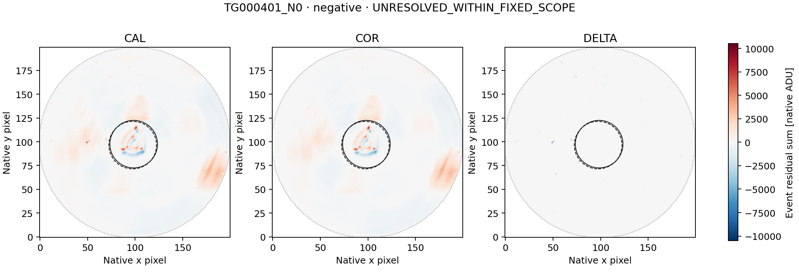
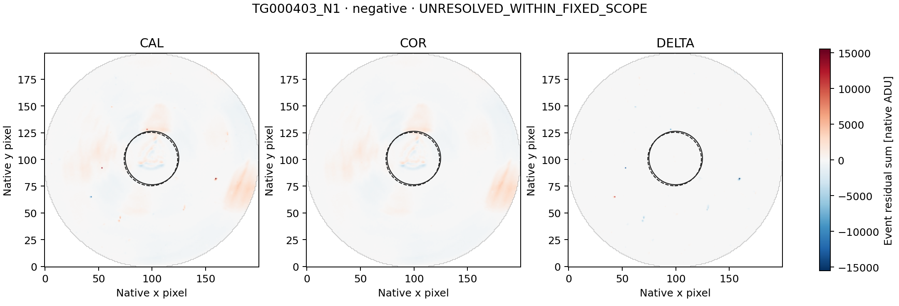
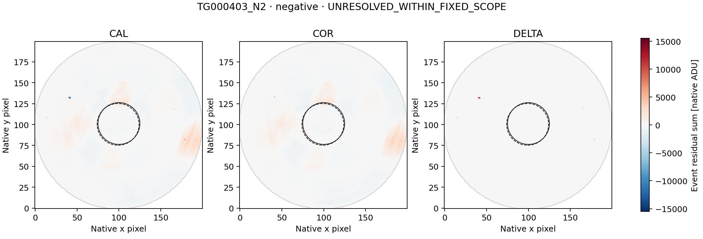
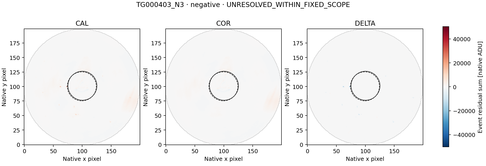

# LS8O — all five GJ 1132 paired-image follow-ups

Completed 20 September 2026. **COMPLETE_AUDITED**, independent audit **PASS**.

The separately frozen diagnostic retains all five negative LS8N control excursions.
LS8N had no positive threshold crossing; none is added or substituted here. Its outcomes are: **{"UNRESOLVED_WITHIN_FIXED_SCOPE": 5}**.
These are descriptive image labels, not a determination of artificial or
astrophysical origin, and not detector qualification or a SETI-candidate claim.

| Representative | Sign | Fixed classification | DELTA/COR C0 / C1 | COR brightness explained C0 / C1 | COR displacement explained C0 / C1 |
|---|---|---|---:|---:|---:|
| TG000401_N0 | negative | UNRESOLVED_WITHIN_FIXED_SCOPE | 0.09797 / 0.09704 | 3.98406% / 4.01614% | 18.77967% / 18.95020% |
| TG000403_N0 | negative | UNRESOLVED_WITHIN_FIXED_SCOPE | -0.05773 / -0.06337 | 0.68257% / 0.75438% | 56.27990% / 61.67326% |
| TG000403_N1 | negative | UNRESOLVED_WITHIN_FIXED_SCOPE | 0.10614 / 0.08875 | 0.21385% / 0.25238% | 79.74861% / 83.79823% |
| TG000403_N2 | negative | UNRESOLVED_WITHIN_FIXED_SCOPE | 0.37227 / -0.03201 | 0.84069% / 1.09833% | 16.37823% / 20.10730% |
| TG000403_N3 | negative | UNRESOLVED_WITHIN_FIXED_SCOPE | 0.14757 / 0.15517 | 0.78082% / 0.84436% | 68.78136% / 73.39195% |

The original representatives are TG000401 row 88, and TG000403 rows 69, 132,
191 and 297. Every event spans three 60-second rows (180 seconds of integration).
The L2 scores range from -8.529277829 to -17.739594988 and are not Gaussian significances.

## Scope and method

The metadata-only preflight established **310 unique CAL/COR exposure joins**
for the 155 fixed L2 context rows, with <=1 ms MJD/BJD differences and exact UTC
and CE agreement. The public config fixed every source identity and future
range before image access. The run acquired exactly
**99,200,000 paired image bytes** and
**248,000 smearing-row bytes**.

The unchanged LS8D/LS8H method constructs CAL, COR and DELTA=COR-CAL temporal
event maps on the common finite mask. It retains the original 12-row sidebands,
two-row guards, both coordinate conventions C0/C1, r<=25 source aperture,
30<r<=40 background annulus and r>35 smearing regression. Source pixel centers
come only from the saved sideband centroids; none is moved to fit the event.

CORRECTION_LINKED is evaluated first: complete apertures and matching COR/L2
signs in both conventions, plus |DELTA/COR| or |column-DELTA/COR| >=0.5 in both.
Otherwise SPATIALLY_STRUCTURED requires displacement explained energy >=0.8
and an advantage >=0.2 over brightness in both conventions. Remaining events
are UNRESOLVED_WITHIN_FIXED_SCOPE. Missing/rank-deficient fits stay unavailable.

A correction-linked label identifies material coupling to delivered processing;
it does not identify one physical correction component or exclude source
variability. A spatial label identifies a morphological fit, not a unique
physical cause. An unresolved label does not establish that the event is
astrophysical or artificial.

## Verification

Seven inherited synthetic tests and two additional three-row known-answer
tests run before payload access. The independent
struct/long-double/scalar-normal-equation audit checks source ranges and
hashes, metadata joins, masks, event maps, fits and classifications:

- numerical comparisons: **472,685**;
- exact checks: **802,983**;
- disagreements: **0**.

LS8N's L2 audit remains PASS. Historical LS8B's original FAIL and later
arithmetic repair remain unchanged. This is diagnosis of already selected
events, not an independent sensitivity or false-alarm calibration. Raw
imagettes, alternative apertures and additional visits remain unopened.

[Summary](summary.json) · [all diagnostics](diagnostics.json) ·
[independent audit](audit.json) · [independent reference](independent_reference.json) ·
[checksums](SHA256SUMS).

## Event maps

Each three-panel figure uses one common signed scale for its representative.
Solid/dashed circles show the C0/C1 apertures. Figures are presentation only;
they do not feed the diagnostic or any threshold.

### TG000401_N0

### TG000403_N0

### TG000403_N1

### TG000403_N2

### TG000403_N3

## Next action

Preserve TG000401_N0, TG000403_N0, TG000403_N1, TG000403_N2, TG000403_N3 as unresolved under this fixed diagnostic. Any next analysis must first state the specific limitation and freeze a separate diagnostic using only the already retained tables/maps. Do not widen image ranges, switch apertures or classify these as SETI candidates merely because the two descriptive closure gates did not pass.
