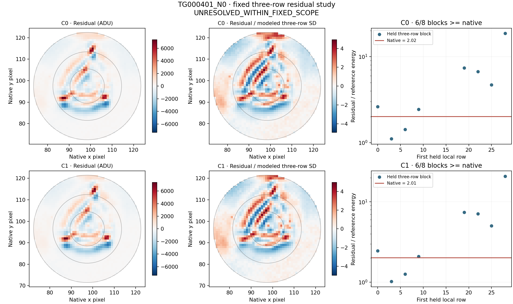
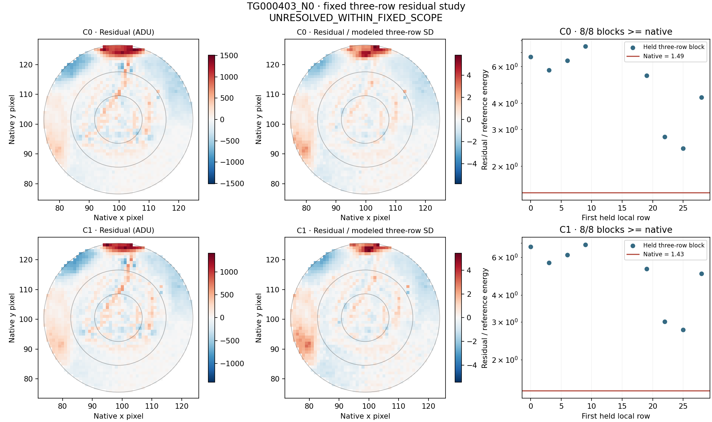
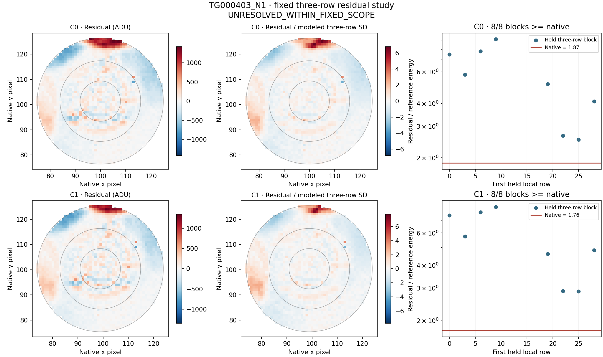
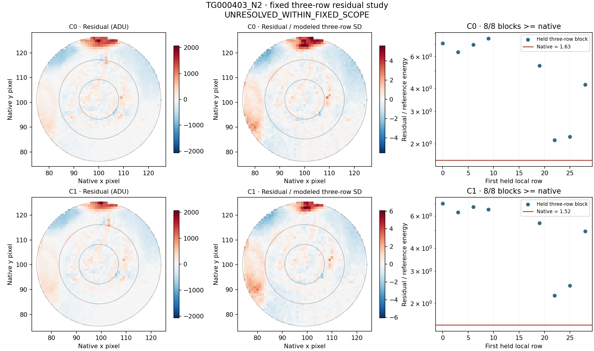
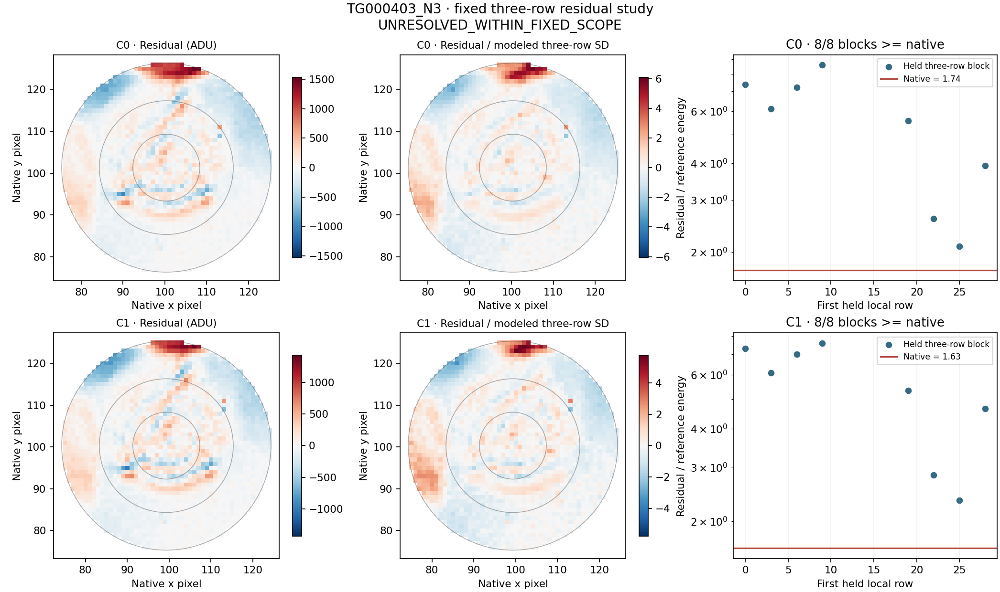

# LS8P: GJ 1132 three-exposure residual, noise and boundary study

This verified result recovers the initial run at `16824ada23afb9c8e66758d2a180a565326f443c`, whose audit stopped while serializing NumPy integer boundary coordinates. The initial result and error log remain unchanged in `results_ls8p_residuals`. Only those coordinate scalar types are converted to Python integers. Producer outputs are copied byte-for-byte; scientific arithmetic, tolerance, scope and labels are unchanged. One additional serialization regression test passes. [Recovery protocol](../LS8P_AUDIT_RECOVERY.md).

All five retained LS8O contexts, both products and both coordinate conventions are included. No new archive bytes or exposures were acquired. The five original LS8O labels remain **UNRESOLVED_WITHIN_FIXED_SCOPE**. LS8N had no positive threshold crossing.

**Retrospective diagnostics only: energy ratios, covariance models and eight sideband comparisons are not calibrated significances, probabilities or completeness measurements.**

Independent audit **PASS**: 1,400,704 numerical comparisons and 1,529,059 exact checks; no disagreements. Seventeen pre-analysis tests pass (nine new three-sum/boundary tests and eight tests of the inherited spatial algebra). All 120 signed known-template controls, 200 signed compact controls and 320 additive checks pass.

## Fixed covariance and residual comparison

Each native event is the sum of three rows. The IID reference uses the exact OLS prediction weights, including the 9/n baseline-estimation term. The second model estimates a pooled lag-1/lag-2 correlation from training-only pixel residuals with a Bartlett taper; all covariance between event and baseline rows enters the same quadratic form. Cadence gaps split the covariance into blocks. This small, estimated, separable covariance model is descriptive; longer correlations, nonstationarity and template-estimation uncertainty are not calibrated. Both models remain visible.

The eight nonoverlapping three-row control targets each exclude a two-row guard from training. Their templates, variances and correlations are refitted without held values. They share training data and differ in leverage and position from the selected native event; the counts below are not p-values.

| Control | Product / center | Combined weighted explained | Residual/reference, correlated | Residual/reference, IID | Held blocks >= native | Correlated/IID variance | Top 10 residual pixels |
|---|---|---:|---:|---:|---:|---:|---:|
| TG000401_N0 | CAL / C0 | 24.6333% | 2.011058 | 3.320345 | 6/8 | 1.651044 | 6.7420% |
| TG000401_N0 | COR / C0 | 24.9845% | 2.017149 | 3.360848 | 6/8 | 1.666138 | 6.7555% |
| TG000401_N0 | CAL / C1 | 25.3335% | 2.006823 | 3.292788 | 6/8 | 1.640796 | 7.0012% |
| TG000401_N0 | COR / C1 | 25.6996% | 2.010914 | 3.328964 | 6/8 | 1.655448 | 6.9568% |
| TG000403_N0 | CAL / C0 | 28.9106% | 1.395647 | 2.047174 | 8/8 | 1.466828 | 18.8840% |
| TG000403_N0 | COR / C0 | 28.1511% | 1.494935 | 2.230577 | 8/8 | 1.492090 | 18.5462% |
| TG000403_N0 | CAL / C1 | 30.9076% | 1.326413 | 1.921375 | 8/8 | 1.448550 | 17.6721% |
| TG000403_N0 | COR / C1 | 29.8019% | 1.429729 | 2.106998 | 8/8 | 1.473705 | 17.1439% |
| TG000403_N1 | CAL / C0 | 48.4479% | 1.844726 | 2.550754 | 8/8 | 1.382728 | 22.0395% |
| TG000403_N1 | COR / C0 | 48.5263% | 1.867250 | 2.586448 | 8/8 | 1.385164 | 22.1259% |
| TG000403_N1 | CAL / C1 | 51.4112% | 1.697278 | 2.310094 | 8/8 | 1.361058 | 23.0214% |
| TG000403_N1 | COR / C1 | 50.7315% | 1.755100 | 2.397360 | 8/8 | 1.365939 | 22.9694% |
| TG000403_N2 | CAL / C0 | 4.5815% | 2.945868 | 4.294368 | 6/8 | 1.457760 | 54.2043% |
| TG000403_N2 | COR / C0 | 8.2754% | 1.625038 | 2.396579 | 8/8 | 1.474783 | 17.8667% |
| TG000403_N2 | CAL / C1 | 8.8289% | 1.496945 | 2.153569 | 8/8 | 1.438643 | 19.4637% |
| TG000403_N2 | COR / C1 | 8.9706% | 1.520501 | 2.214354 | 8/8 | 1.456331 | 17.9626% |
| TG000403_N3 | CAL / C0 | 41.8172% | 1.692453 | 2.446849 | 8/8 | 1.445741 | 18.1645% |
| TG000403_N3 | COR / C0 | 41.5237% | 1.736429 | 2.525193 | 8/8 | 1.454245 | 18.1765% |
| TG000403_N3 | CAL / C1 | 43.9705% | 1.621596 | 2.313364 | 8/8 | 1.426597 | 16.9689% |
| TG000403_N3 | COR / C1 | 44.1044% | 1.631934 | 2.341786 | 8/8 | 1.434975 | 17.6609% |

## Exact boundary accounting

Both apertures retain radius 25 and their original centers. The C0/C1 intersection cancels exactly in the difference. For each product, C1 minus C0 equals the sum over C1-only pixels minus the sum over C0-only pixels. The full signed pixel list and the analogous squared-energy identity are retained in diagnostics.json. This accounts for aperture sums; it does not uniquely assign a physical cause or explain every change in a fitted model, whose training profile/background also depend on the convention.

| Control | Product | C0-only pixels / sum ADU | C1-only pixels / sum ADU | C1 − C0 ADU |
|---|---|---:|---:|---:|
| TG000401_N0 | CAL | 71 / 3295.087516 | 71 / 1554.422687 | -1740.664829 |
| TG000401_N0 | COR | 71 / 3065.190893 | 71 / 1213.664579 | -1851.526314 |
| TG000401_N0 | DELTA | 71 / -229.896623 | 71 / -340.758108 | -110.861485 |
| TG000403_N0 | CAL | 71 / 4469.232019 | 71 / 3645.171603 | -824.060416 |
| TG000403_N0 | COR | 71 / 3718.428961 | 71 / 3228.115491 | -490.313469 |
| TG000403_N0 | DELTA | 71 / -750.803058 | 71 / -417.056111 | 333.746946 |
| TG000403_N1 | CAL | 70 / 5829.659592 | 70 / 2122.105857 | -3707.553735 |
| TG000403_N1 | COR | 70 / 5616.768696 | 70 / 2508.398074 | -3108.370622 |
| TG000403_N1 | DELTA | 70 / -212.890896 | 70 / 386.292217 | 599.183113 |
| TG000403_N2 | CAL | 71 / 22696.290720 | 71 / 3363.758151 | -19332.532569 |
| TG000403_N2 | COR | 71 / 5169.668733 | 71 / 3657.931862 | -1511.736871 |
| TG000403_N2 | DELTA | 71 / -17526.621987 | 71 / 294.173710 | 17820.795698 |
| TG000403_N3 | CAL | 71 / 4372.394318 | 71 / 3927.373374 | -445.020944 |
| TG000403_N3 | COR | 71 / 3693.284940 | 71 / 2694.993887 | -998.291053 |
| TG000403_N3 | DELTA | 71 / -679.109378 | 71 / -1232.379487 | -553.270109 |

## Paired correction and brightness protection

Residual CAL and DELTA use the same COR combined projector. Their energies and the signed cross term add to COR residual energy; they are not independent cause fractions.

| Control / center | CAL / COR residual energy | DELTA / COR | Twice cross / COR |
|---|---:|---:|---:|
| TG000401_N0 / C0 | 1.009503 | 0.010759 | -0.020262 |
| TG000401_N0 / C1 | 1.010830 | 0.012045 | -0.022875 |
| TG000403_N0 / C0 | 1.027228 | 0.061209 | -0.088437 |
| TG000403_N0 / C1 | 1.044639 | 0.077140 | -0.121779 |
| TG000403_N1 / C0 | 1.003673 | 0.004488 | -0.008161 |
| TG000403_N1 / C1 | 0.999406 | 0.007911 | -0.007316 |
| TG000403_N2 / C0 | 1.910956 | 0.641423 | -1.552378 |
| TG000403_N2 / C1 | 1.082550 | 0.079874 | -0.162425 |
| TG000403_N3 / C0 | 1.006152 | 0.005249 | -0.011401 |
| TG000403_N3 / C1 | 1.028288 | 0.017243 | -0.045531 |

Pure brightness additions are 0.1% per exposure in each of three exposures. Their summed coefficient is recovered as ±0.003. Displacement additions are ±0.05 gradient units per exposure, not a nonlinear resampling of a star. Five fixed compact positions receive both signs with total amplitude five modeled event-pixel SDs, split equally across three rows. The table shows losses from a hypothetical displacement plus constant subtraction; no subtraction, event veto or new mask is adopted.

| Control | Product / center | Brightness weighted energy retained | Brightness signed flux retained |
|---|---|---:|---:|
| TG000401_N0 | CAL / C0 | 81.7686% | 71.8393% |
| TG000401_N0 | COR / C0 | 81.8898% | 72.4140% |
| TG000401_N0 | CAL / C1 | 83.2606% | 75.1201% |
| TG000401_N0 | COR / C1 | 83.3708% | 75.8484% |
| TG000403_N0 | CAL / C0 | 87.6764% | 62.0542% |
| TG000403_N0 | COR / C0 | 88.4901% | 64.5838% |
| TG000403_N0 | CAL / C1 | 90.0574% | 68.0670% |
| TG000403_N0 | COR / C1 | 91.0269% | 71.1856% |
| TG000403_N1 | CAL / C0 | 88.6495% | 65.8190% |
| TG000403_N1 | COR / C0 | 88.6488% | 65.8920% |
| TG000403_N1 | CAL / C1 | 91.2030% | 72.6188% |
| TG000403_N1 | COR / C1 | 91.5902% | 73.9848% |
| TG000403_N2 | CAL / C0 | 88.5432% | 63.9994% |
| TG000403_N2 | COR / C0 | 88.8482% | 65.1554% |
| TG000403_N2 | CAL / C1 | 91.1501% | 70.8939% |
| TG000403_N2 | COR / C1 | 91.2893% | 71.5544% |
| TG000403_N3 | CAL / C0 | 88.3891% | 64.5969% |
| TG000403_N3 | COR / C0 | 88.4220% | 64.9596% |
| TG000403_N3 | CAL / C1 | 91.1860% | 72.1777% |
| TG000403_N3 | COR / C1 | 91.1453% | 72.2675% |

## All COR residual maps and held-block controls

Each panel has its own symmetric scale and retains the unchanged aperture. Standardized pixels are divided by the modeled three-row SD, not Gaussian sigmas. Only the plotting viewport is cropped; no analysis pixels are removed.

## Stop and interpretation boundaries

A high ratio establishes a mismatch with these local sidebands under the stated model; a low ratio does not prove an ordinary-noise origin. Spatial and boundary structure describe what the fixed templates miss. All five LS8O labels and LS8N thresholds remain unchanged, with no positive LS8N crossing and no qualified candidate, detector or coverage.

This single bounded study is closed regardless of result. Rank-3 HD 136352 remains next for a separately frozen independent transfer from the unchanged target ledger. Its science values remain unopened. No further GJ 1132 tuning is automatically authorized by this study. Raw imagettes, reserved TESS/M43 material and the unsent calibration request remain unchanged.

[Protocol](../LS8P_THREE_SUM_PROTOCOL.md) · [Full diagnostics](diagnostics.json) · [Signed injections](injection_controls.json) · [Audit](audit.json) · [Original LS8O report](../results_ls8o_images/REPORT.md)
