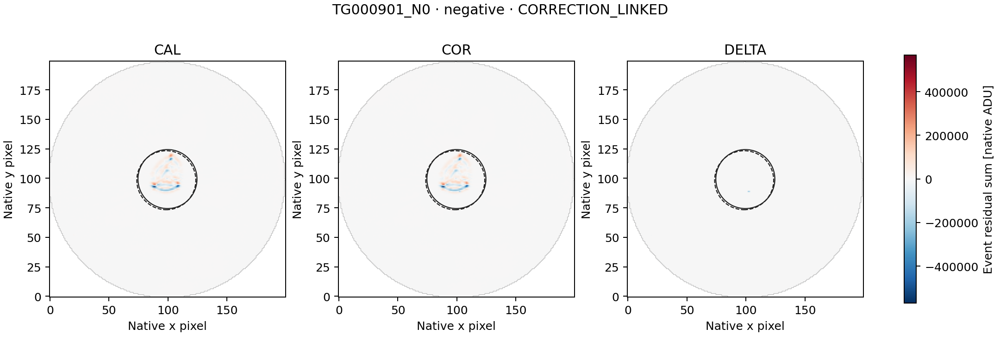
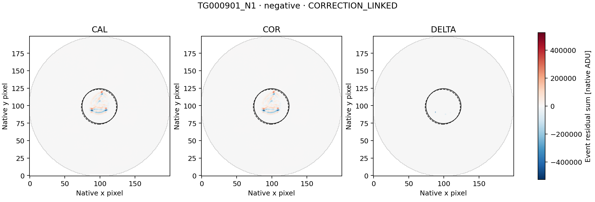
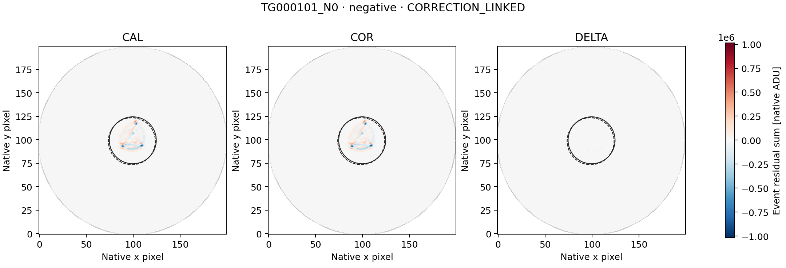

# LS8R — all three HD 136352 paired-image follow-ups

Completed 20 September 2026. **COMPLETE_AUDITED**, independent audit **PASS**.

The separately frozen diagnostic retains all three negative LS8Q control excursions.
LS8Q had no positive threshold crossing; none is added or substituted here. Its outcomes are: **{"CORRECTION_LINKED": 3}**.
These are descriptive image labels, not a determination of artificial or
astrophysical origin, and not detector qualification or a SETI-candidate claim.

| Representative | Sign | Fixed classification | DELTA/COR C0 / C1 | COR brightness explained C0 / C1 | COR displacement explained C0 / C1 |
|---|---|---|---:|---:|---:|
| TG000901_N0 | negative | CORRECTION_LINKED | 0.57522 / 0.55856 | 10.50574% / 10.48300% | 27.31815% / 27.31818% |
| TG000901_N1 | negative | CORRECTION_LINKED | 0.74159 / 0.73653 | 10.45031% / 10.43335% | 18.51842% / 18.51796% |
| TG000101_N0 | negative | CORRECTION_LINKED | 0.79146 / 0.81381 | 10.33993% / 10.33026% | 24.01006% / 24.00814% |

The original representatives are TG000901 rows 46 and 196, each spanning one
44.2-second stack, and TG000101 rows 432–433, spanning two stacks (88.4 seconds).
Each stack combines 26 exposures of approximately 1.7 seconds; they are not
individually resolved here. L2 scores range from -13.440986490 to -29.560654017
and are not Gaussian significances.

## Scope and method

The metadata-only preflight established **176 unique CAL/COR exposure joins**
for the 88 fixed L2 context rows, with <=1 ms MJD/BJD differences and exact UTC
and CE agreement. The public config fixed every source identity and future
range before image access. The run acquired exactly
**56,320,000 paired image bytes** and
**140,800 smearing-row bytes**.

The unchanged LS8D/LS8H method constructs CAL, COR and DELTA=COR-CAL temporal
event maps on the common finite mask. It retains the original 12-row sidebands,
two-row guards, both coordinate conventions C0/C1, r<=25 source aperture,
30<r<=40 background annulus and r>35 smearing regression. Source pixel centers
come only from the saved sideband centroids; none is moved to fit the event.

CORRECTION_LINKED is evaluated first: complete apertures and matching COR/L2
signs in both conventions, plus |DELTA/COR| or |column-DELTA/COR| >=0.5 in both.
Otherwise SPATIALLY_STRUCTURED requires displacement explained energy >=0.8
and an advantage >=0.2 over brightness in both conventions. Remaining events
are UNRESOLVED_WITHIN_FIXED_SCOPE. Missing/rank-deficient fits stay unavailable.

A correction-linked label identifies material coupling to delivered processing;
it does not identify one physical correction component or exclude source
variability. A spatial label identifies a morphological fit, not a unique
physical cause. An unresolved label does not establish that the event is
astrophysical or artificial.

## Verification

Seven inherited synthetic tests and two additional one/two-row known-answer
tests in both signs run before payload access. The independent
struct/long-double/scalar-normal-equation audit checks source ranges and
hashes, metadata joins, masks, event maps, fits and classifications:

- numerical comparisons: **283,611**;
- exact checks: **481,748**;
- disagreements: **0**.

LS8Q's L2 audit remains PASS. Historical LS8B's original FAIL and later
arithmetic repair remain unchanged. This is diagnosis of already selected
events, not an independent sensitivity or false-alarm calibration. Raw
imagettes, alternative apertures and additional visits remain unopened.

[Summary](summary.json) · [all diagnostics](diagnostics.json) ·
[independent audit](audit.json) · [independent reference](independent_reference.json) ·
[checksums](SHA256SUMS).

## Event maps

Each three-panel figure uses one common signed scale for its representative.
Solid/dashed circles show the C0/C1 apertures. Figures are presentation only;
they do not feed the diagnostic or any threshold.

### TG000901_N0

### TG000901_N1

### TG000101_N0

## Next action

Close all three HD 136352 follow-up branches under their fixed descriptive labels without widening. The next independent target is rank 4 of the unchanged reconciled LS8J ledger, TESS_260647166; freeze its exact pair and header preflight before science values.
