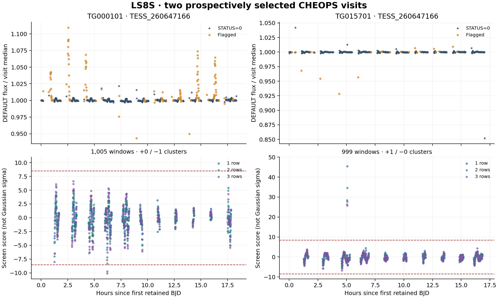

# LS8S — TESS_260647166 two-visit DEFAULT-L2 screen

Completed 20 September 2026. Result: **COMPLETE_AUDITED**.

The unchanged symmetric screen evaluated **1,747 table rows** and
**2,004 eligible, overlapping windows**. It retained
**1 positive and 1 negative clusters**.
These are L2 screening outcomes, with no SETI-candidate or detector-qualification claim.

| Visit | Table rows | Eligible windows | Positive / negative windows | Positive / negative clusters |
|---|---:|---:|---:|---:|
| CH_PR300046_TG000101_V0300 | 983 | 1,005 | 0 / 2 | 0 / 1 |
| CH_PR100031_TG015701_V0300 | 764 | 999 | 6 / 0 | 1 / 0 |

The upper panels use visit-median normalization only for display. The screen
uses the unchanged local sideband baseline in electron units. Flagged rows are
shown for context and excluded according to the frozen rule. Gaps are not bridged.

## Selection and fixed method

TESS_260647166 was rank 4 of the metadata-only first-1,000-public-row CHEOPS census:
452 eligible visits and 107 cohorts with at least two eligible visits. It was
selected by the time of its second eligible visit, then first visit and archive
target name. It was not selected for known variability or SETI interest.
LS8J's original discarded full product responses remain a historical limitation;
the separately dated full-inventory reconciliation preserves fresh responses
and verifies unchanged summaries and complete cohort order before this screen.

The public header preflight recorded both exact products, their ETags and
schemas without reading table values. The science freeze is
`94437df35db15a774388ce7ebabfcac9913b5bd1`. Both products have NEXP=1. Their verified
TEXPTIME values are 42.0 and
49.0 seconds respectively. Durations
are one/two/three rows (42/84/126 seconds in the first visit and 49/98/147
seconds in the second), with 12 sideband rows on each side, two-row guards
and endpoints +/-8.5. Each visit uses its own verified cadence.
TESS_260647166 is the CHEOPS archive target name; reserved TESS sectors
remain unopened.
The flux-centered local-linear scorer and all eligibility/cluster rules remain
unchanged from LS8K; no thresholds are chosen from these outcomes.

Exactly **241,086 science-table bytes** were acquired.
Image bytes are zero; no alternative aperture, raw imagette or later TESS_260647166
visit was opened.

## Independent verification and interpretation

Audit status: **PASS**, with
**24,048 numerical and discrete comparisons**
and **0 numerical disagreements**. It independently
decodes big-endian 138-byte rows, enumerates eligible windows, solves scalar
normal equations and checks both signed cluster sets and summary counts.
The unchanged tolerances are relative 2e-8 and absolute 2e-10.

Overlapping windows are not independent statistical trials. The score is not
a calibrated Gaussian significance or a false-alarm probability. This screen
does not establish completeness, sensitivity to short glints, population limits,
or additional qualified observing coverage. A threshold excursion requires
image-level assessment before physical interpretation.

## All fixed cluster representatives

| Visit | Sign | Cluster | Start row (zero-based) | Duration (rows) | Score |
|---|---|---:|---:|---:|---:|
| CH_PR300046_TG000101_V0300 | negative | 0 | 317 | 3 | -10.085104590 |
| CH_PR100031_TG015701_V0300 | positive | 0 | 217 | 1 | 45.460348286 |

## Next action

Freeze one bounded CAL/COR metadata-and-image diagnostic for every positive and negative representative below. Establish exact exposure joins and byte ranges before image access. Do not select only the strongest positive event.
