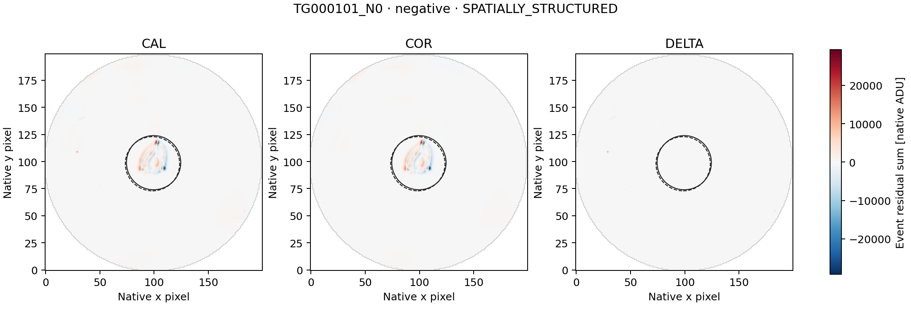
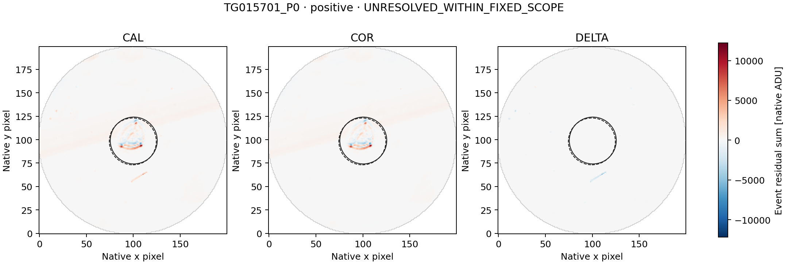

# LS8T — both TESS_260647166 paired-image follow-ups

Completed 20 September 2026. **COMPLETE_AUDITED**, independent audit **PASS**.

The separately frozen diagnostic retains both LS8S signed representatives,
one positive and one negative. No representative is added or substituted.
The image outcomes are: **{"SPATIALLY_STRUCTURED": 1, "UNRESOLVED_WITHIN_FIXED_SCOPE": 1}**.
These are descriptive image labels, not a determination of artificial or
astrophysical origin, and not detector qualification or a SETI-candidate claim.

| Representative | Sign | Fixed classification | DELTA/COR C0 / C1 | COR brightness explained C0 / C1 | COR displacement explained C0 / C1 |
|---|---|---|---:|---:|---:|
| TG000101_N0 | negative | SPATIALLY_STRUCTURED | 0.45659 / 0.45954 | 0.09607% / 0.09494% | 92.95567% / 92.96205% |
| TG015701_P0 | positive | UNRESOLVED_WITHIN_FIXED_SCOPE | -0.08906 / -0.09253 | 2.69041% / 2.67304% | 75.76422% / 75.77892% |

The original negative representative is TG000101 rows 317–319, spanning
three 42-second exposures (126 seconds). The positive is TG015701 row 217,
one 49-second exposure. Both visits have NEXP=1. Their original L2 scores
are -10.085104590 and +45.460348286 respectively; they are not Gaussian
significances. TESS_260647166 is the CHEOPS archive target name, and no
reserved TESS sector is opened by this study.

## Scope and method

The metadata-only preflight established **120 unique CAL/COR exposure joins**
for the 60 fixed L2 context rows, with <=1 ms MJD/BJD differences and exact UTC
and CE agreement. The public config fixed every source identity and future
range before image access. The run acquired exactly
**38,400,000 paired image bytes** and
**96,000 smearing-row bytes**.

The unchanged LS8D/LS8H method constructs CAL, COR and DELTA=COR-CAL temporal
event maps on the common finite mask. It retains the original 12-row sidebands,
two-row guards, both coordinate conventions C0/C1, r<=25 source aperture,
30<r<=40 background annulus and r>35 smearing regression. Source pixel centers
come only from the saved sideband centroids; none is moved to fit the event.

CORRECTION_LINKED is evaluated first: complete apertures and matching COR/L2
signs in both conventions, plus |DELTA/COR| or |column-DELTA/COR| >=0.5 in both.
Otherwise SPATIALLY_STRUCTURED requires displacement explained energy >=0.8
and an advantage >=0.2 over brightness in both conventions. Remaining events
are UNRESOLVED_WITHIN_FIXED_SCOPE. Missing/rank-deficient fits stay unavailable.

A correction-linked label identifies material coupling to delivered processing;
it does not identify one physical correction component or exclude source
variability. A spatial label identifies a morphological fit, not a unique
physical cause. An unresolved label does not establish that the event is
astrophysical or artificial.

## Verification

Seven inherited synthetic tests and two additional one/three-row known-answer
tests in both signs run before payload access. The independent
struct/long-double/scalar-normal-equation audit checks source ranges and
hashes, metadata joins, masks, event maps, fits and classifications:

- numerical comparisons: **189,074**;
- exact checks: **321,180**;
- disagreements: **0**.

LS8S's L2 audit remains PASS. Historical LS8B's original FAIL and later
arithmetic repair remain unchanged. This is diagnosis of already selected
events, not an independent sensitivity or false-alarm calibration. Raw
imagettes, alternative apertures and additional visits remain unopened.

[Summary](summary.json) · [all diagnostics](diagnostics.json) ·
[independent audit](audit.json) · [independent reference](independent_reference.json) ·
[checksums](SHA256SUMS).

## Event maps

Each three-panel figure uses one common signed scale for its representative.
Solid/dashed circles show the C0/C1 apertures. Figures are presentation only;
they do not feed the diagnostic or any threshold.

### TG000101_N0

### TG015701_P0

## Next action

Preserve TG015701_P0 as unresolved under this fixed diagnostic. Any next analysis must first state the specific limitation and freeze a separate diagnostic using only the already retained tables/maps. Do not widen image ranges, switch apertures or classify these as SETI candidates merely because the two descriptive closure gates did not pass.
